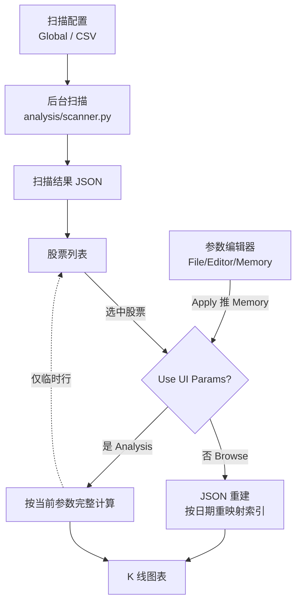

# 开发态 UI (dev) 模块

> 最后更新：2026-07-25

## 定位与边界

`BreakoutStrategy/dev/` 是基于 Tkinter 的**策略开发台**：发起批量扫描、载入扫描结果 JSON、在 K 线上复核突破与峰值、就地改参数看图表怎么变。属 BreakoutStrategy 前身流水线（项目主线是 path2），日常基本不用。

**管**：扫描的发起与配置、结果浏览、参数编辑器及其状态机、股票列表 / 键盘导航等应用胶水（有状态的 UI 编排）。

**不管**（都在 dev 之外，改行为别在 dev 里找）：

| 职责 | 归属 |
|------|------|
| 扫描执行本身 | `BreakoutStrategy/analysis/scanner.py`（`dev/managers` 只是 re-export 转发） |
| JSON → 对象重建 | `BreakoutStrategy/analysis/json_adapter.py` |
| 策略参数 SSoT | 顶层 `BreakoutStrategy/param_loader.py`（dev 只持有"编辑器临时状态"） |
| 绘图原语与三层范围模型 | 共享 UI 包，见 [UI.md](UI.md) |

与 live 的分工见 [live.md](live.md)；扫描器内部见 [突破扫描模块.md](突破扫描模块.md)。

## 关键决策与理由

### 双模式：Browse / Analysis

由「Use UI Params」这一个复选框单点决定，**初始为 Browse**；参数编辑器 Apply 后会自动勾上切进 Analysis。

要解决的问题：用户改完参数后，如果股票列表里各行的统计值跟着新参数各自刷新，表里就会出现「不同行基于不同参数」的混乱口径。

- **Browse**：图表与列表统一来自已加载的 JSON，口径天然一致；参数编辑与 Rescan All 这些由 UI 参数驱动的入口一并禁用，避免在 JSON 口径下触发 UI 参数动作。
- **Analysis**：图表按当前 UI 参数实时计算，但**列表统计值一律不改写**——新口径只以单独一行临时统计的形式，显示当前这一只股票。
- **扫描结束后强制切回 Browse**：新 JSON 本身就是当前参数的产物，停在 Analysis 既无意义，又会重新引入两套口径。

New Scan 与 Rescan All 的差别在**股票列表从哪来**：前者来自扫描配置（CSV 清单或 pkl 目录），无需先载入 JSON；后者复用已载入的 scan_data，因此强制要求先载入 JSON。

### 双路径加载：JSON 缓存 vs 完整计算

每切一只股票都重跑突破检测，延迟肉眼可见。于是 Browse 走 JSON 重建（快），Analysis 走检测器实时算（慢，但反映当前参数）。分支判据只有两条：复选框状态 + JSON 里有没有这只股票——别再往里塞时间范围校验（见负知识）。

### 索引重映射：以日期为身份，不以下标

JSON 里存的 index 是**扫描当时那份 DataFrame** 的行位置，而 UI 加载的 df 时间范围与缓冲区未必相同，直接拿整数下标定位必然错位。因此重建 Breakout / Peak 时一律用日期回查当前 df 的位置（`analysis/json_adapter.py`）。日期跨 DataFrame 稳定，行下标不稳定。

### 参数编辑器三层状态

编辑器、参数文件下拉菜单、运行时参数三方要同步，否则会出现「看着改了、算的还是旧值」。分层：

- **File**：磁盘 YAML 的加载快照（Discard 就是回到它）
- **Editor**：正在编辑的副本 + dirty / applied 两个标志
- **Memory**：`ParamLoader` 持有的运行时值，scanner / scorer 实际消费的就是它

`ParameterStateManager` 只负责 File 与 Editor 两层；Memory 层归顶层 ParamLoader，编辑器侧的活跃文件与监听器归 dev 的 `ParamEditorState`（单例）。**Apply 只推到 Memory、不落盘**，所以「Apply 过但尚未 Save」是一个必须单独提示的中间状态，不是 dirty 的同义词。

### 扫描配置二分：Global vs CSV

Global = 全体 pkl + 统一时间窗；CSV = 一份股票清单，每行以自身基准日前后若干月构成独立窗口。

股票筛选（价格 / 成交量下限那组）**只在 Global 模式下生效并传给扫描器**：CSV 模式每一行本来就是被人为挑出来的特定事件窗口，再统一筛一遍与它的用途相矛盾。

### FACTOR_REGISTRY 驱动的参数编辑

新因子注册后，编辑器 schema 从注册表动态生成，无需手改 UI。YAML 里缺该因子条目时，schema 层、输入控件层、param_loader 层各有一道 fallback 到注册表默认值——**任何一层被拿掉，缺条目的 YAML 都会让控件拿到 None 而渲染异常**。新增因子的完整改动面见 `add-new-factor` skill。

## 不变式与负知识

- **Analysis Mode 绝不写回股票列表统计**：这是双模式设计的落脚点，破了它就退回到"一张表混多套参数"。
- **别给 JSON 缓存可用性加"时间范围检查"**：加载 df 时会前置一段技术指标缓冲，df 起点必然早于扫描起点，任何"df 是否覆盖扫描范围"的断言都会恒假地把快速路径关死。那个范围本来就取自 JSON，无需二次验证。
- **复现一次扫描就要以那份 JSON 为准**：每只股票的加载时间窗口、以及 label 缓冲这类扫描期参数，都优先从 JSON 取、当前配置只作兜底。CSV 模式下每只股票的窗口本就各不相同，改用当前配置会画出与那次扫描对不上的范围和缓冲区。
- **参数一变就要清空 DataFrame 缓存**：ATR / MA 周期参与 df 预处理，而缓存键只有 (symbol, start, end)、不含参数，不清就会拿到旧指标列。
- **降级不 raise**：pkl 数据不足时，显示 / 运算 / 扫描三层各自 gracefully degrade，dev 侧把降级警告拼进状态栏（转橙）而非中断。范围模型本身在共享 UI 包里。
- **扫描在后台跑、渲染仍在主线程**：扫描走后台线程 + 多进程并回主线程更新 UI，但数据加载与图表绘制仍是主线程同步的，大文件会卡界面。

## 核心流程

