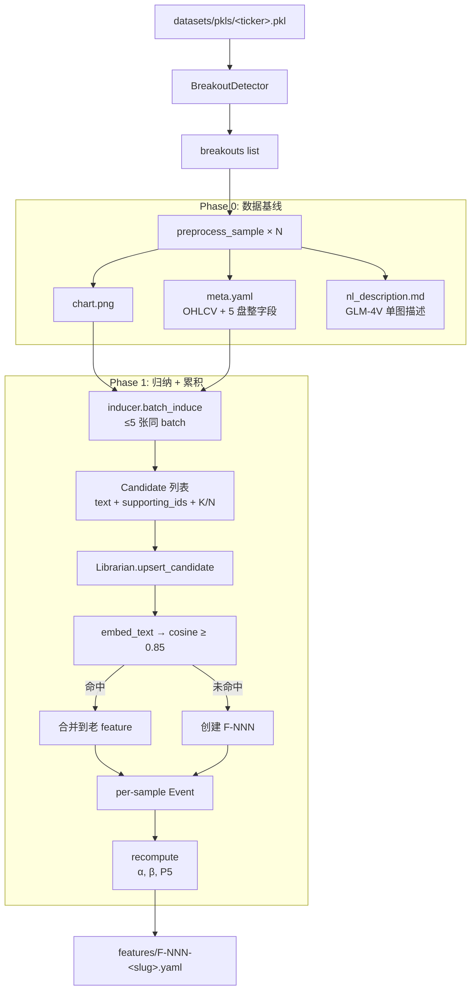

> 最后更新：2026-04-30

# 特征库 — AI 驱动的 K 线形态归纳框架

## 定位

把每个 breakout 样本喂给多模态大模型，让模型对**多张同主题 K 线图**做对比归纳，产出"可命名、可累积、可被反复评估的形态规律"（feature）。每个 feature 用 Beta-Binomial 共轭后验维护一个置信信号 P5，作为后续策略筛选 / 因子工程的语义补充。

不替代 `analysis/` 的数值因子；它产出的是"自然语言形态规律 + 概率信号"，与因子档位互补。

---

## 核心数据流



入口脚本：`scripts/feature_mining_phase1.py`（参数在 `main()` 顶部，无 argparse）。

---

## 模块组织

| 子模块 | 职责 |
|--------|------|
| `paths.py` | `feature_library/{samples,features}/` 路径 SSoT，所有 IO 走它 |
| `sample_id.py` | `BO_<TICKER>_<YYYYMMDD>` 稳定主键 |
| `consolidation_fields.py` | 5 个盘整阶段量化字段（length / height / vs_52w / volume_ratio / tightness_atr） |
| `sample_meta.py` | 拼 meta.yaml（breakout_day OHLCV + consolidation 5 字段） |
| `sample_renderer.py` | 渲染脱敏 chart.png（Figure + FigureCanvasAgg OO API，不调 pyplot 避免污染调用方 backend；标题恒为 "Breakout sample"，Y 轴显示相对 BO close 的 %，无 pk/bo 虚线 / legend / 日期；底部 "Bar Count: N" 替代默认 "Interval" 文本） |
| `prompts.py` | 单图 nl_description 的 SYSTEM/USER prompt（归一化方案 B：脱敏 ticker / 日期 / 绝对价，OHLC 改为相对 BO close 的 %） |
| `glm4v_backend.py` | zhipuai SDK 薄封装：`describe_chart` 单图 + `batch_describe` 多图（≤ 5） |
| `preprocess.py` | Phase 0 vertical slice：1 个 sample → chart + meta + nl_description；backend 返回空字符串时写 `PREPROCESS_FAILED_MARKER` 而非抛异常（便于离线 retry） |
| `feature_models.py` | 共享 dataclass（Candidate/Event/Feature/ObservationLogEntry）+ StatusBand + yaml representer |
| `embedding_l0.py` | fastembed 384 维 embedding 薄封装（`embed_text`/`cosine_similarity`） |
| `feature_store.py` | `features/F-NNN-<slug>.yaml` CRUD + slugify + next_id |
| `observation_log.py` | `obs-<8 hex>` id + active 过滤（superseded_by is None） |
| `inducer_prompts.py` | INDUCER 多图 SYSTEM_PROMPT + 编号化 user message；归一化方案 B（图序 [1]/[2] 匿名编号，与 chart.png 视觉脱敏对齐）；可选 `return_id_map` 返回 `{"[1]": "BO_AAPL_..."}` 供 inducer 反查 |
| `inducer.py` | `batch_induce`：N 张图 → GLM 一次调用 → 解析 YAML candidates；含 `_strip_code_fence`（剥离 ```yaml 围栏）+ 匿名编号 → 真实 sample_id 翻译（裸 int / 数字串 / `[N]` 三态归一）+ 幻觉 ID 过滤 + K<2 丢弃 |
| `librarian.py` | Beta-Binomial 累积器：upsert / lookup / update / recompute |

---

## 关键架构决策

### 1. GLM-4V-Flash 替代主 spec 中的 Opus

**决策**：多模态调用统一走 `glm-4v-flash`（zhipuai 免费档）。

**理由**：先验证 vertical slice 流程，避免在 prompt/schema 仍可能变动的阶段直接消耗 Opus 配额。**服务端硬限单次 ≤ 5 张图**（实验确认 n=8 报错 1210），写入 `GLM4V_MAX_IMAGES` 常量。

### 2. Beta-Binomial + Jeffreys prior

**决策**：α₀ = β₀ = 0.5，`signal = beta.ppf(0.05, α, β)`。

**理由**：均匀先验 (1, 1) 让首次单样本观测 (K=1, N=1) 的 P5 ≈ 0.05，进入 forgotten 带；Jeffreys (0.5, 0.5) 让首次 P5 ≈ 0.23，进入 candidate 带 — 给"刚被多图归纳出来的新 feature"留一线生机。

### 3. L0 cosine 0.85 merge

**决策**：candidate.text → embedding → 与全库 cosine 比较 ≥ 0.85 视为同义，合并到 cosine 最高的老 feature；否则新建。

**理由**：避免每次 Inducer 把"换个措辞"的同一规律重复计入，导致 features 库膨胀且 K/N 被稀释。0.85 是 fastembed bge-small 在中文短句上的经验阈值（Phase 1.5 可能引入 L1 LLM 二次裁定）。

### 4. ObservationLog 按 (sample, feature) 粒度展开

**决策**：一条 candidate 对应 batch 内 N 个 ObservationLogEntry，`K=1 if sample in supporting_ids else 0`，每条 entry 都有自己的 `alpha_after/beta_after/signal_after` 快照。

**理由**：审计粒度对齐"哪张图支持了哪条规律"，未来 supersede / replay / shuffle re-induction 都能定位到单条 entry。代价是文件略大（每 batch 写 N 条），但 yaml + gzip 可控。

### 5. Schema 含未来字段但置 null

**决策**：`epoch_tag` / `superseded_by` / `provenance`（含 `shuffle-` 前缀语义）字段全部进 schema，本期写入 null/`ai_induction`。

**理由**：避开 Phase 1.5/4 上线时的 schema migration 痛点。`derive_status_band` 已实现 `provenance.startswith("shuffle-") → 强制锁 candidate band` 规则（防止 reshuffle 在固定样本集上虚假升级）。

### 6. Inducer 是 Python module，不是 subagent

**决策**：spec §1.1 写"Inducer = Opus 短 subagent"，实现为 Python 模块直接调 GLM API。

**理由**：框架入口是 Python 脚本，不能 spawn subagent；本质是"prompt → LLM → output"单向流程，subagent 形态不增加能力。

### 7. 归一化方案 B：双通道视觉 + 文本脱敏

**决策**：chart.png 与 prompts 文本同时脱敏 — 不暴露 ticker / 日期 / 绝对价；OHLC 在文本里改为相对百分比，user message 用 `[1] / [2]` 匿名图序而非真实 sample_id。

**理由**：GLM-4V 通过 OCR 可以读出 chart 标题和 Y 轴 ticker label，若文本里再出现真实 sample_id / 价位，模型可能跨样本调用先验（"AAPL 通常 ...")污染归纳。两通道同步脱敏后，模型只能从纯形态特征做归纳，与下游"形态规律"目标对齐。

### 8. D-08：BO close 作为唯一锚点

**决策**：chart.png Y 轴 pivot、`prompts.py` 单图 OHLC、`inducer_prompts.py` batch OHLC 全部以**突破日 close** 为零点（之前 prompt 用 consolidation pivot_close）。

**理由**：图像通道（GLM 看到的 Y 轴 0%）与文本通道（user message 里的 "open=+1.2%"）使用同一相对参考系，避免 cross-attention 时遇到两套零点导致几何错位的描述。

### 9. Inducer 匿名编号反查（id_map）

**决策**：`build_batch_user_message(..., return_id_map=True)` 返回 `{"[1]": "BO_AAPL_..."}`；`_parse_candidates` 把 GLM 返回的 supporting_sample_ids 先归一为 `"[N]"` 键再翻译回真实 sample_id，最后才做幻觉过滤。

**理由**：方案 B 让 GLM 只看得到匿名 `[1]/[2]`，但下游 Librarian 累积 K/N 必须落到真实 sample_id 上。GLM 实际输出常见三种形态（裸整数 / 数字字符串 / `"[N]"`），归一后查 `id_map`，否则 batch_ids_set 含真实 ID 而 sup_ids 含匿名 `[N]`，所有合法候选会被幻觉过滤错误拒绝（实测触发过 0 candidate bug）。

---

## 对外 API（被 `scripts/feature_mining_phase1.py` 消费）

| 入口 | 作用 |
|------|------|
| `preprocess_sample(...)` | Phase 0：单样本 → chart + meta + nl_description |
| `inducer.batch_induce(sample_ids, backend)` | Phase 1 归纳：≤5 张图 → `list[Candidate]` |
| `Librarian(store).upsert_candidate(c, *, batch_sample_ids, source)` | candidate 入库 + 累积 P5 |
| `FeatureStore().list_all()` | 读全库 features（按文件名排序） |
| `derive_status_band(signal, provenance)` | P5 → forgotten/candidate/supported/consolidated/strong |

---

## 已知局限

| 局限 | 触发场景 | 现状 |
|------|---------|------|
| Inducer 不读 `nl_description.md` | Phase 0 的单图描述当前只供人类 review，未进 Inducer 输入 | spec/实现 drift，未消化 |
| 单 batch 上限 5 张 | GLM-4V-Flash 服务端硬限 | spec §1.3 提到的 80~150 样本 sparse 模式需要 Phase 2 chunked batch |
| ObservationLog 不去重 | 同一 (sample_id, feature_id) 重复 upsert 会累计两次 | Phase 1.5 待加 |
| 无时间衰减 | `LAMBDA_DECAY = 1.0` | Phase 1 简化，多 epoch 上线时启用 |
| 无 counter 加权 | `GAMMA = 1.0` 且 C 始终 0 | Phase 1 简化，Critic 上线后启用 |
| `list_all()` 字典序排序 | F-1000+ 在文件名上排在 F-100x 之前 | Phase 2 自然主键排序 |

---

## 依赖关系

**项目内**：
- `BreakoutStrategy.analysis.breakout_detector` — 入口脚本通过它枚举 breakouts
- `BreakoutStrategy.UI.charts.components.candlestick` — `sample_renderer` 复用 K 线绘制
- `BreakoutStrategy.news_sentiment.embedding` — `embedding_l0` 复用 fastembed 加载

**外部**：
- `zhipuai`（GLM-4V-Flash 多模态）
- `fastembed`（bge-small-en-v1.5 384 维 embedding，经 news_sentiment 间接加载）
- `scipy.stats.beta`（P5 = beta.ppf(0.05, α, β)）
- `matplotlib` (Agg backend)、`pandas`、`pyyaml`

**配置**：
- `configs/api_keys.yaml::zhipuai` — GLM-4V API key
