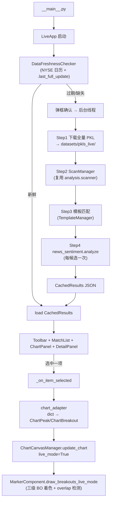

> 最后更新：2026-04-14

# Live 日常监控模块

## 定位

独立的**只读日常盯盘 UI**，消费挖掘模块产出的 Top-1 Trial 参数，每天对全市场做一次突破扫描+情感评估，把候选集投到筛选面板供用户人工复核。

与 `UI/` 的分工：
- `UI/` 是**策略开发台**——可载入任意历史窗口反复调参、回测、导出模板，关注"这个配置在过去哪些股票/时段好"。
- `live/` 是**生产盯盘台**——使用定稿 Trial，每天刷新到最新交易日，关注"今天有谁进入候选集，值不值得看"。

两者都复用 `analysis/` 的扫描能力和 `UI/charts/` 的图表组件，但数据目录、状态机、渲染细节不共享。

---

## 核心流程

**四步 Pipeline** 在 `pipeline/daily_runner.py`：原子提交——任一步失败都不写 `.last_full_update` marker，下次启动仍判为"过期"，避免残缺缓存被当成有效结果。

---

## 关键架构决策

### 1. Live 与 Dev UI 物理隔离，不是"同一个 UI 加开关"

**决策**：独立包、独立入口（`python -m BreakoutStrategy.live`）、独立状态机，共享的只是 `UI/charts/` 组件。

**理由**：
- 两者的主循环不同——Dev 是"载入一次、反复调参"，Live 是"每天刷新、点点看看"；把两套状态塞进一个 App 会让 state.py 迅速复杂化
- 数据目录独立（`datasets/pkls_live/` vs `datasets/pkls/`）：Live 天天全量覆盖 PKL（akshare 前复权调整需要重下载），Dev 需要稳定的回测数据集，两者共用就会互相污染
- 失败影响独立：Live 下载挂掉不影响 Dev 正在进行的回测

### 2. Pipeline 拆成四个独立文件而非单 class

**决策**：`pipeline/` 下 `daily_runner.py` / `freshness.py` / `results.py` / `trial_loader.py` 各司其职。

**理由**：
- `freshness.py`（NYSE 日历 + marker 文件）是无状态工具，可被任何需要"今天是否应刷新"的调用方复用，不绑 Pipeline
- `results.py` 的 `MatchedBreakout` dataclass + JSON 序列化是缓存层，Pipeline 和 UI 都读它——独立出来避免循环依赖
- `trial_loader.py` 只关心 `filter.yaml → TrialBundle` 的解包，把挖掘模块的产出契约集中在一处，Trial 字段变化时只改这一个文件
- `daily_runner.py` 只承载"四步编排"业务逻辑，可脱离 UI 单独测（`tests/test_daily_runner_matched_fields.py` 就是这么跑的）

### 3. chart_adapter 作为 dict ↔ 对象的桥层

**决策**：`ScanManager` 返回 dict（为了跨进程 JSON 可序列化），`ChartCanvasManager` 要对象（属性访问 `bo.index` / `peak.id`）；`chart_adapter.py` 提供 `adapt_peaks()` / `adapt_breakout()` 做轻量包装。

**理由**：两边的契约都不能动——scanner 的 dict 契约被整个 mining pipeline 共用，charts 的对象契约服务于 Dev UI。桥层只带渲染需要的字段，不变动源对象，也不做业务判断。

### 4. Live 不改 `draw_breakouts`，走单独渲染路径

**决策**：`MarkerComponent` 加 `draw_breakouts_live_mode` 静态方法，`canvas_manager.update_chart` 根据 `display_options["live_mode"]` 分派。

**理由**：
- Dev 路径展示 quality_score（红字数字），是调参用户的决策信号；Live 用户不调参，看分数反而是噪音
- Live 需要区分当前选中 BO（绿色实心）/其他 matched BO（蓝色实心）/plain BO（蓝色空心），Dev 没有"当前选中"的概念
- 直接改 `draw_breakouts` 要加一堆分支，改动面波及 Dev 的 6 个渲染测试；加新方法各走各路，互不干扰

### 5. `MatchedBreakout` 携带全股票 BO 上下文

**决策**：`results.py` 的 `MatchedBreakout` 除了"被匹配到的那个 BO"外，还带 `all_stock_breakouts`（该股票全部 BO）和 `all_matched_bo_chart_indices`（所有匹配模板的 BO 的 chart-df 行号）。

**理由**：用户选中一行后需要在图上看到整只股票的 BO 全貌，并区分出哪些也进了模板筛选。若只存"当前 BO"，画图时缺少兄弟 BO 和 matched 集合的信息，每次选中都要重新扫描——缓存阶段就一次性带全，避免选中时阻塞 UI。

### 6. 异步 Pipeline + root.after() 回主线程

**决策**：`_run_pipeline_async` 启 worker 线程跑下载/扫描/情感，进度和完成通过 `root.after()` 调回主线程更新 Tkinter 控件。

**理由**：Tkinter 不是线程安全的；直接从 worker 动控件会偶发崩溃。`after()` 把回调塞进主循环队列，保证 UI 变更只在主线程发生。

---

## 外部依赖

| 被复用 | 入口 | 用途 |
|---|---|---|
| `analysis.scanner.ScanManager` | `daily_runner.py` Step2 | 突破检测，与 Dev UI 共用同一个 scanner |
| `UI.config.param_loader.UIParamLoader` | `daily_runner.py` | 合并 Trial 的 scan_params 与默认配置 |
| `mining.template_matcher.TemplateManager` | `daily_runner.py` Step3 | 用 Trial 的 Top-1 模板过滤扫描结果 |
| `news_sentiment.api.analyze` | `daily_runner.py` Step4 | 每个候选调一次情感分析 |
| `UI.charts.ChartCanvasManager / MarkerComponent` | `app.py` + `chart_adapter.py` | 图表渲染（live_mode 分支） |
| `scripts.data.data_download` | `daily_runner.py` Step1 | akshare 全美股下载 |
| `pandas_market_calendars` | `freshness.py` | NYSE 交易日判定 |

**配置来源**：`BreakoutStrategy/live/config.yaml`（Live 自己的 UI 配置）+ Trial 目录下 `filter.yaml`（模板 + 阈值 + scan_params + negative_factors）。

---

## 已知局限

1. **只读**：不触发下单、不做持仓管理，仅产出候选列表。交易决策完全在用户手工复核之后。
2. **全量下载成本高**：Step1 每天一次全美股（~6000+ ticker）重下载，受 akshare 限流和网络抖动影响，实测 10–30 min；增量下载因为前复权调整不可行。
3. **Marker 原子性仅保证完整刷新**：`.last_full_update` 在 Step1 成功后写入，但 Step2/3/4 失败时当前不清除 marker——下次启动认为数据新鲜，直接用不完整结果。实际回退依赖 CachedResults 的存在性（见 `app.py:_on_startup`）。
4. **Sentiment 失败降级**：单候选 sentiment API 失败返回 `None`，归类为"error"而非阻断整批，用户要自己识别这种状态。
5. **Chart 缩放极限下 BO marker 仍可能挤 label**：`draw_breakouts_live_mode` 用数据坐标 `offset_unit * 倍数`，极端放大（price_range 缩到初始 <25%）可能重叠；当前取 `marker_y - label_y = 1.8u` 作为折衷，更高鲁棒性需改成 `textcoords="offset points"` 像素偏移。
