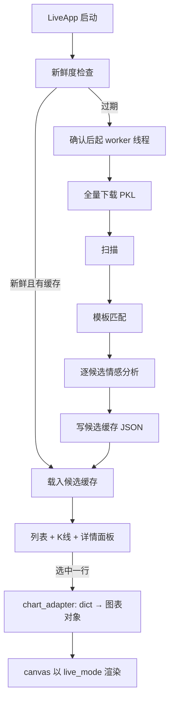

> 最后更新：2026-07-25

# Live 日常监控模块

## 定位与边界

`BreakoutStrategy/live/` 是**只读日常盯盘台**：消费挖掘模块定稿的 Trial 参数，每天对全市场跑一次
「下载 → 扫描 → 模板匹配 → 情感分析」，把候选集投到筛选面板供人工复核。

**管**：数据新鲜度判定、每日刷新编排、候选缓存、盯盘界面。
**不管**：下单、持仓管理、参数调优（那是 `dev/` 的事）。所有交易决策都在用户手工复核之后。

与 `dev/` 的分工：`dev/` 是"载入一次、反复调参"的开发台；`live/` 是"每天刷新、点点看看"的生产台。
两者共享 `analysis/` 的扫描能力和 `BreakoutStrategy/UI/`（见 [UI.md](UI.md)），但数据目录、状态机、渲染路径都不共享。

对外依赖全部集中在 `pipeline/daily_runner.py`（扫描、参数加载、模板匹配、情感分析、行情下载都是调
别的模块）与 `pipeline/freshness.py`（交易日历），逐项见这两个文件的 import。

```mermaid
flowchart TD
    L[LiveApp 启动] --> F[新鲜度检查]
    F -->|新鲜且有缓存| C[载入候选缓存]
    F -->|过期| P[确认后起 worker 线程]
    P --> D1[全量下载 PKL]
    D1 --> D2[扫描]
    D2 --> D3[模板匹配]
    D3 --> D4[逐候选情感分析]
    D4 --> SAVE[写候选缓存 JSON]
    SAVE --> C
    C --> UI[列表 + K线 + 详情面板]
    UI -->|选中一行| ADAPT[chart_adapter: dict → 图表对象]
    ADAPT --> CM[canvas 以 live_mode 渲染]
```

## 关键决策与理由

**Live 与 Dev 物理隔离，不是"同一个 UI 加开关"**：独立包、独立入口、独立状态机。理由有三——
主循环形态不同，两套状态塞进一个 App 会让状态层迅速失控；数据目录必须独立（Live 每天全量覆盖
PKL，Dev 需要稳定不变的回测数据集，共用即互相污染）；失败影响独立（Live 下载挂掉不能波及 Dev 的回测）。

**Pipeline 按职责拆成多个文件而非一个 class**：新鲜度判定是无状态工具，任何需要"今天该不该刷新"的调用方
都能复用，不该绑在 Pipeline 上；候选缓存层被 Pipeline 和 UI 双向读写，独立出来才不产生循环依赖；
Trial 解包单独成文件，把挖掘模块的产出契约收在一处，契约变化只改一个文件；编排逻辑本身不碰 UI，
因而可脱离 Tkinter 单测。

**chart_adapter 作为 dict ↔ 对象桥层**：scanner 返回 dict（跨进程可序列化，且该契约被整个 mining
管线共用），图表组件要属性访问的对象（该契约服务 Dev UI）。两边契约都不能动，只能加薄桥层——
它只搬渲染需要的字段，不改源对象，不做业务判断。

**Live 不改 dev 的 BO 绘制函数，走并列的 live_mode 渲染路径**：Dev 展示评分是调参用户的决策信号，
Live 用户不调参、看评分是噪音；Live 另有"当前选中 + 点 marker 反向同步列表"的语义，Dev 没有；
直接改共用函数会把 Dev 的测试一起卷进来，加并列路径则各走各路。

**候选记录携带整只股票的 BO 上下文**（不只是被匹配中的那一个）：用户选中一行后要在图上看到该股全部
BO 并区分哪些也进了模板筛选。缓存阶段一次性带全，选中时才不必重扫、不阻塞 UI。

**图表数据流与 Dev 统一走 `UI/charts/range_utils.py` 管线**：旧路径直接读 pkl 喂 canvas，隐含
"scanner df 行数 == pkl 行数"的不变量，而它只由两处常量的数值巧合维持——任一侧一动，BO index 就
无声错位。统一后 index 由裁切返回的 offset 显式补偿，MA 取 preprocess 的预计算列（避免 canvas
fallback 现算导致前 N 根 NaN）。

**下载窗口由常量派生而非写死**：唯一事实源是 `FeatureCalculator` 的有效 buffer，任何因子 lookback /
MA 周期 / 显示窗口变化都自动传导到下载量。公式与各项默认值见 `pipeline/daily_runner.py::_compute_download_days`。

**渲染范围的降级要在 UI 上可见**：数据不足以覆盖理想范围时，列表行尾出小标、图上画降级虚线，
而不是静默按实际范围画——否则用户会把截短的图当成完整历史。阴影与虚线的绘制与 Dev UI 共用一套，
见 [dev.md](dev.md)。

## 不变式与负知识

- **新鲜度 marker 只保证下载这一步的原子性，不保证整条 pipeline**。marker 在下载成功后立即写入，
  后续扫描/匹配/情感分析失败时不会清除它——下次启动会判为"数据新鲜"并直接采用不完整结果。真正的兜底是
  启动时同时检查候选缓存是否存在（见 `app.py::_on_startup`）。改动刷新逻辑时别默认 marker 是全局提交点。
- **全量下载是刻意的，不能改成增量**：数据源无法真正增量（每次返回全部历史），且前复权会回溯修改
  历史价格，只有全量覆盖才跟得上分红/拆股调整。代价是每天一次全美股重下载，耗时以十分钟计。
- **Tkinter 不是线程安全的**：worker 线程只能通过 `root.after()` 把回调塞回主循环，禁止在 worker
  里直接动控件，否则偶发崩溃且难复现。
- **渲染范围规格不进缓存 JSON**：它含 date 对象、非 JSON 原生可序列化，且可从 pkl 廉价重建；
  加载后缺失时现场重建，旧缓存因而 graceful 降级而非报错。
- **因子值可能不可用**（per-factor gate 返回 None），详情面板的格式化函数必须处理 None，
  否则会抛 TypeError 而不是显示 N/A。
- **单候选情感分析失败不阻断整批**，会被归为 error 状态留在结果里，需要用户自行识别。
