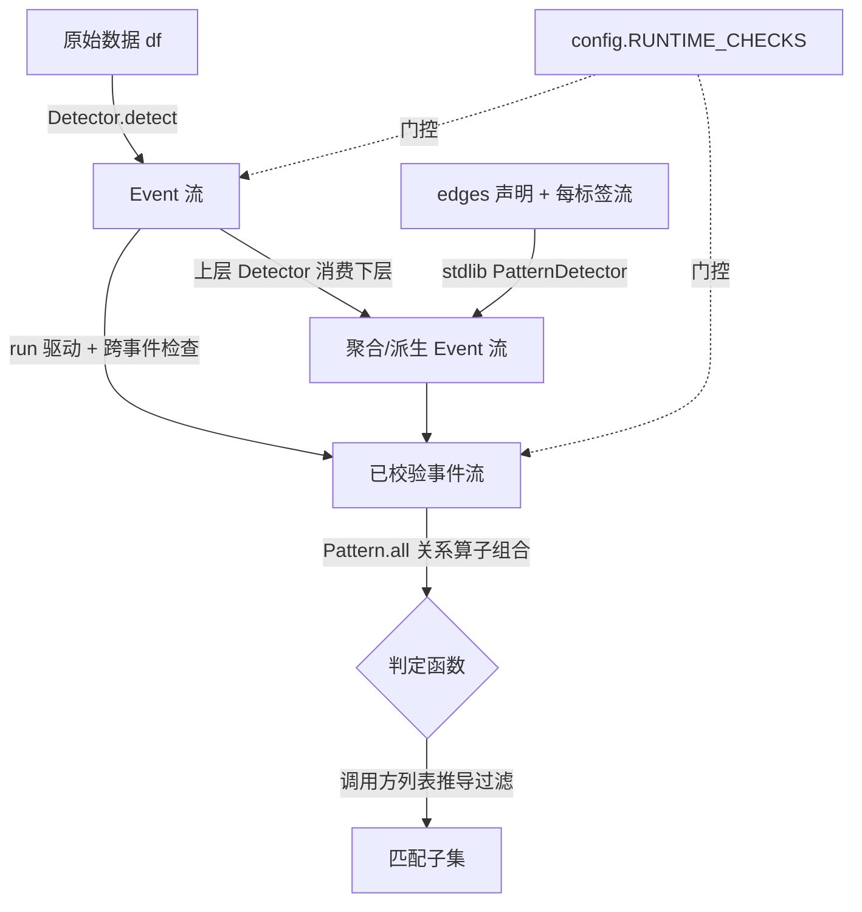

# Path 2 协议层 + stdlib

> 最后更新：2026-05-17
> 顶层包 `path2/`。**独立事件表达框架**,与 `BreakoutStrategy/` 因子框架/突破选股数据流**无任何耦合**(独立业务,自带未来流水线,与 mining/TPE/因子框架无关)。
> 两层:`path2/`(协议层,冻结)+ `path2/stdlib/`(标准 PatternDetector + 便利层:`BarwiseDetector`/`span_id`)。算法权威 `docs/research/path2_algo_core_redesign.md`。

## 定位

Path 2 把"股票形态"建模为**多级事件**:事件是一等的、不可变的结构化数据行;形态由"造事件 + 约束事件关系"两步表达。协议层定类型契约 + 关系算子 + 安全网;stdlib 在其上提供**消费 `TemporalEdge` 声明的标准 PatternDetector**——用户只写声明(edges + 每标签一条流),stdlib 跑实现。

## 三角色叙事(理解协议层的钥匙)

| 角色 | 性质 | 代码载体 |
|---|---|---|
| `Event` | 名词(数据行) | frozen dataclass ABC,必有 `event_id/start_idx/end_idx` |
| `Detector` | 动词(产出事件) | `runtime_checkable` Protocol,`detect(source)->Iterator[Event]` |
| Pattern | 形容词(约束关系) | **不是类**:5 个关系算子 + `Pattern.all` 组合出的 `Event->bool` 判定函数 |

`Detector` 是事件层之间唯一的桥(`df`→L1→L2→…);Pattern 只评估、不产出。

## 核心流程

## 协议层关键决策与理由(Why)

- **`Event` 必须 frozen + "Row 落地=字段完成"不变式**:事件一旦 yield,所有字段已就绪(无 NaN/partial)。需要后置窗口才能算的字段,Detector 等够再 yield。消费方永不判断"字段是否 ready",事件可安全跨层复用。
- **两层安全网,按状态需求拆分**:单事件不变式(int 类型、非 bool、`start≤end`、NaN 扫描)放 `Event.__post_init__`(错误在**构造点**立即暴露);跨事件不变式(yield `end_idx` 升序、`event_id` 单 run 唯一)需跨事件状态,放 `runner.run()`。算子层保持纯函数零状态。
- **不写自定义 frozen 检查**:Python `@dataclass` 装饰期即拒绝"非 frozen 子类继承 frozen `Event`",比协议层自检更早更强;自检为不可达死代码。
- **`run()` 非强制**:`MyDetector().detect(df)` 直用仍可(极简心智),只是少跨事件检查;`run(detector,*source)` 是推荐驱动,变参支撑 L2+ 的 `detect(stream,df)`,**流式不物化**(generator 边跑边查,内存只占 `seen_ids`)。
- **`config.RUNTIME_CHECKS` 必须属性访问**:用 `config.RUNTIME_CHECKS`,禁止 `from path2.config import RUNTIME_CHECKS`(import 期拷死布尔,热切失效)。关掉时全走 fast-path 零开销。
- **算子纯函数 + `Pattern.all` 唯一组合子**:协议层刻意瘦,表达力靠组合非内建子类。窗口边界精确且不对称(刻意):`Before` idx 形态 `[max(0,start-w), start)`、stream 形态不 clamp;`After` idx `(end, end+w]`;`window<=0` 一律 False。
- **`bool` 一律拒绝**:`bool⊂int` 但布尔当索引/数值特征是语义错误。`Event.__post_init__` 用 `type(x) is bool` 精确拒 `start_idx/end_idx`;`features` 用 `not isinstance(v,bool)` 排除。

## stdlib 关键决策与理由(Why)

- **4 个 Detector = 一个约束推进核心的四种形态**:Chain(线性)/Dag(偏序)/Kof(k-of-n 松弛)/Neg(偏序+排除)。Chain = Dag 加严线性构造期断言、复用同核心——单一实现的支点。
- **核心 = LEF-DFS,三态分离不可混淆**:INV-A(逐节点访问 scan,全后缀新鲜、不跨 anchor/回溯携带——因输入仅 `end_idx` 升序、`start_idx` 无序,不可早停);INV-B(持久消费指针,产出后全成员按真实整数下标 `+1` 非重叠消费——这是 `end_idx` 升序流式产出的承重正确性不变式,部分消费不健全);INV-C(FAILED 前沿割记忆,仅一次 LEF 调用内有效、调用间重置)。`earliest-feasible := key=(start_idx,end_idx,position)` 字典序最小,position 终极 tiebreak 使算法不依赖 `event_id` 唯一性。逐弱连通分量(WCC)独立跑 + 按 `end_idx` p 路归并。
- **诚实复杂度**:Chain 前沿割宽 `f=1` ⇒ 多项式/近线性(headline);病态宽前沿 DAG 时间空间同为指数(内在 interval-CSP-over-DAG 难度,显式承认,不粉饰)。
- **统一产出 `PatternMatch`**:4 种都产同一 frozen Event 子类(`children` 按 start 升序 / `role_index` 标签→升序 tuple 恒 tuple / `pattern_label`)。不设每 Detector 专属子类——"哪种算法拼的"是无人消费的运行期细节;统一类型才能跨 Detector 一致回查、嵌套复用。`pattern_label` 由用户声明时给,替代"类名默认"解嵌套。
- **三段标签解析**:具名流(kwarg)> key 函数 > 类名/pattern_label 默认。冲突一律构造期 `ValueError`("构造点拦截、绝不静默合并",与协议层 bool 决议同源)。
- **event_id 单 run 唯一机制**:无条件、四 Detector 共享的 `detect()`-局部 `seen_ids`,`base=f"{label}_{s}_{e}"`,撞则 `base#<n>`。生产侧 yield 前保证唯一,`run()` 校验为后盾。`pattern_label` 不得含 `#`。
- **Kof = LEF-DFS 结构姊妹**:差异仅 4 处——无窗口过滤(边可不满足,不能据某边裁候选)/ 叶层 k-of-n 接受谓词 / 关 INV-C / 不做等-end 塌缩。缓冲继承零/结构常数,代价转为时间标签维诚实指数(松弛无剪枝的内在代价)。构造期强制单 WCC(跨 WCC 的 k-of-n 无明确语义)。
- **Neg = 正向子图 + forbid 成员资格谓词**:forbid 边端点角色由**成员资格**(∈ forward.nodes ⇒ 正向锚,∉ ⇒ 否定标签)识别,**与 earlier/later 方向无关**;两端皆∈/皆∉ 构造期报错。gap 按声明方向原样代入,否定流空 ⇒ 放行,多 forbid 合取。正向复用 `advance_dag`,子序列过滤继承升序与缓冲界;否定标签结构性不进 children/role_index。

## stdlib 便利层关键决策与理由(Why)

- **`BarwiseDetector` 是唯一沉淀的 Detector 模板**:从 dogfood 真实痛点倒推——"逐 bar 单点扫描"循环是唯一高频+易错+未被 PatternDetector 覆盖的样板。模板拥有 `for i in range(len(df))` 主循环 + None 过滤,用户子类只实现领域判据 `emit(df,i)->Optional[Event]`。**模板对 `i` 零领域假设**:lookback 由子类在 `emit` 内 `return None` 自管(lookback 是领域知识,不焊进框架契约,故不暴露 `warmup`);**零跨事件校验**(end_idx 升序/id 唯一仍归 `run()`,模板做=与 run 重复二义)。`detect(df)` 即对接 `run(MyDet(),df)`。
- **不沉淀任何 Event 类**:用户真实 L1 事件总带使用方私有领域字段,按定义无法被 stdlib 预沉淀;协议层 `Event` + 自动 `.features` 已够。候选 `Peak/BO` 命名还违反"与突破业务无关"独立业务约束。
- **不造窗口/聚合/滑动计数原语(红线)**:"窗口内 ≥N" 是滑动动态计数,`Kof` 是 k-of-n 边松弛(成员数恒=label 数)**并不覆盖**它;该样板暂无足够复用证据进 stdlib,使用方自管,待真实重复再立。红线不依赖任何"已被某 Detector 覆盖"声明。
- **`span_id` 与 `default_event_id` 两函数刻意并存**:`span_id`(公开)单点 `start==end` 塌缩 `kind_i` 否则 `kind_s_e`,吸收单点/区间两种惯例;`default_event_id`(#3 内部,不公开)恒区间——#3 已用 pinned 测试锁定该语义,归一会 break。实体数=必要语义数(奥卡姆),非过度设计。

## 对外 API

`path2/__init__.py` 出口:协议层 `Event`/`Detector`/`TemporalEdge`/`Before`/`At`/`After`/`Over`/`Any`/`Pattern`/`run`/`config`/`set_runtime_checks` + stdlib PatternDetector `Chain`/`Dag`/`Kof`/`Neg`/`PatternMatch` + 便利层 `BarwiseDetector`/`span_id`(`default_event_id` 不公开)。`TemporalEdge`:`earlier/later/min_gap/max_gap`,`gap=later.start_idx-earlier.end_idx`;声明性 datatype,由 stdlib PatternDetector 解析驱动(`earlier/later` 是声明期端点标签,非 event_id)。

## 依赖关系

仅 stdlib(`dataclasses`/`typing`/`math`/`os`/`operator`/`abc`)+ `BarwiseDetector` 用 `pandas`(L1 模板天然吃 df)。协议层内部 `core`/`runner`→`config`,`operators`/`pattern`→`core`。`path2/stdlib/`:PatternDetector 依赖协议层 + `_ids.default_event_id`(#3 内部桩);便利层 `templates.py`(`BarwiseDetector`)依赖 `core.Event`,`_ids.span_id` 独立公开。无环。

## 已知局限与边界

- **stdlib 未含(刻意)**:任何 Event 子类(领域字段使用方私有,不可预沉淀)、任何窗口/聚合/滑动计数 Detector(红线,使用方自管)、DSL 层(未来 #5,默认不做)。仅 `BarwiseDetector` 一个 Detector 模板。
- **Kof 时间最坏指数于出现标签数**(松弛无窗口剪枝,常态;非如 Dag 仅病态),且强制单 WCC。
- **Neg 否定标签须显式传流**(可空 `N=[]`);完全不传该 kwarg → 构造期 `missing` 报错(有意:打错 forbid 标签名当场暴露)。
- **`#<seq>` 使 event_id 跨 run 不稳定**:协议 §1.1.1 只要求单 run 唯一,不违约;远期跨 run 稳定 id 需求须重审。
- spec/设计:`docs/research/path2_spec.md`、`docs/research/path2_algo_core_redesign.md`(LEF-DFS §1-9 / Kof §10 / Neg §11,算法权威)、`docs/superpowers/specs|plans/2026-05-16-path2-*`(协议层/dogfood/PatternDetector)、`docs/superpowers/specs/2026-05-17-path2-4-stdlib-templates-design.md`(便利层,含写回横幅:Kof 不覆盖滑动计数);dogfood `docs/research/path2_dogfood_report.md`;路线 `docs/research/path2_roadmap.md`。
