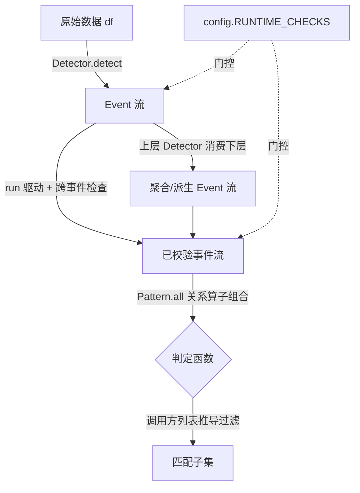

# Path 2 协议层

> 最后更新：2026-05-16
> 顶层包 `path2/`。**独立事件表达框架的协议层**,与 `BreakoutStrategy/` 因子框架/突破选股数据流**无任何耦合**(独立业务,自带未来流水线,与 mining/TPE/因子框架无关)。

## 定位

Path 2 把"股票形态"建模为**多级事件**:事件是一等的、不可变的结构化数据行;形态由"造事件 + 约束事件关系"两步表达。本包只实现**协议层**(类型契约 + 关系算子 + 安全网),不含任何开箱即用的具体检测器。

## 三角色叙事(理解全包的钥匙)

| 角色 | 性质 | 代码载体 |
|---|---|---|
| `Event` | 名词(数据行) | frozen dataclass ABC,必有 `event_id/start_idx/end_idx` |
| `Detector` | 动词(产出事件) | `runtime_checkable` Protocol,`detect(source)->Iterator[Event]` |
| Pattern | 形容词(约束关系) | **不是类**:5 个关系算子 + `Pattern.all` 组合出的 `Event->bool` 判定函数 |

`Detector` 是事件层之间唯一的桥(`df`→L1→L2→…);Pattern 只评估、不产出。

## 核心流程

## 关键决策与理由(Why)

- **`Event` 必须 frozen + "Row 落地=字段完成"不变式**:事件一旦 yield,所有字段已就绪(无 NaN/partial)。需要后置窗口才能算的字段,Detector 等够再 yield。这样消费方永不判断"字段是否 ready",事件可安全跨层复用。
- **两层安全网,按状态需求拆分**:单事件不变式(int 类型、非 bool、`start≤end`、NaN 扫描)放 `Event.__post_init__`——错误在**构造点**立即暴露,定位最准;跨事件不变式(yield `end_idx` 升序、`event_id` 单 run 唯一)需要跨事件状态,放 `runner.run()`。算子层保持纯函数零状态。
- **不写自定义 frozen 检查**:Python `@dataclass` 在**装饰期**即拒绝"非 frozen 子类继承 frozen `Event`",比任何协议层自检更早更强;自检为不可达死代码,故不写。
- **`run()` 非强制**:直接 `MyDetector().detect(df)` 仍可用(保留极简心智模型),只是少了跨事件检查;`run(detector,*source)` 是推荐驱动,`*source` 变参支撑 L2+ 的 `detect(stream, df)` 形态,且**流式不物化**(generator 边跑边查,内存只占 `seen_ids`)。
- **`config.RUNTIME_CHECKS` 必须属性访问**:`core`/`runner` 用 `config.RUNTIME_CHECKS`(模块属性),**禁止** `from path2.config import RUNTIME_CHECKS`——否则 import 期把布尔值拷死,`set_runtime_checks()` 热切失效。关掉时所有检查走 fast-path 零开销(`run` 直接 `yield from`)。
- **算子是纯函数 + `Pattern.all` 是唯一组合子**:协议层刻意瘦,表达力靠组合而非内建子类。窗口边界精确且不对称(刻意):`Before` idx 形态 `[max(0,start-w), start)`(clamp 到 0)、stream 形态用原始下界不 clamp;`After` idx 形态 `(end, end+w]`;`window<=0` 一律 False。
- **`bool` 一律拒绝(idx 与 features 同源)**:`bool ⊂ int`,但布尔当整数索引或数值特征是语义错误。`Event.__post_init__` 用 `type(x) is bool` 精确拒 `start_idx/end_idx`(`isinstance` 无法区分,精确判定才不破坏 int 卫语);`features` 同理用 `not isinstance(v,bool)` 排除布尔标志。

## 对外 API

`path2/__init__.py` 唯一出口:`Event` / `Detector` / `TemporalEdge` / `Before` / `At` / `After` / `Over` / `Any` / `Pattern` / `run` / `config`(模块对象)/ `set_runtime_checks`。

`TemporalEdge` 是声明性 datatype(`earlier/later/min_gap/max_gap`,`gap=later.start_idx-earlier.end_idx`),本身不计算,需消费者读取驱动匹配。

## 依赖关系

无第三方依赖,仅 stdlib(`dataclasses`/`typing`/`math`/`os`/`operator`)。内部:`core`/`runner` 依赖 `config`;`operators`/`pattern` 依赖 `core`;`__init__` 聚合全部。无环。

## 已知局限与边界

- **仅协议层**:不含具体 Event 子类、具体 Detector、消费 `TemporalEdge` 的标准 PatternDetector(Chain/Dag/Kof/Neg)、DSL 层——这些不在本包范围。
- **`TemporalEdge` 无内建消费者**:声明可建,但驱动匹配的检测器需使用方自写。
- spec/设计见 `docs/research/path2_spec.md`(§9;§9.3 bool-as-idx 已闭环)、`docs/superpowers/specs/2026-05-16-path2-protocol-layer-design.md`;dogfood 验证见 `docs/research/path2_dogfood_report.md`。
