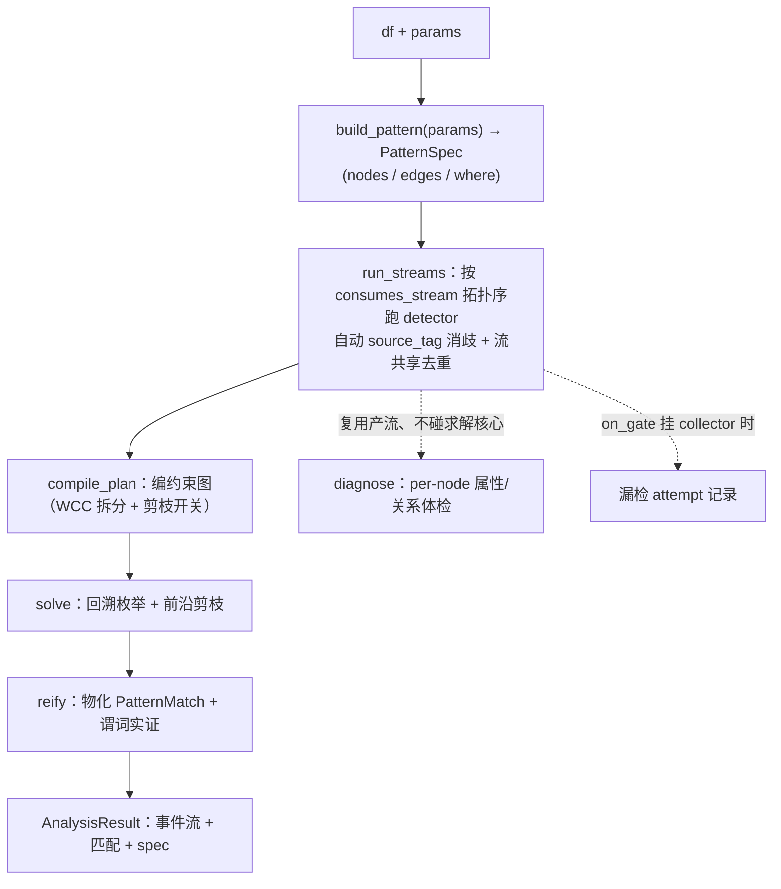

# path2 框架架构意图

> 最后更新：2026-08-03

覆盖 `path2/`（协议地基 + dag 引擎 + atoms + calc + stdlib + eval + 诊断底座）。
应用层见 [path2_apps.md](path2_apps.md)；扫描 / 可视化 / 调试前后端见 [path2_web.md](path2_web.md)。

---

## 定位与边界

path2 把"股票形态"建模为**多级不可变事件**：事件是有类型的冻结数据行；形态由"声明节点 + 声明类型化边"两步表达，不写命令式编排。引擎负责跑 detector、求解约束图、物化匹配；app 只 `build_pattern(params)` 后交给 `analyze`。

- **管**：事件/检测器协议、DAG 声明与求解、走势-无关的 L1 detector、纯数值计算、前瞻收益度量、漏检诊断底座。
- **不管**：任何带形状偏见的具体走势（归 `path2_apps/`）、扫描编排 / 序列化 / UI（归 `path2_web*/`）。
- **零耦合**：`path2/` 内任何文件不得 `from BreakoutStrategy`，`tests/path2/test_self_contained.py` grep 强制。

---

## 关键决策与理由

### where（一元）vs satisfies（二元）的正交分工

这是整个设计的脊梁：`where` 读**单实例自身属性**，边的 `satisfies` 读**一对实例间关系**。where 谓词签名严格一元、**不接受任何运行时上下文对象**，由此推出三条硬性归属：K 线回看归 detector（算好字段挂 event 上）、参数阈值由 `build_pattern(params)` 闭包闭合、跨节点约束一律归边。声明作者因此根本看不到命令式循环。

### 边多态，引擎零边类型分支

边同时定义拓扑序、引擎前沿推进方向、面板箭头方向——一条声明三重用途。边子类与它们共同的多态接口见 `path2/dag/edges.py`；**引擎只经基类接口消费，没有任何按边类型分支的代码**，新增一种关系 = 加一个子类，引擎不动。

### 段聚合走"复合事件"，不走节点展开

**引擎里一个节点恒绑单个 Event**，求解期没有区间绑定 / 串聚合的概念。所以要把"一段子结构"整体绑进外层 DAG，唯一做法是让 detector 直接把子序列封成**一个宽事件**（如 bo 串 → burst）：where 读它的预算标量（与单实例同式、零特例），外层边经 `Child` 端点 selector 连它的内部端点。收益是把"相对子成员的代价"这类约束表达成普通边，绕开把成员展开成节点带来的指数爆炸。selector 不参与边身份——spec 校验与图构建只看纯 node_id，求值期才投影到子事件。

### 身份分三处正交机制

类型身份、实例身份、流共享是三件事，不能合一：

1. **class_id**（类型键）：面板上色、拓扑投影、序列化的唯一类型标识，类定义期入全局注册表查重，冲突即抛。
2. **source_tag**（实例键）：event_id 前缀。当同一 class 有 **≥2 个独立 detector 实例**时，引擎在跑流前自动给未命名者编号消歧；单实例 / 共享实例 / 已显式命名的**一律不动**，故 event_id 向后兼容且幂等。多实例化要求该 detector 暴露 `source_tag` 钩子，无钩子又多实例即抛。
3. **流共享去重**：同一 detector **实例**喂多个 node 时只物化一遍流，结果按流对象去重平铺，`AnalysisResult` 自断言 event_id 无重复。

### `__call__` 短路，`witness` 全量求值

where 谓词对象是双出口的：求解热路径每个候选都要调 `__call__`，必须短路；诊断与物化则走 witness 递归产出、**故意不短路**——`or` 的首支已为真时仍算出第二支的实测值，否则调参 UI 看不到"另一支还差多少就能命中"。这是富诊断的机制源头。

### 诊断的坐标轴是 node，不是 event

event 级"失败归因"因为求解本身短路、结果 path-dependent，是 ill-defined 的。所以 `diagnose` 只做 per-node 独立体检：哪些候选能当这个 node、卡在哪条 where、找不找得到关系伙伴。它**复用产流、但不碰 `_solve` 求解核心**；单 node 通过不代表能凑成完整匹配。

关系体检**不能只看 `satisfies`**：dst 还必须真的锚定到那个 src，strict 边还必须是窗口内第一个同类候选——漏掉任一关都会报假通过。NegationEdge 是全称量词，单点视角没有独立诊断入口，直接跳过。

### eval.py 为什么不放 calc/

`calc/` 的约定是纯数值、零 Event 依赖；前瞻收益要读 `PatternMatch` 的节点索引，破了这个约定，故独立成模块。买点节点与 horizon 由调用方提供，path2 本身不知道任何具体走势。

### first_passage：路径方向度量（与 forward_return 正交）

forward_return 量买点后窗口的**终点幅度**（mfr，含波动率 = 盈利潜力）；first_passage 量**路径方向**——价格先触上行线还是下行线。两者看正交维度：幅度大不代表有方向（高波动随机涨跌），有方向不代表幅度大（涨得对却没油水）。first_passage 的存在是为了配一个"去波动率的方向锚"，让方向信号不被波动率污染。

- **几何对称阈值**：上行 `P(1+kM)`、下行 `P/(1+kM)`，对数距离相等（都 = log(1+kM)）→ 对无方向波动 ratio 钉在 0.5，偏离 0.5 即真 drift（不是阈值偏置）。算术 ±kM 反而对数不对称（下行更远）、凭空偏上行——这是选几何对称而非算术的唯一理由。
- **波动率尺度 M**：每买点窗内 ATR/close 的 nanmedian（中位数扛"一年一次"的极端异动；均值类如 Wilder RMA 会被一把大异动撑成失真的尺）。**内算、与判定同 bar 口径**（TR[t] 用 t 的 high/low + t-1 的 close，均已知 → 无前瞻）。
- **ratio 分母 = up+down**（不含 none/both）：none = 窗口内未触任一线（无方向信息）、both = 同根双向（方向不明），都不计分母。改这口径会让 ratio 跨 scan 不可比。
- 单参数 k，scan 链路可调；默认值与函数签名见 `path2/eval.py`，集合级聚合 / 序列化口径见 `path2_web/`。

---

## 不变式与负知识

- **frozen 容器字段一律用 tuple**：list 可以 in-place mutate，会从内部突破 frozen 语义。
- **"Row 落地 = 字段完成"**：单事件不变式（区间合法、禁 NaN）在构造点校验；跨事件不变式（end_idx 升序、event_id 单 run 唯一）只在驱动入口 `run()` 校验。两者别混放。
- **node_id / pattern_id 同时被前端当显示名用**：没有独立的显示标签字段，起名要直接按"面板上希望看到的短标签"来定，改名等于改 UI 文案。
- **node_id 是拓扑主键、必须唯一**：重复会让求解层的字典后写覆盖前写（静默丢节点），而面板投影遍历 tuple 不去重 → 求解层与面板层裂脑。spec 校验里这一条**必须先于**其余校验跑，否则去重后的集合会掩盖重复。
- **C1 等-end 塌缩在若干类节点上必须关掉，否则漏匹配**：这些节点的判据看的根本不是父事件的 end，C1 学不到这类信息，会把不可互换的候选误判为可互换。具体是哪些节点、各自因为什么，见 `path2/dag/_solve.py::compile_plan` 的内联注释。
- **动 C1 剪枝相关逻辑，必须先跑多候选 fuzz**：真漏匹配 bug 曾两次逃过平凡场景的单测试，全靠独立 fuzz 才抓到。
- **anchor 引用约束拒绝单调坐标**（start/end 索引）：那类约束应改用 EqualsEdge 走结构剪枝，spec 校验会直接拒绝并引导。
- **`Detector` 协议里 `on_gate` 的声明必须留在 `TYPE_CHECKING` 守卫内**：`runtime_checkable` 的 isinstance 结构检查会把 Protocol 中任何已声明属性（哪怕带默认值）都纳入必须项，正常声明会让所有未显式带 `on_gate` 的现有 detector 突然判定为不合规。守卫两全：类型检查器看得到契约，运行时行为不变。
- **on_gate 默认 None、生产路径零开销**，只有诊断层挂 collector 时才在实例上覆盖。
- **出口过滤残缺匹配**：只为产流给别人消费的孤立节点（无任何边）不该自成一个匹配，`analyze` 会丢弃这类 match；判据从边与 `consumes_stream` 反推，不需要额外的"流源"标记。被丢的匹配保留在结果里可查。
- **where 组合子的命名与 None 语义**：`and` / `or` 是关键字不能当函数名，故用内置同名替身并遮蔽，`not_` 尾下划线同理。属性为 None 时叶子判 False（与短路写法语义一致），**取反后会变 True**——写 where 时留意。
- **atoms 入库门槛**：至少两条不相关走势会用，或表达单一通用物理事件。**带形状偏见的命名一律拒入**（`RoundedBottom` 之类退到 `path2_apps/`）。detector 内部状态不得跨 `detect()` 调用。

---

## 分层边界

- **`core.py` / `runner.py` / `config.py`**：Event 与 Detector 协议、class_id 注册表、`run()` 跨事件安全网、运行时校验开关。
- **`dag/`**：唯一引擎。声明（`nodes` / `edges` / `where` / `spec`）→ 编译求解（`_graph` / `_signature` / `_solve`）→ 物化（`_reify` / `result`）→ per-node 诊断（`diagnose`）+ 漏检底座（`gate_failure`）。
- **`atoms/`**：走势-无关 L1 Detector，一 atom 一文件。
  - **BO**：滑窗 peak + 单点突破。`drought` 在首个 BO 上为 None，语义是"无前序"而非"未知"。
  - **Burst**：消费 bo 流（独立性原则：不自己 new 一个 BODetector）。聚类只看**相邻间距**、与总跨度无关——固定 span 窗会把"紧但长"的串切碎；物化成前缀族，每个实例在其 end 时刻即时成立、只读 ≤ end 的数据，保住买家因果。只负责切串 + 算预算标量，阈值过滤交给 burst 节点的 where。
  - **Trend**：SMA 逐 bar 变化 + hysteresis 平滑（压掉短反转），切成连续三态区间流。
  - **Platform** / **Distribution**：窄幅震荡平台段 / 高位派发单 bar。
  - **Throwback**：**设计判据** —— throwback 只能以 BO 为锚点推断、无法独立枚举，所以核心是一个锚点谓词函数，detector 只是消费 bo 流、逐 BO 调用它的事件壳。事件存在 ⟺ 止跌确认成功。
  - 新写 L1 Detector 要埋 `on_gate` 时，入口读 `path2/dag/gate_failure.py` 顶部的编写指南（attempt 边界怎么划、失败窗口记什么）。
- **`calc/`**：纯数值函数库，无 Event/Detector、仅依赖 pandas/numpy，可被任意 atom / app 调用。有哪些函数见 `path2/calc/`。
- **`stdlib/`**：atoms 依赖的便利层（id 生成 + 逐 bar 扫描模板：**模板拥有主循环，子类只写领域判据**，跨事件校验全留给协议层）+ **app 入口装配工厂 `make_app`**：把每个 path2_apps app 手写的 `analyze`/`matches`/`PATTERN_DAG` 三件套收口成一个闭包，消除跨 app 样板、给入口语义留单一改动点（见 `path2/stdlib/app.py`）。
- **`eval.py`**：走势-无关的 match 买点度量——前瞻收益（forward_return，终点幅度）+ 首次穿越（first_passage，路径方向，几何对称单 k）；两者正交分工见「关键决策」节。
- **`debug_ctx.py` / `debug.py`**：env var 驱动的条件断点 + 当前 symbol 的 ContextVar；关闭时一次 bool 比较即短路。

---

## 核心流程

```mermaid
flowchart TD
    A["df + params"] --> B["build_pattern(params) → PatternSpec<br/>(nodes / edges / where)"]
    B --> C["run_streams：按 consumes_stream 拓扑序跑 detector<br/>自动 source_tag 消歧 + 流共享去重"]
    C --> D["compile_plan：编约束图（WCC 拆分 + 剪枝开关）"]
    D --> E["solve：回溯枚举 + 前沿剪枝"]
    E --> F["reify：物化 PatternMatch + 谓词实证"]
    F --> G["AnalysisResult：事件流 + 匹配 + spec"]
    C -.复用产流、不碰求解核心.-> H["diagnose：per-node 属性/关系体检"]
    C -.on_gate 挂 collector 时.-> I["漏检 attempt 记录"]
```
