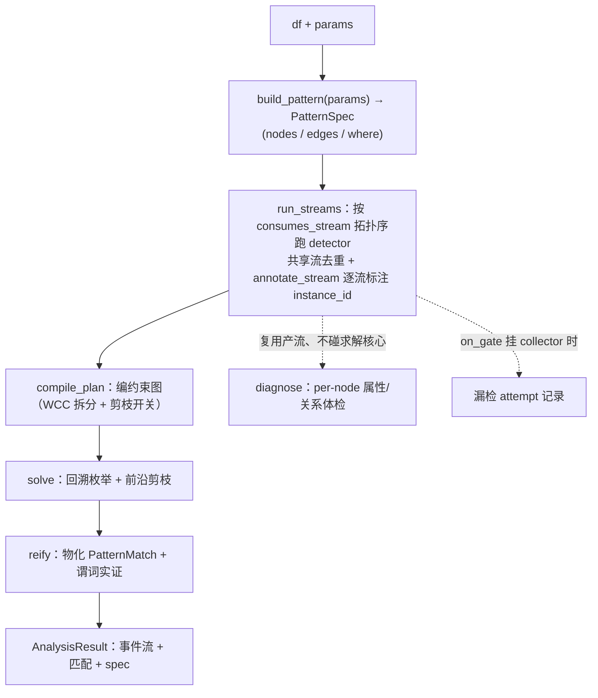

# path2 框架架构意图

> 最后更新：2026-09-02

覆盖 `path2/`（协议地基 + dag 引擎 + atoms + calc + stdlib + eval + 诊断底座）。
应用层见 [path2_apps.md](path2_apps.md)；扫描 / 可视化 / 调试前后端见 [path2_web.md](path2_web.md)。

---

## 定位与边界

path2 把"股票形态"建模为**多级不可变事件**：事件是有类型的冻结数据行；形态由"声明节点 + 声明类型化边"两步表达，不写命令式编排。引擎负责跑 detector、求解约束图、物化匹配；app 只 `build_pattern(params)` 后交给 `analyze`。

- **管**：事件/检测器协议、DAG 声明与求解、走势-无关的 L1 detector、纯数值计算、前瞻收益度量、漏检诊断底座。
- **不管**：任何带形状偏见的具体走势（归 `path2_apps/`）、扫描编排 / 序列化 / UI（归 `path2_web*/`）。
- **零耦合**：`path2/` 内任何文件不得 `from BreakoutStrategy`，`tests/path2/test_self_contained.py` grep 强制。

---

## 关键决策与理由

### where（一元）vs satisfies（二元）的正交分工

这是整个设计的脊梁：`where` 读**单实例自身属性**，边的 `satisfies` 读**一对实例间关系**。where 谓词签名严格一元、**不接受任何运行时上下文对象**，由此推出三条硬性归属：K 线回看归 detector（算好字段挂 event 上）、参数阈值由 `build_pattern(params)` 闭包闭合、跨节点约束一律归边。声明作者因此根本看不到命令式循环。

### 边多态，引擎零边类型分支

边同时定义拓扑序、引擎前沿推进方向、面板箭头方向——一条声明三重用途。边子类与它们共同的多态接口见 `path2/dag/edges.py`；**引擎只经基类接口消费，没有任何按边类型分支的代码**，新增一种关系 = 加一个子类，引擎不动。

### 段聚合走"复合事件"，不走节点展开

**引擎里一个节点恒绑单个 Event**，求解期没有区间绑定 / 串聚合的概念。所以要把"一段子结构"整体绑进外层 DAG，唯一做法是让 detector 直接把子序列封成**一个宽事件**（如 bo 串 → burst）：where 读它的预算标量（与单实例同式、零特例），外层边经 `Child` 端点 selector 连它的内部端点。收益是把"相对子成员的代价"这类约束表达成普通边，绕开把成员展开成节点带来的指数爆炸。selector 不参与边身份——spec 校验与图构建只看纯 node_id，求值期才投影到子事件。

### 身份双轴：node_id（声明层）+ instance_id（物化层）

class_id / source_tag / event_id / span_id 旧身份体系已整体消灭。现行身份只有两轴，event 类型退回 Python 类型系统（`isinstance` 判别），**不进任何字符串契约**——序列化、过滤、分组、显示、debug 门都不按"类型"分：

1. **node_id**（声明层，结构位置）：拓扑主键、作者命名；一身多角就多起 node_id。子事件按**children 声明命名表**取名（`engine.annotate_stream` 第二遍嵌套标注查 `{node_id: {槽名: 子node_id}}`）：声明了槽位映射的段直标子结构 node_id（tb.segments → tb_seg），未声明的 child 继承父容器 node_id 兜底——声明即启用，旧 app 行为不变；声明与物化漂移由 C1/C3 抓，不会静默错名（前端消费见 [path2_web.md](path2_web.md)）。
2. **instance_id**（物化层，实例唯一性）：引擎逐流标注注入，`{node_id}_{start}[_{end}]}#{idx}`、点事件塌缩、桶内流序从 0 起——**契约唯一出处 = `core.py::Event` docstring + `engine.annotate_stream`，禁止各处自行构造**。

**detector 阶段身份字段恒为 None/0/None**：node 归属是引擎层概念，detector 作者读不到也不该读（走势-无关边界）。这个空窗正是 `GateFailure.node_id` 需要 web 侧 collector 注入的原因（见负知识·挂雷）。

**共享 detector 合法但只物化一次**：`run_streams` 按 `(id(detector), consumes_stream)` 去重，共享的多个 node 指向同一个事件 list；标注对已标注事件跳过 → **instance_id 按拓扑序首个消费 node 命名**。不产 gate failure 的共享（如 TrendSegmentDetector）零影响；产 gate failure 时**这种同流共享**被挂雷拦截（见负知识；不同流各绑一个 node 不受限，见下节多流）。

### ref_slots／ref_ids：跨事件引用只落 id，不落对象

`children`（结构持有）与 `ref_slots`（关系引用）是两条正交声明：前者驱动物化命名与 diagnose 展开（见上）；后者只声明"这个事件语义上指向哪些别的事件"，不影响命名、不影响求解，只影响下游怎么解读关系。全部流标注完后，引擎跑统一翻译阶段：按每个事件的 `ref_slots()`（槽名 → 引用的 Event 或元组）把引用对象换成其 `instance_id`，写入 frozen 字段 `Event.ref_ids`（按槽名字典序排列的 `(槽名, (instance_id,...))` 对元组，`ref_ids_of(slot)` 按槽名取值）；引用了池外对象（无 instance_id）在这一步报错——PatternSpec 已校验全绑定，此处只剩 detect 期误引用的 bug。

这条协议消灭了"事件字段自带派生状态"：一个引用关系的终态（比如某个峰最终是否被吃掉）依赖"后续有没有别的事件引用它"，这类跨事件知识只有在全部流标注、全部引用翻译完之后才拿得到，装进单事件字段要么滞后要么被迫二次回填。现在事件只留原始事实（如"我吃掉了谁"），任何终态判定都由消费侧按 ref_ids 关系合成，事件本身保持"detect 期一次写定，不再回填"的不变式（活跃峰的 `price`/`original_price` 在 detect 内原地演化是现存例外，见 atoms 节 BO 条目）。

序列化契约：`ref_slots()` 声明持有的原始引用字段按字段类型结构性跳过 payload（判据 = 字段类型是否提及 `Event`，不依赖字段名/槽名字符串是否一致），只有翻译后的 `ref_ids` 出境——事件 dict 因此不会递归内嵌被引用事件的完整对象。

### 事件端点与检测过程分层（start/end 是事件协议，entry/attempt/gate 是检测过程）

`start`/`end` 是**事件协议**——所有事件必有两端，confirm 落其一（确认型 start=confirm、回顾型 end=confirm）。`attempt`/`entry`/`gate` 属于**检测过程**，挂靠 detector、不随事件类型：attempt 粒度由 detector 扫描单位决定（逐 bar / 逐簇 / 逐机器），entry 仅当 attempt 入口独立于事件起点时才单独出现（确认型独立成档、回顾型并入 start）。**"一个 detector 产多种事件、一个 attempt"因此自洽**：次级产物（子结构段如 tb_seg）无独立 attempt、只有事件层 start/end——不是例外，是 entry 本就不属于事件档位。诊断分工：入口 A 消费 gate 失败（attempt 层），段级过程走 debug_break 锚点。权威规则在 `core.py::Event` docstring 锚点档位节 + authoring-path2-detector skill §3。

### NodeSpec 声明契约：注册表 + 归一化推导

spec.nodes 是**事件类型注册表**——凡能物化出 event 的结构都有 node 声明，无隐藏生产者；但声明身份 ≠ 求解身份（子结构 node 只注册、无候选池、不进图、where 不进求解）。

字段分工（作者默认只写 node_id + detector；子结构 node 只写 node_id + event_cls + children，where 可选）：
- **detector**：独立 node 的生产者 + event_cls 反射源（构造期写回）；子结构 node 必须为 None。
- **event_cls**：可空。独立 node 反射自 detector；**子结构 node（无 detector）必须显式声明**——类型注册表反查的旧约定已消灭，漏写 / typo 在声明期报错而非静默漏类型。
- **children**：child slot 名 → 子 node_id，**唯一不可推导部分，必须显式**；produced_by 由它逆映射回填（单父确定 / 孤儿报错 / 多父报错）。
- **produces_stream**：认领 detector 的哪条命名流（单流 detector 省略即可）；event_cls 按它从 `stream_schema(detector)` 反射（详见「多流 detector」节）。
- **solve**：是否参与求解匹配，默认 True；`False` = 只显示不参与匹配（详见「不变式与负知识」K2 条目）。
- **子结构 where（可选）= 诊断层判定**：`diagnose` 从父容器 child_slots 挖出该槽事件产 attr 行、按它评估（无 where 则 vacuous 真）→ 前端段级 tier。**不进求解**——要让段属性 gate match，写父 where 的 `W.children`（显示与求解正交，两声明点各司其职；谓词对象可共享，勿建第二套 gate 机制）。
- 子结构 node 的 consumes_stream / produces_stream / render_grid 是死字段，spec 校验拒绝非默认值。

归一化时序：NodeSpec `__post_init__`（event_cls 反射）→ PatternSpec 构造（produced_by 逆映射，**先于其余校验**）→ 声明期校验（结构 / 死字段 / neg_dst 双端等，清单见 `path2/dag/spec.py`）。消费方（to_topology / diagnose）读归一化后字段、零改动。

**双层校验**：声明期（上述）+ 运行期 **C1/C2/C3**（声明⊆实例 / 实例⊆声明 / slot 元素类型核对，挂 `run_streams` 出口、`RUNTIME_CHECKS` 门控，analyze 与 diagnose 共用路径双覆盖）——防"声明-物化漂移"：改了 child_slots 忘改声明立即报错。

**children 是镜像声明不是功能声明**（2026-08-07 用户裁定）：物化由 detector/event 代码客观完成（`child_slots()` 运行时 API），children 不指导任何执行——价值 = 漂移检测 + spec 自包含（读者不用翻 atoms 代码）。

### 多流 detector：produces 声明，兄弟 node 各自认领一条流

一个 detector 可以在同一次 `detect()` 里产出多条语义不同的流——典型场景是几条流的内部状态天然耦合，硬拆成两个 detector 会被迫在两处重复维护同一份可变状态（如 BODetector 逐 bar 既登记峰又判突破，突破判定要读同一份活跃峰池）。多流声明：detector 用 `produces: ClassVar[Mapping[str, type]]`（流名 → event_cls）取代单流的 `event_cls`，`detect()` 内 `yield (流名, event)`；`stream_schema(det)` 优先读 `produces`，没有则回落 `{None: det.event_cls}`（单流 detector 不受影响）。`NodeSpec.event_cls` 按 `produces_stream` 从 schema 反射，多流 detector 因此不写 `event_cls`。

物化机制与「共享 detector 合法但只物化一次」（身份双轴节）是同一套分组（`(id(detector), consumes_stream)`），只是取用方式不同：那里多个 node 共享的是同一条流（相同 produces_stream，literally 同一个事件 list）；这里多个 node 各自认领不同的流（不同 produces_stream，取同一次 detect 产出的不同列表）——`run_streams` 内部称"兄弟机制"。

全绑定校验（契约 C3）：detector 声明的每条流都必须被组内某 node 用 `produces_stream` 认领，`PatternSpec.__post_init__` 构造期直接拒绝未认领的流，报错信息点名"只显示不匹配用 solve=False"——不认领会在物化阶段的 `_translate_refs` 才以一句误导性的"事件池外"报错现身，提前到声明期是为了让错误说人话。`path2_web/gate_collector` 保留同类检查作兜底（伪 spec / 测试路径）。

### `__call__` 短路，`witness` 全量求值

where 谓词对象是双出口的：求解热路径每个候选都要调 `__call__`，必须短路；诊断与物化则走 witness 递归产出、**故意不短路**——`or` 的首支已为真时仍算出第二支的实测值，否则调参 UI 看不到"另一支还差多少就能命中"。这是富诊断的机制源头。

### 诊断的坐标轴是 node，不是 event

event 级"失败归因"因为求解本身短路、结果 path-dependent，是 ill-defined 的。所以 `diagnose` 只做 per-node 独立体检：哪些候选能当这个 node、卡在哪条 where、找不找得到关系伙伴。它**复用产流、但不碰 `_solve` 求解核心**；单 node 通过不代表能凑成完整匹配。子结构 node 无独立流，attr 行从父容器 child_slots 挖该槽事件（与 serialize 挖 child 同源）——这使 qualified 档能覆盖子结构段（无 where 时 vacuous 真，与容器同档是独立判定的巧合结果，不是继承）。

关系体检**不能只看 `satisfies`**：dst 还必须真的锚定到那个 src，strict 边还必须是窗口内第一个同类候选——漏掉任一关都会报假通过。NegationEdge 是全称量词，单点视角没有独立诊断入口，直接跳过。

### eval.py 为什么不放 calc/ + eval_meta 路径协议

`calc/` 的约定是纯数值、零 Event 依赖；前瞻收益要读 `PatternMatch` 的节点索引，破了这个约定，故独立成模块。买点节点与 horizon 由调用方提供（web 侧读 app 的 `eval_meta`），path2 本身不知道任何具体走势。

**end_node 路径协议**（统一标准协议）：所有消费端（eval 统计 + serialize 过滤）按 eval_meta 的 `end_node` 声明锚定买点，声明是唯一事实源、一次解析处处一致（`path2/eval.py::_resolve_end_events`）：
- `node_id` → 该 node 单事件；`node_id.slot` → 该容器 `child_slots()` 中该 slot 的 child events（运行时物化、零 spec 依赖）。
- **第二段是 slot 名（父内身份，声明于 children key）**：`"tb.segments"` = "tb 容器里 segments 槽的子事件"——按槽寻址直接表达"买点在父结构的哪个位置"，不依赖子 node 的全局命名。
- match 级过滤 = 任一 OR（路径解析出的事件只要有一个命中即保留）；容器 `sample_bar_indices` 的 override 已删（统一由解析层锚定）。

### first_passage：路径方向度量（与 forward_return 正交）

forward_return 量买点后窗口的**终点幅度**（mfr，含波动率 = 盈利潜力）；first_passage 量**路径方向**——价格先触上行线还是下行线。两者看正交维度：幅度大不代表有方向（高波动随机涨跌），有方向不代表幅度大（涨得对却没油水）。first_passage 的存在是为了配一个"去波动率的方向锚"，让方向信号不被波动率污染。

- **几何对称阈值**：上行 `P(1+kM)`、下行 `P/(1+kM)`，对数距离相等（都 = log(1+kM)）→ 对无方向波动 ratio 钉在 0.5，偏离 0.5 即真 drift（不是阈值偏置）。算术 ±kM 反而对数不对称（下行更远）、凭空偏上行——这是选几何对称而非算术的唯一理由。
- **波动率尺度 M**：每买点窗内 ATR/close 的 nanmedian（中位数扛"一年一次"的极端异动；均值类如 Wilder RMA 会被一把大异动撑成失真的尺）。**内算、与判定同 bar 口径**（TR[t] 用 t 的 high/low + t-1 的 close，均已知 → 无前瞻）。
- **ratio 分母 = up+down**（不含 none/both）：none = 窗口内未触任一线（无方向信息）、both = 同根双向（方向不明），都不计分母。改这口径会让 ratio 跨 scan 不可比。
- 单参数 k，scan 链路可调；默认值与函数签名见 `path2/eval.py`，集合级聚合 / 序列化口径见 `path2_web/`。

### 多对一确认：leaf 跨 match 复用

dag 求解**枚举所有满足约束的绑定**，不独占任何节点——同一 dst event 可被多个 src match 共享（多对一确认信号）。这条要三层机制配套，缺一层就失效：

1. **引擎不独占**（`path2/dag/_solve.py`）：回溯枚举没有任何"已 emit 的 leaf 不再绑"的剪枝，同一 event 出现在多个 Solution 里合法、全部物化。
2. **match_id 编码成员 instance_id**（`path2/dag/_reify.py`）：成员全局唯一 → 组合必异，防 dict key 静默覆盖、前端同 key 渲染错乱。
3. **anchor 集合 + 包含判断**（`path2/dag/edges.py::_anchor_ok`）：dst 端 `anchor_field` 值为集合时按 `src ∈ 集合`、标量按相等。"多 src → 同一 dst"要 dst 能认多个 src——标量封死，这是多对一的真正瓶颈，与引擎独占无关（不独占也照样被标量 anchor 挡在边层）。

③ 是角色无关的边层协议：非叶子 dst 提供集合字段同样享受多对一，不只服务 leaf。统计 / 评估侧的配套（评估单元 = match、shared_leaf_stats）见 [path2_web.md](path2_web.md)。

---

## 不变式与负知识

- **frozen 容器字段一律用 tuple**：list 可以 in-place mutate，会从内部突破 frozen 语义。
- **"Row 落地 = 字段完成"**：单事件不变式（区间合法、禁 NaN）在构造点校验；跨事件不变式（end_idx 升序、instance_id 单 run 唯一）只在驱动入口 `run()` 校验。两者别混放。
- **node_id / pattern_id 同时被前端当显示名用**：没有独立的显示标签字段，起名要直接按"面板上希望看到的短标签"来定，改名等于改 UI 文案。
- **node_id 是拓扑主键、必须唯一**：重复会让求解层的字典后写覆盖前写（静默丢节点），而面板投影遍历 tuple 不去重 → 求解层与面板层裂脑。spec 校验里这一条**必须先于**其余校验跑，否则去重后的集合会掩盖重复。
- **C1 等-end 塌缩在若干类节点上必须关掉，否则漏匹配**：这些节点的判据看的根本不是父事件的 end，C1 学不到这类信息，会把不可互换的候选误判为可互换。具体是哪些节点、各自因为什么，见 `path2/dag/_solve.py::compile_plan` 的内联注释。
- **动 C1 剪枝相关逻辑，必须先跑多候选 fuzz**：真漏匹配 bug 曾两次逃过平凡场景的单测试，全靠独立 fuzz 才抓到。
- **anchor 引用约束拒绝单调坐标**（start/end 索引）：那类约束应改用 EqualsEdge 走结构剪枝，spec 校验会直接拒绝并引导。
- **`Detector` 协议里 `on_gate` 的声明必须留在 `TYPE_CHECKING` 守卫内**：`runtime_checkable` 的 isinstance 结构检查会把 Protocol 中任何已声明属性（哪怕带默认值）都纳入必须项，正常声明会让所有未显式带 `on_gate` 的现有 detector 突然判定为不合规。守卫两全：类型检查器看得到契约，运行时行为不变。
- **on_gate 默认 None、生产路径零开销**，只有诊断层挂 collector 时才在实例上覆盖。
- **产 gate failure 的一条流不可被多 node 绑定**（判据是**流**不是 detector，别扩大）：同一条流被 ≥2 node 绑定时 gf 的 node 归属无真值（detector 阶段读不到 node_id），`path2_web/gate_collector` 的路由 wrapper 懒触发式防护——那条流第一条 gf 真的到达时才 raise，attach 期不查。**同一 detector 的不同流各绑一个 node 完全合法、且是标准多流用法**：`BODetector` 的 bo/pk 就共享一个实例并照常 emit gf，gf 靠 `gf.stream` 路由到对应 node。不产 gf 的同流共享（Trend 场景）零影响。
- **detector / where 里别读身份字段做逻辑**：node_id / instance_id 在 detector 阶段恒 None/0/None，物化后才由引擎注入；serialize / 前端也别自行拼 instance_id 字符串（契约唯一出处见身份双轴节）。
- **K2 三要素判据（求解层排除残缺节点）**：只为产流给别人消费的孤立流源 node 不该自成一个匹配——`_solve.py::compile_plan` 的 bound_ids = 边端点并集（整个 pattern 无任何边时全求解，bo_only 例外）+ 非否定 dst + detector 非空，三要素直接在求解层排除（不是出口过滤——残缺 match 根本不会被生成）；子结构 node 因 detector=None 被结构性守卫（无候选池）。**外加 `NodeSpec.solve` 一道显式开关**：`solve=False` 的 node（只显示不参与匹配，多流 detector 里的展示型流如 pk 典型用它）无条件退出 bound_ids——没有它，这类 node 一旦落进"求解会纳入它"的情形（含零边全求解例外），就会把自己的每个事件也物化成一条平凡 match，或让 serialize 对每个 match 取 `node_index[end_node]` 时抛 KeyError。
- **eval 路径第二段写 slot 名（父内身份），别写子 node 全局名**：`end_node: "tb.segments"`——槽寻址直接表达"买点在父结构的哪个位置"，解析唯一出处 `_resolve_end_events`。
- **两个 C1 别混**：求解剪枝的 C1（等-end 塌缩，`_solve.py`，漏匹配风险源，改它必须先 fuzz）与运行期校验的 C1（声明⊆实例，`engine.py`，漂移检测）是同名不同机制。
- **where 组合子的命名与 None 语义**：`and` / `or` 是关键字不能当函数名，故用内置同名替身并遮蔽，`not_` 尾下划线同理。属性为 None 时叶子判 False（与短路写法语义一致），**取反后会变 True**——写 where 时留意。
- **atoms 入库门槛**：至少两条不相关走势会用，或表达单一通用物理事件。**带形状偏见的命名一律拒入**（`RoundedBottom` 之类退到 `path2_apps/`）。detector 内部状态不得跨 `detect()` 调用。

---

## 分层边界

- **`core.py` / `runner.py` / `config.py`**：Event 与 Detector 协议（含物化标注三字段契约）、`run()` 跨事件安全网、运行时校验开关。
- **`dag/`**：唯一引擎。声明（`nodes` / `edges` / `where` / `spec`——NodeSpec 归一化推导 + 子结构死字段校验 + 多流全绑定校验在 `spec.py`）→ 编译求解（`_graph` / `_signature` / `_solve`，K2 三要素 + `solve` 开关 + 剪枝开关）→ 物化（`_reify` / `result`）→ 运行期声明-物化校验（C1/C2/C3，`engine.py` 出口）→ per-node 诊断（`diagnose`）+ 漏检底座（`gate_failure`）。
- **`atoms/`**：走势-无关 L1 Detector，一 atom 一文件。
  - **BO**：滑窗 peak + 单点突破，`BODetector` 是多流 detector（`produces={"bo": BOEvent, "pk": PeakEvent}`）——逐 bar 先登记峰（产 pk 流）、再判突破（产 bo 流），同一次 `detect()` 里两条流都吐（见「多流 detector」节）。`drought` 在首个 BO 上为 None，语义是"无前序"而非"未知"；活跃峰的 `price`/`original_price` 在 detect 期间原地演化（`object.__setattr__`，与物化标注同手段），是"事件 yield 即定稿"通例的现存例外。可选 bear（大阴线高点）峰种由 `bear_drop` 显式开启，默认 None 禁用；bear 路径不产量比，`volume_peak` 恒 None。**bear 峰的登记门槛比 convex 低一个量级**：它只看当根形态（阴线实体跌幅 + 相对窗口低点的高度），**不要侧翼确认、不受窗口热身期限制**，而 convex 峰要等 `min_side_bars` 根后侧 bar 才确认——所以开 bear 后峰数量通常成倍增长，可被突破的对象随之变多，bo/match 计数会显著抬升。还有一个反直觉的连带效应：**开 bear 会挤掉一部分 convex 峰**（bear-wins，见 `breakout.py` bear 检测段注释）——同一个 bar 既是 argmax 又是大阴线时，bear 当根就登记，convex 晚 `min_side_bars` 根到达时撞上 `peak_already_active` 被抑制。所以 bear 不是"在 convex 之上纯加法"。
  - **Burst**：消费 bo 流（独立性原则：不自己 new 一个 BODetector）。聚类只看**相邻间距**、与总跨度无关——固定 span 窗会把"紧但长"的串切碎；物化成前缀族，每个实例在其 end 时刻即时成立、只读 ≤ end 的数据，保住买家因果。只负责切串 + 算预算标量，阈值过滤交给 burst 节点的 where。
  - **Trend**：SMA 逐 bar 变化 + hysteresis 平滑（压掉短反转），切成连续三态区间流。
  - **Platform** / **Distribution**：窄幅震荡平台段 / 高位派发单 bar。
  - **Throwback（tb 家族，多代并存）**：**设计判据** —— tb 只能以突破结构为锚点推断、无法独立枚举，所以每代核心都是一个锚点驱动的判据函数，detector 只是消费上游流的事件壳。V2（`throwback.py` 容器版）/ t1 / t3 为历史语义代；**当前 bb 接线的是 V4（`throwback_v4.py`）：post-burst 三态价格行为状态机（UP/DOWN/STABLE），一 burst 一机一容器**——DOWN 找底、STABLE 产企稳买点段、UP 等下一轮回踩。设计动机与不变式：修复 t1 的 rise-before-confirm 召回杀手（rise 只是状态转换不再终止机器）、re-entry 从显式补丁变原生属性（weak 出段自然回 DOWN）、global_bottom ratchet（只筛层层上升的波段）、容器 `machine_outcome` 独立表达整机死法（与末段 outcome 分离）。判据顺序 / gate 名表 / 失效边界见 diagnose-event skill 的 `detectors/throwback_v4.md`。
  - 新写 L1 Detector 要埋 `on_gate` 时，入口读 authoring-path2-detector skill 的 reference §4（attempt 边界怎么划、失败窗口记什么）。
- **`calc/`**：纯数值函数库，无 Event/Detector、仅依赖 pandas/numpy，可被任意 atom / app 调用。有哪些函数见 `path2/calc/`。**波动率度量选即时 median TR 而非 Wilder ATR/均值**（`atr.py::calculate_tr_median`）：TR 分布右偏、burst 段大 TR 会拉爆均值；即时取 i-1 避开当根自指（当根大 TR 会抬高自己的阈值）——多波段过程波动率状态漂移，冻结值系统性失真。
- **`stdlib/`**：atoms 依赖的便利层（id 生成 + 逐 bar 扫描模板：**模板拥有主循环，子类只写领域判据**，跨事件校验全留给协议层）+ **app 入口装配工厂 `make_app`**：把每个 path2_apps app 手写的 `analyze`/`matches`/`PATTERN_DAG` 三件套收口成一个闭包，消除跨 app 样板、给入口语义留单一改动点（见 `path2/stdlib/app.py`）。
- **`eval.py`**：走势-无关的 match 买点度量——前瞻收益（forward_return，终点幅度）+ 首次穿越（first_passage，路径方向，几何对称单 k）；两者正交分工见「关键决策」节。
- **`debug_ctx.py` / `debug.py`**：env var 驱动的条件断点 + 当前 symbol 的 ContextVar；关闭时一次 bool 比较即短路。

---

## 核心流程

```mermaid
flowchart TD
    A["df + params"] --> B["build_pattern(params) → PatternSpec<br/>(nodes / edges / where)"]
    B --> C["run_streams：按 consumes_stream 拓扑序跑 detector<br/>共享流去重 + annotate_stream 逐流标注 instance_id"]
    C --> D["compile_plan：编约束图（WCC 拆分 + 剪枝开关）"]
    D --> E["solve：回溯枚举 + 前沿剪枝"]
    E --> F["reify：物化 PatternMatch + 谓词实证"]
    F --> G["AnalysisResult：事件流 + 匹配 + spec"]
    C -.复用产流、不碰求解核心.-> H["diagnose：per-node 属性/关系体检"]
    C -.on_gate 挂 collector 时.-> I["漏检 attempt 记录"]
```
