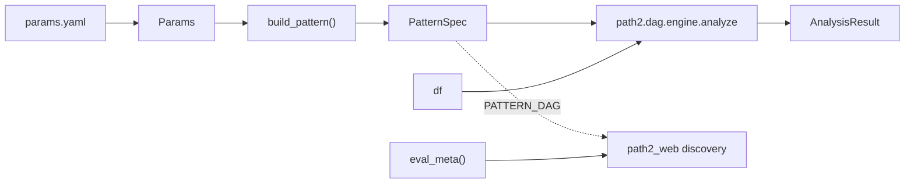

# path2_apps 应用层架构意图

> 最后更新：2026-09-02
> 覆盖：`path2_apps/<走势>/`（走势-特异应用层，与 `path2/` 顶层平级）。框架见 [path2.md](path2.md)，后端见 [path2_web.md](path2_web.md)。

---

## 定位与边界

path2_apps 是**走势-特异层**：一个子包 = 一个具体形态。它与 `path2/`（走势-无关框架）平级、不是其子包——框架不该知道任何具体走势，走势包只按需组合框架的 atoms + 类型化边 + where。**带形状偏见的命名与阈值只能落在这里**，不能进 `path2/atoms`。

本层管：拓扑声明（哪些 node、哪些边、每个 node 的 where）+ 参数取值。
本层不管：匹配求解（`path2.dag.engine`）、detector 实现（`path2.atoms`）、序列化与 UI 投影（`path2_web*`）。

**零手搓编排**是硬要求：业务约束一律降为 NodeSpec / 类型化边 / where 声明，不在 app 里写簇构造、谓词循环或匹配编排。做不到就说明框架缺能力，该改框架而不是在 app 里绕。

子包清单以 `path2_apps/` 目录为准，每个子包的角色写在自己 `dag_spec.py` 的模块 docstring 首段。其中既有生产形态，也有只为验证引擎判定 / UI 渲染的 sandbox 子包——**sandbox 不是真实形态，别拿它的拓扑或阈值当业务参考**。

---

## 接线协议（新增走势要做什么）

新建 `path2_apps/<id>/dag_spec.py`，定义模块级 `PATTERN_DAG` 与 `eval_meta`，即被 path2_web 的 discovery 自动发现，**无需改框架或后端**。

- `build_pattern` 是参数化声明工厂：detector 实例化与 where 阈值都在这里闭合。`PATTERN_DAG` 是它在默认参数下的模块级常量，供 discovery / 拓扑投影。
- **入口三件套（`analyze`/`matches`/`PATTERN_DAG`）由 stdlib 的 `make_app` 闭包工厂装配，不再手写**：app 只声明 `build_pattern` + `Params`，三件套由工厂一行解构产出（见 `path2/stdlib/app.py`），消除跨 app 样板。三者仍是模块级同名同签名，discovery / 调用方 / monkeypatch 无感消费；`eval_meta` 是 app 特异、留原地。
- **`eval_meta` 是铁律不是可选**：discovery 有硬闸，不满足协议的包直接被拒（判定逻辑见 `path2_web/discovery.py`）。**不存在"app 不提供就回退"的路径**——别再为缺失情况写兜底分支。
- app 特异知识（买点 node 名、缓冲深度）只经 `eval_meta` 出境，web 端零硬编码。
- **`eval_meta.end_node` 支持路径声明买点**：容器场景写 `"tb.segments"`（父 node_id + 父内 **slot 名**，非子 node 全局名），所有消费端按它锚定（见 [path2.md](path2.md) eval 路径协议节）。
- **容器结构声明**：容器事件内部结构（child slot → 子 node）由父的 `children={"segments": "tb_seg"}` 声明，两种情况——引用已有独立 node（burst `children={"members": "bo"}`，情况一）或引用子结构 node（tb `children={"segments": "tb_seg"}`，情况二）。子结构 node 自身一行 `NodeSpec("tb_seg")` 声明（event_cls/produced_by 归一化回填），只写 node_id；但 `children` 键值本身必须显式、运行期 C1/C2/C3 会核对声明与物化一致（见 [path2.md](path2.md) NodeSpec 契约节）。
- **多流 detector 由多个 node 分别认领每条流**：detector 若声明 `produces`（见 [path2.md](path2.md) 多流 detector 节），组内每个 node 各写一次 `NodeSpec(..., produces_stream=...)` 认领一条流；声明的流必须全部被认领，未认领在 `build_pattern` 构造期直接报错。只做展示、不参与匹配的流用 `solve=False`（`bb_pk` 的 `pk` node：与 `bo` node 共享同一个 `BODetector` 实例，`solve=False` + `render_grid='price'` 让峰位随突破一起钉主图，但不进求解、不产 match）。
- **head_buffer 必须由参数推导（取本 app 全部 rolling lookback 的 max），不能写死常量**：写死的常量不会随参数变化，改完阈值后缓冲不够会静默切错窗。

具体节点 / 边 / 每条业务约束落到哪个声明，逐条写在各 app 的 `dag_spec.py` 模块 docstring 里——那是唯一权威，不在本文档复刻。

---

## 关键决策与负知识

- **「一串同类事件」声明成单个宽事件 node，而不是重复节点或循环**：串级的计数 / 峰数 / 放量约束因此全部退化成读该事件上预先算好的聚合量的普通 node where，与单实例节点同式、引擎侧零特例。
- **流源 node 与业务 node 是两种东西**：产 bo 流的 node 自身不连边，只为下游 detector（`consumes_stream`）提供输入。它单独命中不是业务 pattern，由求解层 K2 三要素判据排除（bound_ids = 边端点并集，见 [path2.md](path2.md) 负知识节）——整个 pattern 无任何边时全求解（bo_only 例外），不会误杀**整体就是单孤立节点**的 pattern。
- **跨 node 的身份约束要用 anchor 复核，不能只靠时间 gap**：burst 会为同一簇物化一族共享簇首、末端各异的前缀实例，光有 gap 区间约束不能保证被匹配到的回踩确实由这个 burst 的末 bo 触发。边上声明 anchor 字段做身份复核，才把"同一根 bo"钉死。
- **同一份参数被 detector 和 edge 共用时，只写一处**：共用值归入对应 node 的参数 section，edge 显式引用该字段。两边各写各的会在调参时静默错位。
- **burst 的 drought 阈值必须大于聚簇的 gap 上限**，否则该 where 结构性恒真（簇首必然是断点），等于这条约束被悄悄关掉。
- **跨 app 比事件计数前先对齐 bear 开关**：`bear_drop` 是 app 级选择（在各自 params.yaml 里），并非所有 bb_* 都一样。bear 峰不需侧翼确认、门槛远低于 convex（见 [path2.md](path2.md) atoms·BO 条目），开与不开会让 bo / burst / tb / match 计数整体翻倍级变化。所以两份扫描结果的事件数对不上时，**先查两边扫描文件的 `per_pattern[pid].params_snapshot.bo.bear_drop` 再怀疑代码**——`null` 或字段整个缺失（老 scan）都表示关着，只有正数才是开。

- **where 的顶层各 clause 之间恒为 AND**：要 OR 就写进单条 clause 内部，别拆成两条平级 clause——那是 AND，语义完全不同。组合子用法与可引用字段速查见 `path2_apps/try_conplex_where/dag_spec.py` 的模块 docstring。

---

## 参数：三件套分工

- `params.yaml` 是 web 入口的 **SSoT**，热加载——改完下一次扫描即生效，不用重启。
- `Params` 及其 section 子 dataclass 是 **schema 层**（字段名/类型），其默认值只作 yaml 缺字段时的兜底与脚本 / 测试 fixture 默认，**不是业务基准值**。
- 读写形式协议（加载 / 序列化 / 重建）继承自 `path2_apps/_params_base.py`，是跨 app 的**单一来源**；app 侧只留业务内容——各 section 的参数定义 + 参数到 detector 构造签名的映射。理由是真实教训：形式代码曾按 app 复制粘贴、某个拷贝缺方法而在扫描时静默丢数据。新 app 一律继承，别再拷贝一份。基类刻意保持浅——只支持"顶层字段全是 section 子 dataclass"，出现非-section 顶层字段应在子类处理，而不是往基类塞钩子。

---

## 声明与消费流

