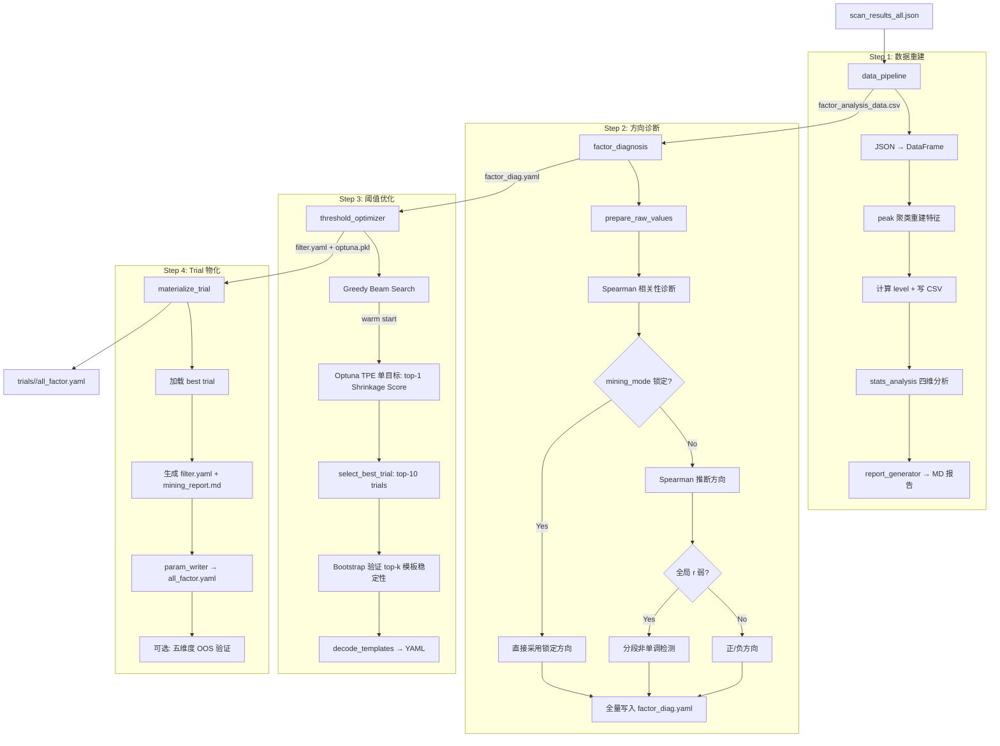

> 状态：已实现 (Implemented) | 最后更新：2026-04-03 (v5: 方向单一来源重构, Trial 物化闭环)

# 15. 数据挖掘模块 (mining)

## 定位

从扫描结果中挖掘因子的最优阈值组合，替代人工调参。
输入是 `scan_results_all.json`，输出是可直接用于生产评分的 `trials/<id>/all_factor.yaml`。

## 核心流程



## 关键设计决策

### factor_diag.yaml 为方向单一来源

**Why**: 旧代码中因子方向分散在三处（`FactorInfo.mining_mode` → YAML `mode` 字段 → 默认 `'gte'`），`load_factor_modes` 和 `param_writer` 各自走不同的 fallback 路径，导致同一因子在优化阶段（filter.yaml 的 `negative_factors`）和产出阶段（trial `all_factor.yaml` 的 `mode`）方向不一致。实际发生案例：`pk_mom` 在 `best` 实验中优化方向为 lte，但 trial 产出为 gte。

**修复**: Step 2（factor_diagnosis）全量诊断所有活跃因子方向，一次性写入 `factor_diag.yaml`。下游 `load_factor_modes` 和 `param_writer` 只读 YAML，不再查询 registry。方向决策的唯一入口是 `diagnose_direction()`，锁定因子（`mining_mode`）在此处生效并固化到 YAML。

### 非活跃因子不进入产出

**Why**: `INACTIVE_FACTORS` 中的因子（如 `ma_curve`, `dd_recov`）未经挖掘验证，混入配置文件具有误导性。运行时 `BreakoutScorer` 已通过 `get_active_factors()` 硬排除它们。

**实现**: `factor_diag.yaml` 和 trial `all_factor.yaml` 中移除非活跃因子条目，产出配置准确反映实际使用的因子集。

### 统一因子注册表 (factor_registry)

**Why**: 原系统在 4 个位置维护因子映射，新增因子需改 4 处。`FactorInfo` dataclass 将所有元数据集中管理，派生函数按需生成各视图。当前注册 15 个因子（13 活跃 + 2 非活跃）。

### 二值化触发矩阵 + Bit-packed 评估

**Why**: 将 N 个因子的触发状态编码为 N-bit 整数 key，`fast_evaluate()` 在 ~1ms 内评估一套阈值下的所有模板。使得数万次 Optuna trial 在合理时间内完成。

### James-Stein 收缩评估

**Why**: 小样本模板的 raw median 噪声大。`fast_evaluate()` 对 top-k 模板做收缩：`adjusted = w * median + (1-w) * baseline`，`w = count / (count + shrinkage_n0)`。样本越少，越向全局基线收缩。

### 两阶段搜索策略

**Why**:
- **Greedy Beam Search** 在离散百分位空间快速找因子子集和粗略阈值，作为 warm start
- **Optuna TPE** 在连续空间精细搜索，seed=42 固定

单独用 Optuna 收敛太慢；单独用贪心陷入局部最优。

### 方向诊断基于 raw value + 非单调检测

**Why**: level 受预设阈值污染。直接对 raw value 做 Spearman，方向信号干净。对全局 Spearman 弱的因子，追加分段检测（三分位切分），取最强段方向。部分因子通过 `mining_mode` 强制锁定方向。

### Bootstrap 稳定性验证

**Why**: 高 median 可能来自小样本偶然。对 Optuna 前 10 名 trial 逐一 bootstrap 重采样 1000 次，计算 95% CI 和 `stability = 1 - ci_width / median`。附加门槛：top-1 模板 count >= `min_viable_count`(30)。

### 参数文件方向编码 (param_writer)

**Why**: `gte` 因子 `values=[1.2]`（奖励），`lte` 因子 `values=[0.8]`（惩罚）。评分器统一用 `>=` 比较，方向隐含在数值中。mode 从 `factor_diag.yaml` 读取，保证与优化方向一致。

### 五维度样本外验证 (template_validator)

**Why**: 训练集优化存在过拟合风险。独立测试期五维度评估：
- **D1**: per-template 训练/测试 median 对比
- **D2**: Top-K 保留率（与 shrinkage_k 对齐）
- **D3**: KS 检验 + Bootstrap CI
- **D4**: baseline shift、above-baseline ratio、template lift
- **D5**: 样本覆盖率

三级判定: PASS / CONDITIONAL PASS / FAIL。

## 组件职责

| 文件 | 职责 | 可独立运行 |
|------|------|:---:|
| `factor_registry.py` | 因子元数据 SSOT + 派生视图函数 | - |
| `data_pipeline.py` | JSON → DataFrame，特征重建 | Yes |
| `factor_diagnosis.py` | Spearman 方向诊断 + 非单调检测 + 全量写入 `factor_diag.yaml` | Yes |
| `threshold_optimizer.py` | Beam Search + Optuna TPE + Bootstrap 验证 | Yes |
| `template_generator.py` | 二值组合枚举 + YAML 输出工具 | Yes |
| `template_validator.py` | Trial 物化 + 五维度样本外验证 | Yes |
| `param_writer.py` | 合并 factor_diag.yaml + filter.yaml → 生产 all_factor.yaml | Yes |
| `stats_analysis.py` | 四维统计分析（单因子/组合/交互/树模型） | - |
| `report_generator.py` | 分析结果 → Markdown 报告 | - |
| `distribution_analysis.py` | 分布形态检测（U型/倒U型/单调） | Yes |
| `pipeline.py` | 管线编排 Step 1→2→3→4 | Yes |

## 方向数据流（SSOT 保证）

```
diagnose_direction()
  ├── mining_mode 锁定 → 直接输出 mode
  └── Spearman 推断 → 输出 mode（含非单调检测）
        ↓
  write_diagnosed_yaml() → factor_diag.yaml（全量写入所有活跃因子 mode）
        ↓
  ┌─ load_factor_modes() → negative_factors → filter.yaml._meta
  └─ param_writer → trial/all_factor.yaml 的 mode
        ↓
  三处 mode 保证一致（同源派生）
```

## IO 契约

| 步骤 | 输入 | 输出 |
|------|------|------|
| Step 1 | `scan_results_all.json` | `factor_analysis_data.csv` + `raw_report.md` |
| Step 2 | CSV + `all_factor.yaml`(模板) | `factor_diag.yaml`(方向 SSOT) |
| Step 3 | CSV + `factor_diag.yaml` | `filter.yaml` + `optuna.pkl` + `mining_report.md` |
| Step 4 | `archive_dir/` 全部中间产出 | `trials/<id>/filter.yaml` + `all_factor.yaml` + `validation_report.md` |

## 已知局限

1. **Label 单一**: 仅支持单个 label（从 JSON metadata 推断），不支持多目标
2. **DayStr 因子退化**: 当前数据分布极度集中，触发率 100%，无区分度
3. **收缩参数经验值**: `shrinkage_n=200`, `shrinkage_k=1` 基于实验调整，未做系统敏感性分析
