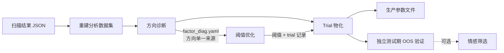

> 最后更新：2026-07-25

# 数据挖掘模块 (mining)

## 定位与边界

从突破扫描结果里挖掘因子的阈值组合，产出可直接用于生产评分的参数文件——用搜索替代人工调参。
编排入口 `BreakoutStrategy/mining/pipeline.py`（重建数据 → 诊断方向 → 优化阈值 → 物化 trial 并验证），各步职责见 `mining/__init__.py` 与各文件 docstring。

**不管什么**：

- 不做扫描——输入来自 [突破扫描模块](突破扫描模块.md) 的扫描结果 JSON。
- 不做实盘评分——只写参数文件，消费方是 live 侧评分器。
- 不做新闻抓取与情感打分——只调用 [新闻情感分析](新闻情感分析.md) 的对外接口。
- **不持有因子元数据**：注册表在 `BreakoutStrategy/factor_registry.py`，`mining/__init__.py` 只是再导出。要增删因子、改活跃集合，去注册表改，别在 mining 内部另立一份映射——否则加一个因子就要同步改好几处。

**单 label**：目标列从扫描结果元数据里取第一个 label 配置推断，全链路只支持一个目标，没有多目标路径。

## 关键决策与理由

### 因子方向必须单一来源

因子方向（越大越好 / 越小越好）如果让优化端和产出端各自推断，就会出现同一因子「搜阈值时按一个方向、产出打分时按另一个方向」的静默错配：两边都不报错，只是结果没有意义。

所以诊断阶段一次性把所有活跃因子的方向定死、写进 `factor_diag.yaml`；下游优化和 trial 物化都以它为唯一输入（物化时基准 YAML 和方向 YAML 指向的是同一份文件）。**别在下游补"查不到就默认某方向"的 fallback**——fallback 正是错配的来源。

### 方向诊断用原始值，不用分级值

分级值是已经被一套预设阈值切过的产物，拿它来推方向等于让旧阈值给新阈值背书，信号被污染。所以直接对原始值做秩相关。

全局相关性弱的因子还要补一层分段检测：单调假设不成立时（U 型 / 倒 U 型），全局系数会把真实信号抹平成接近 0，只看它会误判成"这因子没用"。少数因子在注册表里直接锁死方向，锁定值在诊断处生效并固化进 YAML。

### 两阶段搜索：贪心打底 + TPE 精修

单独用 TPE 在高维空间收敛太慢，单独用贪心陷局部最优。先在粗粒度的百分位空间用贪心束搜索定下因子子集和粗略阈值，再作为 warm start 交给 TPE 在连续空间精修。

### 二值化触发矩阵 + 位打包评估

搜索循环里要评估几万套阈值组合，每套都重算模板统计不可行。把每个因子的触发状态压成一个整数 key 之后，单次评估退化为整数分组统计，成本可忽略——这是搜索规模能上去的前提，不是可有可无的优化。

### 评分用收缩后的中位数，不是原始中位数

如果优化目标直接取模板的原始中位数，会系统性地奖励小样本模板：样本越少方差越大、越容易偶然刷出高中位数。按样本量向全局基线收缩之后再比，噪声才不会当冠军。同理，最终挑 trial 不只看分数，还要过 bootstrap 重采样的稳定性和最小样本量门槛。

### 独立测试期 OOS 验证

前面每一步（选因子、定阈值、挑模板、挑 trial）都在同一份训练数据上做选择，产出天然带过拟合。所以要在训练期之外的独立时间段重新扫一遍，多维度对比训练/测试表现，给出分级判定（判定口径见 `template_validator.py::_judge_result`）。**这是整条流水线唯一的外部裁判，跳过它等于没验证过。**

## 不变式与负知识

- **非活跃因子不得出现在任何产出配置里**。运行时评分器已按活跃集合硬排除它们；配置文件里若还留着条目，就是在描述一件不会发生的事，会误导后续调参。
- **方向靠数值编码，不靠比较符**。生产评分器统一用 `>=` 比较，反向因子靠给一个惩罚性取值来表达方向。所以改 `param_writer.py` 里的取值约定 = 改评分语义，不是改格式。
- **禁止 `.fillna(0)`**。因子可能因回看长度不足而"算不出来"。补 0 会把"没数据"伪装成"值就是 0"，两条后果：① 反向因子的 `0 <= 阈值` 恒真，本该跳过的样本被当成触发；② 原始值分布里混进大量人造 0，秩相关方向、分位数阈值、TPE 取值范围一起偏。阈值挖掘链路必须显式 NaN 掩码——构造触发矩阵、算分位数、生成贪心候选百分位都要先过滤，全 NaN 的因子直接跳过。诊断阶段把每因子的有效样本量写进 `factor_diag.yaml` 的审计字段，就是为了让这类覆盖率问题看得见。
- **情感验证严格依附 OOS 验证**。它筛的是 OOS 里 top-K 模板命中的样本，验证不跑就没有输入，会被静默跳过（不是报错）。
- **新闻窗口包含突破日当天，不构成前瞻偏差**。label 从突破日的次日起算，当天信息不进 label；这也与因子系统一致（成交量之类的因子本来就用突破日 K 线）。反过来排除当天代价很大：冷门股常常在突破当天才第一次有新闻覆盖。
- **测试集缓存要日期范围完全一致才复用**。用"是否覆盖"来判断会导致缩小测试区间时沿用旧的宽区间结果；另外空结果按失败缓存处理、强制重扫（数据源更新后旧 JSON 不会自动失效）。
- **各类调参数值没有理论依据**。束宽、trial 数、收缩强度、各种最小样本量集中声明在 `pipeline.py::main()` 顶部，凭实验拍的，没做过系统敏感性分析——别当成推导出来的常数用。

## 核心流程

```mermaid
flowchart LR
    S[扫描结果 JSON] --> P1[重建分析数据集]
    P1 --> P2[方向诊断]
    P2 -->|factor_diag.yaml<br/>方向单一来源| P3[阈值优化]
    P2 --> P4
    P3 -->|阈值 + trial 记录| P4[Trial 物化]
    P4 --> OUT[生产参数文件]
    P4 --> V[独立测试期 OOS 验证]
    V -.可选.-> SENT[情感筛选]
```
