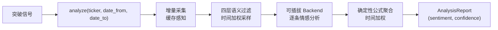

> 状态：已实现 (Implemented) | 最后更新：2026-03-23

# 16 新闻情感分析模块

## 定位

在突破检测管线的末端提供**情感维度的辅助判断** — 股票突破后，分析突破前一段时间的新闻情绪，评估突破的可靠程度。不独立决策，仅作为突破评分的一个额外维度。

---

## 核心流程

### 五阶段管道

| 阶段 | 模块 | 核心逻辑 | 可缓存？ |
|------|------|----------|---------|
| 1. 采集 | collectors/ | 多源（Finnhub/AlphaVantage/EDGAR），增量采集 | 是 — news 表 |
| 2. 过滤 | filter.py | 语义模板→相关性→去重→多样性采样 | 否 — 依赖候选集组成 |
| 3. 分析 | analyzer.py + backends/ | 逐条 LLM 情感标注 (positive/negative/neutral + confidence) | 是 — sentiments 表 |
| 4. 聚合 | analyzer.py _summarize | 三分支 certainty × sufficiency 乘法公式 | 否 — 时间权重动态 |
| 5. 输出 | reporter.py | JSON 序列化 | - |

---

## 关键架构决策

### 1. 可插拔 Backend 而非单一 LLM

**决策**：Stage 1（逐条分析）通过 `BaseAnalyzerBackend` 抽象，当前三个实现：DeepSeek、GLM、FinBERT+RoBERTa。

**理由**：LLM API 的可用性和性价比变化快。DeepSeek 最便宜但偶尔抽风，GLM 稳定但贵，FinBERT+RoBERTa 免费但准确度低。用户通过 YAML 配置 `backend` 字段切换，无需改代码。

### 2. Stage 2 汇总用确定性公式而非 LLM

**决策**：聚合阶段不调 LLM，使用手调的数学公式（rho 极性分数 → 三分支 confidence）。

**理由**：
- 聚合需要在同一批新闻上**可复现** — LLM 汇总有随机性，同样的输入可能给出不同结论
- 可以精细控制损失厌恶（negative 放大 1.15x）、对冲惩罚等行为
- 无额外 API 成本
- 时间衰减可以在输入层注入，公式无需感知

### 3. 两层时间衰减（采样 + 汇总）而非单层

**决策**：时间权重同时作用于 diversity_sample（选哪些新闻）和 _summarize（怎么算情绪）。

**理由**：
- 只改采样层：选对了新闻但等权聚合，远期 outlier 仍可能扭曲结果
- 只改汇总层：可能选了一堆老新闻进来（FPS 纯基于语义距离），即使降权也浪费了 LLM 调用的 quota
- 两层协同：采样层确保近期新闻不被挤掉，汇总层确保远期新闻即使入选也被衰减

### 4. max_items 亚线性缩放而非线性

**决策**：`max_items = clamp(10√days, 15, 100)` 而非 `news_per_day × days`。

**理由**：新闻主题随时间呈亚线性增长（事件复现、聚集效应）。线性缩放在 90 天窗口下产生 900 条 LLM 调用，成本不可接受且边际收益递减。√ 缩放在 90 天时约 94 条，5 秒即可完成。

### 5. 缓存情感结果而非 filter 输出

**决策**：缓存 `(fingerprint, backend, model) → SentimentResult`，不缓存 filter 阶段的输出。

**理由**：filter 的结果依赖全局候选集的组成（semantic_dedup 和 diversity_sample 都是全局操作），不同的请求窗口产生不同的候选集。而单条新闻的情感标注在给定 backend+model 下是确定性的，安全缓存。

### 6. 缓存与时间衰减正交

**决策**：缓存存储不含时间权重的原始 `(sentiment, confidence)`，时间衰减在 _summarize 中实时计算。

**理由**：同一条新闻在不同 `reference_date`（如连续突破的两次分析）下应获得不同的时间权重。如果把权重烘焙进缓存，就无法复用。

---

## 已知局限

1. **采集器 API 限流**：AlphaVantage 25次/天（免费 tier），大规模扫描时是瓶颈。缓存缓解但不消除首次采集的限制。
2. **EDGAR 公告格式不统一**：SEC 公告的文本质量参差不齐，有些是纯法律条文，LLM 分析效果一般。
3. **缓存不做 TTL 自动清理**：配置了 `news_ttl_days` 和 `sentiment_ttl_days` 字段，但当前未实现定时清理逻辑。需手动调用 `cache.clear()` 或后续实现清理。
4. **时间衰减半衰期固定**：当前 `half_life=3.0` 是全局配置，不区分新闻类型（财报 vs 产品发布 vs 分析师评级）。实际上财报的影响力持续时间可能更长。
5. **diversity_sample 的 alpha 参数尚未经过系统调优**：`sample_alpha=0.25` 是基于直觉设定的经验值。
