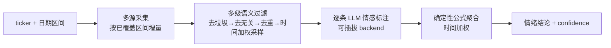

> 最后更新：2026-07-25

# 新闻情感分析模块

## 定位与边界

`BreakoutStrategy/news_sentiment/` 在突破检测管线末端提供**情感维度的辅助判断**：给定股票和时间段，
采集该段新闻/公告/财报，产出一个带 confidence 的情绪结论。它**不独立决策**，只作为突破评分之外的一个维度。

对外只有一个入口 `api.py::analyze`（给股票代码和一段起止日期，拿回一份报告），包内其余模块都是它的
内部编排。**外部不要绕过它直接调采集器或分析器**——增量采集的覆盖标记、候选上限的动态调整、各阶段的
失败降级都只在这条路径上生效，绕过去就全都拿不到。

```mermaid
flowchart LR
    A[ticker + 日期区间] --> B[多源采集<br/>按已覆盖区间增量]
    B --> C[多级语义过滤<br/>去垃圾→去无关→去重→时间加权采样]
    C --> D[逐条 LLM 情感标注<br/>可插拔 backend]
    D --> E[确定性公式聚合<br/>时间加权]
    E --> F[情绪结论 + confidence]
```

## 关键决策与理由

**逐条分析走可插拔 backend，而非绑死一家 LLM**：各家 API 的可用性和性价比变动很快，便宜的偶尔抽风、
稳定的贵、本地模型免费但准确度低。抽象成统一基类后，切换只改 YAML 配置不改代码。当前实现清单与
选择逻辑见 `analyzer.py::_get_backend_registry`（重型依赖的 backend 在此延迟导入，未装也不影响其余可用）。

**聚合阶段用手调的确定性公式，不再调一次 LLM 做汇总**：
- 同一批新闻必须可复现——LLM 汇总有随机性，同样输入可能给出不同结论；
- 需要精细控制损失厌恶、对冲惩罚这类行为，公式才拧得动，提示词拧不动；
- 无额外 API 成本；
- 时间衰减可以在输入层注入，公式本身无需感知时间。

**时间衰减做在两层（采样 + 聚合），不是只做一层**：只在聚合层降权，采样阶段（纯按语义距离选点）
可能先选进一堆老新闻，即使后面降权也已浪费掉 LLM 调用配额；只在采样层加权，选对了新闻却等权聚合，
远期离群点仍会扭曲结论。两层协同才既保住配额又保住结论。

**候选条数随窗口亚线性增长（√ 而非线性）**：新闻主题本身随时间亚线性增长（事件复现、聚集效应），
线性缩放会让长窗口产生数百次 LLM 调用，成本不可接受且边际收益递减。公式与上下限见
`api.py::_compute_dynamic_max_items`。

**缓存的是"单条新闻的情感标注"，不缓存过滤结果**：过滤里的语义去重和多样性采样都是**全局操作**，
结果依赖整个候选集的组成，换个请求窗口就完全不同，缓存它等于缓存了错的东西。而单条新闻在给定
backend + model 下的标注是确定性的，可以安全按 (指纹, backend, model) 缓存。

**缓存内容与时间衰减正交**：存进去的是不带时间权重的原始标注，权重在聚合时按当次的参考日期实时算。
同一条新闻在两次不同日期的分析里本就应该拿到不同权重——把权重烘焙进缓存，缓存就复用不了了。

## 不变式与负知识

- **`analyze()` 永不抛异常**，任何阶段失败都降级成一份仍可读的报告返回。调用方（如 live 的每日
  pipeline）依赖这一点做"单只股票失败不阻断整批"。改这里要先确认没有调用方在裸调它。
- **采集的"已覆盖区间"标记延迟到整轮走完才提交，且空结果不标记**：覆盖标记一旦写下，该区间之后
  就被永久跳过、不会重采。提前写会让中途 Ctrl+C 留下"声称采过、实则没采全"的空洞，把空结果也标上
  则会把一次限流失败固化成永久缺口。改采集顺序时别把这一步提前。
- **TTL 配置项存在但不生效**：缓存配置里的过期天数被读进了对象，但查询路径
  完全不看它们——缓存条目永不自动过期。要清理只能显式调 `cache.clear()`。别因为看到配置项就以为有回收。
- **采集侧受免费 API 限流**（尤其日配额型的那家），大规模扫描时这是真瓶颈。缓存缓解重复请求，
  但消不掉首次采集的限制。
- **公告类文本质量参差**：SEC 公告有相当比例是纯法律条文，LLM 在这类文本上的判断可信度低于普通新闻。
- **时间衰减半衰期是全局单值**，不区分新闻类型；财报类的影响力实际持续更久，当前模型不表达这一点。
- **多样性采样的偏好强度参数未经系统调优**，是凭直觉设的经验值——拿它做归因结论前先自己验一遍。
