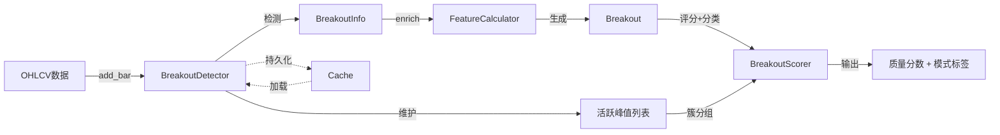
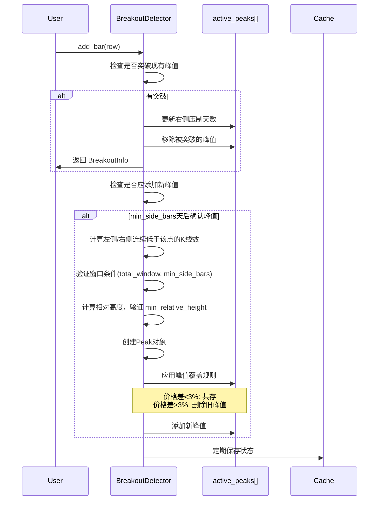

# 技术分析模块 - 实现文档

> 状态：已实现 (Implemented) | 最后更新：2026-03-13

**模块路径**：`BreakoutStrategy/analysis/`

---

## 一、架构意图

### 核心设计决策

技术分析模块采用**增量式架构**重构，这是一个关键的架构决策：

**Why 增量式？**
- **实时监控需求**：支持逐笔添加新数据，无需重新计算全部历史
- **持久化缓存**：增量状态可序列化保存，系统重启后快速恢复
- **性能优化**：避免回测时重复计算，O(n)复杂度而非O(n²)

**核心创新**：
1. **峰值共存机制**：允许价格相近的峰值同时存在（形成"阻力区"），反映真实市场的价格密集带
2. **一次突破多峰**：单次突破可突破多个峰值，更准确反映市场行为
3. **峰值唯一ID**：每个峰值分配唯一ID，支持追踪和去重
4. **不对称窗口检测**：峰值确认采用灵活的不对称窗口 + 相对高度下限，更符合实际市场形态
5. **Bonus 乘法评分模型**：突破评分采用基准分 × 多个 Bonus 乘数的模型，避免权重归一化问题
6. **9 种模式自动分类**：基于主导 Bonus 自动识别突破模式（momentum, historical, volume_surge 等），为下游策略提供维度信息

---

## 二、数据流转图



**关键节点说明**：
- **BreakoutDetector**：增量式核心，维护活跃峰值状态
- **BreakoutInfo**：轻量级突破信息（增量检测直接返回）
- **Breakout**：完整突破对象（包含丰富特征，用于评分）
- **Cache**：可选持久化层，支持状态恢复

---

## 三、核心流程

### 3.1 增量式峰值检测流程



**关键决策点**：
- **不对称窗口**：左右两侧合计 `total_window` 根，单侧至少 `min_side_bars` 根
- **相对高度下限**：峰值相对窗口内最低点的幅度 >= `min_relative_height`
- **峰值覆盖阈值**：默认3%，可配置（平衡共存与清理）

### 3.2 峰值判定规则（不对称窗口）

**核心逻辑**：
```python
def _detect_peak_in_window(current_idx):
    # 窗口：[current_idx - total_window, current_idx)
    window_highs = self.highs[window_start:current_idx]

    # 条件1：在窗口内是最高点
    max_high = max(window_highs)
    max_local_idx = window_highs.index(max_high)

    # 条件2：不在窗口前后 min_side_bars 位置
    if max_local_idx < min_side_bars:
        return  # 在窗口前部，不是有效峰值
    if max_local_idx >= window_size - min_side_bars:
        return  # 在窗口后部，不是有效峰值

    # 条件3：相对高度满足要求
    window_min_low = min(window_lows)
    relative_height = (max_high - window_min_low) / window_min_low
    if relative_height < min_relative_height:
        return  # 相对高度不足

    # 通过所有条件，创建峰值...
```

**Why 不对称窗口？**
- **符合实际形态**：上涨趋势中的顶部（左长右短）vs 下跌初期的顶部（左短右长）
- **灵活性**：允许 左8+右2 或 左2+右8，只要合计满足 total_window
- **单侧保障**：`min_side_bars` 防止极端情况（如0+10）

**Why 相对高度下限？**
- 过滤横盘震荡中的噪声峰值
- 确保峰值具有足够的"显著性"来构成有效阻力

### 3.3 峰值共存规则

```python
# 核心逻辑（伪代码）
for old_peak in active_peaks:
    if old_peak.price > new_peak.price:
        # 旧峰值更高 → 始终保留
        keep(old_peak)
    else:
        exceed_pct = (new_peak.price - old_peak.price) / old_peak.price
        if exceed_pct < peak_supersede_threshold:  # 默认3%
            # 价格相近 → 共存（形成阻力区）
            keep(old_peak)
        # else: 新峰值显著更高 → 删除旧峰值
```

**Why 3%阈值？**
- 经验值，反映市场"价格密集带"的典型范围
- 太小（如1%）→ 峰值过度清理，丢失密集区信息
- 太大（如5%）→ 峰值过度保留，噪音增大

---

## 四、质量评分体系

### 4.1 突破质量评分 — Bonus 乘法模型

**核心公式**：
```
总分 = BASE × age × test × height × peak_volume ×
       volume × day_strength × pbm × streak × pk_momentum × pre_vol × overshoot
```

- 基准分 `BASE = 50`：存在有效突破这件事本身的价值
- 满足条件时获得对应 bonus 乘数（>1.0），否则为 1.0（无加成）
- overshoot 为惩罚项（<1.0）
- **总分可超过 100**，只要同一基准下可比即可
- **评分完成后自动分类模式标签**（见 4.3 节）
- **所有因子由 `FACTOR_REGISTRY` 驱动**，新增因子仅需注册即可参与评分

**完整 Bonus 因素（11 个 + 1 个惩罚）**：

```yaml
阻力属性 Bonus（描述被突破阻力的"难度"）:
  Age:            # 最老峰值年龄（远期阻力 > 近期）
    - 21天:  1.15
    - 63天:  1.30
    - 252天: 1.50
  Tests:          # 测试次数（最大簇的峰值数）
    - 2次: 1.10
    - 3次: 1.25
    - 4次: 1.40
  Height:         # 最大相对高度
    - 10%: 1.15
    - 20%: 1.30
  PeakVol:        # 峰值放量倍数（被突破峰值中最大值）
    - 2.0x: 1.10
    - 5.0x: 1.20

突破行为 Bonus（描述突破动作的"力度"）:
  Volume:         # 突破日放量
    - 1.5x: 1.15
    - 2.0x: 1.30
  DayStr:         # 突破日强度 = max(IDR-Vol, Gap-Vol)
    - 1.5σ: 1.10    # IDR-Vol = intraday_change / daily_vol
    - 2.5σ: 1.20    # Gap-Vol = gap_up_pct / daily_vol
  PBM:            # 突破前涨势强度 (Pre-Breakout Momentum)
    - 1‰:  1.15     # ΔP² / (P₀ × L × N)
    - 3‰:  1.30
  Streak:         # 连续突破次数
    - 2次: 1.20
    - 4次: 1.40
  PK-Mom:         # 近期 peak 凹陷深度
    - 1.5: 1.15     # pk_momentum = 1 + log(1 + D_atr)
    - 2.0: 1.25
  PreVol:         # 突破前放量（window 天内最大放量倍数）
    - 3.0x: 1.15
    - 5.0x: 1.25

惩罚:
  Overshoot:      # 超涨惩罚（5 日波动率标准化）
    - 3.0σ: 0.80    # ratio = gain_5d / five_day_vol
    - 4.0σ: 0.60    # five_day_vol = annual_vol / √50.4
```

**Why Bonus 乘法模型？**
- **避免权重归一化**：传统加权模型需要权重和为1，新因素难以加入
- **乘法语义正确**：多个利好因素同时满足时，效果应该叠加
- **灵活扩展**：新增 Bonus 不影响现有评分逻辑

### 4.2 关键算法说明

#### DayStr — 突破日强度（合并设计）

**设计决策**：取日内涨幅和跳空幅度中较大者，避免双重计分

```
DayStr = max(intraday_change_pct / daily_vol, gap_up_pct / daily_vol)
daily_vol = annual_volatility / √252
```

**Why 合并而非分开？** 跳空和日内涨幅存在替代关系（大跳空通常伴随小日内涨幅），分开计算会导致相同强度的突破因形态不同而获得不同分数。

#### PBM — 突破前涨势强度

```
PBM = (位移/起点价格) × (|位移|/路径长度) / K线数量
    = ΔP² / (P₀ × L × N)
```

衡量突破前涨势的"直接程度"：位移大、路径效率高、时间短 → PBM 高。

#### PK-Momentum — 近期 peak 凹陷深度

```
pk_momentum = 1 + log(1 + D_atr)
D_atr = (peak_price - trough_price) / ATR
```

值域：0（无近期 peak）→ 1.0（无凹陷）→ 2.5+（深蹲）。反映从近期高点回调后再突破的反弹势能。

#### Overshoot — 超涨惩罚

使用波动率动态阈值：低波动股票更容易触发超涨惩罚，高波动股票阈值更高。

### 4.3 模式分类体系（9 种标签）

评分完成后，`_classify_pattern()` 根据各 Bonus 的触发级别自动分类：

```
第1层：混合模式（同时满足多个维度，优先判定）
├─ deep_rebound:      PK-Mom ≥ L1 AND Age ≥ L2    深蹲远射（势能+历史）
├─ power_historical:  Volume ≥ L1 AND Age ≥ L2     放量历史突破（放量+历史）
└─ grind_through:     Age ≥ L2 AND Tests ≥ L1      磨穿防线（测试+历史）

第2层：单一维度模式
├─ momentum:          PK-Mom ≥ L1                   势能突破
├─ historical:        Age ≥ L2                      历史阻力突破
├─ volume_surge:      Volume ≥ L1                   放量爆发
├─ dense_test:        Tests ≥ L2                    密集测试
└─ trend_continuation: Streak ≥ L1                  趋势延续

第3层：兜底
└─ basic                                            基础突破
```

**设计理念**：模式标签不影响评分（评分由 Bonus 乘法决定），仅为下游策略提供维度信息。

### 4.4 评分方法架构

**设计决策**：评分逻辑单一来源

```
score_breakout()   ──委托──>  get_breakout_score_breakdown_bonus()
                               ├─ 计算 10 个 Bonus + 1 个 Penalty
                               ├─ 乘法聚合总分
                               └─ _classify_pattern() → 模式标签
```

- `get_breakout_score_breakdown_bonus()` 返回 `ScoreBreakdown`（含 `bonuses` 列表和 `pattern_label`）
- `score_breakout()` 将总分和标签写回 `breakout.quality_score` 和 `breakout.pattern_label`
- UI 浮动窗口可通过 `breakdown.get_formula_string()` 获取可读公式

### 4.5 阻力簇分组

- 将被突破峰值按价格相近度分组成"阻力簇"（贪心聚类，价差 < 3%）
- Tests Bonus 使用**最大簇的峰值数**
- Age/Height/PeakVolume 取**全局最值**（跨簇的绝对属性）

---

## 五、特征计算模块

**FeatureCalculator 职责**：从 BreakoutInfo 计算完整的 Breakout 对象

**架构**：每个因子对应一个独立的 `_calculate_xxx()` 方法，`enrich_breakout()` 统一调用并赋值到 Breakout 构造器。新增因子只需添加计算方法并在构造器中引用。

**核心特征**：
```yaml
突破类型:
  breakout_type: yang | yin | shadow   # 阳线/阴线/上影线突破

价格特征:
  intraday_change_pct: (close - open) / open     # 日内涨幅
  gap_up: bool                                    # 是否跳空
  gap_up_pct: (open - prev_close) / prev_close   # 跳空幅度
  gap_atr_ratio: gap / atr[prev]                  # 跳空 ATR 标准化

量能特征:
  volume_surge_ratio: cur_vol / avg_vol(63d)      # 放量倍数
  pre_vol: max(vol_ratio[-window:])               # 突破前放量最大值

动量特征:
  momentum: PBM 值                                # 突破前涨势强度
  pk_momentum: 1 + log(1 + D_atr)                # 近期 peak 凹陷深度
  recent_breakout_count: int                       # 近期突破次数

波动率特征:
  gain_5d: 5 日涨幅                               # 用于 overshoot 惩罚
  annual_volatility: 年化波动率                    # 用于波动率标准化

ATR 特征:
  daily_return_atr_ratio: (close - prev_close) / atr   # 单日强度
  atr_value: ATR 值（前一天）
  atr_normalized_height: 突破幅度 / ATR（可选）

阻力属性（从 broken_peaks 聚合）:
  age: max(idx - p.index)                         # 最老峰值年龄
  height: max(p.relative_height)                  # 最大相对高度
  peak_vol: max(p.volume_peak)                    # 峰值最大放量
  test: max_cluster_size(broken_peaks)            # 最大阻力簇大小

稳定性:
  stability_score: 突破后 N 天不跌破峰值的比例

回测标签:
  labels: {"label_5_20": 0.15, ...}               # 事后表现评估
```

---

## 六、技术指标模块

**TechnicalIndicators 职责**：基于 `pandas_ta` 库提供常用技术指标计算

**依赖**：`pandas_ta>=0.3.14b`（必需）

**支持的指标**：
- `calculate_ma(series, period)`: 移动平均线
- `calculate_rsi(close, period)`: RSI 指标（使用 pandas_ta）
- `calculate_atr(high, low, close, period)`: ATR 指标（Wilder's smoothing，与 TradingView 一致）
- `calculate_relative_volume(volume, period)`: 相对成交量
- `add_indicators(df)`: 批量添加 ma_20, ma_50, rsi_14, rv_63

---

## 七、已知局限与权衡

### 7.1 峰值确认延迟

**现状**：峰值需等待 `min_side_bars` 天后才能确认（确保右侧有足够数据）

**影响**：
- ✅ 优点：避免假峰值，提高准确性
- ❌ 缺点：实时监控时，最新峰值无法立即识别

**未来优化方向**：
- 引入"候选峰值"机制（未确认但可监控）
- 双模式：回测用严格确认，实时用候选峰值

### 7.2 持久化依赖 pickle

**现状**：使用 `pickle` 序列化状态

**权衡**：
- ✅ 优点：简单快速，支持复杂对象
- ❌ 缺点：不跨语言，版本兼容性差

**未来改进**：
- 考虑切换到 JSON/MessagePack（需自定义序列化）

### 7.3 Bonus 模型总分无上限

**现状**：乘法模型下总分可能超过100

**权衡**：
- ✅ 优点：避免权重归一化，扩展灵活
- ❌ 缺点：分数不直观，需要相对比较

**建议**：UI 中使用分位数或相对排名展示

---

## 八、配置参数说明

### 8.1 BreakoutDetector 参数

```yaml
total_window: 10                   # 总窗口大小
min_side_bars: 2                   # 单侧最少K线数
min_relative_height: 0.05          # 最小相对高度（5%）
exceed_threshold: 0.005            # 突破确认阈值（0.5%）
peak_supersede_threshold: 0.03     # 峰值覆盖阈值（3%）
streak_window: 20                  # 连续突破统计窗口
peak_measure: body_top             # 峰值价格定义
breakout_modes: [body_top]         # 突破确认模式
# 约束：min_side_bars * 2 <= total_window
```

### 8.2 FeatureCalculator 参数

```yaml
stability_lookforward: 10          # 稳定性向前看天数
continuity_lookback: 5             # PBM 计算回看窗口
atr_period: 14                     # ATR 计算周期
gain_window: 5                     # 涨幅计算窗口
pk_lookback: 30                    # pk_momentum 时间窗口
label_configs: []                  # 回测标签配置
```

### 8.3 BreakoutScorer 参数

```yaml
bonus_base_score: 50               # 基准分

# 阻力属性 Bonus
age_bonus:
  thresholds: [21, 63, 252]        # 1月, 3月, 1年
  values: [1.15, 1.30, 1.50]
test_bonus:
  thresholds: [2, 3, 4]
  values: [1.10, 1.25, 1.40]
height_bonus:
  thresholds: [0.10, 0.20]
  values: [1.15, 1.30]
peak_volume_bonus:
  thresholds: [2.0, 5.0]
  values: [1.10, 1.20]

# 突破行为 Bonus
volume_bonus:
  thresholds: [1.5, 2.0]
  values: [1.15, 1.30]
breakout_day_strength_bonus:       # 合并 IDR-Vol 和 Gap-Vol
  thresholds: [1.5, 2.5]           # σ（日波动率倍数）
  values: [1.10, 1.20]
pbm_bonus:
  thresholds: [0.001, 0.003]
  values: [1.15, 1.30]
streak_bonus:
  thresholds: [2, 4]
  values: [1.20, 1.40]
pk_momentum_bonus:
  thresholds: [1.5, 2.0]
  values: [1.15, 1.25]

# 惩罚
overshoot_penalty:
  thresholds: [3.0, 4.0]           # σ（5 日波动率倍数）
  values: [0.80, 0.60]

# 可选功能
use_atr_normalization: false
atr_normalized_height_thresholds: [1.5, 2.5]
atr_normalized_height_values: [1.10, 1.20]

# 阻力簇
cluster_density_threshold: 0.03
```

---

## 九、API 使用示例

### 基础用法

```python
from BreakoutStrategy.analysis import (
    BreakoutDetector, FeatureCalculator, BreakoutScorer
)
import pandas as pd

# 1. 初始化
detector = BreakoutDetector(symbol='AAPL')
calculator = FeatureCalculator()
scorer = BreakoutScorer()

# 2. 批量添加历史数据
df = pd.read_csv('AAPL_history.csv')
breakout_infos = detector.batch_add_bars(df, return_breakouts=True)

# 3. 特征计算 + 评分 + 模式分类
atr_series = TechnicalIndicators.calculate_atr(df['high'], df['low'], df['close'])
for info in breakout_infos:
    breakout = calculator.enrich_breakout(
        df, info, 'AAPL', detector=detector, atr_series=atr_series
    )
    scorer.score_breakout(breakout)
    # breakout.quality_score = 总分
    # breakout.pattern_label = 模式标签（如 "momentum", "historical"）
```

### 评分分解查看

```python
breakdown = scorer.get_breakout_score_breakdown_bonus(breakout)

print(f"总分: {breakdown.total_score:.1f}")
print(f"模式: {breakdown.pattern_label}")
print(f"公式: {breakdown.get_formula_string()}")
# 输出示例: "50 ×1.30 ×1.25 ×1.15 ×1.20 = 112.1"

for b in breakdown.bonuses:
    if b.triggered:
        print(f"  {b.name}: {b.raw_value}{b.unit} → ×{b.bonus:.2f} (L{b.level})")
```

---

## 十、性能特征

### 时间复杂度

- **add_bar()**：O(P)，P为活跃峰值数量（通常<10）
- **batch_add_bars()**：O(N×P)，N为数据点数
- **峰值质量评分**：O(1)
- **突破质量评分**：O(P²)（簇分组）

### 空间复杂度

- **内存占用**：O(N + P)，N为历史数据点，P为活跃峰值
- **缓存文件**：约100KB/股票（1000天历史数据）

### 性能优化手段

1. **增量计算**：避免重复计算历史数据
2. **向量化操作**：使用pandas/numpy向量化计算
3. **延迟评分**：峰值质量评分仅在需要时计算
4. **持久化缓存**：避免系统重启时重新计算

---

## 十一、测试覆盖

### 单元测试

- ✅ 峰值识别正确性
- ✅ 峰值共存规则
- ✅ 突破检测准确性
- ✅ 质量评分范围
- ✅ 持久化加载/保存

### 集成测试

- ✅ 完整流程测试（数据→检测→评分）
- ✅ 多股票批量处理
- ✅ 缓存一致性测试

**测试文件**：
- `BreakoutStrategy/analysis/test/test_integrated_system.py`

---

## 十二、架构演进记录

### 2025-12-21 Bonus 乘法模型替代加权模型

- 删除旧加权模型代码（约720行），全面切换到 Bonus 乘法模型
- 簇选择从复杂评分简化为 `max(clusters, key=len)`

### 2025-12-27 ATR 标准化引入

- 新增 `daily_return_atr_ratio`、`atr_value`、`atr_normalized_height` 字段
- ATR 使用前一天的值（`ATR[i-1]`），避免自引用

### 2026-01-08 Spike Penalty → Overshoot Penalty

- 旧方案：`spike_ratio = max((close[i]-close[i-var])/atr[i-var])` + `spike_penalty`
- 新方案：`overshoot_penalty` 基于 5 日波动率标准化（`gain_5d / five_day_vol`）
- 移除 `spike_ratio`、`spike_window` 字段和参数

### 2026-03-13 因子计算重构 + pre_vol 因子

- `features.py` 每个因子独立为 `_calculate_xxx()` 方法，`enrich_breakout()` 不再内联计算逻辑
- 阻力属性因子（age, height, peak_vol, test）从内联提取到独立方法
- 派生因子（day_str, overshoot, pbm, streak, drought）同上
- 新增 `pre_vol` 因子：突破前 window 天内最大放量倍数，衡量突破前的量能积蓄
- 评分因子从 10+1 升级至 11+1（新增 PreVol Bonus）

### 2026-01~02 评分模型大幅升级

**新增 Bonus 因素**：
- `breakout_day_strength_bonus`：合并原 Gap 和 DailyReturn Bonus，取 max(IDR-Vol, Gap-Vol)，消除双重计分
- `pbm_bonus`：突破前涨势强度（Pre-Breakout Momentum），衡量涨势的"直接程度"
- `streak_bonus`：连续突破次数（替代原 Momentum Bonus 概念，阈值从 [2] 升级为 [2, 4]）
- `pk_momentum_bonus`：近期 peak 凹陷深度，反映反弹势能
- `overshoot_penalty`：替代 spike_penalty，基于波动率标准化

**移除 Bonus 因素**：
- `gap_bonus`、`daily_return_bonus`（合并为 DayStr）
- `continuity_bonus`（连续阳线，判定噪声大）
- `momentum_bonus`（重命名为 streak_bonus，逻辑不变）

**新增特征字段**：
- `Breakout.pk_momentum`、`Breakout.gain_5d`、`Breakout.annual_volatility`、`Breakout.gap_atr_ratio`

**移除特征字段**：
- `spike_ratio`、`continuity_days`

**新增模式分类**：
- `_classify_pattern()` 方法：基于主导 Bonus 自动分类为 9 种模式标签
- `ScoreBreakdown.pattern_label` 字段
- `Breakout.pattern_label` 属性（由 scorer 动态设置）

---

**维护者**：Claude Code
**最后审核**：2026-03-13
