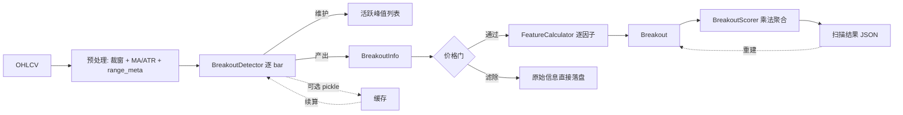

# 突破扫描模块

> 最后更新：2026-07-25

**模块路径**：`BreakoutStrategy/analysis/`

> 本模块属 `BreakoutStrategy/`（path2 的前身突破选股流水线），主线开发已转向 `path2/`，此处仅作参考。

---

## 一、定位与边界

把 OHLCV 变成「带因子与评分的突破事件」，并支撑全市场批量扫描落盘。

**管**：峰值状态维护 → 突破判定 → 因子计算 → 乘法评分 → 批量扫描与结果序列化。

**不管**：
- **因子清单及其元数据**（名称、默认阈值、显示与语义标记等）——权威在 `BreakoutStrategy/factor_registry.py`，本模块只消费。
- **绘图与交互** → `BreakoutStrategy/UI/`、`BreakoutStrategy/dev/`（见 [UI.md](UI.md) · [dev.md](dev.md)）；**参数寻优** → `BreakoutStrategy/mining/`（见 [数据挖掘模块.md](数据挖掘模块.md)）；**实时调度** → `BreakoutStrategy/live/`（见 [live.md](live.md)）。

**内部分工**（各文件职责，具体签名以代码为准）：

| 文件 | 职责 |
|---|---|
| `breakout_detector.py` | 增量状态机 + 峰值/突破核心数据结构 + 可选持久化 |
| `features.py` | 逐因子计算（每因子一个 `_calculate_xxx`）+ lookback SSOT |
| `breakout_scorer.py` | 乘法聚合评分，因子清单由注册表动态驱动 |
| `scanner.py` | 预处理 / 统一突破计算函数 / 并行扫描管理与结果落盘 |
| `json_adapter.py` | 反向路径：从扫描结果 JSON 重建对象，供 UI 浏览模式免重算 |
| `indicators.py` | `pandas_ta` 薄封装（硬依赖，import 失败直接抛） |

---

## 二、关键决策与理由

**增量式检测（逐 bar 推进而非整段重算）**：为实时监控服务——新数据到来只需推进一步，不必重算全部历史；状态可落盘，重启后续算。回测批量入口只是在同一状态机上循环喂 bar，两条路径共用一套逻辑。

**峰值共存**：价格相近的多个峰值同时留在活跃列表里，构成"阻力区"而非单一阻力线，贴合真实市场的价格密集带。由此派生**一次突破可吃掉多个峰值**——`BreakoutInfo` 天然持有峰值列表而非单个峰值。

**双阈值（突破确认 vs 峰值移除）**：突破确认用一个小阈值（敏感，宁可多报），峰值移除用一个大得多的阈值（保守，宁可留着）。两者分开是为了让"小幅突破"既被记为突破事件、又不至于把阻力区抹掉——阻力被试探过不等于被消灭。移除阈值是经验值，调参方向：调小则峰值被过度清理、丢失价格密集带信息；调大则峰值过度滞留、噪声峰值堆积。

**峰值 elevation + supersede 锚定原始价**：小幅突破后峰值不移除，但其有效价格被抬到当前度量价（阻力位上移）。此时 supersede 判定必须锚在 `Peak.original_price` 而非被抬升后的 `price`——否则缓步上行的累计涨幅永远追不上不断被抬高的基准，peak 会永不退场。这是踩过的坑，改动 elevation 逻辑时必须保住这条。

**不对称窗口 + 相对高度下限**：峰值只要求"左右两侧合计"达到窗口长度、每侧不低于一个最小值，不要求左右对称——上涨趋势顶部（左长右短）与下跌初期顶部（左短右长）都该算峰值。相对高度下限则过滤横盘噪声，保证峰值有足够显著性才配当阻力。

**Factor 乘法模型（基准分 × 各因子乘数）**：加权求和模型要求权重归一化，每加一个因子都得重调所有权重；乘法模型下新增因子互不干扰，方向由乘数值编码（>1 奖励、<1 惩罚），触发判定统一用 `>=`。代价是**总分无上限**，只在同一参数基准下可比，不能当百分制读。

**同一现象的替代性度量合并成一个因子（取 max），而不是各设一个因子**：例如跳空与日内涨幅本就互相替代（大跳空往往伴随小日内涨幅），若分列两个乘数，同等强度的突破会因形态不同拿到不同分数，且强度被双重计入。新增因子前先判断它与已有因子是不是同一件事的两种表现。

**Per-factor gating**：突破判定是纯局部事实，只依赖当前 bar 与活跃峰值，与任何因子的 lookback 无关。因此不设全局 buffer 闸门卡掉早期 BO；每个因子在自己的计算入口自检 lookback，不够就返回 `None`。这样数据头部的 BO 照样成立，只是部分因子缺席。

**价格门前置**：价格过滤在 enrich + score **之前**做 partition，被滤掉的 BO 只保留原始检测信息、不跑因子（省 CPU），但仍随结果持久化——否则 UI 浏览模式会丢掉这些 BO 击穿过的峰值，画面与分析模式对不上。

**峰值权威来源是 detector 的全量峰值列表**，不是"活跃 ∪ 被突破 ∪ 被覆盖"的并集。后者会漏掉被价格门滤除的 BO 所击穿的峰值。全量列表在峰值创建时就填充，与下游任何过滤解耦。

**范围元数据两次写入**：`scanner` 在 df 上挂一份 range_meta，承载 pkl / scan / compute / label buffer 各层的 ideal-actual 双值。预处理入口先写一版（JSON-cache 路径不跑 detector，也必须拿得到），突破计算入口再用真实 valid window 精化 actual；actual 偏离 ideal 时打 INFO 日志说明降级原因。下游由 `BreakoutStrategy/UI/charts/range_utils.py` 消费。

---

## 三、不变式与负知识

- **lookback SSOT**：因子的最小索引要求只在 `FeatureCalculator._effective_buffer` 定义一处。新增因子必须在此登记，否则立即抛 `ValueError`——刻意的 strict 契约，防止静默按 0 处理导致因子在数据头部算出垃圾值。
- **对外求 buffer 时迭代完整注册表（含 inactive 因子）**，不是只算激活的。这样将来激活某个 inactive 因子时，下载天数 / 预处理 buffer 自动跟上，不需要再改一处。
- **因子 `None` ≠ 0**：`None` 的语义是"数据不够算"，与"算出来了但没触发"必须分开。评分层用一个专门标志位承载这个区分，下游 UI 据此做三态渲染。把 `None` 当 0 传下去会污染统计与挖掘。
- **单侧最小 bar 数 × 2 不得超过总窗口**，构造检测器时即校验，否则峰值判定条件永远无解。
- **峰值 id 是跨阶段的身份锚**：落盘时只有全量峰值表存完整对象，活跃 / 被覆盖集合、突破记录的关联峰值、峰值间的 killer→victim 关系全部按 id 引用；`json_adapter` 的反向重建也按 id 建索引再挂回。改动 id 的生成或引用方式，浏览模式会静默丢峰值/丢关联，而不是报错。
- **ATR 标准化一律锚在事件之前的 ATR 值**，不用当日值：突破当天的 ATR 已被这根 K 线自己撑大，用它做分母等于自我参照，强突破反而被压回平庸。个别因子还会把锚点继续往前挪（避免回撤—反弹段膨胀分母，理由写在该因子的计算方法注释里）——改 ATR 取值时点前先读那段注释。
- **`INACTIVE_FACTORS` 是全局总开关**：列入即同时从评分链和 per-factor gate 中消失。想临时停用某因子改这里，不要在 scorer 或 features 里硬编码分支。
- **不要在评分器里写死因子清单**。评分完全由注册表驱动，加因子的正确姿势是注册 + 加计算方法 + 加 `_effective_buffer` case（`add-new-factor` skill 覆盖了全套改动点）。
- **峰值确认存在固有延迟**：峰值需要右侧积累足够 bar 才能确认，实时场景下最新的顶部无法即时识别。这是"避免假峰值"换来的，不是 bug。
- **持久化用 pickle**：不跨语言、跨版本兼容性差，缓存文件不可当长期资产。缓存文件名只编码了部分参数，参数一致性靠加载时逐项比对——任一不符即整体弃用重算；靠文件名判断缓存是否可复用会踩空。
- **峰值检测受有效起始索引闸门约束**：指标预热区（ATR / MA buffer）内不产生峰值，因此峰值已在检测阶段过滤干净，下游不需要也不应该再做一次范围过滤。

---

## 四、核心流程

```mermaid
graph LR
    A[OHLCV] --> P[预处理: 裁窗 + MA/ATR + range_meta]
    P --> D[BreakoutDetector 逐 bar]
    D -->|维护| K[活跃峰值列表]
    D -->|产出| I[BreakoutInfo]
    I --> G{价格门}
    G -->|通过| F[FeatureCalculator 逐因子]
    G -->|滤除| X[原始信息直接落盘]
    F --> B[Breakout]
    B --> S[BreakoutScorer 乘法聚合]
    S --> J[扫描结果 JSON]
    J -.重建.-> B
    D -.可选 pickle.-> C[缓存]
    C -.续算.-> D
```

因子元数据横向注入评分与 gating 两处，均来自 `BreakoutStrategy/factor_registry.py`。
