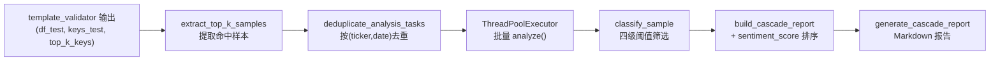

> 最后更新：2026-04-07

# 级联验证模块 (cascade)

## 定位

桥接 mining（模板验证）和 news_sentiment（情感分析）的独立子包。对 template_validator 筛出的 top-K 模板命中样本，逐个突破执行情感分析，以"技术面+消息面"联合筛选评估增量价值。不修改上下游模块内部逻辑。

---

## 核心流程

---

## 关键架构决策

### 1. 独立子包而非嵌入 mining 或 sentiment

**Why**: 级联是桥接层。放在 mining 中会引入 mining→sentiment 硬依赖；放在 sentiment 中会引入对 DataFrame/triggered matrix 的依赖。独立子包保持模块边界清晰。

### 2. per-breakout-date 粒度而非 per-ticker

**Why**: 同一 ticker 的不同突破日期需要不同的 time_decay reference_date。每个 (ticker, breakout_date) 独立调用 `analyze()`，news_sentiment 的增量缓存自动处理重叠窗口的新闻复用，边际成本趋零。

### 3. 筛选层与排序层分离

**Why**: 筛选层（风控）只做排除（score < -0.15 reject, < -0.40 strong_reject），不因正面 sentiment 改变通过判定。排序层在通过样本中按 sentiment_score 降序排列，帮助用户优先关注"技术+消息双优"标的。风控职责不被正面信号污染。

### 4. 分析失败默认放行

**Why**: 不因 API 故障排除技术面合格的样本。`analyze()` 保证永不抛异常；外层 `_analyze_single` 重试后仍失败的标记为 `category="error"`，统计报告单独列出错误率。

### 5. 不侵入 template_validator

**Why**: cascade 接收 template_validator 已有的输出变量（df_test, keys_test, matched），不修改任何内部函数签名。通过 `materialize_trial(run_cascade=True)` 可选触发，关闭时零开销。

---

## 组件职责

| 文件 | 职责 |
|------|------|
| `models.py` | 数据类：BreakoutSample, CascadeResult, CascadeReport |
| `filter.py` | 阈值分类 + 配置加载（cascade.yaml） |
| `batch_analyzer.py` | 核心编排：提取→去重→批量分析→筛选→构建报告 |
| `reporter.py` | Markdown 报告生成 + 三级判定（EFFECTIVE/MARGINAL/INEFFECTIVE） |
| `__main__.py` | 独立运行入口 |

## 配置

`configs/cascade.yaml`：lookback_days、四级阈值、并发数、重试策略。情感分析引擎配置复用 `configs/news_sentiment.yaml`。

## 集成点

- **输入**: `template_validator.materialize_trial(run_cascade=True)` 在 OOS 验证后触发
- **依赖**: `news_sentiment.api.analyze(save=False)` 执行单次情感分析
- **输出**: `CascadeReport` + trial 目录下的 `cascade_report.md`

## 已知局限

1. 报告中缺少 per-template cascade comparison 表（spec Section 5），仅有按 category 的分组统计
2. 历史数据中小盘股新闻稀缺，可能导致 insufficient_data 比例较高
3. cascade_lift 基于小样本（通常 20-100 个），统计显著性需谨慎解读
