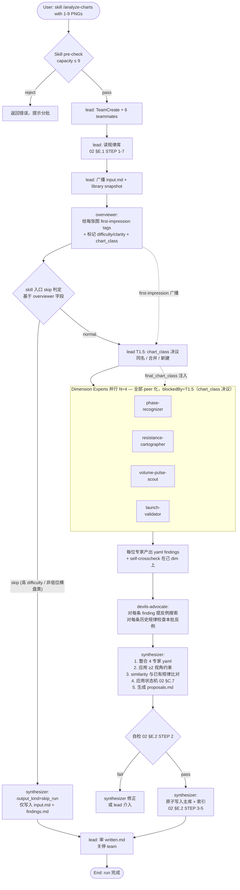

# 03 — 股票分析 Agent Team 架构设计

> **角色**：本文是 meta team `meta-stock-analyst-design` 的产出之一，由 team-architect 执笔。
> **目的**：定义可被 skill 反复启动的"股票分析团队"的成员组成、协作流程、防偏差机制、IO 协议，让 skill-author 能据此写出团队启动模板。
> **输入依赖**：
> - `01_analysis_dimensions.md`（stock-domain-expert 产出，提供 9 个分析视角与 4+1 切分建议）
> - `02_memory_system.md`（memory-system-designer 产出，提供规律库 schema + IO 协议 + 状态机）
> - team-lead 的 6 条架构约束（见 §1.3）
> **不写实现代码**：本文仅定义角色边界、伪代码骨架、调用模板。skill 实现由后续 task 完成。

> **设计约束**：所有 team 协作 / 写库 / 状态判定流程必须 LLM 可完成。详见 `SKILL.md §0.2 设计约束（LLM-only）`。

---

## 1. Executive Summary（速读）

### 1.1 一句话定义

每次用户提交 1~9 张"上涨前走势"K 线图，团队按"**总览员定调 → 4 个纵切维度专家并行分析 → 反方质疑者提反例 → 整合者收敛入库**"的流程产出本次独立报告，并以增量方式更新跨会话规律库。

### 1.2 选定方案：**E + Overviewer**（混合方案）

- 主干：**B 纵切（每个 teammate 一个分析维度组）**——上下文成本最优
- 前置：**Overviewer 先给 gestalt 第一印象**——补回纯 B 丢失的"整体直觉"
- 强化：**Devil's Advocate 反方质疑者**——架构层面对抗幸存者偏差
- 收敛：**唯一 Synthesizer 写入者**——读写分离，避免并发污染

### 1.3 与 team-lead 6 条约束的对齐

| # | Lead 约束 | 在本架构中的体现 |
|---|---|---|
| 1 | 论证为何不是 D（总-分-总） | §2 方案对比，选定 E+Overviewer 而非纯 D（避免重复扫尾） |
| 2 | 维度专家 ≤ 4 | 4 个 dimension-experts，按 01 的 4+1 切分（聚类后落 4 个） |
| 3 | 反方只能 block 不能 delete | §4.4 Devil's Advocate 权限矩阵；反对意见仅写入 refute_notes，不触动主库 |
| 4 | Synthesizer 唯一写入者 | §4.6 唯一具备主库 Write 权限的角色；lead 不兼任分析 |
| 5 | 单次 ≤9 张图硬上限 | §6 容量策略；skill 入口 pre-check 拒绝 |
| 6 | 诚实失败识别 | §5.3 诚实兜底原则；synthesizer 必须支持 `output_kind: no_new_pattern` / `chart_unexplained` 等非积极产出 |

### 1.4 团队成员一览（共 7 角色，含 lead）

```
team-lead (用户代理 / spawn / 协调 / 关停 — 不参与具体分析)
├─ overviewer            (1人, opus: gestalt 第一印象 + chart_class 自动命名 + 同质性校验 + difficulty / clarity 评分)
├─ phase-recognizer      (1人, dim-expert: 价格结构 + 时间 + 行业环境；专长方向 — 但人人可发现任何视角，跨 group 自由报告)
├─ resistance-cartographer (1人, dim-expert: 阻力支撑 + 相对位置；专长方向 — 但人人可发现任何视角，跨 group 自由报告)
├─ volume-pulse-scout (1人, dim-expert: 量价配合 + 波动收敛 + 异常信号；专长方向 — 但人人可发现任何视角，跨 group 自由报告)
├─ launch-validator      (1人, dim-expert: 动量结构；专长方向 — 但人人可发现任何视角，跨 group 自由报告)
├─ devils-advocate       (1人, 反方质疑 + 阻止晋级)
└─ synthesizer           (1人, 收敛 + 唯一写入者)
```

---

## 2. 架构方案对比与选定（核心论证）

### 2.1 候选方案权衡矩阵

每项打分 1-5，5 为最佳。

| 方案 | 描述 | 覆盖度 | 上下文成本 | 防偏差能力 | 整合开销 | 失败容忍 | 总分 |
|---|---|---|---|---|---|---|---|
| **A. 横切** | 每个 teammate 1-2 张图 | 5 | 5 | **2** | 4 | 3 | 19 |
| **B. 纵切** | 每个 teammate 一个维度 | 4 | **5** | 3 | 3 | 4 | 19 |
| **C. 层层递进** | 先规划视角再执行 | 4 | 3 | 3 | **2** | 3 | 15 |
| **D. 总-分-总** | 整体→并行→整体 | 5 | 2 | 3 | 2 | 3 | 15 |
| **E. 混合（B+overview+反方+整合）** | 本架构选定 | **5** | 4 | **5** | 3 | **5** | **22** |

### 2.2 各方案的致命弱点

- **A. 横切**：每人样本仅 1-2 张图，**无法横向比较**，幸存者偏差不可控。9 张图全是"已涨"，每人都会反向拟合特征。**直接淘汰**。
- **B. 纵切**：上下文成本最优（每人专注一个维度），但**丢"整体直觉"** —— 人看图是先有 gestalt 再分维度的，纯 B 让维度专家在没有整体认知的情况下抠细节，容易"只见树木不见森林"。
- **C. 层层递进**：第一阶段规划视角等同于"再做一次 01"，是重复劳动。01 已经给了视角清单，运行时不必再次规划。
- **D. 总-分-总**：第一轮"总"和第三轮"总"职能重叠 —— 前者给 first-impression，后者做整合，但中间专家组的产出已经包含整合所需信息，第三轮"总"是冗余环节，徒增上下文成本。
- **E. 混合**：把 B 的低成本骨架 + D 的"整体先行"想法 + 显式反方质疑融合。前 overview 替代 D 的第一轮"总"，synthesizer 替代 D 的第三轮"总"，但 synthesizer 不再做全员评审，只做单向收敛。

### 2.3 为什么是 E + Overviewer，而不是纯 D

**核心论证**：D 的问题是"两次大会"，E 只开"一次大会"（synthesizer 收敛）。

- 在 D 中，第三轮"总"需要每个专家都把自己的中间产出再呈现一次给"总"角色 —— 这等于让 synthesizer 重新感知所有专家的细节，上下文压力陡增。
- 在 E 中，synthesizer 只接收每个专家的**结构化 yaml 输出**（按 01 §5.4 的 schema），不需要重新"听讲"，直接做 schema-level 的收敛 —— 上下文成本远低于 D。
- Overviewer 的产出（gestalt tags + chart-level 一句话定调）会以**广播形式**进入每个 dimension-expert 的 spawn prompt，确保每个专家在分析前都有"整体直觉"作为先验，而不是 D 的"开两次会"。

### 2.4 为什么不直接采用 01 的 4+1（而要加 overviewer 和 devil's advocate）

01 的 4+1 已经是好骨架，但缺两件东西：

- **Overviewer**：01 假定每个 agent 自带视觉感知能力，但每个 dimension-expert 的视觉判断只针对自己的视角，**没人给整张图打总分**。这会让"几乎无预兆"型上涨样本被各专家分别"找出"伪规律。Overviewer 提供"这张图整体是难/易判读"的元判断，是诚实兜底的入口。
- **Devil's Advocate**：01 的 Agent-5（synthesizer）虽然有反幸存者偏差职责，但他既是整合者又是质疑者 —— 角色冲突，容易自我打圆场。把质疑职责拆给独立角色，他与 synthesizer 形成"对抗-收敛"循环，是架构层面的偏差对冲。

---

## 3. 整体工作流（核心）

### 3.0 切分轴的选择：维度切 vs 图切（必读论证）

01 推荐"按维度并行"（每专家×全部图），02 §G.3 写的是"chart-perceiver per-chart 可并行"（每图×全部维度）。两种切分**正交**，必须显式选择。本架构选定**按维度切**，论证如下：

| 切分轴 | 优点 | 致命缺点 |
|---|---|---|
| 按图切（chart-per-agent） | 每个 agent 上下文窄、模型选型灵活；与 02 §G.3 自然对齐 | **每个 agent 看到 1 张图就要给所有维度结论** → 这正是"看一张已涨图反向找特征"的幸存者偏差温床；且单图样本无法横向比较，每个 agent 的产出都是孤立的 |
| **按维度切（本架构选定）** | 每个 agent 看 9 张图同一维度 → 强制做横向比较（"这 9 张在我的维度上有什么共性 / 哪张是反例"）；天然抑制单图过拟合 | 每个 agent 上下文压力较大（9 张图 + 维度文档段） — 但通过 frontmatter-only 加载历史规律和 summary_tags 抽象历史图，仍在 opus 200k 范围内 |

**底层原理**：本团队的核心任务是"在小样本（≤9）上找规律 + 防过拟合"。规律的本质是"跨多图共性"，按图切等于让每个 agent 在 1-image-sample 上猜规律 → 反偏差架构失败。按维度切让"横向比较"成为每个 agent 的内置约束 —— 这与 01 §3 的"反幸存者偏差方法论"在切分层就对齐。

**与 02 §G.3 的协调**：02 G.3 说的是"agent 实现层面 chart-perceiver 可按图并行"，这是一个 **per-agent 内的实现细节**（一个 dim-expert 可以在内部把 9 张图并行判读），不是 team-level 的成员切分。本架构的成员级切分是按维度，dim-expert 内部仍可按图并行执行视觉判读（实现自由度由 prompt 决定）。

### 3.1 Mermaid 流程图



> **T1.5 决议节点**（v2.2 新增，**不进入 TaskCreate**）：lead 在 overviewer 完成后协调 user 做 chart_class 决议（同名直接合并 / LLM 推荐合并候选弹 AskUserQuestion / 无候选直接新建）。final_chart_class 注入下游 dim-expert spawn prompt。详见 SKILL.md §5.2bis。

### 3.2 流程的"步级" I/O 表

| Step | Actor | Input | Output | Check |
|---|---|---|---|---|
| S0 | skill 入口 | user 上传的 1-9 张 PNG 路径 | 校验通过的 input snapshot | 图数 ≤ 9，否则 abort |
| S1 | team-lead | input snapshot + skill 配置 | 6 teammates spawn 完成 + library snapshot | TeamCreate 成功 |
| S2 | team-lead | 主规律库路径 | 全库 frontmatter + dimensions_link.md + open conflicts | 02 §E.1 STEP 1-7 |
| S3 | overviewer | 9 张图 + library `summary_tags` 词典 | 每图 1 行 first-impression（tags + difficulty 0-1） | 9 行无遗漏 |
| S4 | phase-recognizer (E1) | 9 张图 + S3 first-impression + 视角 A/D/E/I 文档段 | 每图 phase 标签 + finding yaml（peer 化产出，与其他 dim-expert 平等并行） | findings 字段完整；不再产 go/no-go |
| S5a | resistance-cartographer (E2) | 9 张图 + S3 + 视角 B/F | yaml findings (rule candidates) | 每个 finding 含 perspectives_used ≥ 2 字段 |
| S5b | volume-pulse-scout (E3) | 9 张图 + S3 + 视角 C/D/H | yaml findings | 同上 |
| S5c | launch-validator (E4) | 9 张图 + S3 + 视角 G | yaml findings | 同上 |
| S5 | （并行 S5a/b/c） | — | 4 份 yaml | confidence 字段必填 |
| S6 | devils-advocate | S5 4 份 yaml + 全库 patterns frontmatter | refute_notes（每个候选 + 每条历史规律的反例评估） | 每个候选必有 refute 评估 |
| S7 | synthesizer | S3+S4+S5+S6 全部 + library | proposals.md + crosscheck.md + findings.md | 02 §E.2 STEP 2 自检 |
| S8 | synthesizer | proposals.md (status=pending) | 主库写入 + 索引更新 + written.md (status=applied) | 锁文件 + 原子顺序 |
| S9 | team-lead | written.md | 用户可见的 run 摘要 | run 关停 |

### 3.3 早停（early stop）路径

skill 入口在 spawn 团队前先调用 overviewer 给 first-impression（gestalt + difficulty / clarity + chart_class 候选），并基于 overviewer 字段做 skip 判定 —— 例如 9 张图全部 difficulty=high 或同质性极差。

- **触发条件**：skill 入口读取 overviewer 输出，若 (a) chart_diversity 极低且 (b) 全 batch 高 difficulty 或非低位横盘类，则进入 skip 路径
- **行为**：跳过 dim-experts (S5) 与 advocate (S6)，synthesizer 直接走 S7 简化流（仅写入 input.md + findings.md，标注 `output_kind: skip_run`）
- **目的**：避免在不可分析的输入上消耗 4×opus 的算力
- **设计原则**：早停判定在 skill 入口（基于 overviewer 字段），phase-recognizer 不再承担 gating 角色 —— 它已 peer 化为与其他 dim-expert 并列的 dimension-expert，平等产出 findings
- **lead 复核**：早停结果由 lead 在 S9 复核，确保 overviewer 判断未误伤

### 3.4 失败兜底（与 02 §E.4 对齐）

| 阶段 | 崩溃位置 | 恢复 |
|---|---|---|
| S1-S3 | overviewer 失败 | lead 重试 1 次，仍失败则 abort，runs/ 半成品保留 status=incomplete |
| S5 | 某个 dim-expert 失败 | 其他 expert 继续，synthesizer 在 proposals.md 标注 `partial_run: true`，可读规律不入新 hypothesis |
| S6 | devils-advocate 失败 | synthesizer 在 proposals.md 标注 `unaudited: true`，**不允许任何 hypothesis 升级到 partially-validated** |
| S7-S8 | synthesizer 自检失败 | 卡在 proposals (pending)，由 lead 决定重跑 S7 或 abort |
| S8 中途 | 主库写到一半 | 02 §E.4 情形 2/3 的 git 回滚或索引重建 |

### 3.5 成员间通信用 7 字段轻量摘要（上下文优化）

依 02 §G.5 修订建议，team 内部传递 pattern 引用时使用**轻量摘要**而非完整 yaml，降低成员上下文压力：

```yaml
# 轻量 pattern 摘要（agent 间 SendMessage 用）
id: R-0001
one_liner: "..."
n_supports: 5
sample_refs: [C-..., C-...]
confidence_score: 0.78
distinct_batches: 3
last_updated_at: 2026-...
```

**完整 yaml** 仅 synthesizer 在写库阶段使用，不在 agent 间流转。

### 3.6 cross-image 工作模式（设计 A 落地）

**dim-expert 看图模式**：
- 每个 dim-expert 收到全部 N≈5 张图（独立 context，~24K visual token / expert）
- 真正做 cross-image 对比分析（非 caption-then-aggregate）
- prompt 强制要求引用具体图号（如"图 1, 图 3, 图 5 都显示..."）

**单 batch 内 K cutoff（软建议）**：
- ≥ 3/5 视为主推规律
- 1-2/5 标记为弱信号或反例 hypothesis
- 不硬 drop（保留独图反例 hypothesis 的价值）
- synthesizer 跨 batch 整合时再用 K=3/5 作晋级阈值

**理论依据**：tom 多模态研究（`docs/research/multimodal_batch_analysis_2026-05-04.md`）判定 VLM 真实多图机制是 "shallow visual alignment + deep textual aggregation"，但同类 batch 对比仍优于单图独立分析（一次 token 域聚合 > 多次跨 run 文档级聚合的累积漂移）。

---

## 4. 团队成员表（职责 / 模型 / 权限）

### 4.1 角色总表

| name | role | subagent_type | 推荐 model | 可写文件路径 | 主要输入 | 主要输出 | 备注 |
|---|---|---|---|---|---|---|---|
| team-lead | 用户代理 / 协调员 / 不分析 | (lead) | opus 4.7 | runs/`<runId>`/written.md 顶部摘要 | skill 参数 + S8 written.md | run 摘要 + team 关停 | 无（仍 spawn + 协调）|
| overviewer | gestalt 观察员 | tom（Researcher 模板） | **opus 4.7** | runs/`<runId>`/findings.md `## 1.gestalt` | 9 张 PNG + summary_tags 词典 | 每图 first-impression yaml | 加 chart_class 自动命名 + 同质性校验 |
| phase-recognizer | 维度专家 (group: `structure_phase`) | tom | opus 4.7 | runs/`<runId>`/findings.md `## E1` | 9 张图 + 视角 A/D/E/I + S3 | yaml findings + phase 标签（与其他 dim-expert peer 化产出） | 视角即提示 + cross-image 全 N 张 + 跨 group 自由报告 + 双层 evidence |
| resistance-cartographer | 维度专家 (group: `pricing_terrain`) | tom | **opus 4.7** | runs/`<runId>`/findings.md `## E2` | 9 张图 + 视角 B/F + S3+S4 | yaml findings + self-crosscheck | 视角即提示 + cross-image 全 N 张 + 跨 group 自由报告 + 双层 evidence |
| volume-pulse-scout | 维度专家 (group: `volume_pulse`) | tom | opus 4.7 | runs/`<runId>`/findings.md `## E3` | 9 张图 + 视角 C/H + S3+S4 | yaml findings + self-crosscheck | 视角即提示 + cross-image 全 N 张 + 跨 group 自由报告 + 双层 evidence |
| launch-validator | 维度专家 (group: `momentum_validate`) | tom | **opus 4.7** | runs/`<runId>`/findings.md `## E4` | 9 张图 + 视角 G + S3+S4 | yaml findings + self-crosscheck | 视角即提示 + cross-image 全 N 张 + 跨 group 自由报告 + 双层 evidence |
| devils-advocate | 反方质疑者 / 审计 | tom | opus 4.7 | runs/`<runId>`/findings.md `## advocate` | 4 份专家 yaml + 全库 frontmatter | refute_notes（每候选 + 每历史规律） | 删除"key 不与 factor_registry 冲突"校验项；其余职责保留 |
| synthesizer | 整合者 / 唯一写入者 | tom | opus 4.7 | runs/`<runId>`/* + 主库 patterns/ + conflicts/ + _meta/ | 全 S3-S6 产出 + library | proposals.md + 主库变更 + written.md | 清晰度校验（替代 factor 映射校验）+ chart_class 写库 + LLM 语义聚类 |

### 4.2 模型选择理由

- **全员 opus 4.7（除 lead 外）**：dim-expert 定位为"专长方向同伴"（§4.5），人人需做 cross-image 跨 group 推理 + 双层 evidence 累积，判断密度高 → 全员 opus 才能稳定支撑。overviewer 也用 opus 以承担 chart_class 自动命名 + 同质性校验。
- **opus 关键判断角色**：phase-recognizer（peer 化的 dim-expert，提供 price structure / time / industry 视角）、volume-pulse-scout（核心早期信号源）、devils-advocate（防偏差最后一道）、synthesizer（写库一致性）。
- **总成本估算**：单次 run 约 7×opus 的 token 数量级。merge_group ≤ 4 硬上限保留（opus 算力约束），不再扩展 dim-expert 数量。如果预算紧张，可单独降级 overviewer / resistance-cartographer / launch-validator 到 sonnet（牺牲 cross-image 一致性）。

### 4.3 权限矩阵（核心）

| 角色 | 读规律库 | 写 runs/ | 写主库 patterns/ | 写主库 conflicts/ | 写 _meta/ |
|---|---|---|---|---|---|
| team-lead | ✓ | ✓ (摘要) | ✗ | ✗ | ✗ |
| overviewer | ✓ (仅 charts_index 的 tags) | ✓ (仅 findings 的 gestalt 段) | ✗ | ✗ | ✗ |
| 4×dimension-experts | ✓ (frontmatter + 自己 dim 相关 patterns 全文) | ✓ (各自 findings 段) | ✗ | ✗ | ✗ |
| devils-advocate | ✓ (全库 frontmatter + 自己关注的 patterns 全文) | ✓ (advocate 段 + 标记 refute) | ✗ | ✗ | ✗ |
| **synthesizer** | ✓ (全库) | ✓ (proposals.md / crosscheck.md / written.md) | **✓ 唯一** | **✓ 唯一** | **✓ 唯一** |

> 为什么读权限不收紧到"自己 dim 相关"：dimension-experts 在做 self-crosscheck 时需要看历史规律的 frontmatter 来标记 SUPPORT/IRRELEVANT/NO_DATA —— 但他们只读 frontmatter，不读 description 节省 token（02 §E.1 STEP 5）。仅在自己 dim 上的 pattern 才读全文。

**v2.2 新增 — lead 的 chart_class 决议权限**：

skill 入口（lead）在 T1.5 节点拥有以下权限：
- ✅ 读 `_meta/chart_classes.md` 做合并候选检索
- ✅ 调 LLM 求合并候选 + 调 AskUserQuestion 与 user 交互
- ✅ 写 `_meta/chart_classes.md`（追加 `## active classes` / `## decision history` 行）
- ✅ 写 `{run_dir}/findings.md ## 1.5.class_decision`（决议日志）

synthesizer 在 v2.2 失去以下权限（已上移到 lead）：
- ❌ chart_class 同义判断（不再调 LLM 比对 active classes）
- ❌ aliases 维护（aliases 概念已消除）
- ❌ proposed classes 段写入
- ❌ `patterns/_pending/` 暂存

### 4.4 Devil's Advocate 的权限边界（lead 约束 #3 落地）

devils-advocate **同时承担两个职责**（不可遗漏，否则防偏差架构被削弱）：

#### 职责 A：反方质疑（对每条新候选 + 每条历史规律）

**能做：**
- 对每条新候选规律提反例的形态描述，写入 refute_notes 段
- 对每条历史规律基于本批 9 图给出 `SUPPORT` / `IRRELEVANT` / `NO_DATA` 判断（v2.3：移除 `COUNTER` / `SHOULD_FAIL`——前者在仅看上涨图的 LLM-only 设定下不可达；后者与"充分非必要"前提冲突）
- 在 proposals.md 上标记 "block-promotion"（阻止某规律的状态升级）
- 对每条 finding 追加 `challenged_status: passed | weakened | rejected` + `challenge_notes` 字段（采纳 01 接口点 1）—— synthesizer 直接基于 challenged_status 过滤，无需重新解析散文式反驳

#### 职责 B：写库前 2 项强制校验（否决权，对应 02 §F.1 / §E.2 STEP 2）

advocate 必须在 synthesizer 写主库**前**完成以下 2 项校验，任一失败即在 advocate 段标注 **block-promotion** 并通知 synthesizer 修正：

1. 新规律是否覆盖 `≥ 2 perspectives_used`（`cross_group_diversity` 达标）？
2. 新规律 `clarity_threshold` 是否已填写且高于最低可入库阈值？

**为什么校验不能由 synthesizer 自做**：synthesizer 同时是 curator + writer，自检自己写的 proposals.md = 自我审查 = 系统性盲区。保留独立 advocate 校验是 02 §G.1 的核心硬约束。

**反对意见的 schema（v2.3）：**
- 每条反对写入 advocate 的 refute_notes 段（`raised_at` / `raised_by` / `reason`），synthesizer 在 proposals.md 中显式回应（采纳 / 拒绝 + 理由）；不再写入主库 patterns/*.md 的字段。

**不能做：**
- 删除任何规律（v2.3：状态机不再产生 disputed/refuted；如 user 主动归档则仅由 user 移入 `_retired/`）
- 直接修改 patterns/* 文件
- 决定新规律的 pattern_id（synthesizer 决定）

**与 synthesizer 的对抗-收敛机制：**
1. devils-advocate 输出 refute_notes
2. synthesizer 必须在 proposals.md 中显式回应每条 refute（采纳 / 拒绝，并附理由）
3. 若 synthesizer 拒绝某 refute，必须把双方意见写入 proposals.md 的 `disputes` 段，提交 lead 仲裁（lead 复核 written.md 时可推翻）

### 4.5 dim-expert 切分语义

**核心定位**："4 个 dim-expert 是**专长方向不同的同伴**"：
- 每个 dim-expert 对自己的 merge_group 更熟（仍保留 merge_group 标签）
- **但人人可发现任何视角的现象**（不限于自己 merge_group）
- 视角是 dim-expert 的 checklist，不是工作边界

**切分价值**：
- 多个 opus 并行带来视野多样性
- 不同专长方向降低单一思维偏差
- 同一现象被多个 dim-expert 独立看到 = synthesizer 提升 confidence 的天然信号
- merge_group ≤ 4 硬上限保留（opus 算力约束）

**对原有 5.2 防偏差表的影响**：
- "≥ 2 视角组合 + 跨 ≥ 2 merge_group 多样性"约束保留（仍是反伪组合硬边界）
- dim-expert 跨 group 自由报告时，synthesizer 校验该约束

---

## 5. 防幸存者偏差的架构机制

### 5.1 三层防御（Defense in Depth）

```
Layer 1 (输入层): overviewer 标记 difficulty/clarity
                  → 把"难判读图"降权或排除
                  
Layer 2 (执行层): 每个 dim-expert 主动声明 figure_supports 字段
                  → 单点强制
                  
Layer 3 (审计层): devils-advocate 全局反例搜索 + ≥2 视角约束 + 状态机
                  → 整合层强制（与 02 §F 对齐）
```

### 5.2 具体机制清单

| 机制 | 来源 | 落点 |
|---|---|---|
| 每条新候选必有 `≥ 2 perspectives_used` | 01 §3.4 | synthesizer 拒绝单视角候选 |
| **每条新候选 ≥2 视角的 `merge_group` 多样性以 confidence 软分层处理** — `cross_group=true` → `confidence` 可达 `validated`；`cross_group=false`（同 group 内伪组合风险）→ `confidence_cap=medium`（永远不能升 `validated`），仍准入库作 user 探索素材 | 01 §5 group 边界 + design rationale: "防伪组合" | synthesizer 软分层；详见 02 §C.7 single-group cap |
| 跨 dim 巡检的 IRRELEVANT 由 synthesizer 填补 | memory-designer 硬约束 1 | dim-expert 只填自己 group 的 SUPPORT/IRRELEVANT/NO_DATA；synthesizer 在 S7 整合时把"无 expert 关注"的 (chart, pattern) 单元格统一标 IRRELEVANT + 1 行理由 |
| dim-expert 之间对同一 (chart, pattern) 给出方向冲突的标签 → 开 conflict 文件 | memory-designer 硬约束 1 | 走 02 §C.8 流程，禁止静默合并 |
| overviewer 的判断**不能**让下游 dim-expert 跳过任何视角扫描 | 01 接口点 3 | 即使 overviewer 标注某图 difficulty=high，dim-expert 仍独立扫描全部视角再产 unexplained_chart，避免形态学偏见污染团队 |
| 每条新候选必有 `applicable_domain` 字段 | 01 §5.4 修订 | dim-expert 输出限定适用域，未限定即全域 |
| 状态机 3 态（v2.3 简化）：`hypothesis → partially-validated → validated`（单向晋级，无 disputed/refuted 旁路） | 02 §C.7 | synthesizer 严格执行 |
| 晋级到 validated 的双门槛：`n_supports ≥ N` (N 默认 3) **且** `distinct_batches_supported ≥ 3` | 02 §C.7（双门槛叠加） | synthesizer：同 run 内 9 图同质支持也无法升级 |
| 全规律巡检（9 × N 单元格全填充） | 02 §C.10 | dim-experts 共同完成自己 dim 部分，synthesizer 汇总剩余 |
| devils-advocate 可阻止状态升级 | lead 约束 #3 | proposals.md `block-promotion` 标记 |
| 输入同质性预警 | 02 §F.5 | run_history.md 维护 chart_diversity_score，连续 N 次低则 README 顶端警告 |
| `unexplained_charts` 必须保留为"成长档案"，禁止强行转规律 | 01 §3.5 + 5.4 修订规则 5 | synthesizer 把 dim-experts 的 unexplained 聚类输出 `uncovered_types.md`，不入库 patterns/ |
| chart_class 物理切分 | 02 §D.3 | 同 class 内 dim_sim 比较；跨 class 严格隔离 |
| 双层 evidence | 02 §C.7 | figure-level + batch-level 累积；状态机晋级 ≥ 3 distinct_batches |
| 同质性校验 | 02 §D.5 | overviewer 检测 batch 内 outlier；分层处理（≤20% 反例 / 20-40% 警告 / ≥40% 拒绝）|
| user as gatekeeper | 设计原则 §10 | 新 chart_class / pattern 晋级 validated / class 拆分 / 跨类合并 全部 user 决议 |

### 5.3 诚实兜底（Lead 约束 #6 落地）

team 必须支持以下"非积极"产出，且不被视为失败：

| output_kind | 触发条件 | 说明 |
|---|---|---|
| `no_new_pattern` | dim-experts 全部产出 confidence=low 或无 ≥2 视角组合 | 本批没找到达入库标准的规律，但巡检结果仍写入 |
| `skip_run` | skill 入口基于 overviewer 字段判定 skip（如全 batch 高 difficulty 或非低位横盘类） | 不值得分析，仅写 input.md + findings 简版 |
| `chart_unexplained` | 某图所有维度专家都给 IRRELEVANT 或 NO_DATA | crosscheck.md 显式标注，并提示 stock-domain-expert 是否需要补充视角 |

---

## 6. 容量与降级策略

### 6.1 单次容量上限

- **硬上限：9 张图**（lead 约束 #5）
- **理由**：
  1. 9 张图 × 4 维度专家 × 平均 2k token/图 ≈ 70k 输入 token，加 system prompt + 视角文档段，单 dim-expert 上下文 ~120k，仍在 opus 200k 范围内安全余量。
  2. 9 张图能让 dim-expert 做"5 张正面 + 4 张反例假想"的最低粒度横向比较；少于 5 张幸存者偏差不可控，多于 9 张上下文成本陡增。
  3. devils-advocate 需要交叉读 9 张图 + 全库 frontmatter，9 是上限。

### 6.2 超出 9 张图的处理

- **skill 入口拒绝 + 提示分批**：
  ```
  ❌ 单次最多 9 张图。请将 12 张图拆为两批（如 9+3），分两次运行。
     第一次 run 完成后规律库会增量更新，第二次 run 会基于第一次的发现继续完善。
  ```
- 不引入"自动分批"逻辑：自动分批会让两批之间失去横向比较能力，反而劣化质量。让用户自己控制语义分批（例如"成长股 9 张 + 价值股 9 张"分两次）。

### 6.3 单图容量

- **下限：1 张图**：可分析（特殊场景，如用户对单只股票深度复盘）
- 但 ≤ 2 张图时 synthesizer 必须强制 `confidence: low` 给所有候选 —— 样本量太小，避免过拟合。

### 6.4 上下文超限的兜底

- **每个 dim-expert 收到的 patterns 列表**只含 frontmatter + one_liner（02 §E.1 STEP 5），不含 description；仅在 self-crosscheck 阶段命中某 pattern 时再读其 description。
- **历史 charts**：通过 `summary_tags` 词典间接引用，不重新加载图本身（02 §A.3）。
- **若某 dim-expert 仍上下文溢出**：synthesizer 在 proposals.md 标记 `context_overflow: dim-expert-X`，本次该 dim 的产出降级为 `partial`，不作为新 hypothesis 入库。

### 6.5 数据降级（phase-recognizer 视角 I 缺失）

01 修订指出：项目当前无行业 ETF 数据，phase-recognizer（即 01 的 Agent-1）的视角 I（行业环境）暂时无法启用。

- **降级路径**：phase-recognizer 退化为 A+E 双视角运行，视角 I 在 yaml 输出中标注 `status: future_work`。
- **影响范围**：phase-recognizer 已 peer 化（不再 gating），视角 I 缺失只影响其自身 finding 的 confidence；下游 dim-experts 正常运行；synthesizer 在 proposals.md 末尾追加 `data_gaps: [industry_etf]` 提醒。
- **激活条件**：未来若数据集补齐行业 ETF（参考 01 §视角 I 的 `relative_strength` 因子建议），phase-recognizer 的 system prompt 自动启用视角 I —— 不需要重新设计架构。

---

## 7. 与已有项目的耦合

### 7.1 必读项目代码（只读，不改）

| 文件 | 谁读 | 用途 |
|---|---|---|
| `BreakoutStrategy/factor_registry.py` | synthesizer | 校验 `proposed_factors[].key` 不与现有冲突 |
| `.claude/docs/system_outline.md` | team-lead spawn 时只在系统层 | 让 lead 知道项目数据流（避免提议与项目矛盾的规律） |
| `BreakoutStrategy/param_loader.py` | （不读，避免上下文污染） | — |
| `BreakoutStrategy/analysis/*` | （不读） | — |

### 7.2 不写代码的约束（lead 约束 #4 / meta team 规范）

- **本团队默认不写任何 Python 代码**。
- 所有"可代码化路径"以**伪代码 + thresholds + 建议 FactorInfo 字段**形式写入 `pattern.formalization` 字段，留待用户决定是否独立运行 `add-new-factor` skill 落地。
- synthesizer 的 Write 权限仅限 markdown 文件，不允许触碰 `.py` `.yaml` 配置等。

### 7.3 与 mining 模块的（未来）集成

- 当某规律状态升级到 `validated`（distinct_batches_supported ≥ 3 + total_figure_supports ≥ 9）时，synthesizer 在 proposals.md 加注 `ready_for_mining: true`。
- 实际把 proposed_factors 落地为 FactorInfo 是另一个 task / skill，不在本团队职责内。

---

## 8. 单次独立报告 vs 持久化规律库的关系

### 8.1 设计原则

每次 run 的"独立报告"**概念上是**规律库的本次切片快照 + 增量变更日志，但**物理上分离**为两个目录：
- `stock_pattern_library/` — 主库（git history 只反映规律集合演化）
- `stock_pattern_runs/<runId>/` — 单次 run 的 staging + 分析师笔记

未来回查时：
- 通过 run 看到"那次发现了什么、改动了什么"
- 通过 library 看到"截至今天累积成果"

**为什么物理分离而非内嵌**（与 memory-system-designer 共同决议，02 §H Q7）：
1. **审计/回滚干净**：主库 git history 只反映"规律集合演化"，不被 run 中间产物污染
2. **大小可控**：runs 可归档迁移，不拖累主库可读性
3. **写入安全**：runs/ 完整写完才进入主库写入，主库永远是"已提交"状态

**对 team 成员的视角**：每个成员看到的"输出"就是 `runs/<runId>/` 整个目录 + 对主库的 diff —— 概念上仍是"切片 + 变更日志"。

### 8.2 字段映射表

| run 文件 | 字段 | 与 library 的关系 |
|---|---|---|
| `runs/<runId>/input.md` | chart_files[].chart_id | 写入 `_meta/charts_index.md`（唯一来源） |
| `runs/<runId>/findings.md` | `## E1-E4 yaml` | 转译后部分进入 `patterns/` 的 evidence.supports |
| `runs/<runId>/crosscheck.md` | matrix | 用于更新 `patterns/*` 的 evidence.* 计数 |
| `runs/<runId>/proposals.md` | merge/variant/new 决议 | 直接驱动 `patterns/` 的 CRUD |
| `runs/<runId>/written.md` | audit log | 反向索引到 `_meta/run_history.md` |

### 8.3 写入顺序（与 02 §E.2 严格对齐）

1. 先写 `runs/<runId>/{input,findings,crosscheck,proposals}.md`（不动主库）
2. synthesizer 自检通过
3. 应用 proposals 到主库（patterns + conflicts）
4. 更新 `_meta/*` 索引（最后一步）
5. proposals.md status = applied，写 written.md

---

## 9. 给 skill-author 的 spawn 模板

> 以下是 skill 启动股票分析团队时的具体步骤骨架。skill-author 应按此模板写最终 SKILL.md。

### 9.1 skill 入口伪代码

```python
# .claude/skills/analyze-stock-charts/SKILL.md 的执行体（伪代码）

def main(chart_paths: list[Path]):
    # === Pre-check ===
    if len(chart_paths) > 9:
        return error("单次最多 9 张图。建议分批：" + suggest_batches(chart_paths))
    if len(chart_paths) == 0:
        return error("至少需要 1 张图。")

    # === 计算 runId ===
    chartset_hash = sha1(sorted([p.name for p in chart_paths]))[:5]
    run_id = f"{now('YYYY-MM-DD_HHMMSS')}_{chartset_hash}"
    run_dir = Path(f"experiments/analyze_stock_charts/stock_pattern_runs/{run_id}")

    # === Library snapshot 路径 ===
    library_root = Path("experiments/analyze_stock_charts/stock_pattern_library")

    # === Spawn team ===
    team_config = {
        "name": f"stock-analyst-{chartset_hash}",
        "members": [
            {"name": "overviewer", "agent_type": "tom", "model": "claude-opus-4-7"},
            {"name": "phase-recognizer", "agent_type": "tom", "model": "claude-opus-4-7"},
            {"name": "resistance-cartographer", "agent_type": "tom", "model": "claude-opus-4-7"},
            {"name": "volume-pulse-scout", "agent_type": "tom", "model": "claude-opus-4-7"},
            {"name": "launch-validator", "agent_type": "tom", "model": "claude-opus-4-7"},
            {"name": "devils-advocate", "agent_type": "tom", "model": "claude-opus-4-7"},
            {"name": "synthesizer", "agent_type": "tom", "model": "claude-opus-4-7"},
        ],
    }
    TeamCreate(team_config)

    # === Tasks ===
    # 创建任务依赖图（与 §3.1 流程图对齐）
    # 4 个 dim-expert peer 化：全部以 t_overview 为唯一上游，并行启动
    # （phase-recognizer 已 peer 化，不再 gating；skip 判定在 skill 入口基于 overviewer 字段做）
    t_overview = TaskCreate(subject="Gestalt 第一印象", owner="overviewer", ...)
    t_e1 = TaskCreate(subject="价格结构识别", owner="phase-recognizer",
                      blockedBy=[t_overview])
    t_e2 = TaskCreate(subject="阻力地形", owner="resistance-cartographer",
                      blockedBy=[t_overview])
    t_e3 = TaskCreate(subject="蓄势侦察", owner="volume-pulse-scout",
                      blockedBy=[t_overview])
    t_e4 = TaskCreate(subject="启动验证", owner="launch-validator",
                      blockedBy=[t_overview])
    t_advocate = TaskCreate(subject="反方质疑", owner="devils-advocate",
                             blockedBy=[t_e1, t_e2, t_e3, t_e4])
    t_synth = TaskCreate(subject="整合 + 写库", owner="synthesizer",
                          blockedBy=[t_advocate])

    # === 广播初始上下文 ===
    SendMessage(to="all", message={
        "input": {"chart_paths": chart_paths, "run_id": run_id, "run_dir": run_dir},
        "library_root": library_root,
        "schema_refs": {
            "01": ".claude/skills/analyze-stock-charts/references/01_analysis_dimensions.md",
            "02": ".claude/skills/analyze-stock-charts/references/02_memory_system.md",
        },
        "constraints": {
            "≥2 perspectives required": True,
            "figure_supports required": True,
            "no_new_pattern is allowed": True,
        }
    })

    # === 等待 synthesizer 完成 ===
    wait_for(t_synth, status="completed")

    # === 关停 team ===
    summary = read(f"{run_dir}/written.md")
    return summary
```

### 9.2 各角色 spawn prompt 骨架（关键）

每个 teammate 的 system prompt 必须包含：

```
你是 {role_name}，本次 run 的 runId 是 {run_id}。
你的职责：{role_specific_duties}
你必须读：{required_files}
你必须写：{allowed_write_paths}（不要写其他路径）
你的产出 schema：{yaml_schema_ref}（必须严格遵守）
反幸存者偏差约束：
  - 任何新候选必须声明 figure_supports 字段
  - 任何新候选必须 perspectives_used ≥ 2
  - 允许诚实输出 "无新规律" / "图 X 无法判读"
完成后用 SendMessage 通知 synthesizer（或下一节点）。
```

### 9.3 synthesizer 的特殊 prompt 要点

```
你是 synthesizer，本团队唯一的写入者。
读权限：全库 + 全 runs/<runId>/。
写权限：runs/<runId>/* + patterns/ + conflicts/ + _meta/* + 主库锁文件。

收到所有上游产出后必须：
1. 自检（02 §E.2 STEP 2）
2. 应用相似度算法（02 §C.2）做 MERGE/VARIANT/COMPLEMENT/NEW 决策
3. 应用状态机（02 §C.7）—— 严格遵守 distinct_batches_supported 要求
4. 显式回应 devils-advocate 的每条 refute（采纳/拒绝+理由）
5. 创建锁文件 → 原子写入主库 → 更新索引 → 删除锁
6. 写 written.md 后通知 lead

诚实兜底：
- 若本次无新规律达入库标准 → output_kind=no_new_pattern
- 若 skill 入口基于 overviewer 字段判定 skip → output_kind=skip_run
- 若某图所有专家都 IRRELEVANT/NO_DATA → output_kind=chart_unexplained
不要为了"有产出"而强行写入低置信度规律。
```

### 9.4 skill 文件位置建议

```
.claude/skills/analyze-stock-charts/
├── SKILL.md                       ← 用户调用入口，伪代码体如 §9.1
├── prompts/
│   ├── overviewer.md
│   ├── phase-recognizer.md
│   ├── resistance-cartographer.md
│   ├── volume-pulse-scout.md
│   ├── launch-validator.md
│   ├── devils-advocate.md
│   └── synthesizer.md             ← 各角色完整 system prompt
└── README.md                      ← 设计意图（可链接本文档）
```

### 9.5 调用方式（用户视角）

```
/analyze-stock-charts img1.png img2.png ... img9.png
```

或拖图后调用：

```
@1.png @2.png @3.png 帮我分析一下，运行 /analyze-stock-charts
```

skill 自动从消息中提取 image-cache 路径作为输入。

---

## 10. 关键 Takeaways（给 team-lead / skill-author）

1. **选定方案：E + Overviewer**。论证见 §2，核心理由：B 纵切的低成本 + D 的"整体直觉"前置 + 显式反方质疑 = 综合最优。
2. **团队 7 角色**：overviewer + 4 dim-experts（采纳 01 的 4+1）+ devils-advocate（lead 新增）+ synthesizer。lead 只 spawn / 协调，不分析。
3. **synthesizer 是唯一写入者**：架构层面避免并发写入，实现 02 §G.1 的读写分离。
4. **三层防偏差**（v2.3 修订）：输入层 overviewer 打 difficulty 标 + 执行层 dim-expert 主动声明 figure_supports + 审计层 devils-advocate 全局规律巡检 + 状态机 distinct_batches_supported / cross_group_diversity 强制要求。
5. **诚实兜底**：team 必须支持 `no_new_pattern` / `skip_run` / `chart_unexplained` 三种"非积极"产出（v2.3 移除 `library_doubt`），无预兆型上涨样本不被强行解释。
6. **容量硬上限 9 张图**，超出由 skill 入口拒绝并提示分批。下限 1 张但 ≤2 时强制 confidence=low。
7. **不写代码**：本团队仅产出 markdown + yaml 形态规律，落地为 Python factor 由后续 add-new-factor skill 处理。
8. **独立报告 = 规律库的快照 + 变更日志**，二者非平行文档，字段映射见 §8.2。

---

## 附录 A：与 01 / 02 的对应表（致谢两位同事）

| 本文章节 | 引用 01 | 引用 02 |
|---|---|---|
| §1.4 团队成员 | 5.3 推荐 4+1 切分 | G.1 角色权限 |
| §3 工作流 | 5.2 依赖图 | C.1 总流程决策树 + E.1/E.2 IO 协议 |
| §4 角色表 | 5.3 各 agent 职责 | G.1 读写权限 |
| §4.4 advocate 边界 | — | C.7 状态机 + F.1 准入校验 |
| §5 防偏差 | §3 全节 + 4.1 早期信号 | §F 防偏差汇总 |
| §6 容量 | — | （新增） |
| §8 报告 vs 库 | — | §A.1 文件布局 + §D 单次文档结构 |
| §9 skill 模板 | 5.4 yaml schema | E.1/E.2 IO 协议 |

## 附录 B：术语对照

| 本文 | 01 | 02 |
|---|---|---|
| dimension-expert | analysis agent | chart-perceiver + pattern-matcher（合并） |
| synthesizer | Agent-5 整合架构师 | library-curator + writer（合并） |
| devils-advocate | （未显式定义） | auditor |
| overviewer | （未显式定义） | （未显式定义，本架构新增） |
| run | 一次分析 | run（已对齐） |
| pattern | rule（一致语义） | pattern（已对齐） |

---

**文档版本**: 2.1  | **作者**: team-architect (meta team)  | **依赖**: 01 / 02（schema_version 2.1）
