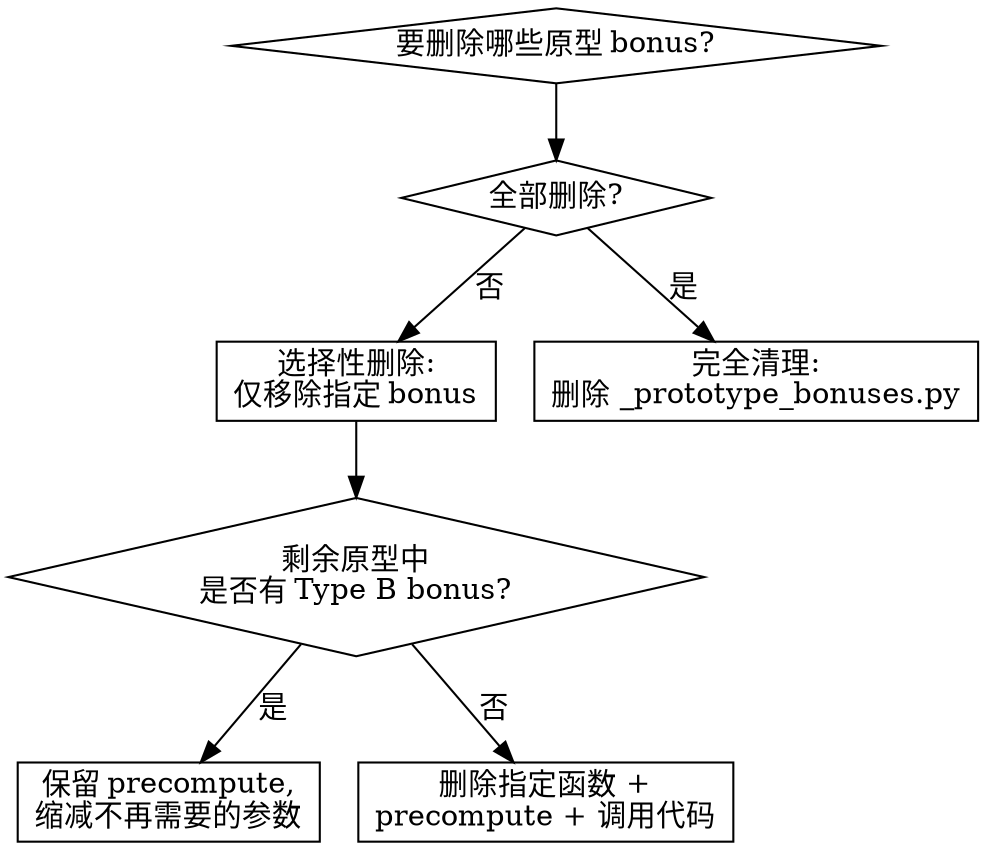

# Remove Prototype Bonus

## Overview

从分析管道中移除未通过统计验证的实验性 bonus 因子。核心原则：**精确逆操作 `prototype-bonus-analysis` 的每一步，不留残留代码**。

**配套 skill**：`prototype-bonus-analysis`（添加流程）

## 输入

要删除的 bonus 名称列表（如 `trend_level`, `candle_level`），以及删除原因：
- **验证失败**：Spearman r 不显著、level 无单调性、交互效应差
- **已正式实现**：bonus 已通过验证并接入 BreakoutScorer，原型代码不再需要

## 删除前检查

确认 Git 工作区状态，便于误操作时回滚：
```bash
git status  # 确认无未提交更改
```

然后判断删除范围：



**判定 Type B 的方法**：在 breakout 循环中搜索剩余 bonus 是否引用 `aux`（预加载数据）：
```bash
# 删除目标 bonus 的代码后，是否还有使用 aux/stock_data 的地方
grep -n "aux\.get\|stock_data\.get" bonus_combination_analysis.py
```

## 删除流程

按添加的**逆序**执行，共 3 个文件 4 个步骤：

### Step 1: 从分析框架注销

修改 `scripts/analysis/_analysis_functions.py`：

- 从 `BONUS_COLS` 列表中删除对应条目（如 `'trend_level'`）
- 从 `BONUS_DISPLAY` 字典中删除对应条目（如 `'trend_level': 'Trend'`）

### Step 2: 从 build_dataframe() 移除

修改 `scripts/analysis/bonus_combination_analysis.py` 的 `build_dataframe()` 函数，按以下顺序清理：

1. **rows.append({...})** 中删除对应列（如 `"trend_level": trend_level,`）
2. **breakout 循环中**删除 level 计算代码（如 `trend_level = calc_trend_level(...)`）
3. **precompute 相关代码**：
   - 如果**无剩余 Type B bonus**：删除 `stock_data = precompute_stock_data(...)` 调用及循环中的 `aux = stock_data.get(...)` 行
   - 如果**仍有 Type B bonus**：保留 precompute 调用，但缩减不再需要的参数（见下方"参数缩减"）
4. **文件头部**删除不再需要的 import

**参数缩减**（仅当保留 precompute 时）：
```bash
# 检查剩余 bonus 使用了哪些 MA 周期
grep -o "aux\.get('ma_[0-9]*')" bonus_combination_analysis.py | sort -u
# 检查是否还使用 OHLC 数据
grep "aux\.get('open\|high\|low\|close')" bonus_combination_analysis.py
```
根据结果调整 `precompute_stock_data(data, need_ohlc=..., ma_periods=...)` 的参数，移除不再需要的字段。

### Step 3: 清理 _prototype_bonuses.py

`scripts/analysis/_prototype_bonuses.py` 的处理取决于剩余内容：

| 情况 | 操作 |
|------|------|
| 所有原型 bonus 都被删除 | **删除整个文件** |
| 仅删除部分 bonus | 删除对应的 `calc_xxx_level()` 函数 |
| 删除后无剩余 Type B bonus | 同时删除 `precompute_stock_data()` 函数 |
| 删除后仍有 Type B bonus | 保留 `precompute_stock_data()` |

### Step 4: 重新生成报告

重跑脚本确保 CSV 和报告不含已删除 bonus 的残留列：
```bash
uv run python scripts/analysis/bonus_combination_analysis.py
```

旧报告（`docs/statistics/bonus_combination_*.md`）不会自动删除，按需手动清理。

## 清理检查清单

删除完成后逐项验证：

- [ ] `_analysis_functions.py` 的 `BONUS_COLS` 中不含已删除的 bonus
- [ ] `_analysis_functions.py` 的 `BONUS_DISPLAY` 中不含已删除的 bonus
- [ ] `bonus_combination_analysis.py` 中无已删除 bonus 的 import
- [ ] `bonus_combination_analysis.py` 中无已删除 bonus 的 level 计算代码
- [ ] `bonus_combination_analysis.py` 的 `rows.append({})` 中无已删除的列
- [ ] 如 precompute 不再需要：无 `precompute_stock_data` 调用和 `aux` 引用
- [ ] 如 precompute 保留：参数已缩减（无冗余 MA 周期或 OHLC）
- [ ] `_prototype_bonuses.py` 已删除对应函数（或整个文件已删除）
- [ ] 脚本可正常运行：`uv run python scripts/analysis/bonus_combination_analysis.py`

## 常见错误

| 错误 | 正确做法 |
|------|---------|
| 只删了 `BONUS_COLS` 忘删计算代码 | 按 4 步清单逐项清理，最后运行脚本验证 |
| 删了 precompute 但其他原型还在用 | 删前用 grep 检查 `aux.get` / `stock_data.get` 的使用处 |
| 删了函数但 import 还在 | Python 启动就会报 ImportError，必须同步清理 import |
| 删了所有函数但保留空的 `_prototype_bonuses.py` | 文件为空则直接删除，不留空文件 |
| 手动删 CSV 列而不重跑脚本 | 重跑脚本自动生成干净 CSV，不要手动编辑数据文件 |
| 删完后 precompute 仍计算无用字段 | 用 grep 检查剩余 `aux.get` 使用，缩减 `need_ohlc` / `ma_periods` |
