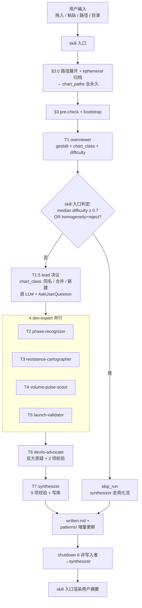

# analyze-stock-charts skill 逻辑解析（v2.3）

> 本文档面向**人类读者**，解释 skill 的工作原理、设计权衡、使用方式。
> Skill 本身的权威定义见 `.claude/skills/analyze-stock-charts/{SKILL.md, prompts/, references/}`，本文档**不是** AI 上下文（AI 上下文在 `.claude/docs/`，由 update-ai-context skill 维护）。

---

## 1. 一句话定位

**用户拖入 3-7 张同形态类别的"上涨前走势"K 线图，skill 启动一个 7 人 agent team，并行从 4 个维度做 cross-image 对比，反方质疑后由 synthesizer 收敛入库；产出"本次独立报告 + 跨会话规律库的增量更新"。**

Skill 完全 LLM-only：不调用 Python、不查股票 API，全部依赖 VLM 看图 + 跟结构化 yaml 规则。

---

## 2. 何时调用 / 不调用

| 场景 | 触发？ |
|---|---|
| 拖入 3-7 张同形态类 K 线图 + "找规律 / 蓄势分析 / 突破前共性" | ✅ 触发 |
| 显式 `/analyze-stock-charts` | ✅ 触发 |
| < 3 张（cross-image 对比需要） | ❌ 不触发 |
| ≥ 10 张（容量上限） | ❌ 引导分批 |
| 单图临时看盘 / 已涨已破的盘后复盘 / 索取买卖建议 | ❌ 不触发 |
| 重复同一 batch（distinct_batches 累积要求独立证据） | ❌ 提示 user 换 batch |

---

## 3. 架构总览

### 3.1 团队构成（7 teammate + 1 lead）

```
team-lead（= skill 调用方 Claude 自身，不是独立 agent）
├─ overviewer            T1: gestalt 第一印象 + chart_class 自动命名 + difficulty 评分
├─ phase-recognizer      T2: 价格结构 + 时间 + 行业（structure_phase）
├─ resistance-cartographer T3: 阻力支撑（pricing_terrain）
├─ volume-pulse-scout    T4: 量价配合 + 波动 + 异常（volume_pulse）
├─ launch-validator      T5: 动量结构 + BO 序列拓扑（momentum_validate）
├─ devils-advocate       T6: 反方质疑 + 2 项写库前校验
└─ synthesizer           T7: 整合 + 唯一写入者
```

> "lead"不是另一个 agent，是 skill 入口的执行者本身。所有 prompt 中"通知 team-lead"的目标是**调用 Claude 实例**。

### 3.2 流程图



### 3.3 与 v1.x / v2.1 / v2.2 的关键差异（v2.3 状态）

| 维度 | v1.x（已废弃） | v2.1 | v2.2 | v2.3（当前） |
|---|---|---|---|---|
| **phase-recognizer 角色** | gatekeeper：通过 `go/no-go` 决定下游是否运行 | peer dim-expert | 同 v2.1 | 同 v2.1 |
| **task DAG** | T1 → T2 → (T3 ‖ T4 ‖ T5) → T6 → T7 | T1 → (T2 ‖ T3 ‖ T4 ‖ T5) → T6 → T7 | T1 → **T1.5 lead 决议** → (T2 ‖ T3 ‖ T4 ‖ T5) → T6 → T7（T1.5 不进 TaskCreate） | 同 v2.2 |
| **跨 group 多样性** | 硬约束：reject | 软分层：confidence_cap | 同 v2.1 | 同 v2.1 |
| **chart_class 决议** | synthesizer 在 T7 自动判同义（LLM 语义聚类）；新 class 写 `## proposed classes` 等 user 事后决议；patterns 暂存 `_pending/<batch_id>/` | 同 v1.x（synthesizer 自动 + alias） | **lead 在 T1.5 协调 user 决议**（同名命中直接合并 / LLM 推荐合并候选弹 AskUserQuestion / 无候选直接新建）。alias / proposed classes / _pending 全部消除 | 同 v2.2 |
| **设计约束** | 隐含 LLM-only | §0.2 显式 L1/L2/L3 层级 | 同 v2.1 | 同 v2.1 |
| **状态机** | 不适用 | hypothesis / partially-validated / validated / disputed / refuted（5 态） | 同 v2.1 | **3 态**（hypothesis / partially-validated / validated）；移除 disputed / refuted 旁路 |
| **反例机制** | 不适用 | dim-expert 必填 counter_example + counter_search_path；advocate 5 项校验（含 counter_example 质量 / chart_eight_self_check）；disputed / refuted 状态机 | 同 v2.1 | **全部移除**（counter_example / chart_eight / figure_exceptions / per_batch_coverage）；advocate 精简为 2 项强制校验 |

---

## 4. 数据流细节

### 4.1 输入预检（skill 入口）

按顺序判定，任一失败即拒绝：
1. `len(chart_paths)` 在 [3, 9] 内
2. 每张文件存在 + 是图片
3. `library_root` 可写（不存在则触发 bootstrap：建目录 + 写空 schema_version / chart_classes / dimensions_link）

### 4.2 skip 判定（v2.1 新增 §3.3）

T1 (overviewer) 完成后、spawn T2-T5 之前，skill 入口读 `findings.md ## 1.gestalt`：

```python
if median([c.difficulty for c in chart_phases]) >= 0.7:
    skip_run = True; reason = "median difficulty too high"
elif batch.batch_homogeneity.homogeneity_decision == "reject":
    skip_run = True; reason = "class 混杂度过高"
else:
    spawn T2/T3/T4/T5 并行
```

skip_run=True 时，synthesizer 走简化流，写 `output_kind: skip_run` 到 `written.md`。

### 4.3 chart_class 决议（v2.2 新增 §5.2bis）— lead 内部步骤

skip 判定通过后、spawn T2-T5 之前，skill 入口（lead）执行 chart_class 决议（**不进 TaskCreate**）：

1. 读 `findings.md ## 1.gestalt` 取 overviewer 给的 `dominant_chart_class`
2. 读 `_meta/chart_classes.md ## active classes` 取已有 class 列表
3. 三分支判定：
   - **A 同名命中** → text 通知 user "类已存在，将合并"，self-execute
   - **B 有合并候选**（LLM 调用找到 sim ≥ 0.5）→ AskUserQuestion 弹选项（"新建" / "合并入 X"），含 LLM 给的 rationale + 差异说明 + 推荐
   - **C 无候选**（库为空 / LLM 找不到）→ text 通知 user "未找到合并候选，将新建"，self-execute
4. 写决议日志到 `findings.md ## 1.5.class_decision`，含 `decision_branch / final_chart_class / user_choice / llm_candidate`
5. 持久化到 `_meta/chart_classes.md`：新建 → 追加到 `## active classes`；合并/同名 → 仅更新 `last_updated`；任何分支都追加 1 行到 `## decision history`
6. spawn T2-T5 时把 `final_chart_class` + `class_decision_branch` + `history_baseline`（合并入既有 class 时含历史 patterns frontmatter）注入元信息段

**rename 承载**：B-new 分支 user 可在 AskUserQuestion 回复中加 "rename: <new_name>" 指示 lead 改名。单段 prompt（禁 2 段式）。

### 4.4 4 dim-expert 并行执行（peer 化）

每个 dim-expert 接收 spawn prompt（角色 prompt + run 元信息），分别写入 `findings.md` 的 `## E1` ~ `## E4` 段。每个 finding 是 yaml block，必填字段：
- `perspectives_used`：≥ 2（多视角组合）
- `formalization.pseudocode`：≥ 1 个可量化锚点
- `figure_supports`：figure-level evidence（v2.3 移除 figure_exceptions / per_batch_coverage）
- `cross_image_observation`：跨图共性描述

> **专长不是边界**：每个 dim-expert 有 merge_group（A+D+E+I / B+F / C+H / G），但只是 checklist 提示，不限制发现范围。任何 dim-expert 看到任何视角的现象都该报告。

### 4.5 反方质疑（T6 devils-advocate）

advocate 有两职责：
- **职责 A**：对每条候选 finding + 每条历史 pattern 提反例评估，写 `## advocate` 段的 refute_notes
- **职责 B**：写库前 2 项强制校验（v2.3 精简，原 5 项中 3 项被论证为伪校验）
  1. `perspectives_diversity`：perspectives_used ≥ 2
  2. `clarity_threshold`：formalization.pseudocode 非空 + ≥ 1 可量化锚点

### 4.6 整合写库（T7 synthesizer）

synthesizer 是**唯一**对 `patterns/` `conflicts/` `_meta/` 有写权限的角色，过 9 项校验后才能写：

```
findings.md → 9 项校验 → cross_group_diversity 字段 → confidence_cap 决定
                                                    → patterns/<class>/R-XXXX.md
                                                    → mining_mode.ready_for_mining
                                                    → state machine 晋级判定
                                                    → 写 written.md
```

**confidence_cap 关键逻辑（v2.1）**：
- `cross_group_diversity == true` → 不设 cap，state machine 可一路升至 validated
- `cross_group_diversity == false` → `confidence_cap: medium`，state machine 上限 partially-validated；即使 distinct_batches ≥ 3 + total_supports ≥ 9 也不晋级
- `mining_mode.ready_for_mining`：仅当 `state == validated AND cross_group_diversity == true` 为 true，否则 false

### 4.7 状态机（pattern 生命周期）

```
hypothesis → partially-validated → validated（user gatekeeper）
                                 ↓
                      （confidence_cap=medium 时此跃迁不适用）
                                 ↓
                          停留在 partially-validated

v2.3：移除 disputed / refuted 旁路状态。_retired/ 仅 user 主动归档。
```

晋级 validated 是 user gatekeeper hook：synthesizer 只把候选写到 `_meta/proposals.md ## validation_ready`，由 user review 后决议。

---

## 5. 输出位置

```
experiments/analyze_stock_charts/                          ← v2.2 起路径（旧版在 docs/charts_analysis/）；.gitignore（user 本地累积）
├── stock_pattern_library/                     主库（跨会话累积）
│   ├── _meta/
│   │   ├── schema_version.md                  当前 schema（v2.3）
│   │   ├── chart_classes.md                   ## active classes（class 注册表）+ ## decision history（每次 T1.5 决议追加 1 行；v2.2 起无 aliases / proposed classes 段）
│   │   ├── charts_index.md                    每张图被哪些 pattern 引用
│   │   ├── dimensions_link.md                 视角到 merge_group 的映射
│   │   ├── proposals.md                       validation_ready / 待 user 决议
│   │   └── run_history.md                     全 run 时间线
│   ├── patterns/<final_chart_class>/R-XXXX-<name>.md   每条规律一个文件（frontmatter + 描述）；class 名由 lead T1.5 决议
│   ├── patterns/_retired/                     user 主动归档（v2.3 移除 refuted / disputed 自动降级）
│   └── conflicts/<id>.md                      规律之间冲突
│
├── stock_pattern_runs/<run_id>/               每次 run 独立目录（输出）
│   ├── input.md                               本次 run 输入快照
│   ├── findings.md                            ## 1.gestalt + ## 1.5.class_decision（v2.2 新增）+ ## E1-E4 + ## advocate
│   ├── proposals.md                           synthesizer 候选 + advocate refute
│   ├── crosscheck.md                          9 项校验结果
│   └── written.md                             写库结果（output_kind / 入库 R 列表）
│
└── images_cache/<run_id>/                     ← ephemeral 输入自动归档（拖入 / 粘贴自 clipboard）
    ├── 1.png                                   归档自 ~/.claude/image-cache/.../1.png
    └── ...                                     与 runs/<run_id>/ 共享 run_id
```

`output_kind` 4 种：`validated_added / no_new_pattern / chart_unexplained / skip_run`（v2.3 移除 `library_doubt`）。

---

## 6. 使用方式

### 6.1 触发示例 — 4 种输入模式

skill 入口在 §3.0 路径展开 + 归档阶段统一处理 4 种输入，归档与否取决于路径是否 ephemeral：

| 模式 | 用法 | 归档行为 |
|---|---|---|
| **1. 拖入 / `@` 引用** | `@1.png @2.png @3.png 请帮我分析上涨前共性` | ephemeral 路径（如 `~/.claude/image-cache/.../1.png`）→ **复制到 `images_cache/<run_id>/`** |
| **2. 粘贴 (clipboard)** | 在 prompt 中按 Ctrl+V 粘贴截图 + 文字"分析" | clipboard 临时路径 → **同样归档到 `images_cache/<run_id>/`** |
| **3. 路径列表** | `/home/yu/a.png /home/yu/b.png 跑 sonnet` | 持久路径 → 原地引用，不归档 |
| **4. 目录路径** | `/home/yu/charts/long_base_oct2024/ 用 sonnet 跑 analyze-stock-charts 分析` | 顶层扫描 PNG/JPG/JPEG，原地引用，不归档 |

**混合模式**（dir + 临时补图）：
```
/home/yu/charts/long_base/ + @extra1.png @extra2.png 跑分析
```
dir 内文件原地引用 + 拖入图归档到 `images_cache/<run_id>/`。两份合并去重为一个 batch。

**为什么自动归档 ephemeral 输入**：
- `~/.claude/image-cache/<session_uuid>/` 在 session 结束 / claude 重启后会被清理
- 如果只引用原路径，下次回看 `runs/<run_id>/findings.md` 时图已丢失，无法 audit / 复现
- 自动归档保证：**任何 run 的图都跟 run 报告永久共存**（与 runs/<run_id>/ 用同一 run_id），跨 session 可回看
- 持久路径（模式 3/4）已经稳定，重复归档反而冗余

**run_id 命名**：`{YYYY-MM-DD_HHMMSS}_{chartset_hash}`，hash 是 sorted file names 的 sha1 前 5 位 hex。同一批图二次跑能复用 hash 但时间戳变。

### 6.2 model_tier 选择（成本递减）

| tier | 配置 | 单 batch 成本（5 张图） | 适用 |
|---|---|---|---|
| `opus`（默认） | 全 7 teammate 用 opus-4-7 | $10-25 | 首次发现规律 / 关键 batch / 库扩张期 |
| `mixed` | 决策层 opus + 分析层 sonnet | $5-12 | 常规 batch（决策与成本平衡） |
| `sonnet` | 全 sonnet-4-6 | $2-5 | sandbox 测试 / 大批量重复扫描 |

> **注意**：sonnet 模式下 chart_class 自动命名能力下降；synthesizer 的 LLM 语义聚类 dim_sim 准确度下降。user 应在 review 时人工 verify chart_class 归属。

### 6.3 触发关键词

中文：分析 K 线 / 上涨前规律 / 突破前规律 / 蓄势分析 / 潜伏放量 / accumulation
英文：analyze stock chart / pre-rally pattern / pre-breakout pattern / accumulation pattern study

---

## 7. 设计权衡（"为什么是这样"）

### 7.1 为什么 4 dim-expert 而不是按图切

01 推荐按维度切（每 expert × 全部图），02 推荐按图切（每图 × 全部维度）。架构选**按维度切**因为：
- 同一专家看 N 张图能做 cross-image 对比（"图 1, 3, 5 都显示..."），这是 pattern 发现的本质
- 按图切会让每人只看 1-2 张，幸存者偏差不可控（9 张全是已涨样本）

### 7.2 为什么 phase-recognizer 不再 gating（v2.1）

v1.x 让 phase-recognizer 用 `phase != range` 一刀切跳过下游。bug：5 张全 V 反转图会触发 `phase != range` → skill 拒绝分析 V 反转 batch。但 V 反转是合法 chart_class，user 想研究就该让它跑。

v2.1 修复：phase-recognizer 退化为 peer dim-expert，skip 判定上移到 skill 入口，依据是 overviewer 的 `difficulty` 和 `homogeneity_decision`（与 phase 无关）。

### 7.3 为什么 single_group 软化（v2.1）

v1.x 要求 perspectives_used 必须跨 ≥ 2 merge_group，否则 hard reject。smoke test 数据：12 候选规律中 7 条因 single_group_combo 被 reject，但只有 ~1 条是真伪多视角，其余 ~3 条 trigger 锚点独立但 group 同。**精度仅 1/7，不到合格硬约束应有的 80%**。

v2.1 修复：cross_group_diversity 改为 confidence cap：
- single-group finding 准入主库，但 `confidence_cap: medium`（state machine 上限 partially-validated）
- mining 仅取 validated AND cross_group=true 的规律，所以 single-group 不污染下游因子化
- user 可在 review 时手动 retire 明显伪多视角

预期入库率从 17% (2/12) 提升到 ~50% (6/12)。

### 7.4 为什么 chart_class 用户决议（v2.2）

v2.0 / v2.1 让 synthesizer 在 T7 用 LLM 自动判 chart_class 同义；新 class 写到 `## proposed classes` 段、patterns 暂存 `_pending/<batch_id>/` 等 user **事后**决议。3 个问题：

1. **dim-expert baseline 时机错位**：dim-expert 输入依赖 `patterns/<chart_class>/*.md` 历史 baseline。如果 chart_class 在 T7 才决议（同义合并 / 新建），dim-expert (T2-T5) 跑时只能用 dominant_class 找 baseline，找不到 → 重复发现历史已知规律 / 跨 batch 累积失效
2. **alias 冗余**：alias 价值是性能 cache（避免重复 LLM 同义判断），随库扩大递减，但牺牲命名一致性
3. **`_pending/` 推迟决议**：user 拿到 skill 摘要后还要去整理 `_pending/<batch_id>/`，主目录碎片化

v2.2 修复：把 chart_class 决策权前移到 lead T1.5（T1 后、T2-T5 spawn 前），user 显式决议（同名直接合并 / 选合并入既有 class / 新建 + 可改名）。alias / proposed classes / _pending 全部消除。

收益：
- dim-expert 拿到正确 chart_class → 能查到正确历史 baseline → cross-batch evidence 累积有意义
- 主目录纯净（仅 active class 子目录 + _retired）
- audit 透明：每次 batch 的决议记录在 `## decision history` + `findings.md ## 1.5.class_decision`

### 7.5 为什么 LLM-only meta-rule（v2.1）

之前 single_group rule 修复曾提议方案 C 用 `decoupling_check` 确定性算法。但 skill 在 LLM-only 环境运行——synthesizer 没有 Bash/Python 执行权，所谓"确定性算法"实际是 LLM 跟一段结构化规则。这种 hidden assumption 让方案设计偏离实际能力。

v2.1 加 §0.2 显式 L1/L2/L3 层级，禁止 L3（真 Python 函数）。任何 fix 提议如包含 L3，必须在 design 阶段 reject 或降级到 L2。

### 7.6 为什么删除 counter_example 等"想象的反例"机制（v2.3）

v2.0/v2.1/v2.2 中，dim-expert finding 必填 counter_example（"想象 trigger 触发但不涨的样本形态"）+ counter_search_path（"如何去历史里找反例"）。advocate §5.B 5 项校验中 3 项（counter_example_quality / counter_search_path_executability / chart_eight_self_check）和状态机的 disputed / refuted 降级都依赖这套机制。

v2.3 整体移除，理由：
1. **想象的反例不能验证规律**：LLM 在只看 5 张已涨图的情况下"想"反例，等于自我审查（无独立信号）
2. **可证伪性检查空转**：LLM 总能编出反例描述，过滤效果近零
3. **chart_eight_self_check 误把非必要性当 bug**：skill 找的是充分非必要条件，"图 8 不满足 trigger 但仍涨"是预期，不是问题
4. **counterexamples ≥ 1 → disputed 是 dead code**：本 skill LLM-only / 仅看上涨图，"满足 trigger 不涨"的样本永远不在 user 输入中
5. **should_have_matched_but_failed ≥ 3 → refuted 与设计前提冲突**：漏掉上涨样本是"非必要"的预期表现，不是缺陷

防御链替代方案（基于真实观察 + 跨 batch 累积 + user gatekeeper）：
- figure_supports 主动声明 / cross_image_observation 跨图叙述（基于本 batch 真实图像）
- distinct_batches_supported ≥ 3（结构性硬约束）
- validated 由 user 周期性 review 决议（user gatekeeper）

详见 `docs/research/2026-05-07_skill_v2_3_remove_imagined_counter_example.md`。

---

## 8. 与项目其他模块的边界

| 模块 | 关系 |
|---|---|
| `BreakoutStrategy/factor_registry.py` | **完全解耦**。skill 不读 factor_registry、不校验 key 冲突、不输出 proposed_factors.yaml。formalization.pseudocode 用通用伪代码（如 `amplitude / atr_ratio / percentile`），不引用具体因子名 |
| `BreakoutStrategy/mining/` | 单向消费。mining 仅读 patterns 中 `mining_mode.ready_for_mining: true` 的规律（即 validated AND cross_group=true）。skill 不感知 mining 是否运行 |
| `add-new-factor` skill | 完全独立。如 user 看完一条 pattern 想落地为因子，由 user 独立调用 `add-new-factor`。skill 不调度它 |
| 其他 skill / agent team | skill 完全自治。run 内 7 teammate 用 SendMessage 互相通信；skill 入口（lead）只在 spawn / shutdown / 摘要时介入 |

---

## 9. 已知边界 / 未解决问题

- **跨 batch dedup**：skill 不做技术 fingerprint。user 自觉避免重复 batch（重复会假性增强 confidence —— distinct_batches_supported 累积要求独立证据，重跑同一 batch 是欺骗自己）
- **chart_class 决议**（v2.2 起）：lead 在 T1.5 调 LLM 给合并候选 + AskUserQuestion 让 user 决议。sonnet 模式下 LLM 候选检索 / overviewer chart_class 命名能力下降，user 应在弹窗时仔细 review LLM 推荐
- **medium-cap 池低质量**：v2.1 接受少量伪多视角进 medium 池，confidence_cap=medium 限制其最高 state 为 partially-validated + user retire 兜底；mining 不取（仅取 validated AND cross_group=true），无下游污染
- **状态机 user gatekeeper**：晋级 validated 不自动，靠 user 周期性 review proposals.md ## validation_ready 段。user 不 review 则 patterns 永远停在 partially-validated

---

## 10. 文档参考

| 文档 | 内容 |
|---|---|
| `.claude/skills/analyze-stock-charts/SKILL.md` | 触发条件 / 输入规范 / 流程定义（权威） |
| `.claude/skills/analyze-stock-charts/references/00_README.md` | 文件树 + pipeline 全景图 |
| `.claude/skills/analyze-stock-charts/references/01_analysis_dimensions.md` | 9 个分析视角 + 4 merge_group 切分 |
| `.claude/skills/analyze-stock-charts/references/02_memory_system.md` | 规律库 schema + IO 协议 + 状态机 |
| `.claude/skills/analyze-stock-charts/references/03_team_architecture.md` | 团队架构 / 协作流程 / 防偏差机制 |
| `.claude/skills/analyze-stock-charts/prompts/<role>.md` | 7 个 teammate 各自的 system prompt |
