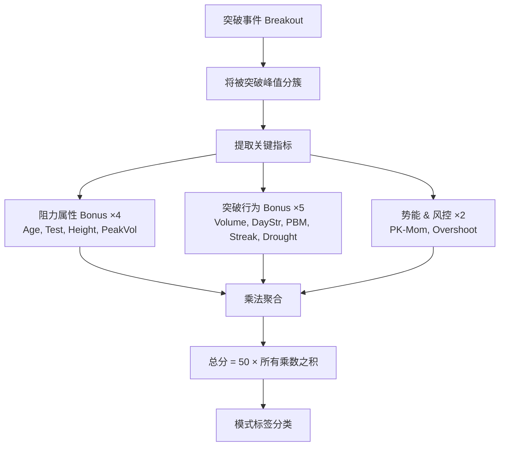

# Bonus 评分系统详解

> 本文档解释参数配置面板中每一种 Bonus 的含义、计算原理和调参思路。

## 概览

系统采用**乘法模型**对突破(breakout)质量进行评分：

```
总分 = 基准分(50) × bonus₁ × bonus₂ × ... × bonusₙ
```

每个 Bonus 是一个独立的乘数因子。值 > 1.0 表示加分，值 < 1.0 表示惩罚，值 = 1.0 表示不影响。这种乘法设计使得各因子相互独立、可单独开关，且天然支持"一票否决"（如 overshoot_penalty = 0.6 可以直接将分数大幅削减）。

完整公式：

```
总分 = BASE × age × test × height × peak_vol ×
       volume × day_str × pbm × streak × drought ×
       pk_mom × overshoot
```

---

## 评分流程图



---

## 第一组：阻力属性 Bonus（衡量被突破阻力位的质量）

这组 Bonus 回答的核心问题是：**被突破的阻力位有多"硬"？**阻力位越老、被测试越多次、位置越高、形成时成交量越大，说明它越重要，突破的含金量也越高。

### 1. Age Bonus（阻力年龄）

| 项目 | 说明 |
|------|------|
| **含义** | 最老被突破峰值距突破日的交易日数 |
| **单位** | 天 (d) |
| **原理** | 技术分析共识：远期阻力 > 近期阻力。一个存在了一年的阻力位被突破，比仅存在一周的阻力位被突破更有意义 |
| **当前配置** | ≥42天 → ×1.15, ≥63天 → ×1.30, ≥252天 → ×1.50 |
| **调参思路** | 阈值对应约 2个月/3个月/1年。如果觉得短期阻力也有价值，可以降低第一档阈值 |

### 2. Test Bonus（测试次数）

| 项目 | 说明 |
|------|------|
| **含义** | 同一阻力区域（簇）中峰值的数量 |
| **单位** | 次 (x) |
| **原理** | 多次测试 > 单次测试。价格多次触及同一区域又回落，说明该区域有大量挂单/供给，一旦突破意味着供给被彻底消化 |
| **当前配置** | ≥2次 → ×1.10, ≥3次 → ×1.25, ≥4次 → ×1.40 |
| **调参思路** | 第一档 2 次是最低门槛，4 次及以上已经是非常强的阻力区 |

### 3. Height Bonus（相对高度）

| 项目 | 说明 |
|------|------|
| **含义** | 被突破峰值相对于窗口低点的高度比例 |
| **单位** | 百分比 (%) |
| **原理** | 高位阻力 > 低位阻力。如果峰值远高于近期低点，说明突破发生在价格已经大幅攀升之后，阻力位的心理意义更大 |
| **当前配置** | **已禁用** (enabled: false)。默认阈值 ≥20% → ×1.10, ≥50% → ×1.20, ≥100% → ×1.40 |
| **调参思路** | 当前被禁用，可能是因为 Height 与其他指标存在一定冗余 |

### 4. Peak Volume Bonus（峰值放量）

| 项目 | 说明 |
|------|------|
| **含义** | 被突破峰值形成时的成交量放大倍数（相对均量） |
| **单位** | 倍 (x) |
| **原理** | 峰值形成时放量越大，说明该价位的卖盘/供给压力越重。突破这样的阻力位意味着更强的买方力量 |
| **当前配置** | ≥3.0倍 → ×1.10, ≥5.0倍 → ×1.20 |
| **调参思路** | 注意区分与 Volume Bonus 的差异：Peak Volume 看的是**阻力位形成时**的量，Volume 看的是**突破当天**的量 |

---

## 第二组：突破行为 Bonus（衡量突破动作本身的强度）

这组 Bonus 回答的核心问题是：**突破本身的动作够不够猛？**

### 5. Volume Bonus（突破放量）

| 项目 | 说明 |
|------|------|
| **含义** | 突破当天的成交量放大倍数（相对近期均量） |
| **单位** | 倍 (x) |
| **原理** | 放量突破 > 缩量突破。突破时成交量越大，说明市场参与者越多、共识越强，突破的可靠性越高 |
| **当前配置** | ≥5.0倍 → ×1.50, ≥10.0倍 → ×2.00 |
| **调参思路** | 当前配置的乘数相当激进（最高 ×2.0），适合对成交量非常重视的策略 |

### 6. Breakout Day Strength Bonus（突破日强度）

| 项目 | 说明 |
|------|------|
| **含义** | 取日内涨幅和跳空幅度的波动率标准化值中的**较大者** |
| **单位** | σ（日标准差倍数） |
| **公式** | `ratio = max(intraday_return / daily_vol, gap_up_pct / daily_vol)` |
| **原理** | 合并了日内涨幅(IDR)和跳空(Gap)两个维度，取较大者避免双重计分。无论是盘中拉升还是跳空高开，只要相对该股日常波动来说够大，就说明突破日当天动力强劲 |
| **当前配置** | ≥1.5σ → ×1.10, ≥2.5σ → ×1.20 |
| **调参思路** | 与 Volume Bonus 互补：Volume 看量，DayStr 看价。两者同时触发说明"量价齐升" |

### 7. PBM Bonus（突破前涨势 Pre-Breakout Momentum）

| 项目 | 说明 |
|------|------|
| **含义** | 突破前 5 根K线的涨势强度 |
| **单位** | 千分比 (‰) |
| **公式** | `PBM = (ΔP / P₀) × (ΔP / L) / N` |
| **原理** | 突破前如果价格已经有明确的上涨趋势（而不是横盘磨过去），说明买方力量在持续积累。PBM 综合考虑了涨幅、效率（位移/路径长度）和速度 |
| **当前配置** | ≥0.006 → ×1.15, ≥0.01 → ×1.30 |
| **公式解读** | ΔP = 价格位移，P₀ = 起点价格，L = 路径长度(所有日间波动绝对值之和)，N = K线数。ΔP/L 衡量上涨效率：若价格直线上涨，ΔP/L ≈ 1；若上蹿下跳，ΔP/L 趋近 0 |

### 8. Streak Bonus（连续突破）

| 项目 | 说明 |
|------|------|
| **含义** | 近期（streak_window 窗口内）发生的突破次数 |
| **单位** | 次 (bo) |
| **原理** | 连续突破意味着趋势正在加速，多个阻力位接连被击穿，强劲多头信号 |
| **当前配置** | ≥2次 → ×1.20, ≥4次 → ×1.40 |
| **调参思路** | streak_window（当前 10 个交易日）控制"连续"的时间范围。窗口越短要求越严格 |

### 9. Drought Bonus（久旱逢甘霖）

| 项目 | 说明 |
|------|------|
| **含义** | 距上一次突破的交易日间隔 |
| **单位** | 天 (d) |
| **原理** | Streak 的天然镜像——Streak 奖励密集突破，Drought 奖励稀缺突破。一只股票长时间无突破后突然产生突破，这种"沉寂后的觉醒"往往代表蓄势释放，积攒的能量一次性爆发 |
| **当前配置** | ≥60天 → ×1.20, ≥80天 → ×1.30, ≥120天 → ×1.50 |
| **特殊情况** | 首次突破（无历史记录）不触发，返回 ×1.00 |
| **调参思路** | 60天 ≈ 3个月，120天 ≈ 6个月。Streak 和 Drought 互斥（同一突破不可能既连续又沉寂），因此不会重复加分 |

---

## 第三组：势能与风控

### 10. PK-Momentum Bonus（Peak 凹陷深度）

| 项目 | 说明 |
|------|------|
| **含义** | 近期 peak（阻力位/凸点）下方的回调深度 |
| **单位** | 无量纲 |
| **公式** | `pk_momentum = 1 + log(1 + D_atr)` |
| **原理** | 如果价格从近期 peak 回调后又拉回来突破，回调越深（D_atr 以 ATR 为单位衡量），说明买方力量越强。这个指标捕捉的是"V 型反转后突破"的形态 |
| **当前配置** | ≥1.2 → ×1.20, ≥1.5 → ×1.50 |
| **数值解读** | pk_momentum=0 → 无近期peak（超出时间窗口）；1.0 → 有peak无凹陷；1.5 → 约0.65 ATR凹陷（中等回调）；2.0 → 约1.7 ATR凹陷（深度回调） |
| **调参思路** | ×1.50 的乘数很高，说明系统非常重视"深V反弹后突破"这种形态 |

### 11. Overshoot Penalty（超涨惩罚）

| 项目 | 说明 |
|------|------|
| **含义** | 突破前 5 日累计涨幅 ÷ 5日波动率 |
| **单位** | σ（5日标准差倍数） |
| **公式** | `ratio = gain_5d / (annual_vol / √50.4)` |
| **原理** | 这是唯一的**惩罚项**（乘数 < 1.0）。如果 5 天内涨幅相对波动率过大（≥4σ 或 ≥5σ），说明短期已经"超买"，突破可能是假突破或即将回调 |
| **当前配置** | ≥4.0σ → ×0.80, ≥5.0σ → ×0.60 |
| **调参思路** | 这是风控利器。4σ 以上的 5 日涨幅在统计上非常罕见，打折合理 |

### 12. ATR-Height Bonus（ATR 标准化高度，可选）

| 项目 | 说明 |
|------|------|
| **含义** | 突破幅度 ÷ ATR(14) |(close - peak_price) / ATR
| **单位** | 倍 (x) |
| **原理** | 用 ATR 标准化后的突破幅度。在低波动率环境下，同样绝对幅度的突破更有意义 |
| **当前配置** | 默认 ≥1.5 → ×1.10, ≥2.5 → ×1.20（需开启 `use_atr_normalization` 才生效） |
| **调参思路** | 这是可选功能，适合想要在评分中加入"突破幅度"维度的用户 |

---

## 模式标签（Pattern Labels）

评分完成后，系统根据主导 Bonus 自动为突破分配一个**模式标签**，用于快速识别突破的类型。标签不影响分数，仅供下游策略和 UI 展示使用。

分类按优先级从高到低执行，命中第一个匹配的模式即返回：

### 混合模式（两个维度同时满足）

| 标签 | 缩写 | 触发条件 | 含义 |
|------|------|----------|------|
| `deep_rebound` | D.REB | PK-Mom ≥ L1 且 Age ≥ L2 | 深蹲远射：从远期阻力位深度回调后反弹突破 |
| `power_historical` | P.HIST | Volume ≥ L1 且 Age ≥ L2 | 放量历史突破：大量能配合远期阻力位突破 |
| `grind_through` | GRIND | Age ≥ L2 且 Tests ≥ L1 | 磨穿防线：长期多次测试后终于突破 |

### 单一模式（单维度主导）

| 标签 | 缩写 | 触发条件 | 含义 |
|------|------|----------|------|
| `momentum` | MOM | PK-Mom ≥ L1 | 势能突破：V 型反弹后突破 |
| `historical` | HIST | Age ≥ L2 | 历史阻力突破：突破远期阻力位 |
| `volume_surge` | VOL | Volume ≥ L1 | 放量爆发：成交量驱动的突破 |
| `dense_test` | TEST | Tests ≥ L2 | 密集测试：多次测试后突破 |
| `trend_continuation` | TREND | Streak ≥ L1 | 趋势延续：连续突破 |
| `dormant_breakout` | DORMT | Drought ≥ L1 | 沉寂突破：久旱逢甘霖，长期无突破后觉醒 |

### 兜底

| 标签 | 缩写 | 触发条件 | 含义 |
|------|------|----------|------|
| `basic` | — | 无特殊 Bonus 触发 | 基础突破 |

> **L1/L2** 指 Bonus 的触发级别（level）。L1 = 达到第一档阈值，L2 = 达到第二档阈值。

---

## 参数配置面板结构

在 UI 的参数编辑器中，每个 Bonus 都有统一的三部分配置：

```
┌─────────────────────────────────────┐
│ age_bonus                      [✓]  │  ← enabled 开关
│   thresholds: [42, 63, 252]         │  ← 触发阈值（递增）
│   values:     [1.15, 1.30, 1.50]    │  ← 对应乘数（递增）
└─────────────────────────────────────┘
```

- **enabled**: 开关。关闭后该 Bonus 永远返回 1.0（不影响总分）
- **thresholds**: 阈值列表，必须递增。系统从低到高依次检查，取最后一个满足的档位
- **values**: 乘数列表，与 thresholds 一一对应。对于正向 Bonus 应 > 1.0，对于 Penalty 应 < 1.0

**阈值匹配逻辑**：

```python
# 从低到高扫描，取最后一个 >= threshold 的级别
for i, threshold in enumerate(thresholds):
    if value >= threshold:
        bonus = values[i]    # 更新为更高级别
    else:
        break                # 后续阈值更高，不可能满足
```

---

## 分数示例

假设一个突破事件的各项指标为：

| 指标 | 原始值 | 触发档位 | 乘数 |
|------|--------|---------|------|
| Age | 130天 | 2档 (≥63) | ×1.30 |
| Tests | 3次 | 2档 (≥3) | ×1.25 |
| Height | 8% | 已禁用 | ×1.00 |
| PeakVol | 1.5倍 | 未触发 | ×1.00 |
| Volume | 6.2倍 | 1档 (≥5) | ×1.50 |
| DayStr | 1.8σ | 1档 (≥1.5) | ×1.10 |
| PBM | 7.2‰ | 1档 (≥6) | ×1.15 |
| Streak | 1次 | 未触发 | ×1.00 |
| Drought | 95天 | 2档 (≥80) | ×1.30 |
| PK-Mom | 1.7 | 2档 (≥1.5) | ×1.50 |
| Overshoot | 2.1σ | 未触发 | ×1.00 |

```
总分 = 50 × 1.30 × 1.25 × 1.50 × 1.10 × 1.15 × 1.30 × 1.50
     = 50 × 5.26
     = 263.0
```

模式标签：`deep_rebound`（PK-Mom ≥ L2 且 Age ≥ L2）

这是一个极高质量的突破信号——长期阻力位、深度回调后反弹、放量突破、久旱逢甘霖，多个维度共振。
