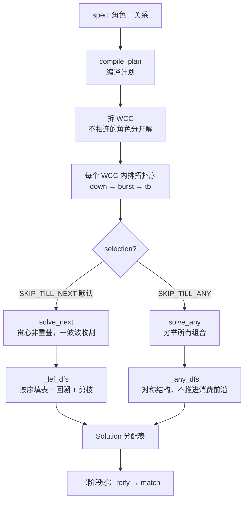
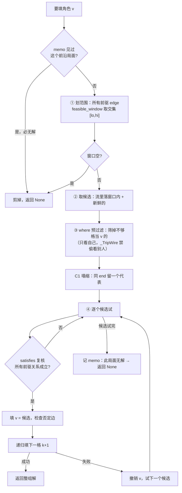

# path2 求解器 `_solve.py` 逻辑讲解

> 面向人类阅读的教学型讲解，对照 `path2/dag/_solve.py` 当前代码状态。
> 读完你能回答：solve 在解什么、怎么一步步解、靠什么加速、入口在哪、怎么对照代码看。
> 贯穿例子：bo 串 pattern 简化成三个角色 **down（下跌段）→ burst（突破串）→ tb（回踩）**，关系是「下跌结束后 1~20 根 K 线内起一波突破」「突破之后回踩」。

---

## 1. 概览：solve 在系统里的位置

path2 一次分析 `analyze(spec, df)` 分四阶段（见 `engine.py`）：

```
① run_streams   每个角色跑 detector，得到候选 event 池
② compile_plan  把 pattern 编译成求解计划（本文重点的前半）
③ solve         在候选池里挑出满足所有关系的组合（本文重点的后半）
④ reify         把解翻译成完整 match 对象
```

`_solve.py` 负责 **② 编译 + ③ 求解**。

**它解的问题（一句话）**：pattern 声明了几个**角色**（down/burst/tb）和它们之间该满足的**关系**（edge）；每个角色背后有一**池候选 event**。

> **solve = 给每个角色从它的候选池里挑一个 event，挑出一组让所有关系都成立的组合。**

这是经典的「约束满足搜索」。朴素穷举会组合爆炸，所以 path2 用的是**带剪枝的回溯搜索**。

**输入 / 输出**：

| | 内容 | 代码 |
|---|---|---|
| 输入 | `plan`（编译后的计划）、`streams`（每角色候选池 `{node_id: [Event]}`）、`ctx`（params 等） | — |
| 输出 | `List[Solution]`，每个 = `assign`（角色→选中 event）+ `chosen_idx`（流内下标，reify 用） | `Solution` `:59` |

---

## 2. 一图看全貌



---

## 3. 宏观：四个直觉

### 直觉 1 · 约束满足搜索
每个角色一个"待填的格子"，edge 是格子之间的约束。solve 要填满所有格子、且不违反任何约束。

### 直觉 2 · 先把不相干的角色拆开（WCC 分解）
`compile_plan`（`:65`）第一件事是看哪些角色被 edge 连在一起。**互相没有 edge 连着的角色彼此不约束，分开各解各的**——这些连通块叫 **WCC（弱连通分量，`wccs()`）**。组合空间从"相乘"降成"相加"。每个 WCC 编译成一个 `WccPlan`（`:50`），独立求解。
（我们的例子 down/burst/tb 全连着，是一个 WCC。）

### 直觉 3 · 在 WCC 里按顺序"填表"，填不下去就退回（拓扑序 DFS + 回溯）
`compile_plan` 给每个 WCC 排好**拓扑序**（`topo_order`）：先填没有前驱的角色，再填依赖它的。

```
填表顺序：  down  →  burst  →  tb
            (起点)   (依赖down) (依赖burst)
```

核心规则：

> **每填一格，前面已填的格子通过 edge 给当前格"划定范围"，填完再"复核关系"；当前格怎么填都不行，就退回上一格换一个填。**

```
① 填 down  ：从 down 候选池挑第一个下跌段
② 填 burst ：down 通过边 "down→burst (1~20 bar)" 把 burst 限制在
             【down 结束后 1~20 根 K 线】窗口里 → 窗口内挑一个
③ 填 tb    ：burst 把 tb 限制在【burst 之后】→ 挑一个
④ 三格填满 = 一个完整匹配 ✓

   ③ tb 怎么挑都不行 → 退回 ②，burst 换一个
   ② burst 也试完了  → 退回 ①，down 换一个
```

这个"填→卡住→退回换"就是**深度优先搜索 + 回溯**，即 `_lef_dfs`（`:177`）递归自己、失败 `del assign[v]` 撤销。

### 直觉 4 · 能不试就不试（剪枝）
纯回溯会重复走死路，path2 用三招砍掉（详见第 5 节）。

---

## 4. 微观：把"填一格"放慢镜头（`_lef_dfs` 一轮）

轮到填角色 `v`（比如 burst），前面 down 已填好，引擎依次做：



逐步对照代码：

**① 划范围（可行窗口）`:191-194`**
看 v 的所有已填前驱，每条 edge 的 `feasible_window` 说"v 得落在这区间"，**取交集** `[lo, hi]`。
例：`down→burst (1~20 bar)` → burst 起点必须在 down 结束后 1~20 根内。交集空（`lo > hi`）→ 此路不通。

**② 取候选 `:221`**
`cands = 流里下标 ≥ ptr[v]（新鲜后缀）且 start 落 [lo,hi] 内` 的 event，按 `(start, end, 下标)` 排序。窗口已把"扫全流"缩成"扫一小段"。

**③ 筛资格（where 预过滤）`:224-226`**
用 v 的 **where**（一元条件，如"burst 的 distinct_pk ≥ 3"）扔掉不够格的候选。
🔒 **where 只许看 event 自己、不许偷看别的角色**：预过滤时 `ctx.bound` 被换成哨兵 `_TripWire`（`:26`），谁读了别人的绑定就当场 `RuntimeError`，绝不静默漏匹配。

**④ 逐个试 + 复核关系（satisfies）`:231-239`**
窗口只是**粗筛**，真正判定靠 `edge.satisfies`。对每个活着的候选，把所有前驱 edge 的关系 + `strict_clear` 精确验一遍；都过 → 填 v → 查否定边 `negation_clear` → **递归填下一格**（`:244`）。成功上返；失败撤销、试下一个。

候选全试完仍无解 → 把当前前沿签名记进 `memo`（`:251`）→ 返回 None（往上回溯）。

---

## 5. 三招剪枝（solve 快的关键）

| 剪枝 | 干什么 | 代码 |
|---|---|---|
| **可行窗口** | edge 先把候选缩进小窗口，不扫全流 | `feasible_window` `:193` |
| **前沿割 memo（INV-C）** | 记住"哪些局面已证明无解"，同局面不走第二遍 | `frontier_cut_signature` `:185` + `memo` |
| **C1 等-end 塌缩** | 同结束位置的候选只留一个"最宽松"代表 | `collapse_equal_end_keep_keymin` `:229` |

**memo 最微妙**：它把"已填部分对后面的影响"压成一个**签名**——同签名 = 对剩下的格子完全等价。某签名一旦被证明走不通就记下，下次撞见**直接判死、不再展开**。

> ⚠ **剪枝必须"健全"**：被记成死路的，必须**确实**是死路，否则会误砍掉正确答案（漏匹配）。所以签名只能由 edge 用 `signature_fields` **自描述**该读哪些字段（在 `_signature.py`）；派生属性只能进 ③ where 预过滤、**永不**进窗口/签名。

**一个边语义特例**：`EqualsEdge` 把位置钉死、破坏 C1 的单调前提，所以它的 **src 节点要关掉 C1**（`eq_src`，`:228` 的 `v not in eq_src`）。

---

## 6. 两种"挑法"（selection 策略）

同一套填表，按需求两种收割方式（结构几乎对称）：

| | `solve_next`（默认） | `solve_any` |
|---|---|---|
| 策略 | **SKIP_TILL_NEXT**：贪心、不重叠 | **SKIP_TILL_ANY**：穷举所有组合 |
| 行为 | 尽早凑一组就收，把用掉的 event 标记消费、前沿 `ptr` 后推，再凑下一组互不重叠的 | 不推进消费前沿（看全部后缀），每凑齐一组记一组、继续回溯 |
| 代码 | `_lef_dfs` `:177` + `_produce_wcc_next` `:267` | `_any_dfs` `:302` |
| 消费前沿 | `_adv` 推进 `ptr` `:255` | `ptr` 恒为 0（全后缀） |

`solve_next` 的"贪心生产循环"（`_produce_wcc_next`）：反复跑 `_lef_dfs` 找一个解 → 找到就把所有绑定的消费前沿推进（`:287-288`，保证下一组不重叠）→ 找不到就**源重试**（让起点角色 `ptr` 前移一格再试，`:279-281`）→ 直到起点流耗尽。

---

## 7. Kleene 节点：整段作一个绑定单元（现状代码的特殊分支）

当前 `_solve.py` 里，角色除了普通 **ONCE**（挑一个 event），还有一种 **Kleene**（挑一**段**密集 event，如 bo 串）。填到 Kleene 角色时走另一条路 `:202-218`：

- `kleene_bind`（`:127`）从候选流里**成段**：以落在窗口内的 event 为段首，把后续在 `span_from_first` 跨度内的成员收成一段，整段过 `min_count` + `node.where` + `aggregate_where`，`yield (整段, 段尾下标)`。
- 整段当**一个绑定单元**塞进 `assign[v]`（所以 `assign` 的值可能是单个 Event，也可能是 `tuple`）。
- 入边对**段首**判定（`_kleene_indeg_ok` `:159`）；出边/取端点由 `endpoint()`（`:89`）按 `endpoint_for_edges` 取段首或段尾。
- 成段是**贪心极大段**（`:156` `i = j` 不回头）。

> 这套 Kleene 特化是 bo 串当前的实现方式。它带来一串端点/聚合的特殊处理（`endpoint`、`aggregate_where`、`_kleene_indeg_ok`），也是 `docs/research/2026-06-08-path2-nested-event-design.md` 那份设计想用"nested event"去统一收编的对象——但**那是未实现的设计**，当前代码仍是本节描述的 Kleene。

---

## 8. 物化（reify）

solve 吐出的是一张张**"角色→选中 event（下标）"分配表** `Solution`。阶段④ `reify`（`_reify.py`）把它翻译成完整 match 对象：每个角色的真实 event、每条 edge 的见证、可下钻数据，供前端画图与诊断。

---

## 9. 代码地图（对照 `_solve.py` 速查）

| 函数 / 结构 | 职责 | 行 |
|---|---|---|
| `compile_plan` | spec → Plan：拆 WCC、排拓扑序、标 eq_src | `:65` |
| `Plan` / `WccPlan` / `Solution` | 计划与解的数据结构 | `:39` `:50` `:59` |
| `endpoint` | 从绑定取代表 event（Kleene 取段首/尾，ONCE 直返） | `:89` |
| `kleene_bind` | Kleene 成段（段首落窗口 + 成员跨度 + 整段过条件） | `:127` |
| `_lef_dfs` | **SKIP_TILL_NEXT 核心**：按序填表 + 回溯 + 剪枝 | `:177` |
| `feasible_window` 取交 | ① 划范围 | `:191-194` |
| 候选生成 | ② 新鲜后缀 ∩ 窗口 | `:221` |
| where 预过滤 + `_TripWire` | ③ 筛资格（一元、禁偷看） | `:224-226` `:26` |
| satisfies + strict | ④ 复核关系 | `:231-239` |
| `_produce_wcc_next` | 贪心生产循环 + 源重试 | `:267` |
| `_any_dfs` / `solve_any` | SKIP_TILL_ANY 全枚举 | `:302` `:386` |
| `solve_next` | 默认入口：逐 WCC 求解 | `:291` |

---

## 10. 一句话总结

> **solve = 把角色按连通性分块（WCC）→ 在每块里按拓扑序"填表"（DFS）→ 每填一格，前面的格子用 edge 给它"划范围 + 复核关系"→ 填不下去就回溯换一个 → 一路用「窗口 / memo / C1 塌缩」三招剪枝加速。**

本质是一个**带约束传播和剪枝的回溯搜索**。整张"待填的表"只有那几个顶层角色——这就是为什么求解层是"扁平"的：无论 event 内部还有没有嵌套结构，它都只是某一格被选中后**被读**的数据，从不在表上单独占一格。
