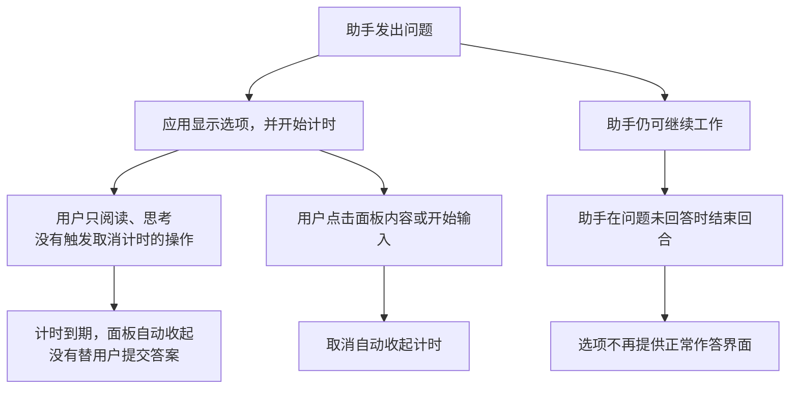

# grill 选项消失排查

来源：2026-10-01 的本地会话记录、正在运行的 Linux 桌面应用安装包，以及 OpenAI 官方异步工具文档。安装包内版本为 `26.928.31416`。结论只针对这次查到的版本与提问方式。

**选项消失有两个独立原因：应用会自动收起尚未操作的提问面板；助手结束回合也会让面板无法继续作答。只加强“等待用户回答”的文字规则，不能解决前一个原因。**

这里的“回合”指助手从开始处理一条消息，到发出最终回复结束这一轮处理。“面板”指显示问题、选项和发送按钮的交互区域。这些是界面说明，不涉及策略评估术语。

这两条关闭路径彼此独立：即使取消了倒计时，随后发生的回合结束仍会影响作答。

## 应用自己的计时

这类问题是“发出去之后，助手还能继续工作”的提问。它没有自动把助手停在等待状态，也没有保证界面一直留着。

应用代码在新问题到达时设置自动收起的截止时间。用户只是看题和思考，并不算程序识别到的操作。计时到期后，应用关闭当前展开的面板；这条处理路径没有提交答案，也没有把推荐项当成用户选择。

几种操作的效果不同：

| 操作 | 当前版本的处理 |
| --- | --- |
| 只阅读、思考 | 继续倒计时 |
| 鼠标从外面移入面板 | 重新计时，仍然会到期 |
| 点击面板内容区域，避开关闭、跳过、发送等按钮 | 取消倒计时；这一处理本身不提交答案 |
| 修改选项或输入回答 | 取消倒计时；实际发送仍是另一步 |
| 助手结束回合 | 作答面板不再正常显示，与是否取消倒计时无关 |

因此，临时防止自动收起，可以先点击一下题目文字区域再思考。它只能处理计时这一条，不能抵消助手提前结束回合。

## 这次助手也提前结束了回合

第二问发出后，会话记录没有收到对应的用户答案，助手却发出了最终回复，结束这一回合。应用的作答组件要求所属回合仍在进行；结束后，这个条件不再成立。

用户规范已经明确要求等待实际回答，而且已经加载到会话中。因此，这部分是助手没有遵守已有要求，不能归因于用户规范没有生效、grill 没找到规则，或用户考虑得太久。

第一问实际等到了回答，且等待时间比第二问发出到结束回合的间隔还长。因此，记录不支持“所有问题统一在两分钟后失效”的说法。

但是，本地会话记录没有保存面板收起的精确时刻，也没有找到这次对应的界面关闭原因记录。**能够确认两种机制都存在、第二问被提前结束；不能确认用户当时看到的第一次消失究竟是哪一种先触发。**

## 为什么只改 skill 不够

grill 的规则能要求助手等待，却不能改写应用的界面计时。当前会话的异步提问工具只接受问题和选项，没有可设置“永不自动收起”的参数。

OpenAI 的[异步工具文档](https://developers.openai.com/api/docs/guides/async-tool-calling)也说明：异步执行本身不会保证一直等待到用户回复，提问界面与超时行为由应用实现。该文档是通用接口说明，不是当前桌面应用界面的源码说明；本次查到的具体倒计时来自本机安装包。

本次同时检查到另一类提问请求也有自己的自动处理逻辑，但那是不同入口，不能把它的时间设置套到本次异步问题上。当前会话也不能任意换用受模式限制的阻塞提问工具，不能只凭工具名字声称更换后一定解决。

## 应当如何处理

助手侧应遵守已有等待要求：问题未回答时，不因“已经等了一阵”或“没有其他工作可做”而自行结束访谈；没有答案时继续等待，不能接受默认选项。用户主动要求暂停、跳过、取消或转入澄清时，按用户的新指令处理。

应用侧的根本改进是：需要用户决策的问题应允许关闭自动收起，并让未回答的问题及草稿在助手结束回合后仍能恢复和提交。若要保留自动收起，也应有明确、持久的“待回答问题”入口，而不是让作答机会依附于当前回合。

目前可用的临时处理是点击题目内容取消倒计时，同时由助手持续等待。题目和完整选项还应有文字副本，方便界面意外消失后继续回答；文字副本只能防止问题丢失，不能等同于修复交互面板。

本次完成的是原因排查与处理逻辑验证，没有修改安装包、应用设置或用户规范，也没有声称应用已经修复。v3 的第二问仍未回答，不能把推荐选项记作决定。

## 可复查的证据

时间均为 UTC，避免混淆会话文件与系统日志的时区。

| 时间 | 会话事件 |
| --- | --- |
| 07:54:02.667 | 发出第一问 |
| 07:56:22.964 | 收到第一问的实际答案，间隔约 140 秒 |
| 07:57:08.064 | 发出第二问 |
| 07:59:18.867 | 第二问尚无答案，助手结束回合，间隔约 131 秒 |
| 07:59:46.249 | 用户报告第二问消失 |

会话来源：`~/.codex/sessions/2026/10/01/rollout-2026-10-01T03-15-04-01a0f651-16dc-7443-a23d-ea51609a5e4b.jsonl`，对应第 38、74、85、127、134 行。第二问调用标识为 `call_k825eoBEXxxBzjwPFrg9tHNF`。回放只读取工具调用、用户回复和回合完成事件，不依据助手内部推理解释原因。

已有等待规则来源：`~/.codex/AGENTS.md`，实际指向 `~/.claude/CODEX-INSTRUCTIONS.md` 第 10 行。该规则要求等待真实回答，明确说明 `accepted: true` 只表示问题已提交。

应用代码来源：`/usr/lib/chatgpt/resources/app.asar` 内的下列文件。函数名是该安装包压缩后的名字，升级后可能变化。

| 文件与定位 | 查到的行为 |
| --- | --- |
| `webview/assets/app-initial-be5a841fcc6f.js`，`MNt` | 新问题设置 `deadlineMs: i + 3e4`，即到达后 30 秒 |
| 同文件，`INt`、`LNt`、`FNt` | 分别重新计时、取消计时、修改草稿并取消计时 |
| 同文件，`aqs` → `RNt` | 到期时移除当前展开面板；该路径不发送用户答案 |
| 同文件，`Cmc` | 问题到达时调用初始化；同时处理回合完成事件 |
| `webview/assets/app-primary-dc07dd266e75.js`，`Jqe` | 根据截止时间安排自动关闭；要求回合状态仍为 `inProgress` 才显示作答组件 |
| 同文件，`Iqe`、`Oz` | 传递取消计时的交互处理；面板内点击与按键触发，鼠标移入另走重新计时；倒计时最后 20 秒显示提示 |

直接抽取安装包原有状态处理函数，在内存中使用简化状态存储运行，以下五项均通过：

1. 到达 30 秒后关闭面板，答案仍未提交。
2. 鼠标移入对应处理延后截止时间，但没有取消计时。
3. 用户操作对应处理取消计时，未提交答案。
4. 修改草稿取消计时，未提交答案。
5. 重新打开问题对应处理清空截止时间。

另一次历史事件回放确认了“仍有未回答问题却结束回合”的失败条件。这些是原函数测试和事件回放，**没有操作真实界面做端到端复现，也没有改变正在运行的应用**。临时实验通过标准输入执行，没有保存实验脚本。
