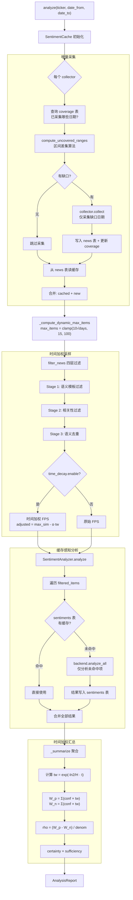

# News Sentiment: 缓存机制与时间衰减

## 概览

news_sentiment 模块在基础的"采集→过滤→分析→汇总"管道上，增加了两个正交的增强层：

1. **缓存层**（cache）：避免重复采集新闻和重复调用 LLM 分析，在连续突破、批量扫描、回测场景下大幅降低 API 成本
2. **时间衰减层**（time decay）：让近期新闻在采样和汇总中获得更高权重，确保情绪反转时近期情绪能覆盖旧情绪

两个功能完全正交 — 缓存存储的是**静态**的情感标签 `(sentiment, confidence)`，时间权重是在汇总阶段**动态**计算的。

---

## 完整数据流



---

## 一、缓存机制

### 为什么需要缓存

| 场景 | 无缓存 | 有缓存 |
|------|--------|--------|
| 连续突破（同一股票一周内多次突破，窗口重叠~79%） | 每次全量采集+分析 | 只采集增量，~80% 分析命中缓存 |
| 批量扫描（100只股票次日复扫） | 2500次 LLM 调用 | ~175次（93% 缓存命中） |
| 回测（6个月50只股票） | 全量 API 调用 | 预热后几乎 100% 命中 |

最大的成本项是 LLM API 调用（DeepSeek/GLM 逐条分析），其次是采集器限流（AlphaVantage 25次/天）。

### 两层缓存架构

```
                     SQLite (cache/news_sentiment/cache.db)
                     ┌──────────────────────────────────────┐
  采集层缓存          │  news 表                              │
  (省 API 限流)       │  PK: fingerprint                     │
                     │  索引: (ticker, collector, pub_date)  │
                     ├──────────────────────────────────────┤
  分析层缓存          │  sentiments 表                        │
  (省 LLM 调用)       │  PK: (fingerprint, backend, model)   │
                     ├──────────────────────────────────────┤
  覆盖追踪           │  coverage 表                          │
                     │  PK: (ticker, collector, from, to)   │
                     └──────────────────────────────────────┘
```

**为什么分两层？** 切换分析后端（如从 DeepSeek 切到 GLM）时，新闻缓存仍有效，只需重新跑情感分析。

### 新闻指纹 (news_fingerprint)

每条新闻需要一个唯一标识来做缓存键。算法：

```
有 URL → sha256(url)[:16]
无 URL → sha256(title|published_at|source)[:16]
```

情感结果的完整缓存键是 `(fingerprint, backend, model)`，确保同一条新闻在不同后端/模型下的结果独立缓存。

### 增量采集算法

核心问题：请求 `(AAPL, 03-05, 03-18)` 但缓存中已有 `(AAPL, 03-01, 03-14)` 的数据，如何只采集缺口？

```
请求区间:   |------03-05==========03-18------|
已覆盖:     |--03-01==============03-14--|
差集:                              |03-15===03-18|  ← 只采集这段
```

`compute_uncovered_ranges()` 实现了标准的区间差集算法：
1. 对已覆盖区间排序合并（处理不连续的多段覆盖）
2. 用游标从请求起点扫到终点，遇到覆盖区间就跳过，未覆盖段记录下来

### 分析层缓存命中

在 `SentimentAnalyzer.analyze()` 中，逐条检查缓存：

```
filtered_items: [A, B, C, D, E]

缓存查找:
  A → 命中 (positive/0.9)
  B → 未命中
  C → 命中 (negative/0.7)
  D → 未命中
  E → 命中 (neutral/0.5)

只对 [B, D] 调用 backend.analyze_all()
新结果写入缓存
合并: [A_cached, B_new, C_cached, D_new, E_cached]
```

只缓存 `confidence > 0` 的成功结果，失败结果不缓存（下次可能成功）。

### 配置

```yaml
cache:
  enable: true
  cache_dir: "cache/news_sentiment"   # 相对于项目根目录
  news_ttl_days: 30                   # 新闻 30 天后过期
  sentiment_ttl_days: 0               # 情感结果永不过期
```

`enable: false` 时所有缓存操作变为 no-op，管道回退到原始行为。

---

## 二、时间衰减

### 为什么需要时间衰减

使用场景是：在交易日前分析过去 ~2 周的新闻情绪，判断突破可靠度。

问题：如果前两周是利空、最近几天转为利好，均匀对待所有新闻会得出"中性"结论，但**真实情绪已经转向看多**。距离交易日越近的新闻，对当前情绪的影响越大。

### 衰减函数

使用指数衰减：

$$w(t) = e^{-\frac{\ln 2}{H} \cdot t}$$

其中 `H` 是半衰期（默认 3 天），`t` 是新闻发布日期到参考日期（`date_to`）的天数。

| 天数 | 权重 | 含义 |
|------|------|------|
| 0（当天） | 1.00 | 满权重 |
| 3（一个半衰期） | 0.50 | 半权重 |
| 6（两个半衰期） | 0.25 | 四分之一 |
| 9 | 0.125 | 八分之一 |
| 14 | 0.039 | 几乎可忽略 |

选择指数衰减而非线性衰减的原因：
- **单参数**（半衰期），直觉性强
- **连续平滑**，无突变
- **自然处理反转** — 旧情绪指数级衰减，无需额外的反转检测机制

### 两层协同作用

时间衰减在管道中作用于两个环节，各自解决不同问题：

#### 采样层 (filter.py — diversity_sample)

**解决"选哪些新闻"的问题。**

原始 FPS（最远点采样）每轮选与已选集合"最不相似"的新闻。纯基于语义距离，完全不感知时间。极端情况下可能选出一堆老新闻（因为老新闻主题更分散）。

时间加权 FPS 修改了评分公式：

```
原始:  next = argmin(max_sim_to_selected)
加权:  next = argmin(max_sim_to_selected - α · tw)
```

`α = 0.25` 意味着近期新闻（tw≈1）相比远期新闻（tw≈0）获得 0.25 的评分优势。在多样性相近的候选中，近期新闻优先入选。

种子选择也使用了加权质心，让起始点偏向近期新闻的语义中心。

#### 汇总层 (analyzer.py — _summarize)

**解决"怎么算情绪"的问题。**

原始公式中 `w_p = sum(confidence)`，所有新闻等权。
加权后 `w_p = sum(confidence × tw)`，近期新闻的情感贡献更大。

具体改动只在 Step 0（数据预处理）：
```python
w_p = sum(c * t for c, t in zip(pos_confs, pos_tw))
w_n = sum(c * t for c, t in zip(neg_confs, neg_tw))
```

后续的 rho、certainty、sufficiency 公式完全不变，因为它们的输入 `w_p`、`w_n` 已经是时间加权值了。

**情绪反转的数值示例：**

5 条远期负面（03-01，conf=0.8）+ 3 条近期正面（03-14，conf=0.8），ref=03-15：

| | 无衰减 | 有衰减 (H=3) |
|--|--------|-------------|
| w_p | 3 × 0.8 = 2.4 | 3 × 0.8 × 0.794 = 1.91 |
| w_n | 5 × 0.8 = 4.0 | 5 × 0.8 × 0.039 = 0.16 |
| rho | -0.25 → **negative** | +0.85 → **positive** |

无衰减时结论是看空（5>3），有衰减时正确识别出近期情绪已转向看多。

### 与缓存的关系

两者**完全正交**：

```
缓存层（静态）                    时间衰减层（动态）
══════════════                  ═══════════════════

缓存存储:                        实时计算:
  sentiment = "positive"           tw = exp(-ln2/3 · days)
  confidence = 0.8                 w_p = 0.8 × tw
  (固定不变)                       (依赖 reference_date)
```

同一条缓存的情感结果，在不同的 `reference_date` 下获得不同的时间权重。缓存模块无需因时间衰减做任何改动。

### 配置

```yaml
filter:
  time_decay:
    enable: true
    half_life: 3.0         # 半衰期（天），3天前权重50%
    sample_alpha: 0.25     # 采样时间偏好强度
```

---

## 三、max_items 动态化

固定 `max_items=20` 在不同时间跨度下存在信息密度失配：3 天可能凑不到 20 条，90 天只分析 20 条会丢失大量信息。

动态公式：

```
max_items = clamp(10 × √(num_days), 15, 100)
```

| 时段 | max_items | LLM 调用量 | 耗时估算 |
|------|-----------|-----------|---------|
| 3天 | 17 | ~1批 | ~1s |
| 15天 | 38 | ~2批 | ~2s |
| 30天 | 54 | ~3批 | ~3s |
| 90天 | 94 | ~5批 | ~5s |

为什么用**亚线性**（√）而非线性：新闻的信息量随时间增长呈边际递减（主题会复现、事件会聚集）。线性缩放在 90 天窗口下会产生 900 条，成本爆炸且收益有限。

**实现细节**：使用 `dataclasses.replace()` 创建 config 浅拷贝来设置动态值，而不是修改传入的 config 对象。这保证了批量分析或回测时同一 config 实例的安全复用。

---

## 四、YAML 配置完整参考

```yaml
filter:
  max_items: 20                    # 回退默认值（动态化后通常被覆盖）
  semantic_filter_threshold: 0.65
  semantic_dedup_threshold: 0.75
  relevance_threshold: 0.55
  time_decay:
    enable: true                   # 开关
    half_life: 3.0                 # 半衰期（天）
    sample_alpha: 0.25             # 采样偏好强度 [0=纯FPS, 1=强烈偏好近期]

cache:
  enable: true                     # 开关
  cache_dir: "cache/news_sentiment"
  news_ttl_days: 30                # 新闻缓存 TTL（0=永不过期）
  sentiment_ttl_days: 0            # 情感结果缓存 TTL（0=永不过期）
```

所有新功能通过 `enable` 开关控制，关闭时行为与增强前完全一致。
