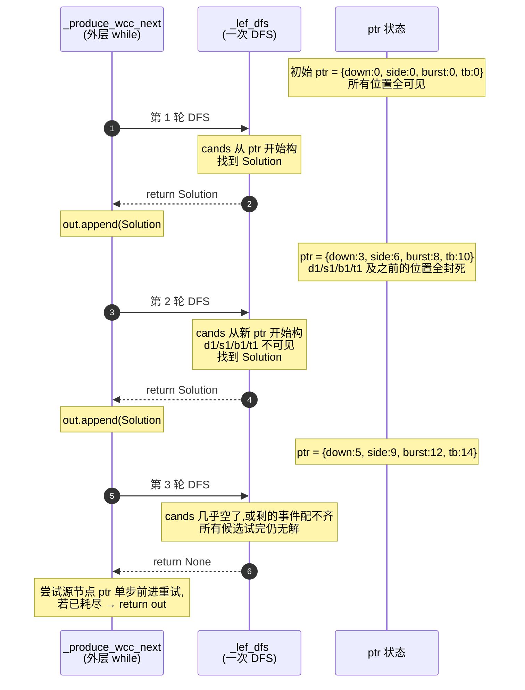

# next 模式 ptr 推进:那两行代码到底在做什么

> 解释目标:`path2/dag/_solve.py::_produce_wcc_next` 里这两行。
>
> ```python
> for lab in assign:
>     ptr[lab] = chosen_idx[lab] + 1    # 所有已绑节点,指针推过本次用过的位置
> ```
>
> 文档定位:面向想搞清楚 next 模式"先到先得"语义的人。先讲意图,再画图,最后展开代码细节。

---

## 1. 一句话意图

**把已经"花掉"的事件位置封死,让下一轮 DFS 找 Solution 时从这些位置之后开始扫。**

这两行是 next 模式(`SKIP_TILL_NEXT_MATCH`)的实现核心——它的整套语义"事件互不重叠地依次生产 match"就靠这两行硬钉死。删掉它们,引擎瞬间退化成"反复找同一个 match"。

---

## 2. 为什么需要它

`_lef_dfs` 一次调用只找**一个** Solution(找到就 `return r`,DFS 不再继续)。但一票数据可能藏着多个 match——你要把它们都找出来。怎么办?重复调用 `_lef_dfs` 就行。

但有个问题:如果第二次进 `_lef_dfs` 时,所有节点的 cands 都从头开始扫,它会**找到一模一样的那个 Solution**——因为输入没变,DFS 是确定的。死循环。

要让"第二次找到的 match"和"第一次"不一样,必须让某些事件位置在第二次扫的时候**不可见**。next 模式选择"把第一次 match 里用过的事件位置全部封死"——`ptr[v] = chosen_idx[v] + 1` 就是封死操作:下一轮 cands 构造时 `range(ptr[v], len(lst))` 直接从这个位置之后开始,前面的位置压根扫不到。

结果:**第二轮、第三轮…… 每轮都在剩下的位置里找新的 match,直到找不到为止**。这就是用户在 web 面板上看到一票里有多个命中的来源。

附带语义:**match 之间的事件互不重叠**——因为同一个事件位置最多只能进一个 match。这是 next 模式跟 any 模式的根本差别。

---

## 3. 画图:三轮 DFS 的 ptr 演化

假设走势链是 `down → side → burst → tb`,某票数据上每个 role 有若干个候选事件。用时间索引在横轴排开,绿色 = 当前轮可见(ptr 之后),灰色 = 已封死(ptr 之前):



横轴时间线(简化示意,只画 tb 一条):

```mermaid
gantt
    title tb 流的位置可见性演化
    dateFormat X
    axisFormat %s
    section 初始
    可见(ptr=0)             :a1, 0, 20
    section 第 1 轮后(ptr=10)
    已封死                 :crit, b1, 0, 10
    可见                   :b2, 10, 20
    section 第 2 轮后(ptr=14)
    已封死                 :crit, c1, 0, 14
    可见                   :c2, 14, 20
```



(Gantt 的 "section" 这里被借用来表示三种状态;只看条带长度和颜色。)

---

## 4. 在调用关系里的位置

这两行不在 `_lef_dfs` 内部,而在包它的外层 while 循环里。下面是浓缩版调用结构,标注两行所处的位置:

```python
def _produce_wcc_next(plan, wp, streams, ctx, *, use_memo, collapse):
    ptr = {n: 0 for n in wp.comp}            # ① 初始化:所有节点 ptr 从 0 起
    out = []
    while True:
        if 任一源节点 ptr 越界:
            return out

        res = _lef_dfs(wp, 0, {}, {}, ptr, ...)   # ② 进入一次完整 DFS

        if res is None:                      # ③ 本轮没找到 Solution
            # 尝试单步推进一个源节点的 ptr 再试(源重试,绕开当前局部死结)
            for s in wp.sources:
                if ptr[s] + 1 < len(streams.get(s, [])):
                    ptr[s] += 1; advanced = True; break
            continue

        assign, chosen_idx = res             # ④ 拿到 Solution
        out.append(Solution(assign=assign, chosen_idx=chosen_idx))

        # ↓↓ next 模式的灵魂两行 ↓↓
        for lab in assign:
            ptr[lab] = chosen_idx[lab] + 1
        # ↑↑ 把这一轮 Solution 涉及的所有 role 的 ptr 都推过 ↑↑
        # 下一轮 _lef_dfs 进来时,这些 role 的 cands 从新位置开始扫
```

执行顺序:**先 append Solution,再推 ptr,再回到 while 头顶进下一轮**。这个顺序保证已经收下的 Solution 不会被改动,推 ptr 只影响往后。

---

## 5. 微观细节

### 5.1 `assign` 和 `chosen_idx` 是什么

这两个字典是 `_lef_dfs` 返回 Solution 的内容:

- `assign: {role_id: event}` —— 这一轮 DFS 绑定的"哪个 role 绑了哪个事件",例如 `{"down": <DownEvent>, "side": <SideEvent>, "burst": <BurstEvent>, "tb": <ThrowbackEvent>}`
- `chosen_idx: {role_id: int}` —— 这些事件在各自流里的**位置索引**,例如 `{"down": 2, "side": 5, "burst": 7, "tb": 9}`(分别是各流第几个事件)

为什么需要 `chosen_idx`?光有 `assign` 拿到事件对象不够——推 ptr 需要知道"这个事件是流里的第几个",才能算出"下一个该从哪开始扫"。

### 5.2 `for lab in assign` 遍历谁

遍历 `assign` 的所有 key,也就是**这一轮被绑过的全部 role**。对一个 4 节点的 DAG(down/side/burst/tb),正常找到 Solution 时四个 role 都被绑了,这一行就会推四次 ptr。

注意 **`bo` 这种上游流(consumes_stream 喂给 burst/tb)不在 assign 里**——它不是 wp.order 上的 role,而是上游 plan 已经物化好的流。bo 流的"消费"不在这两行管,在更外层的 plan 编排里。

### 5.3 `+ 1` 的精确含义

`chosen_idx[lab]` 是流里的索引,`+ 1` 把指针推到"用过的位置之后第一个"。下一轮 `_lef_dfs` 内构 cands 时:

```python
cands = [(lst[i], i) for i in range(ptr[v], len(lst)) if 在窗内]
                                     ^^^^^^   <─ 这里直接跳过了之前的所有位置
```

`range(ptr[v], len(lst))` 是左闭右开,从 `ptr[v]` 开始遍历。所以"用过的那个位置"(`chosen_idx[lab]`)本身**也跳过了**。

### 5.4 一个容易误解的点

推 ptr 推的是**整个流被消费过的位置**,不是只有"已经试过失败"的位置。换句话说,即便某些更早的位置在本轮 DFS 里压根没被试到(可能是 C1 给塌掉了、或 satisfies 直接跳过了、或者根本没进 cands),只要它们的索引比 `chosen_idx[v]` 小,下一轮也看不到。

这就是 next 模式"贪心非重叠"的另一层含义——一旦绑定,绑定位置**及其之前的所有同流位置**都被"用掉"。这点跟"全枚举"语义完全相反,跟 any 模式(`solve_any`)对比鲜明:any 模式根本不动 ptr,叶子 emit 后继续回溯,事件可以反复参与不同的 match。

---

## 6. 跟 C1 塌缩的分工

最容易混的点:C1 塌缩和这两行都让"某些候选看不到",它们到底是什么关系?

| 维度 | C1 塌缩 | 这两行(ptr 推进) |
|---|---|---|
| 发生位置 | `_lef_dfs` 内部,for 循环之前 | `_lef_dfs` 之外,while 循环内、收完 Solution 之后 |
| 影响什么 | 当前节点 cands 列表的**内容**(合并同类项) | 下一轮 cands 列表的**起点** |
| 影响时机 | 这一次 DFS 本次进入这个节点 | 下一轮 DFS 重新进入所有已绑节点 |
| 改不改结果集 | **绝不能改**(优化),改了就是 bug | **就是为改结果集而存在**(语义),非重叠消费靠它实现 |
| 关掉会怎样 | 慢但结果对 | 一直找到同一个 Solution,死循环 |

一句话:**C1 是优化、ptr 推进是语义**。前者属于"我帮你少试几个候选",后者属于"我让你下次别再回头用这块"。

---

## 7. 跟 any 模式对比看更清晰

`solve_any` / `_any_dfs` 的对应位置(`_solve.py:475-487` 一带)长这样:

```python
def solve_any(plan, streams, ctx=None, *, collapse=False, memo_mode="charitable"):
    out = []
    for wp in plan.wcc_plans:
        memo = {n: set() for n in wp.comp}
        _any_dfs(wp, 0, {}, {}, streams, memo, out, ...)
        # 注意:没有 while 循环、没有 ptr 概念、没有"再试一次"
    return out
```

`_any_dfs` 一次调用枚举**所有完成路径**——叶子 emit 之后继续回溯换候选,直到所有组合穷尽。所以根本不需要 ptr 推进,事件被反复用。代价:同一个事件可能出现在几十个 match 里,结果集庞大,适合发现/扫描场景。

`solve_next` 因为有 ptr 推进,**一票数据上的 match 之间事件互斥**,结果集精炼,适合"挑一批互不打架的命中"。

---

## 8. 跟 IdentityEdge 那条研究线的连接

`docs/research/2026-06-14_path2-tb-anchor-edge/` 里讨论的"unmatched satisfy"漂移,其实跟这两行有间接关系。

漂移的直接原因是 satisfies 不读身份字段(gap 边只看时序)——某个 tb 的真锚不是 burst.last_bo,但 gap 边按时序窗放行。

`_lef_dfs` 的 DFS 行为是"取第一个 satisfies 通过的候选就 return"——叶子节点没有"下游失败回溯",等价于"第一个就停"。结合 ptr 推进,**这个错误的占用还会把后续轮次里"可能本应被另一个 burst 正确锚到的 tb"也封死**——下一轮再有别的 burst 候选(end 不同),这个 tb 已经在 ptr 之前,看不见了。

修法不是动 ptr 推进的逻辑(那会破坏 next 模式的语义),而是给 satisfies 增加身份校验(IdentityEdge),让"错的占用"压根不发生——错的候选不通过 satisfies,for 循环跳过它,根本走不到推 ptr 那一步。

---

## 9. 一句话总结

`for lab in assign: ptr[lab] = chosen_idx[lab] + 1` 这两行不是辅助代码,而是 next 模式整套"贪心、非重叠、依次生产 match"语义的**唯一实现位置**。它把"本轮用过的事件位置"在所有相关流上向前钉死,让下一轮 DFS 重新启动时只能看到剩下的位置,从而保证多轮迭代不会反复找到同一个 Solution。理解了这两行,基本就理解了 next 模式跟 any 模式的根本区别、跟 C1 塌缩的分工、以及"先到先得占用"现象的来源。
