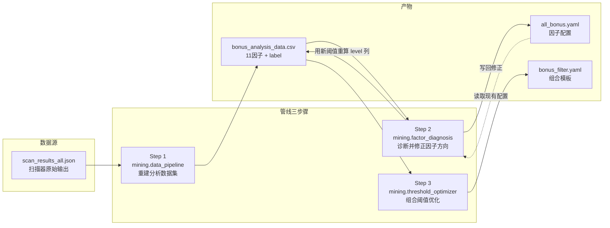
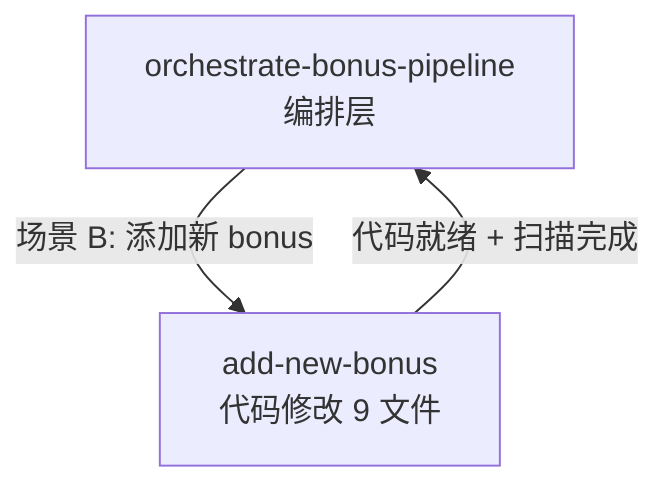

# Orchestrate Bonus Pipeline — 使用指南

> 最后更新：2026-02-26

## 概览

`orchestrate-bonus-pipeline` 是一个 **AI Skill**，负责编排 bonus 数据挖掘管线的全生命周期。用户用自然语言说出意图（如"校准阈值"、"新数据到了"），AI 自动完成意图解析、环境诊断、脚本串联、结果解读和异常交互。

**核心设计理念：AI 编排，脚本执行。** AI 不直接修改 YAML 或代码，只通过调用确定性脚本操作数据。这保证了结果的可复现性。

---

## 系统架构

### 数据流全景



### AI Skill 在系统中的位置

```
用户（自然语言） ──→ AI Skill（编排层） ──→ Python 脚本（执行层）
                         │                         │
                    意图识别                   确定性算法
                    状态诊断                   数据驱动决策
                    结果解读                   YAML 读写
                    异常交互
```

AI Skill 是"指挥官"，Python 脚本是"士兵"。指挥官负责判断局势、下达命令、解读战果；士兵负责精确执行。

---

## 四种使用场景

### 场景 A：校准阈值（最常用）

**触发方式**：告诉 Claude "校准 bonus"、"calibrate"、"重新调整阈值"

**适用时机**：
- 定期维护（如每月校准一次）
- 发现某些因子表现异常后
- 修改了因子配置想回归到数据最优

**执行范围**：跳过扫描，直接从 CSV 开始 → 诊断 → 修正 → 重生成模板

**示例对话**：
```
你：校准 bonus 阈值
AI：[检查文件状态] → [运行诊断] → [展示修正方案] →
    "Tests 建议禁用（r=0.0008），Age 建议改为 lte 模式（低龄更好），
     PK-Mom 发现甜蜜区间 [1.86, 2.09]。确认应用？"
你：Y
AI：[应用修正] → [重生成模板] → [展示结果摘要]
```

### 场景 B：添加新 bonus 因子

**触发方式**："新增 bonus"、"add bonus"

**适用时机**：
- 研究发现新的有价值特征
- 想将某个指标正式接入评分系统

**执行流程**：先使用 `add-new-bonus` skill 完成代码修改（新因子以 `enabled: false` 加入），用户运行全量扫描后，回到本管线的校准流程（方向诊断 → 阈值优化）。

### 场景 C：新数据到达

**触发方式**："new data"、"数据更新"、"重扫"

**适用时机**：
- 运行了新一轮扫描
- 数据时间范围变化（如加入最近 3 个月数据）

**执行范围**：完整管线（提示扫描 → 重建 CSV → 诊断修正 → 重生成模板）

### 场景 D：仅生成组合模板

**触发方式**："find combinations"、"组合"、"选股模板"

**适用时机**：
- 已手动调整了 `all_bonus.yaml`，只需重新生成 `bonus_filter.yaml`
- 想尝试不同的 `min_count` 参数

**执行范围**：仅运行 `uv run -m BreakoutStrategy.mining.template_generator`

---

## 管线三步骤详解

### Step 1: 重建分析数据集

```bash
uv run -m BreakoutStrategy.mining.data_pipeline
```

**输入**：`outputs/analysis/scan_results_all.json`（扫描器原始输出）

**输出**：`outputs/analysis/bonus_analysis_data.csv`

**功能**：从 JSON 中提取每个突破事件的 11 个因子原始值、level 值和收益标签（`label_10_40`）。这是后续所有分析的数据基础。

**健康指标**：
- 样本数 ~9000+（当前 9810）
- 11 个 `*_level` 列 + 1 个 `label_10_40` 列完整

### Step 2: 诊断并修正因子方向

```bash
uv run -m BreakoutStrategy.mining.factor_diagnosis
```

**输入**：`bonus_analysis_data.csv` + `all_bonus.yaml`（现有配置）

**输出**：修正后的 `all_bonus.yaml`（仅 mode 字段）

**核心算法**（基于 raw value Spearman，无循环论证）：

```
对每个因子:
  1. 在原始值空间计算 Spearman 相关系数 r
  2. |r| < 0.015  → weak（保持 gte）
  3. r > 0        → positive（mode=gte，值越大越好）
  4. r < 0        → negative（mode=lte，值越小越好）
  5. 与当前 yaml 中的 mode 对比 → OK 或 FLIP
```

**交互点**：脚本打印诊断表，如果有 FLIP 需要确认。设置环境变量 `BONUS_AUTO_APPLY=1` 可自动应用修正。也可使用 `correct-factor-direction` skill 进行交互式修正。

### Step 3: 组合阈值优化

```bash
uv run -m BreakoutStrategy.mining.threshold_optimizer
```

**输入**：`bonus_analysis_data.csv` + `all_bonus.yaml`（读取 mode 字段）

**输出**：`configs/params/bonus_filter.yaml`

**功能**：四阶段流水线（因子筛选 → 时序验证 → 双引擎搜索 → Bootstrap 验证），面向组合模板质量搜索最优阈值。反向因子（mode=lte）自动使用 `<=` 触发。

**健康指标**：
- 模板数 60~100（当前 81）
- Top-5 avg median 显著高于 baseline
- 所有因子触发率在 3%-50% 范围内

---

## 关键文件一览

| 文件 | 角色 | 谁写入 |
|------|------|--------|
| `outputs/analysis/scan_results_all.json` | 扫描器原始输出 | 扫描器 |
| `outputs/analysis/bonus_analysis_data.csv` | 分析数据集 | Step 1, Step 2（重算 level） |
| `configs/params/all_bonus.yaml` | 因子配置（阈值/乘数/mode） | Step 2（仅 mode 字段） |
| `configs/params/bonus_filter.yaml` | 选股组合模板 | Step 3 |

---

## CI/CD Fallback 模式

当 AI Skill 不可用时（如自动化脚本、CI/CD），使用管线编排入口一键执行全管线：

```bash
uv run -m BreakoutStrategy.mining.pipeline
```

该入口进程内串联 Step 1 → Step 2 → Step 3，`auto_apply=True`，无需人工交互。

---

## 与其他 Skill 的协作

`orchestrate-bonus-pipeline` 已内化了诊断（原 `bonus-system-gap-analysis`）和解读（原 `summarize-bonus-analysis`）能力，管线数据流（JSON→CSV→YAML）全程不读报告文件。这两个 skill 仍可供用户手动使用，但管线不再引用。

当前管线仅在"添加新 bonus"场景下引用其他 skill：



---

## 常见问题

### Q: 什么时候该跑管线？

当以下任一条件满足时：
1. **数据过时**：跑了新扫描但没更新分析数据
2. **定期维护**：每月校准一次阈值
3. **配置漂移**：手动改了 `all_bonus.yaml` 但没重新生成模板
4. **新因子实验**：想添加或移除某个因子

### Q: 管线执行后 YAML 被改坏了怎么办？

方向诊断只修改 `mode` 字段，不改 thresholds/values。如需恢复，可用 `git checkout` 恢复：
```bash
git checkout configs/params/all_bonus.yaml
```

### Q: 如何查看当前因子配置状态？

```bash
uv run python -c "
import yaml
d = yaml.safe_load(open('configs/params/all_bonus.yaml'))
qs = d['quality_scorer']
for key, entry in qs.items():
    if isinstance(entry, dict) and 'enabled' in entry:
        mode = entry.get('mode', 'gte')
        status = 'disabled' if not entry['enabled'] else f'{mode} T={entry[\"thresholds\"]} V={entry[\"values\"]}'
        print(f'{key}: {status}')
"
```

### Q: 方向修正可以只选择性应用吗？

可以。使用 `correct-factor-direction` skill 进行交互式修正，逐个确认每个 FLIP。或者手动编辑 `all_bonus.yaml` 的 `mode` 字段。
