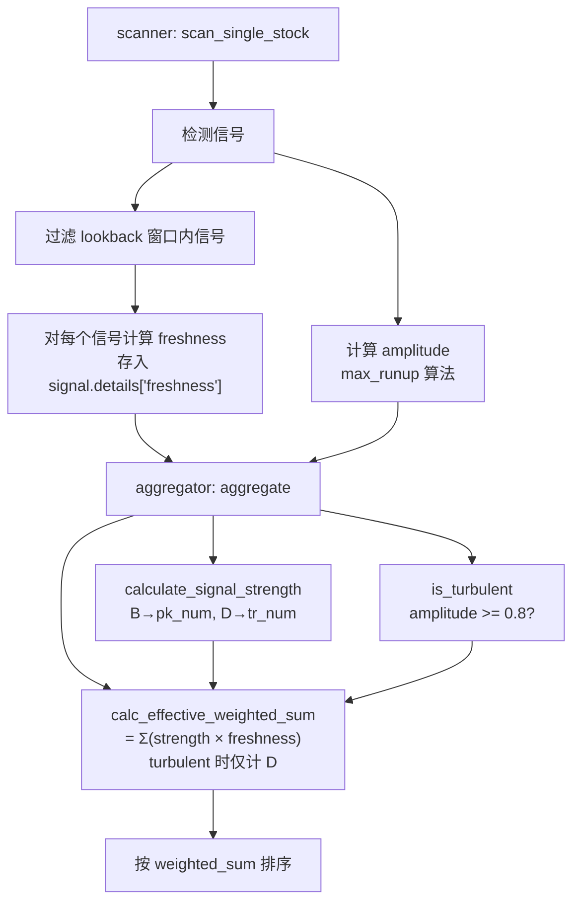

# Max Runup 与信号鲜度 (Signal Freshness) 核心原理

> 最后更新: 2026-02-08

## 概览

信号扫描系统通过 `weighted_sum`（加权强度总和）对股票排序，帮助用户找到最值得关注的标的。
但原始的 `weighted_sum` 存在两个盲区：

1. **度量不准**：振幅 (amplitude) 无法区分"来回震荡"与"方向性暴涨"
2. **能量耗散**：一只股票的信号再多，如果涨势已经走完、价格已经回落，信号的实际价值趋近于零

**Max Runup** 修复了第一个问题，**信号鲜度** 修复了第二个问题。两者完全正交，合在一起让排序结果真正反映"此时此刻值得关注"。

---

## 一、Max Runup — 度量什么才是"超涨"

### 1.1 问题：旧 amplitude 的混淆

旧算法：
```
amplitude = (max_high - min_low) / min_low
```

这个公式捕获的是价格的**总范围**。一只股票如果在 $2 和 $4 之间来回震荡 5 次，amplitude 会是 100%——但它并没有方向性暴涨，不应标记为 turbulent。

低价股（$1-$10）天然波动大，旧算法导致大量低价股被误标为 turbulent，BVY 信号被全部清零。

### 1.2 解法：只测量方向性上冲

Max Runup 只关心一个问题：**从某个低点开始，价格最多往上冲了多少？**

```
          High[3]=$8  ← peak
         /
        /
   Low[0]=$4  ← cumulative min at this point

   runup = ($8 - $4) / $4 = 100%
```

### 1.3 算法步骤

```python
cum_min[i] = min(Low[0], Low[1], ..., Low[i])   # 累计最低价
runup[i]   = (High[i] - cum_min[i]) / cum_min[i] # 每天的 runup
max_runup  = max(runup[0], runup[1], ..., runup[n])
```

关键性质：
- `cum_min` 单调不增，所以 runup 只在价格**持续向上突破**时增长
- 来回震荡不会拉高 cum_min 后的 runup 值，因为每次下跌重新拉低 cum_min 后涨回原位只是"回到原点"

### 1.4 直观对比

```
场景 A: 单向暴涨  $2 → $6
  旧 amplitude = 200%  ✓
  max_runup    = 200%  ✓  (两种方法一致)

场景 B: 来回震荡  $2 → $4 → $2 → $4 → $2
  旧 amplitude = 100%  ✗  (把震荡误判为暴涨)
  max_runup    =  20%  ✓  (每次低点都在 $2，涨到 $4 只算一次)

场景 C: 先跌后涨  $8 → $4 → $6
  旧 amplitude = 100%  ✗  (把下跌区间也算进去)
  max_runup    =  50%  ✓  (从最低点 $4 到峰 $6)
```

### 1.5 NaN 安全处理

`np.minimum.accumulate` 会传播 NaN（一个 NaN 污染所有后续值）。解法：

```python
lows_clean  = np.where(np.isnan(lows),  np.inf,  lows)   # NaN Low → 不参与 min
highs_clean = np.where(np.isnan(highs), -np.inf, highs)  # NaN High → 不参与 max
```

---

## 二、信号鲜度 (Signal Freshness) — 信号还有多少能量

### 2.1 问题：VTGN 案例

```
VTGN: D → V → V，weighted_sum = 9.0，amplitude = 0.5 (非 turbulent)
但实际走势：暴涨 → 暴跌 → 已完成派发
```

旧系统看到 3 个信号、加权总和 9.0，排名很高。但这些信号的"能量"已经被价格运动消耗殆尽——涨了又跌回来了。

### 2.2 核心思想

**信号是有能量的，价格运动会消耗这个能量。**

```
freshness = price_decay × time_decay
```

- **price_decay**：信号发出后，价格走了多少"回程"？走完全程 = 能量耗尽
- **time_decay**：时间越久，信号越不新鲜（指数半衰期衰减）

最终作用到排序：

```
effective_weight = strength × freshness
```

### 2.3 动量信号 (B/V/Y) 的价格衰减 — PRTR

PRTR = **Price Round-Trip Ratio**（价格往返比率）

```
信号价 $10
  ↓
涨到峰值 $18 (rise = $8)
  ↓
当前价 $14 (giveback = $4)

prtr = giveback / rise = $4 / $8 = 0.5
price_decay = 1 - prtr^α = 1 - 0.5^1.5 = 0.65
```

#### 直觉解释

把信号想象成一个弹弓：

```
                     peak ($18)
                    /
                   /   ← rise = $8 (蓄力)
                  /
信号价 ($10) ----+
                  \
                   \   ← giveback = $4 (回弹)
                    \
              当前价 ($14)
```

- **prtr = 0**：价格仍在峰值或更高 → 信号能量完全保留
- **prtr = 0.5**：回撤了一半涨幅 → 能量消耗了一部分
- **prtr = 1.0**：全部涨幅回吐 → 能量完全耗尽

#### alpha 曲线的含义

`price_decay = 1 - prtr^α`，alpha = 1.5 使曲线呈现"**前期容忍、后期惩罚**"的特征：

```
prtr (回撤比) │ α=1.0 (线性) │ α=1.5 (实际使用)
─────────────┼──────────────┼─────────────────
     0.1     │    0.90      │     0.97  ← 10% 回撤几乎无影响
     0.3     │    0.70      │     0.84  ← 30% 回撤仅 16% 衰减
     0.5     │    0.50      │     0.65  ← 50% 回撤衰减 35%
     0.8     │    0.20      │     0.28  ← 80% 回撤严重衰减
     1.0     │    0.00      │     0.00  ← 全部回撤 = 完全衰减
```

这很合理：正常的技术回调（10-30%）不应大幅惩罚信号，但超过 50% 的回吐说明走势可能已结束。

#### 小涨幅守卫 (MIN_RISE_PCT = 0.05)

如果信号后涨幅不足 5%，PRTR 计算失去意义（分母太小导致 prtr 极端）。
退回简单跌幅比率：

```python
if rise <= signal.price * 0.05:
    if current_price < signal.price:
        return max(0.0, 1.0 - drop_ratio)  # 跌了多少扣多少
    return 1.0  # 接近信号价 = 新鲜
```

### 2.4 支撑信号 (D) 的价格衰减 — 区间判定

D 信号（双底）代表的不是动量，而是**支撑位**。它的"能量"取决于当前价格离支撑位多远：

```
price_ratio = current_price / support_price

        衰减           保鲜           缓慢衰减
  ←──────────────┤ 0.9 ====== 1.2 ├───────────────→
  支撑失效        │    支撑区间     │     远离支撑
  (快速衰减)      │  (freshness=1) │   (缓慢衰减)
                  │                │
  跌破支撑 10%    │                │   涨了 20% 以上
  → 支撑可能失效  │                │   → 支撑不再是关注焦点
```

| price_ratio | 含义 | price_decay |
|:-----------:|:----:|:-----------:|
| 0.7 | 跌破支撑 30% | 0.1 (接近失效) |
| 0.85 | 跌破支撑 5% | 0.75 |
| 0.9 ~ 1.2 | 在支撑区间 | **1.0** (完全新鲜) |
| 1.4 | 高于支撑 40% | 0.6 |
| 1.7 | 高于支撑 70% | 0.3 (最低保底) |

**设计考量**：
- 区间下界 0.9：允许略低于支撑（正常波动）
- 区间上界 1.2：高于支撑 20% 内仍有参考价值
- 下方衰减快（0.2 步长）：支撑被实质性跌破 = 快速失效
- 上方衰减慢（0.5 步长）：远离支撑只是"不再关注"，不是错误信号

### 2.5 时间衰减 — 指数半衰期

```python
time_decay = 0.5 ^ (trading_days_elapsed / half_life)
```

half_life = 30 交易日（约 6 周）：

| 经过天数 | time_decay | 含义 |
|:--------:|:----------:|:----:|
| 0 | 1.00 | 刚发出 |
| 10 | 0.79 | 约 2 周，衰减 21% |
| 30 | 0.50 | 半衰期，能量减半 |
| 60 | 0.25 | 仅剩 25% |
| 90 | 0.13 | 接近失效 |

使用**交易日索引差**（而非日历日差），避免周末和节假日导致的偏差。

### 2.6 组合效果

```
freshness = price_decay × time_decay
```

几个典型场景：

| 场景 | price_decay | time_decay | freshness |
|:----:|:----------:|:----------:|:---------:|
| 刚突破 3 天，价格仍在涨 | 0.97 | 0.93 | **0.90** |
| 突破 20 天，回撤 30% | 0.84 | 0.63 | **0.53** |
| 突破 40 天，回撤 80% | 0.28 | 0.40 | **0.11** |
| VTGN: 全回撤，已过 30 天 | 0.00 | 0.50 | **0.00** |

VTGN 的 weighted_sum 从 9.0 降至约 2.2（仅 D 信号保留部分鲜度）。

---

## 三、数据流



**关键设计选择**：
- Freshness 存储在 `signal.details["freshness"]`，而非修改 `signal.strength`
- 这样 strength 保持原始语义（"信号本身有多强"），freshness 是独立的调节因子
- Aggregator 完全不需要改动，因为 `calc_effective_weighted_sum` 已读取 freshness
- `details` 是 dict，可跨进程 pickle 序列化，无 IPC 开销变更

---

## 四、参数一览

| 参数 | 值 | 位置 | 含义 |
|:----:|:--:|:----:|:----:|
| `AMPLITUDE_THRESHOLD` | 0.8 | composite.py | max_runup >= 80% 标记 turbulent |
| `FRESHNESS_ALPHA` | 1.5 | composite.py | PRTR 衰减曲线指数（越大 → 对小回撤越宽容） |
| `FRESHNESS_HALF_LIFE` | 30 | composite.py | 时间衰减半衰期（交易日） |
| `MIN_RISE_PCT` | 0.05 | composite.py | PRTR 有效计算的最小涨幅门槛 |
| D 支撑区间 | [0.9, 1.2] | composite.py | 支撑信号的"完全新鲜"价格比率区间 |

---

## 五、与 Turbulent 机制的关系

两者互补，不重叠：

| 机制 | 粒度 | 作用 |
|:----:|:----:|:----:|
| **Turbulent** (max_runup + 阈值) | 股票级 | 整体判断是否暴涨，是则 BVY 信号全部清零 |
| **Freshness** (PRTR + 时间衰减) | 信号级 | 逐个评估每个信号的剩余能量 |

Turbulent 是粗粒度安全网（极端情况兜底），Freshness 是细粒度评估（精确计分）。
即使一只股票未被标记为 turbulent，其信号仍可能因为价格回撤或时间过久而被 freshness 降权。
