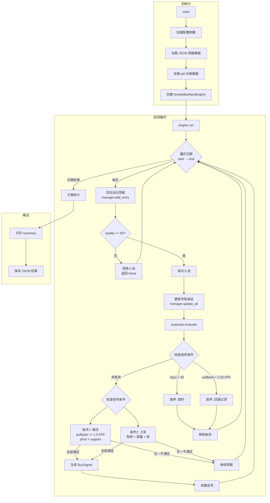

# Simple Pool 回测系统说明

> 入口脚本: `scripts/backtest/simple_pool_backtest.py`

## 一、系统概览

Simple Pool 是 Daily Pool 的 MVP 简化版本，采用**即时判断**模型替代状态机。

```
核心差异:
┌─────────────────────┬────────────────────────┐
│     Daily Pool      │     Simple Pool        │
├─────────────────────┼────────────────────────┤
│ 7 状态状态机        │ 无状态，即时判断       │
│ 29 个参数           │ 4 个核心参数           │
│ 路径依赖            │ 每次评估独立           │
│ 复杂支撑位聚类      │ min(low[-N:])          │
└─────────────────────┴────────────────────────┘
```

---

## 二、运行流程图



---

## 三、核心类说明

### 3.1 SimplePoolConfig

**位置**: `BreakoutStrategy/simple_pool/config.py`

```python
@dataclass
class SimplePoolConfig:
    # 4 核心参数 (可调)
    max_pullback_atr: float = 1.5      # 最大回调深度
    support_lookback: int = 10          # 支撑参考天数
    volume_threshold: float = 1.3       # 放量阈值
    min_quality_score: float = 60.0     # 最小质量分

    # 固定参数
    max_observation_days: int = 30      # 最大观察天数
    abandon_buffer: float = 1.5         # 放弃阈值倍数
```

| 参数 | 默认值 | 市场机制 |
|------|-------|---------|
| `max_pullback_atr` | 1.5 | 回调超过 1.5 ATR 不触发，超过 2.25 ATR 放弃 |
| `support_lookback` | 10 | 近 10 天最低价作为支撑位 |
| `volume_threshold` | 1.3 | 成交量需达到 MA20 的 1.3 倍 |
| `min_quality_score` | 60 | 入池质量需达标 |

---

### 3.2 PoolEntry

**位置**: `BreakoutStrategy/simple_pool/models.py`

```python
@dataclass
class PoolEntry:
    # 标识
    symbol: str
    entry_id: str              # {symbol}_{breakout_date}

    # 突破信息 (不可变)
    breakout_date: date
    breakout_price: float
    peak_price: float
    initial_atr: float         # 关键: 所有阈值的标准化基准
    quality_score: float

    # 价格追踪 (每日更新)
    post_high: float           # 入池后最高价
    current_price: float       # 当前收盘价

    # 状态
    is_active: bool = True
    signal_generated: bool = False
```

**关键属性**:
- `pullback_from_high_atr`: 从入池后高点的回调幅度 (ATR 单位)
- `days_in_pool(as_of_date)`: 入池天数

---

### 3.3 SimpleEvaluator

**位置**: `BreakoutStrategy/simple_pool/evaluator.py`

核心评估器，实现即时判断逻辑。

```python
class SimpleEvaluator:
    def evaluate(self, entry: PoolEntry, df: DataFrame,
                 as_of_date: date) -> Evaluation:
        """
        评估流程:
        1. 更新价格追踪
        2. 检查放弃条件 (任一触发即放弃)
        3. 检查信号条件 (全部满足才触发)
        """
```

**评估结果**:

```python
@dataclass
class Evaluation:
    should_signal: bool      # 是否触发信号
    should_abandon: bool     # 是否放弃
    abandon_reason: str      # 放弃原因
    signal: BuySignal        # 买入信号

    # 两条件诊断 (quality 已在入池时检查)
    stable_ok: bool          # 条件1: 稳住
    rising_ok: bool          # 条件2: 上涨
    metrics: dict            # 详细指标
```

---

### 3.4 SimplePoolManager

**位置**: `BreakoutStrategy/simple_pool/manager.py`

池生命周期管理器。

```python
class SimplePoolManager:
    def add_entry(symbol, breakout_date, breakout_price,
                  peak_price, initial_atr, quality_score) -> Optional[PoolEntry]
        """
        添加条目到池中
        返回 None 表示 quality_score < min_quality_score，拒绝入池
        """

    def update_all(as_of_date, price_data) -> List[BuySignal]
        """
        批量更新所有活跃条目:
        1. 遍历活跃条目
        2. 调用 evaluator.evaluate()
        3. 放弃的条目移除
        4. 收集新信号
        """

    def get_active_entries() -> List[PoolEntry]
    def get_statistics() -> dict
```

---

### 3.5 SimpleBacktestEngine

**位置**: `BreakoutStrategy/simple_pool/backtest.py`

回测引擎，驱动日期迭代。

```python
class SimpleBacktestEngine:
    def run(self, breakouts, price_data,
            start_date, end_date, on_signal=None) -> BacktestResult:
        """
        回测流程:
        1. 按日期迭代 (start → end)
        2. 每天: 添加当日突破 + 更新所有条目
        3. 收集信号和快照
        4. 计算统计
        """
```

**回测结果**:

```python
@dataclass
class BacktestResult:
    signals: List[BuySignal]           # 所有信号
    statistics: dict                    # 统计指标
    daily_snapshots: List[dict]        # 每日快照
    abandoned_entries: List[dict]      # 被放弃的条目

    def summary(self) -> str:          # 生成摘要报告
```

---

## 四、信号条件详解

### 入池条件 (前置过滤)

```
┌─────────────────────────────────────────────────────────┐
│ 质量达标 (在 add_entry 时检查)                           │
│   quality_score >= min_quality_score (60)              │
│   不达标直接拒绝入池，返回 None                          │
│   市场机制: 突破质量高 = 资金认可度高                     │
└─────────────────────────────────────────────────────────┘
```

### 买入信号 (全部满足)

```
┌─────────────────────────────────────────────────────────┐
│ 条件1: 稳住                                              │
│   pullback_atr <= max_pullback_atr (1.5)               │
│   AND current_price > recent_support (min(low[-10:]))  │
│   市场机制: 获利盘消化，新资金承接                        │
├─────────────────────────────────────────────────────────┤
│ 条件2: 上涨                                              │
│   is_bullish (close > open) 阳线                        │
│   AND volume >= 1.3 × MA20 放量                         │
│   AND (close > yesterday OR close > MA5) 涨            │
│   市场机制: 新资金进场，再次供需失衡                      │
└─────────────────────────────────────────────────────────┘
```

### 放弃条件 (任一触发)

```
┌─────────────────────────────────────────────────────────┐
│ 条件1: 超时                                              │
│   days_in_pool > max_observation_days (30)             │
├─────────────────────────────────────────────────────────┤
│ 条件2: 回调过深                                          │
│   pullback_atr > max_pullback_atr × abandon_buffer     │
│   = 1.5 × 1.5 = 2.25 ATR                               │
└─────────────────────────────────────────────────────────┘
```

---

## 五、入口脚本参数

`scripts/backtest/simple_pool_backtest.py` 中的 `main()` 函数参数:

```python
def main():
    # === 数据路径 ===
    scan_result_path = 'outputs/scan_results/scan_results_bo.json'
    data_dir = 'datasets/pkls'

    # === 时间范围 ===
    start_date = '2024-01-01'
    end_date = '2024-06-30'

    # === 输出 ===
    save_results = True
    output_dir = 'outputs/backtest/simple'

    # === 策略 ===
    strategy = 'default'  # 'default' | 'conservative' | 'aggressive'
```

---

## 六、输出文件

运行后在 `outputs/backtest/simple/` 生成:

| 文件 | 内容 |
|------|------|
| `simple_signals_{start}_{end}.json` | 所有买入信号详情 |
| `simple_stats_{start}_{end}.json` | 统计摘要 + 配置参数 |

---

## 七、使用示例

### 命令行运行

```bash
python scripts/backtest/simple_pool_backtest.py
```

### 代码调用

```python
from BreakoutStrategy.simple_pool import SimpleBacktestEngine, SimplePoolConfig

config = SimplePoolConfig(
    max_pullback_atr=1.5,
    volume_threshold=1.3,
    min_quality_score=60.0
)

engine = SimpleBacktestEngine(config)

result = engine.run(
    breakouts=breakouts,
    price_data=price_data,
    start_date=date(2024, 1, 1),
    end_date=date(2024, 6, 30),
    on_signal=lambda s: print(f"Signal: {s.symbol}")
)

print(result.summary())
```

---

## 八、文件依赖关系

```
simple_pool_backtest.py
    │
    ├── SimpleBacktestEngine (backtest.py)
    │       │
    │       └── SimplePoolManager (manager.py)
    │               │
    │               ├── SimpleEvaluator (evaluator.py)
    │               │       │
    │               │       ├── utils.py (ATR, volume_ratio, support)
    │               │       └── PoolEntry, BuySignal (models.py)
    │               │
    │               └── SimplePoolConfig (config.py)
    │
    └── BreakoutJSONAdapter (observation/adapters/)
            │
            └── 加载 JSON 突破数据
```
