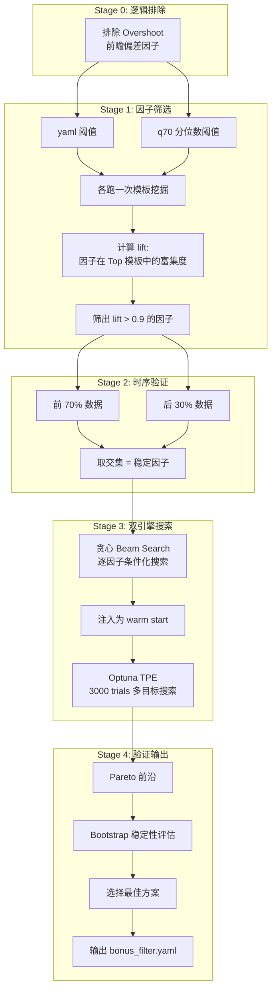

# 组合模板阈值优化系统 — 使用指南（因子方向统一版）

> 最后更新：2026-02-28

## 一句话概览

`BreakoutStrategy.mining.threshold_optimizer` 从原始突破数据中搜索最优的**因子阈值组合**，产出 `bonus_filter.yaml`。所有因子的触发方向（正向 `>=` / 反向 `<=`）统一由 `all_bonus.yaml` 的 `mode` 字段定义，业务评分代码和数据挖掘代码从同一来源读取。

---

## 它解决了什么问题？

### 问题 1：反向因子无法参与优化

Streak（近期突破次数）是一个**反向因子**（Spearman r=-0.22，值越高表现越差）。旧系统只有 `value >= threshold` 逻辑，导致 Streak lift 仅 0.744，被排除出组合。

修正后 Streak 以 `<= 1.54` 参与组合，lift 提升至 1.334。

### 问题 2：因子方向配置散落多处

旧架构中方向信息分布在：
- `all_bonus.yaml` 有 `mode` 字段但 `param_loader.py` 丢失了它
- `optimize_thresholds.py` 硬编码 `NEGATIVE_FACTORS = {'Streak'}`
- `auto_correct_bonus.py` 有独立的方向判断逻辑

**现在统一为 `all_bonus.yaml` → 全链路读取**。

---

## 完整数据流

```
scan_results_all.json
     │
     ▼
mining.data_pipeline                   # 中性观测器（始终 gte，不读 mode）
     │ → bonus_analysis_data.csv
     ▼
mining.factor_diagnosis                # Spearman 方向诊断（raw value 空间）
     │ → 输出报告 + 可选自动修正 all_bonus.yaml
     ▼
all_bonus.yaml                         # 单一事实来源（含 mode: gte/lte）
     ├── → breakout_scorer.py          # 业务评分（via param_loader.py 透传 mode）
     └── → mining.threshold_optimizer  # 组合挖掘（load_factor_modes 读取 mode）
              │ → bonus_filter.yaml
              ▼
           UI 使用 bonus_filter.yaml 筛选突破
```

### 设计要点

- **`mining.data_pipeline` 不读 mode**：它是"中性观测器"，始终用 `>=` 计算 level。这保证了方向诊断的原始数据不受预设影响。
- **方向诊断在 raw value 空间**：`mining.factor_diagnosis` 用 Spearman 相关性判断方向，避免了用 level（已编码方向假设）做循环论证。
- **`all_bonus.yaml` 是唯一的 mode 来源**：业务代码 (`breakout_scorer.py`) 和挖掘代码 (`mining.threshold_optimizer`) 都从它读取，保证方向一致。

---

## 四阶段流水线



#### Stage 0: 逻辑排除

排除 Overshoot 因子。`overshoot_ratio` 使用了 `gain_5d`（突破后 5 天涨幅），而 label 包含突破后 5-40 天收益，两者共享 5 天窗口，产生统计伪相关。

#### Stage 1: Bootstrap 因子筛选

用两套阈值（yaml 阈值 + 数据 q70 分位数）各跑一次完整的模板挖掘，看每个因子在 Top-30 模板中出现频率是否显著高于全局（lift > 0.9）。**反向因子使用 `<=` 触发**，由 `load_factor_modes()` 从 yaml 读取。

#### Stage 2: 时序验证

按日期将数据分为前 70% / 后 30%，分别运行 Stage 1，只保留两个窗口中 lift 均通过的因子。

#### Stage 3: 双引擎搜索

- **贪心 Beam Search**：逐层添加因子，每层搜索 20 个候选阈值，保留 top-3 路径。反向因子的 mask 用 `<=`。
- **Optuna TPE**：以贪心结果作为 warm start，3000 trials 多目标搜索。通过 `build_triggered_matrix()` 自动按 mode 选择 `>=`/`<=`。

#### Stage 4: 验证输出

从 Pareto 前沿选择最终方案，Bootstrap 1000 次评估稳定性。

### 最新优化结果

| 指标 | 值 |
|------|-----|
| Top-5 avg median | 0.6292 |
| 总模板数 | 81 |
| 活跃因子 | Volume, Height, DayStr, **Streak (<=)**, Drought, **Age (<=)**, PK-Mom, PBM |
| 反向因子 | Streak (<=1.54), Age (<=22.13) |

---

## 使用方法

### 场景 A：添加新 bonus 因子后

1. **按 `add-new-bonus` skill 完成代码修改**
   - Step 9 注册到 `diagnose_factor_direction.py` 的 `FACTOR_MAP`
   - 在 `optimize_thresholds.py` 的 `FACTOR_CONFIG` 添加映射

2. **运行全量扫描**（生成含新字段的 JSON）

3. **重建分析数据集**：
   ```bash
   uv run -m BreakoutStrategy.mining.data_pipeline
   ```

4. **诊断因子方向**：
   ```bash
   uv run -m BreakoutStrategy.mining.factor_diagnosis
   ```
   如果新因子 Action=FLIP，使用 `correct-factor-direction` skill 修正 `all_bonus.yaml`

5. **运行阈值优化**：
   ```bash
   uv run -m BreakoutStrategy.mining.threshold_optimizer
   ```

### 场景 B：新数据到达，重新挖掘

**一键管线**（自动修正方向 + 优化）：
```bash
uv run -m BreakoutStrategy.mining.pipeline
```

**交互式**（推荐，可逐步确认）：
使用 `orchestrate-bonus-pipeline` skill。

### 场景 C：仅检查/修正因子方向

```bash
uv run -m BreakoutStrategy.mining.factor_diagnosis
```

看到 FLIP 后，设置环境变量自动修正：
```bash
BONUS_AUTO_APPLY=1 uv run -m BreakoutStrategy.mining.factor_diagnosis
```

### 场景 D：调参

所有参数在 `main()` 开头声明：

```python
def main():
    top_k_templates = 30       # Bootstrap 分析的 top-K 模板数
    min_count_screening = 10   # 筛选阶段最小样本量
    temporal_split = 0.7       # 训练/测试分割比例
    beam_width = 3             # 贪心搜索保留路径数
    n_trials = 3000            # Optuna 搜索次数
    trigger_rate_lo = 0.03     # 触发率下限
    trigger_rate_hi = 0.50     # 触发率上限
```

---

## 相对旧 orchestrate-bonus-pipeline 的优势

| 维度 | 旧管线 (auto_correct) | 新系统 |
|------|---------------------|--------|
| **方向来源** | 硬编码 + 散落多处 | `all_bonus.yaml` 单一事实来源 |
| **方向诊断** | 依赖 level 分箱（循环论证） | raw value Spearman（无信息损失） |
| **优化策略** | 单因子逐个优化 | 组合优化（Beam Search + Optuna 联合搜索） |
| **触发率控制** | 无（膨胀到 60-99%） | 3%-50% 硬约束 |
| **防过拟合** | 无 | 时序验证 + Bootstrap |
| **反向因子** | 支持但 param_loader 丢失 mode | 全链路透传，Streak/Age/PeakVol 自动识别 |
| **新因子接入** | 改多处映射 | `FACTOR_MAP` 加一行 |

### 关键提升

1. **Streak 首次可用**：lift 从 0.744 提升至 1.334，进入组合模板
2. **自动发现反向因子**：Spearman 诊断替代人工判断
3. **方向一致性保证**：业务代码和挖掘代码读同一个 mode
4. **触发率膨胀彻底解决**：旧方案 Volume 91%、Streak 99%；新方案全部在 3%-50%
5. **零循环论证**：方向诊断在 raw value 空间，不受 level/threshold 预设影响

---

## 关键文件

| 模块/文件 | 角色 |
|------|------|
| `BreakoutStrategy.mining.threshold_optimizer` | 阈值优化器（四阶段流水线） |
| `BreakoutStrategy.mining.factor_diagnosis` | 因子方向诊断 |
| `BreakoutStrategy.mining.data_pipeline` | 数据准备（JSON → CSV） |
| `BreakoutStrategy.mining.pipeline` | 一键管线（CI/CD 模式） |
| `configs/params/all_bonus.yaml` | 因子方向 + 阈值配置（单一事实来源） |
| `configs/params/bonus_filter.yaml` | 组合模板输出 |
| `outputs/analysis/bonus_analysis_data.csv` | 分析数据集 |
