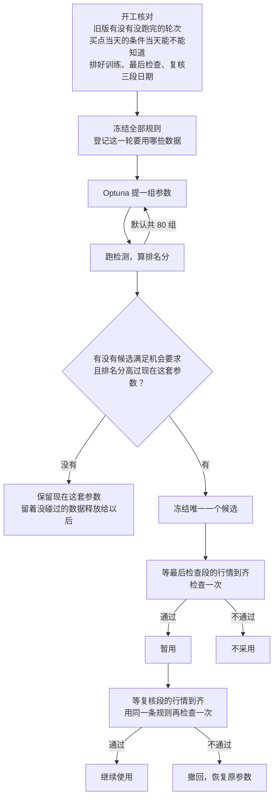

# tune-gates v3 通俗解释

> 来源：2026-10-06 修改后的 `.claude/skills/tune-gates-v3/`（`SKILL.md`、`references/method.md`、`references/runbook.md`）与 `docs/adr/0006`、`0007`；示例数字来自同日在真实全部股票上跑的一次 3 组参数的冒烟测试（bottom_burst，训练段 2024-07 至 2025-10，该段早已登记为开发数据）。
> 状态：已实施，尚未在真实调参里跑过完整一轮；默认值是待验证的工程起点。

**一句话：v3 用 Optuna 在训练数据里找参数，排名只看「买点比同一天的普通买入多走好多少」，并且领先越靠薄证据撑着就折得越多；选出唯一一个候选后，用没碰过的数据检查一次，通过就暂用，到期再用同一条规则复核一次，决定继续使用还是撤回。**

## 用到的词

| 词 | 意思 | 出处 |
|---|---|---|
| pattern | 一组节点和关系组成的走势声明 | [path2/CONTEXT.md:96](../../path2/CONTEXT.md) |
| 买点 | 一次命中里真正用来算后续表现的那些 K 线；同一只股票同一天只算一次 | [path2/CONTEXT.md:159](../../path2/CONTEXT.md) |
| 首次穿越 | 买点之后先碰上方目标线还是下方目标线 | [path2/CONTEXT.md:148](../../path2/CONTEXT.md) |
| 同日普通买入对照 | 在买点的同一天、同样波动水平的全部普通买入，算同一个成绩；扣掉了那几天大盘的涨跌，只剩选股 | [path2/CONTEXT.md:155](../../path2/CONTEXT.md) |
| 随机日基线 | 从整个股票池随机抽日子买入的成绩；不限同一天，所以比出来的差同时含择时与选股 | [path2/CONTEXT.md:152](../../path2/CONTEXT.md) |
| 前瞻收益 | 买点之后观察期内最高涨到多少；量的是潜力，含波动率 | [path2/CONTEXT.md:141](../../path2/CONTEXT.md) |
| 方向成绩 | 买点里「先上的比先下的多多少」，按时段、偏重近期汇总 | [SKILL.md「固定口径」](../../.claude/skills/tune-gates-v3/SKILL.md) |
| 统计折扣 | 领先部分按证据多少打折，证据越薄折得越多 | [SKILL.md「运行时用语」](../../.claude/skills/tune-gates-v3/SKILL.md) |

## 1. v3 和旧版各管什么

日常说「调一下 XX 的参数」「阈值放哪」「继续调 XX」「新数据来了，上次定的参数还成立吗」，默认进 v3。旧版 tune-gates 留给三件事：这个 pattern 有没有底子、哪道闸该不该删、找稳健区域；旧版已经开局但没跑完的轮次也交回旧版续跑（v3 开工第一步就查这个）。

v3 只改参数的取值。检测逻辑、拓扑、买点定义、观察期这些「尺子」不在调的范围里。

## 2. 整体流程



三段数据在时间上首尾相接、互不重叠，每段前面都要留一截「回看」给检测预热，后面要留一截「未来」给观察期：

```
 训练段                          最后检查段                      复核段
 [回看|买点区间|未来40日]  …  [回看|买点区间|未来40日]  …  [回看|买点区间|未来40日]
  ▲ 已有数据，搜索时反复用      ▲ 未来的数据，只看一次          ▲ 更晚的数据，只看一次
```

回看起点不用手填：v3 会看搜索范围里每个参数取到两头时检测各需要多长的历史，取最长的再多留 5 个交易日。如果推出来的回看起点压到了上一段的未来尾巴，开跑前就会报错，并告诉你推出来的日期，把后一段往后挪即可。

## 3. 每个买点怎么打分

买点当天收盘价是起点，按当天已经知道的波动大小在上下各画一条线，线是买入时就定死的。之后最多观察 40 个交易日，每天只看收盘价：先收在上线以上记 +1，先收在下线以下记 −1，40 天都没碰到记 0。

用收盘价而不用盘中最高最低价，是因为同一天不可能收盘既在上线以上又在下线以下，先后总分得清；代价是「没碰到」会多一些。没碰到的买点照样算进分母，它不是坏数据，也不代表收益为零。

然后把日子切成连续的 21 个交易日一段，每段算「先上数 − 先下数」除以「这段的买点总数」，再把有买点的各段按「越近越重」平均，得到这套参数的方向成绩。方向成绩 0.2 不是赚了 20%，它只是方向上的净优势。

前瞻收益和盘中回撤照样算、照样报告，但不参与排名。

## 4. 排名看什么：比同一天的普通买入多出多少

### 为什么不直接比方向成绩

方向成绩里混着三块东西：

| 这一块 | 意思 |
|---|---|
| 整体行情 | 这段时间大盘整体涨还是跌 |
| 择时 | 买点是不是恰好落在随后大盘上涨的日子 |
| 选股 | 同一天里，挑出来的股票是不是比别的股票走得好 |

整体行情对所有参数都一样，不影响谁排前。择时这一块看着诱人，但 v3 刻意不去优化它：pattern 只看单只股票的 K 线，预测不了之后的大盘；而且择时好不好取决于少数几段大盘起伏，一年多的训练期里只有十几段，让 Optuna 去追它，等于让它去背训练期那几段行情。参数真正能稳定改变的，是「同一天留下哪些股票」——也就是选股。

所以排名用的是方向成绩减去同日普通买入对照，只剩选股这一块，下文叫「领先」。

### 领先按证据打折，但只折正的

两个候选领先都是 0.06，一个靠几千个买点撑着、各时段都差不多，另一个只靠几十个买点、时好时坏，后者更可能是运气。统计折扣就是给领先乘一个 0 到 1 之间的保留比例：各时段的领先越稳、越不像偶然，保留得越多。

| 候选 | 领先 | 保留比例 | 排名分 |
|---|---:|---:|---:|
| 甲：买点多、各时段稳定 | 0.06 | 95% | 0.057 |
| 乙：买点少、时好时坏 | 0.08 | 50% | 0.040 |
| 丙：落后于同日普通买入 | −0.05 | 不打折 | −0.05 |

乙的领先虽然更大，排在甲后面——这就是「证据更足的参数优先」，买点数量不直接加分，但买点多通常意味着证据足、折得少。

落后的候选不打折，是为了堵一个漏洞：如果负数也乘保留比例，证据越薄的候选会被拉得越接近 0，反而能排到「落后但证据扎实」的现役前面。极端情况下证据薄到估不出波动，保留比例为 0，正的领先记成 0、负的照原值，所以它不可能靠「什么都看不清」胜出。

搜索、挑候选、最后检查、复核，全程用同一个排名分。

### 三种对照怎么一起看

报告里三样都列，只有最后一样参与排名：

| 报告项 | 含哪几块 | 用途 |
|---|---|---|
| 方向成绩本身 | 整体行情 + 择时 + 选股 | 判断这个 pattern 这段时间值不值得用；为负时醒目提醒你 |
| 对随机日基线的差 | 择时 + 选股 | 只报告 |
| 对同日普通买入对照的差（领先） | 选股 | 排名分的来源 |

冒烟测试里 bottom_burst 现在这套参数的读数正好说明三者的区别：方向成绩 −0.030（这段时间整体是负的）；随机日基线 +0.012，所以对它的差是 −0.042；同日普通买入对照 −0.037，所以领先是 +0.006。拆开看：它的买点偏偏落在随后大盘走弱的日子（择时约 −0.048），但在同一天里挑的股票略好一点（选股 +0.006）。v3 调参只想把后面这一块调大；前面那块要不要在意、这个 pattern 还要不要用，是你的决定。

### 机会只设两条下限

候选的总买点数、最近 126 个交易日的买点数，各自不少于现在这套参数的一半。超过下限不加分。以前还有「方向成绩必须为正」「领先不能为负」两道线，已经删掉：在下跌行情里，它们会把好候选和没效果的候选一起拦下，最后留下的反而是更差的现役。「不比现役差」现在由排名分本身保证——候选的分必须高过现役才会被选中、才会在最后检查里通过。

## 5. 四种结局

| 结局 | 什么时候 | 会做什么 |
|---|---|---|
| 暂用 | 最后检查里机会要求都满足、排名分高过原参数 | 写入候选参数，告诉你复核日期 |
| 继续使用 | 复核里同一条规则再次通过 | 保持候选参数，本轮结束 |
| 不采用 | 最后检查没通过 | 保留原参数 |
| 撤回 | 复核没通过 | 恢复原参数 |

「继续使用」的意思是两段互不相干的新数据都看到了改善，不是统计上证明了改善。只看「有没有改善」的检查，对完全没效果的改动差不多是抛硬币，两次都碰巧偏好它的机会约四分之一，所以总会有一部分没效果的改动被长期留下——它们按定义不伤人。这条流程真正靠得住的是拦住明显变差的改动。

开跑时 v3 会告诉你最后检查和复核最早什么时候能出结论（各段未来尾巴结束、行情也更新到位之后）。

## 6. 偶然波动：这一轮能不能分出好坏

搜索开始前，v3 会把现在这套参数的买点按股票整只重新抽 200 遍（抽中两次就算两份），看领先会晃多少，报一句话：

> 领先部分的偶然波动约 ±X，相近参数之间的差别一般是它的一半左右；过去实测参数改动的效果约 0.03（待验证）。

X 的一半明显大于 0.03，说明这一轮基本分不出好坏；如果当时没用全部股票，会提醒你一次扩大股票池。这个数只报告，不拦流程、不进排名。它没算「同一天全市场一起动」带来的波动，所以是偏乐观的下限。

冒烟测试里，全部股票时这个 X 约 0.04，一半约 0.02，比 0.03 小，勉强分得出。

## 7. 几个工程上的保护

- **股票池默认全部股票**，不用挑。这是唯一能直接增加信息量的办法。
- **行情没更新不白白作废数据**：最后检查和复核会先只看每个文件的最后日期，判断行情是否整体更新到位（本段开始时还在更新的股票里，九成以上到齐就算到位）；没到位就直接报「行情整体尚未更新」，这时还没登记使用，数据仍算没碰过，更新行情后重跑即可。少数没更新的股票照常保留，报告里列出个数。
- **检测代码改过之后**：冻结时会记下当时的 git 提交。检查时发现代码变了，会拒绝并告诉你那个提交；在该提交上开一个 worktree 跑检查即可（报错里写好了要指向的路径）。如果冻结时代码有没提交的改动，就没有可退回的确切版本，这一轮只能关掉重来。
- **只在主目录跑**：账本和运行目录只有一份，不会因为在 worktree 里跑、删了 worktree 就找不到。
- **bottom_burst 与 bb_v1 等 bb 系 app 算同一谱系**：一个用过的数据，另一个也不能当没见过。

## 8. 局限

- 统计折扣的力度没有校准过：对成绩不确定程度的估计可能偏小，折得偏轻；数据很厚时保留比例接近 100%，折扣几乎不起作用（这是该有的性质，证据厚时让开）。
- 偶然波动只算了换股票带来的部分，是下限。
- 择时不进排名。如果某个 pattern 真有择时能力，调参不会去放大它；那要用多轮涨跌周期的长历史单独验证。
- pattern 只看单只股票，找不到「相对大盘超跌」这类必须先知道大盘才能定义的信号。
- 全部股票下一次搜索比较慢：冒烟实测每组参数约 55 秒，加上开头约 2 分钟的读数和标签计算，默认 80 组约 75 分钟。
- bottom_burst 自己声明的首部回看（63 个交易日）没有覆盖它某些检测量的完整回看链；自动推算的回看起点以它为准，会继承这个缺口。这是 app 层的问题。
- 只用现存股票的数据，不含已退市股票的偏差；也没算交易成本与成交限制。方向成绩不是资金回报。

## 附表

### 默认值（每轮开始前冻结，均为待验证的工程起点）

| 项 | 默认 |
|---|---|
| 股票池 | 数据目录下全部股票 |
| 观察期 | 40 个交易日；上下线距离 = 5 × 当日波动尺度 |
| 时段长度 / 近期权重半衰 | 21 个交易日 / 252 个交易日 |
| 近期买点数的统计范围 | 最近 126 个交易日 |
| 机会下限 | 总数、近期数各 ≥ 现役的一半 |
| 统计折扣 | 默认开；差异尺度 0.1，相邻时段相关跨度 80 |
| 回看起点余量 | 最长回看 + 5 个交易日 |
| 行情到齐比例 | ≥ 90% |
| 偶然波动重抽次数 | 200 |
| 搜索次数 | 80 |

### 排名分公式

领先 = 方向成绩 − 同日普通买入对照；保留比例 = τ² ÷ (τ² + 领先的不确定程度估计)，τ 默认 0.1；排名分 = 领先与「领先 × 保留比例」中较小的那个。关掉统计折扣时排名分就是领先。完整算法见 [method.md](../../.claude/skills/tune-gates-v3/references/method.md)。

### 冒烟测试读数（2026-10-06，bottom_burst，全部 5778 只股票，3 组参数）

| 项 | 数值 |
|---|---:|
| 现在这套参数的买点数 / 来自几只股票 | 6326 / 316 |
| 方向成绩 | −0.030 |
| 随机日基线 / 对它的差 | +0.012 / −0.042 |
| 同日普通买入对照 / 领先 | −0.037 / +0.006 |
| 领先保留比例 | 97.5% |
| 偶然波动（领先） | ±0.040 |
| 行情没更新到位的股票 | 0 |
| 读数与标签计算 / 每组参数 | 约 127 秒 / 约 55 秒 |
