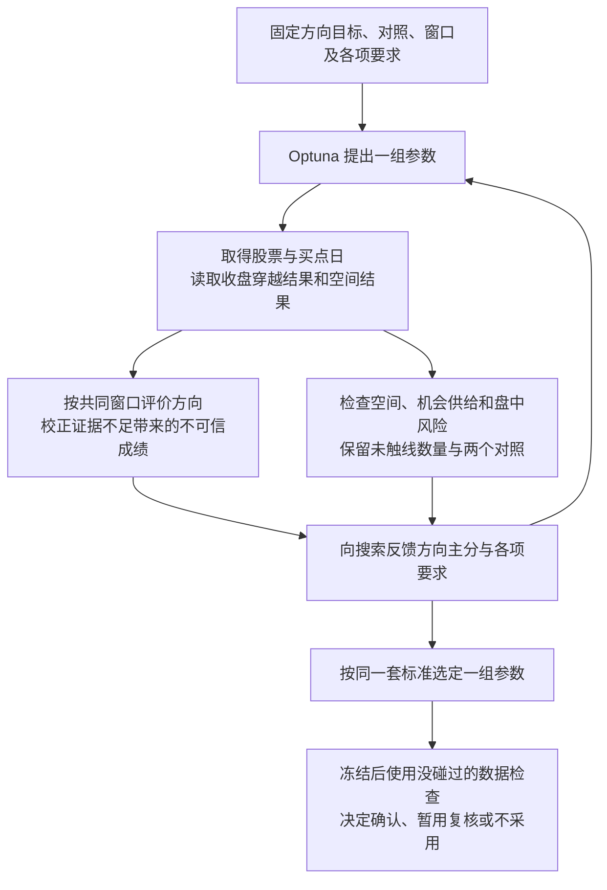

# tune-gates v3 设计修订：方向优先，初定用收盘价判断穿越

> 来源：2026-10-02 关于优化目标、统计证据、首次穿越与收盘价的设计讨论。
> 状态：**设计记录，尚未实施。收盘价判断是初定选择，尚未证明预测效果更好；完整评分公式仍待确定。**
> 本文所有项目内路径均相对 repo root。

**本次设计将重点从上涨空间转向有证据支持的上涨方向优势，初定用后续每日收盘价判断首次穿越；上涨空间、机会供给和盘中风险继续参与评价。**

## 用到的词

| 词 | 本文含义 | 出处 |
|---|---|---|
| 买点 | 真正用于评价买入后表现的股票日期；同股同日只计一次 | [path2/CONTEXT.md:155](../../path2/CONTEXT.md:155) |
| 前瞻收益 | 买点后固定期限内的最大上涨幅度，本文称上涨空间；不是已经兑现的利润 | [path2/CONTEXT.md:141](../../path2/CONTEXT.md:141) |
| 首次穿越 | 先到上方还是下方目标线；本文记录将判断方式初定为收盘价的新设计，当前代码仍判断盘中是否触线 | [path2/CONTEXT.md:148](../../path2/CONTEXT.md:148) |
| bo | 简单突破规则，用作比较对象时参数事先固定 | [path2/CONTEXT.md:11](../../path2/CONTEXT.md:11) |

## 本轮修改了哪些判断

| 内容 | 本次设计记录 |
|---|---|
| 优化主次 | 方向表现提升为主目标；上涨空间不再作为唯一主目标，改为必要补充或次要比较依据 |
| 穿越判断 | 初定用后续每日 `close` 判断，取代主评价中的 `high / low` 触线判断 |
| 买入起点 | 仍用买点当天 `close`，不因改判断方式而改变起点 |
| 上下目标线 | 暂时沿用现有算法与观察期限；目标线根据买点当天已知波动水平确定 |
| 对照口径 | pattern、普通买入、bo 买入统一采用收盘价穿越口径 |
| 盘中高低价 | 保留用于检查盘中风险；不混入收盘方向比例 |
| 统计可靠性 | 决定观察到的方向成绩值得相信多少，不能给买点数或重抽次数无限加分 |
| 资金假设 | 按资金有限讨论机会价值；不再默认每个买点日都可以无限等额新增买入 |
| 评分与入选 | 搜索和训练内最终入选使用同一套主分与要求，不另加一套相互冲突的空间排名 |
| 尚未确定 | 方向分如何校正、如何汇总窗口、空间和供给的具体要求，以及完整交易规则 |

这些是设计层面的修订，不表示现有工具已经切换。早期说明中“空间优先、方向只守下限”的表述仍对应旧实现，不能继续当作新设计的最终方向。

## 为什么方向表现更值得优先

上涨空间只看未来最高能涨多远。价格即使没有更强的上涨倾向，只是上下波动更大，也可能得到更高的空间成绩；先大跌再大涨，也可能拥有很大的上涨空间。

首次穿越同时观察向上和向下，并区分先后顺序，更贴近本次希望识别的“买点之后是否更有先向上走的倾向”。因此设计改为方向优先，而不是继续把方向仅当成空间评分的附属要求。

这不等于宣称首次穿越完全不受波动率影响。现有目标线随买点前的波动水平调整，是为了控制尺度差异；未来波动变化、有限观察期限及买点所在的市场环境，仍会影响结果。方向表现必须带普通买入和 bo 对照解释，不能直接把高比例当成 pattern 的独有能力。

上涨空间仍有作用：方向容易判断但幅度过小，也未必值得实际交易。具体采用最低幅度要求还是次要比较，目前尚未定稿，不能凭空给方向与空间规定一个交换系数。

## 收盘价判断具体怎样算

每个买点日独立评价，按以下顺序：

1. 以买点当天的收盘价为起点，用当天及之前已知的波动水平计算上下目标线。
2. 两条线在本次观察期内保持固定，不用后续价格重新移动目标线。
3. 从买点的下一个交易日起，逐日检查收盘价，直到事先固定的观察期限结束。
4. 最早收盘价达到或超过上线，记为“先上”；最早收盘价达到或低于下线，记为“先下”。
5. 期限内没有任何收盘价越过两条线，记为“未触线”。

单个收盘价不可能同时处在两条不重叠目标线的外侧，因此收盘口径没有“同日触及两线”这一结果。盘中高低价仍可能两条线都碰到，这应记在单独的风险检查里，不再混进收盘方向统计。

起点、目标线算法、期限暂时不变，本次初定修改的只是**用什么价格判断越线**。不能同时更换目标线宽度，再把分数变化全部归因于收盘价。

### 方向比例与未触线

暂沿用“只在已分出方向的买点中计算先上比例”的含义：

> 收盘方向比例 = 先上数量 ÷（先上数量 + 先下数量）

未触线数量、全部真实买点日数量和能够分出方向的数量必须同时报告。若没有任何买点分出方向，这个比例没有定义，不能记为零，也不能冒充高分。

这是方向比例的记录口径，**还不是完整的 Optuna 主分公式**。如果许多买点都未触线，只剩少量买点先上，比例也可能看起来很好；怎样要求足够的证据、怎样评价结果出现得是否够及时，仍需后续确定。不能通过只保留容易分出方向的少量买点来证明整个策略更好。

## close 可能带来的好处与代价

收盘价判断会忽略盘中触线后又回到线内的情形，更贴近日线方向的评价目的。但它只是要求收盘时已经越线，**不代表连续多日站稳，也不证明走势本身变得更有规律**。

例如：第一天盘中跌破下线、没有触及上线，收盘回到两线之间；第二天收盘越过上线。盘中口径判先下，收盘口径判先上。后者可能过滤了不在意的短暂波动，也可能忽略足以触发实盘止损的下跌。保留盘中风险检查正是为了看见这个代价。

在目标线和期限相同的条件下，改用收盘价后，未触线的数量会更多或不变；同日两线都碰的结果消失，能够判断方向的样本集合也会变化。因此不能直接以“新比例比旧比例高”作为收盘口径更好的证据。

后续比较应让两种口径各自使用相同口径的普通买入和 bo 对照，观察另一段未参与该次搜索的数据中，方向优势是否仍能保持，同时检查盘中风险和未触线比例。用于修改方法的数据只能算开发数据，不能再当最后独立验证。

## 对照与统计证据如何参与搜索

普通买入是相同日期、同一可交易股票池里不要求命中 pattern 的买入；并不特意排除 pattern 命中。与方向有关的比较还需控制相近的波动水平，避免只比较到不同市场背景。bo 对照使用事先固定的简单突破规则，不能随候选参数变化偷偷调整。

两个对照都必须同步使用新的收盘标签、相同目标线算法和观察期限。普通买入帮助判断方向成绩有多少来自同期背景；bo 帮助判断复杂 pattern 相比简单方法是否有价值。是否作为必须达到的采用要求，取决于实际用途，不能自动设成每个窗口都必须显著胜过两个对照。

**业务决定追求什么，统计决定成绩信多少。**方向表现作为主目标后，统计校正也应围绕方向表现设计，不能继续返回空间成绩，却把结果称为方向优化。

向合理参照回拉不充分可靠的观察成绩，是值得研究的办法，但目前没有定下公式；不能把旧空间公式换个名字直接用于方向，也不能直接用原始买点数、200次重抽或旧代码中的固定常量决定可信程度。重复行情、同股连续买点和重叠窗口并不提供同样多份独立证据。

机会数量需要分成两件事：有没有足够可用机会，以及有没有足够证据判断方向。资金有限时，更多同时出现的信号不一定都能使用；也不能为了每个月都有买点而强迫低质量交易。具体使用要求由研究和实际交易规则确定，不要求用户指定数值。

## 随机窗口的思路怎样衔接

此前选择的窗口安排作为设计起点继续保留：在训练历史中随机选择连续约一个月的时段起点，有放回抽取200个窗口；所有候选共用同一份安排。每次看的是一个窗口，不把抽到的许多窗口拼成整份历史再计算一次。重抽只读取已缓存结果，不重新检测或重新搜索。

主指标换成方向后，**不能机械照搬“内外两层中位数”**：

- 窗口内的方向表现应按先上与先下的数量计算比例；对先上、先下的零一标记取中位数，会丢失大量方向比例信息。
- 窗口之间是否仍取中位数、是否先校正各窗口再汇总，尚待明确。中位数表达偏重典型时段的选择，并非天然最全面。
- 无买点或没有分出方向的窗口必须保留状态与数量；不能补上普通买入成绩，不能重抽到只剩有结果的窗口。
- 抽到重叠窗口时按抽样安排汇总，但实际机会总数从原始股票与日期去重计算，不能累计成多份机会。

窗口长度与次数只是沿用的设计起点，效果仍待验证；增加重抽次数不会创造新的市场证据。

## 修订后的流程



搜索仍主要在训练数据内完成。主目标改为方向后，训练内选参、最后验证和暂用复核也应围绕同一业务目标安排；不能让搜索追方向，最后却只因原始空间稍低便按另一套排名拒绝。确实需要的空间底线，应在搜索开始前明确，并在全过程一致执行。

此前允许“看起来有改善但证据不足时暂用、之后复核”的业务选择，以及近期适用优先，未在本次讨论中取消；具体判断需要随新的方向目标重新定义，不能直接继承旧空间判断公式。

## 仍待确定与实施边界

| 待确定内容 | 当前边界 |
|---|---|
| 方向主分 | 优化校正后的方向比例，还是校正后的对照优势，以及如何校正，尚未定完整公式；二者可能导致不同排名 |
| 窗口汇总 | 窗口内用方向比例；外层中位数与其他汇总方式的选择仍需论证 |
| 未触线处理 | 必须报告并检查证据是否足够；是否纳入业务评分及怎样纳入，未定 |
| 上涨空间角色 | 不再独占主目标；作为幅度下限还是次要比较，未定 |
| 机会供给 | 按有限资金讨论价值，不无限奖励；实际需求依赖选股、持仓和退出规则 |
| 实盘收益 | 尚未定义完整执行规则，方向比例和上涨空间都不能直接冒充实际资金收益 |

目前只是沉淀设计，未修改 `path2/eval.py`、v3 配套脚本、skill、现役参数或领域词表，未运行真实调参，也未读取留着没碰过的数据。后续实施须同步处理搜索评分、缓存口径、对照、验证与报告；不能只改一个价格字段就宣称整套方法已完成切换。

## 算法对照附注

现有代码的上下线由买点收盘价和买点前波动水平计算。设买点收盘价为 `P`，当时波动尺度为 `M`，现有宽度参数为 `k`：

```text
上方目标线 = P × (1 + k × M)
下方目标线 = P ÷ (1 + k × M)
```

本次初定保留这两条线，用后续收盘价判断是否达到，而非后续最高价与最低价。当前代码事实见 [path2/eval.py:54](../../path2/eval.py:54)；旧方向比例的实现见 [scoring.py:94](../../.claude/skills/tune-gates-v3/scripts/scoring.py:94)。这些链接用于区分现状与拟议改动，不代表代码已经采用本文设计。
