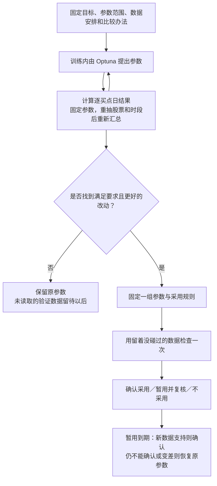

# tune-gates v3：训练内优化，最后验证决定采用

> **后续设计修订（2026-10-02）**：已记录“方向优先、初定用收盘价判断首次穿越”的新方向，尚未实施，具体评分公式仍待确定。见[方向优先与收盘穿越](tune-gates_v3方向优先与收盘穿越_通俗解释.md)。本文下述空间优先规则仍描述旧实现，不作为新设计定稿。

> 来源：2026-10-01 已确认的设计决策及 `.agents/skills/tune-gates-v3/` 实现。
> 状态：skill 和配套搜索、评价工具已实现；默认规则尚未经过真实市场效果比较，不代表已优于 v1、v2。

**v3 已按你的方向定稿：优先提高每个买点日的典型上涨空间，方向表现和机会数量守住下限；主要优化在训练数据内部完成，最后只验证一组固定参数。**

## 用到的词

| 词 | 本文含义 | 出处 |
|---|---|---|
| pattern | 一组位置和关系组成的形态声明 | [path2/CONTEXT.md:96](../../path2/CONTEXT.md) |
| 买点 | 真正用于计算后续表现的位置 | [path2/CONTEXT.md:155](../../path2/CONTEXT.md) |
| 前瞻收益 | 买点后固定期限内的最大上涨空间 | [path2/CONTEXT.md:141](../../path2/CONTEXT.md) |
| 首次穿越 | 之后先碰上方还是下方目标线 | [path2/CONTEXT.md:148](../../path2/CONTEXT.md) |
| 随机日基线 | 同一股票池随机买入的对照 | [path2/CONTEXT.md:152](../../path2/CONTEXT.md) |

## 整体流程

## 三项评价分别怎么算

同一股票同一买点日只计一次；一个事件持续五个合格买点日，就有五次机会。当天必须已经知道成立条件，不能事后看到完整走势才把过去几天补成可交易机会。

- **空间：** 每个买点日分别计算固定后续期限内最高能涨到多少，再取所有这些日子的中位数。它是上涨潜力，不能直接当作实际卖出利润。
- **方向：** 每个买点日分别检查先碰哪条目标线。先碰上方的次数，除以至少触过一条线的次数；同一天碰两条线计入分母但不算先上。两条都没碰的单列，后续数据不足的也单列。
- **机会：** 看股票与买点日去重后的总数，达到下限以后不因为数量更多而另加分。当前工具用能完整评价的数量检查下限，可识别但无法评价的数量另报。

因此，这三项都以买点日为基础，但并非三项都取平均：空间取中位数，方向取上述比例，数量求和。每个事件先平均、再让事件等权的旧汇总方式不再作为主评价。

## 怎样选参数

Optuna 决定下一次试什么；v3 决定怎样评分。门槛可以松、可以紧，也可以在确有对应取值时取消；改变走势定义的参数，根据实际改变的识别含义定范围，不能仅看买点数增减。

所有候选优先比较预先规定的近期训练数据。较早数据单独展示，不能用过去的好成绩掩盖近期退步。原参数也参与比较，保留原参数是正常结果。

每组参数只计算一次逐日表现，重抽时只重新汇总。重复抽中同一股票或时段必须保留重复次数，不能去重掉。这样能看到成绩是否很依赖少数股票或某段行情，又不用每次重抽重新检测或搜索。

本版已固定一个可执行的评分办法：在很多次重抽得到的空间中位数中，取偏低位置的成绩参与排名，原始中位数另报。先排除原始空间没有改善、方向或机会要求不达标的候选，再在合格者中比较稳健空间分。这是一种明确的取舍，并没有被证明一定胜过所有其他办法。

随机日对照按相同日期、相近波动水平配比，避免只因换到本就容易大涨的一批日子就给出孤立的好坏结论。它不替换原始空间中位数。

## 保留了什么，取消了什么

保留逐日结果和准确的重复参数缓存；浮点数可以不按固定间隔试，但不同浮点值不能被四舍五入合并成同一组参数。检测参数真正改变时，重新运行该组检测。

取消强制寻找平稳区域、统一拿附近最差成绩排名。对半分保留为开发评分方法时的可选实验：在一半搜索，另一半比较完整搜索选出的结果。它不是重抽的前提，也不是每轮 v3 的固定步骤。

## 最后验证与暂用

最后只把一组固定参数交给留着没碰过的数据。看完以后不能换第二名、重写评分或挪动下限；中断也不会使已经读取的数据重新变成独立证据。

方向和机会要求通过，空间提高且已有支持改善的证据，才确认采用。看起来提高但证据不足，可以暂用；明确变差或硬要求不通过，则不采用。

暂用前已经固定后续新数据范围和复核时点。当前实现采用一次到期复核：到时仍不能确认，便恢复原参数。不会自动延长到结果满意，也不会仅因时间过去就变成确认采用。正式参数写入前保留完整原参数和文件备份，实际写入与仅给出建议分开记录。

## 已验证的范围

合成测试覆盖按日统计、缓存与重抽、近期选择、一次验证、暂用复核，以及旧版数据使用记录的兼容检查。没有通过这次开发读取真实行情或修改现役策略参数。

重抽只反映现有样本变化带来的差异，不证明未来有效，也不消除所有反复试验造成的运气。现有脚本自动检查买点事件确认时间，整组条件是否在当天可知仍需逐个 pattern 核查。它们都是实际使用时必须保留的边界。

## 默认值附表

下列值由实现者给出，作为待验证的起点，在每轮第一次比较前固定，不要求用户逐项决定。

| 项目 | 当前默认 |
|---|---|
| 重抽次数 | 200 次 |
| 用于排名的位置 | 重抽空间中位数的 20% 分位 |
| 时间块 | 至少 20 个交易日，且不短于评价期限 |
| 最少可评估买点日 | 30 个，并保留原参数至少一半的机会 |
| 方向要求 | 不低于配比后的随机日对照，相对原参数最多下降 2 个百分点 |
| 最低证据覆盖 | 3 只股票、3 个时间块；这不是独立样本数保证 |
| 搜索预算 | 80 次，包含原参数；可在看成绩前按成本调整 |

完整操作入口：[tune-gates-v3](../../.agents/skills/tune-gates-v3/SKILL.md)。
