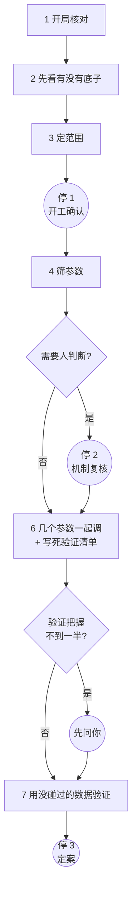
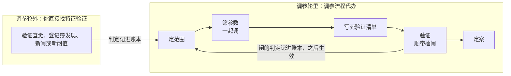

# 调参工作流使用指南

> 面向：要给 path2 的某个 pattern 调参数、但不想了解内部实现的人。
> 读完你应该知道：一轮调参分哪几步、每一步在干什么、你在哪几个时刻需要拍板、平时该怎么开口、调参和特征验证两个 skill 怎么配合。
> 想了解背后的道理（为什么这样排、为什么不直接跑优化器），看《tune-gates 是怎么调参的》；想知道每一步的结论怎么读，看《调参判据卡》。

---

## 1. 这套工作流是干什么的

一个 pattern 有几十个数要定：detector 的构造参数（确认根数、突破幅度门槛、窗口长度……），以及事件识别出来之后对它提的 where 条件的阈值（比如「这段买点里最大单日跌幅要小于 20%」）。下文把 where 阈值和少数起过滤作用的参数统称为「闸」。调参就是给这些数选取值。

这件事由两个 skill 分工完成：

| skill | 回答的问题 |
|---|---|
| **tune-gates**（调参） | 这些数定在哪、取什么值。从头到尾代办整轮调参；调参轮里你只需要和它打交道 |
| **feature-study**（特征验证） | 某个特征、某道闸到底该不该信、该不该存在。调参轮里由调参流程自动调用；调参轮外你可以直接找它 |

两者怎么配合、各在什么时候找，见第 5 节。

两个 skill 共用一本**样本使用账本**（每个 pattern 一个文件），记下哪段数据被谁、为了什么看过。这本账是整个流程防止「在同一份数据上反复挑、挑出运气」的基础。

贯穿全程的三条原则：

- **调参只能把已有的优势磨锐。** pattern 本身比随机买入没有优势时，从很多组合里挑出来的最好成绩多半是运气。所以先查有没有底子，再调。
- **每一次挑选都记账。** 筛选、一起调、查单个组合，每做一次记一笔；定案时会告诉你这组参数一共被比较过几次。
- **留出的两段验证数据只开一次。** 调参全部结束、验证清单写死之后，两段各打开一次，用完就不能再当独立检验。

评价好坏的主指标是**首次穿越率**：买入后在前瞻期（默认 40 个交易日）内，价格先碰到上方目标线、而不是先碰到下方止损线的比例。两条线按这只股票近期的波动幅度定，所以它剥掉了波动率，读到的是方向。任何「好 / 坏」都要对着**随机日基线**说——同一天、同样波动水平的随机买入日。

---

## 2. 一轮调参的全貌

| 步 | 在干什么 | 你要做什么 |
|---|---|---|
| 1 开局核对 | 从数据文件实际覆盖的日期，划出训练期和两段留出的验证数据 | 什么都不用做 |
| 2 先看有没有底子 | 拿买点和同一天、同样波动水平的随机买入日比首次穿越率，逐年给结论；顺便算出这份样本能分辨多小的改进 | 什么都不用做，结论在停 1 里告诉你 |
| 3 定范围 | 给每个参数提出「现值 / 松一档 / 紧一档」，剔除不能调的参数和取不了的值，估算耗时；**不看任何收益** | 停 1 拍板 |
| 4 筛参数 | 在现在这套参数附近每次只改一处，看哪些改动真的分辨得出好坏，哪些闸删了也不亏 | 什么都不用做 |
| 5 机制复核 | 把需要业务判断的机制问题合成一条消息问你 | 停 2 拍板（有需要才出现） |
| 6 一起调 + 写死清单 | 把筛出来的参数放在一起找「自己好、邻居也好」的组合，然后把「验证什么、怎么判」写死 | 把握不到一半时拍板 |
| 7 验证 | 打开两段没碰过的数据，按清单各检验一次 | 什么都不用做 |
| 8 定案 | 按事先写好的规则给出结论 | 停 3 拍板 |

常规只停三次；另有一个条件停点。其余全部自动，做完只报结果。

---

## 3. 每一步在干什么

### 3.1 开局核对

确认是哪个 pattern、代码和正式参数自上一轮以来有没有变过，然后从实际数据文件探测数据覆盖到哪一天，把时间划成三段并写进账本：

- **训练期**：调参时反复看的数据；
- **训练期之前留出的一段**、**训练期之后留出的一段**：最后用来验证的「没碰过的数据」。它们和训练期之间各隔开一个前瞻期，保证涨跌结果互不重叠。

这一步必须在任何人看过收益之前做完。看过收益再划，划分本身就可能被结果影响。

### 3.2 先看有没有底子

把这个 pattern 的买点，和**同一天、同样波动水平**的随机买入日比首次穿越率：

- 「同一天」排除了行情——那几天大盘涨，谁买都赚；
- 「同样波动水平」排除了股票类型——当天全部股票按波动高低分三档，只和同一档比。

分两种版本各比一次：**闸全部放开**（只看走势检测本身）和**现在这套正式参数**。每年给出三种结论之一：**有底子 / 还不能确定 / 没有**。如果闸全放开时没有、按正式参数有，说明底子来自现在开着的闸。

同时算出**分辨力**：这份样本在「一次比很多个改动」时，大约多少个点以上的差别才分辨得出；只验一个事先写好的改动时是多少；同时改两个参数够不够。

### 3.3 定范围

系统替每个检测参数提出候选：现值、松一档、紧一档，并按「买点数量大约留下三到七成」挑出松紧档。同时自动剔除：

- **衡量尺子**：改了等于换了「量什么」的参数（比如改了买点落在哪个 node 上），不能拿收益来挑；
- **取不了的值**：搭不出 pattern 的档、需要的首部缓冲超过本窗的档、和别的档搭出同一个 pattern 的档。

每道闸标出它有没有被单独验证过「该不该存在」：

| 闸的状态 | 这一轮能怎么动 |
|---|---|
| 验证过、确实有用 | 可以试多个取值 |
| 正在用、但没验证过 | 只能比「开着」和「关掉」两种 |
| 没在用、也没验证过 | 这一轮不许加进来调；想加的话在停 1 提出来随清单一起验，或者单独验证，结论下一轮生效 |

这一步不输出任何收益。范围在这里定死，是因为看过各档收益再定范围，范围本身就成了又一次挑选。

### 3.4 筛参数

先扫描一遍全部股票，再做**一致性验证**：抽一批组合、在至少 500 只股票上用原引擎逐个重跑，确认快速扫描的结果和重跑一模一样，对不上就停，不读结果。

然后在现在这套参数附近**每次只改一处**：

- 每个检测参数试松一档、紧一档；
- 每道开着的闸试关掉，看「删了亏不亏」；
- 另把改动两两组合试一下，只用来发现「要一起改才看得出效果」的参数。

每个改动在两个版本上各比一次：现在这套参数（为主）、闸全关掉（作对照）。所有改动算在同一族里做多重比较校正——一次比得越多，单个改动要过的门槛越高。同一段买点被好几条 match 共享时只算一次，同一只股票反复出现也按它的真实信息量折算。

报告里会一并标出：两年是否明显不一样、各时期是否时好时坏、只在一个版本上有效、改动之后是否只是换了一批股票、每个改动靠多少段买点撑着。

### 3.5 机制复核（停 2，有需要才出现）

能自动判的先判掉，留给你的只有业务判断。只有出现下面情况时才停：

- 某个要动的改动带了提醒（效果依赖别的闸开不开、两年明显不一样、可能换了一批股票等），需要你判断机制上能不能接受；
- 有闸「删了不亏」，需要你确认它是不是这个走势定义的一部分。

顺带确认**采纳规则**：验证完之后按什么顺序决定采纳哪套参数。默认是先整套改动，不过就按训练期证据从强到弱逐项退，都不过就维持现状。删闸之后，筛选会在删闸后的参数上自动重算，不用重新扫描。

### 3.6 几个参数一起调 + 写死验证清单

只把筛选里分辨得出的参数（以及和它们一起改会互相影响的参数）放进一张网格，找「自己好、邻居也好」的组合，参照点是现在这套参数。评估时会把「从很多组合里挑出最好的」带来的虚高估出来并扣掉。

- 样本只够一次改一个参数时，退化为「在单个改动里挑」，并告诉你为什么；
- 连单个改动都分辨不出时，结论就是维持现状。

挑完之后，按采纳规则把候选**机械展开**成一张决策表（先验整套，不过验哪几个单项，都不过维持现状），连同全部检验方式**写死成一份验证清单**记进账本。这时还会估出**验证把握**：按训练期的效果（已扣掉挑选虚高）和验证数据的买点量，这次验证能把改进确认下来的概率。

### 3.7 用没碰过的数据验证

两段各开一次，用同一份清单：

- **训练期之前那段**做正式检验：按决策表顺序逐个检验，选出第一个确认下来的配置；
- **训练期之后那段**做核对：选出的配置有没有变差、方向和训练期是否一致。

清单里保留的闸，也在同一次开窗里顺带检验它们该不该存在，不算多开一次。

### 3.8 定案（停 3）

按事先写好的判读表机械给出结论：**采纳 / 暂定采纳 / 撤回 / 维持现状**。你只能**确认写入**，或者**整体不写、维持现状**。写入时，参数文件里原来的注释保留，每处改动旁边加一行定案说明；没经过独立验证确认的标「暂定」，并记下定案时其余参数的取值，之后这些取值变了会提醒复核。

---

## 4. 你怎么用

### 4.1 怎么开口

直接用平常的话说，带上 pattern 名。下面这些说法都会进入调参流程：

- 「调一下 bb_v1 的参数」「把 bb_v1 的闸都过一遍」
- 「bb_v1 调到哪了」「继续调 bb_v1」
- 「这个 pattern 比随机买好吗」
- 「这道闸该不该删」「这个参数还要不要」「阈值放哪」「找稳健区域」
- 「新数据来了，上次定的参数还成立吗」
- 「上次调参定的改动和新发现对不上」

不管你从哪句话开口，系统都会先查这个 pattern 走到了哪一步，再从该做的那一步接着做，不会从头重来，也不会跳过没做的步骤。

**跨会话要注意**：换了新会话，只说「继续」两个字不会触发调参流程，一定要带上 pattern 名或「调参」字样，比如「继续调 bb_v1」。

### 4.2 你会被问的四个时刻

**停 1 · 开工确认**（定范围之后、开始筛之前）

你会收到一条消息，包含：底子逐年怎么样；这份样本能分辨多大的差别；每个参数打算试哪几个取值；闸这一轮怎么查；两段验证数据的起止；预计耗时。你要定的事：

1. **改进不到几个点不算数**（默认 2 个点）。这个数同时用在三处：判断底子有没有、判断一个改动有没有用、判断一道闸删了亏不亏。**开跑前定，开跑后不能改**——看完结果再改，等于换一条及格线重挑。
2. **参数的松紧取值**。可以增删改，但最好现在定死。
3. **有没有别的想法要一起验证**（某个特征、某道闸有没有用）。现在说，它会放进同一份清单一起验；开窗之后再提，只能排到下一批。
4. **批准耗时**。超过半小时的扫描和一致性验证在这里一并批准，之后续跑不再问。

**停 2 · 机制复核**（只在需要时出现）

你要判断：

1. 某个改动的机制业务上能不能接受。例如「确认根数加多，首次穿越率往上走，但可能只是多等几天再买，不是更会挑股票」。
2. 删了不亏的闸，是不是你心目中这个走势定义的一部分。是，就固定在现在的值不删；不是，就放进验证清单。
3. 改进伴随买点少三成以上时，要质量还是要数量。
4. 采纳规则。**验证之前定、验证完不能改**；规则里列的组合越多，每一套验出来的把握越低。

**条件停点 · 验证把握不到一半**（写死清单之后、打开验证数据之前）

训练期之前那段数据只能用一次，也不会随时间变长。把握不到一半时现在用，多半得到「分辨不出」，这段数据也就用掉了。你会看到三个选项：

- 现在就验；
- 先留着往前那段，这一轮只核最近几个月，改动最多按「暂定」写；
- 这轮不改，维持现在这套。

把握都不低于一半时不停，只发一条通知就接着验。

**停 3 · 定案**（两段验证数据都开完之后）

你会看到：规则算出的结论；训练期两年的读数、买点数量变化、扣掉挑选虚高之后的数字、这组参数一共被比较过几次；两段验证数据各自的读数。你只能二选一：

- **按结论写进正式参数**（结论是暂定就标暂定）；
- **整体不写，维持现在这套**。两段数据照样算用掉；方便的话说一句为什么不写，会记下来。

不能换成别的组合，也不能只写其中一部分——那等于在验证数据上又挑了一次，这次验证就不作数了。

### 4.3 其他会停下来问你的情况

| 情况 | 会怎么问 |
|---|---|
| **两年都没有底子** | 建议先停、回去改结构；坚持调的话，结论会标「没有底子」 |
| **筛完没有分辨得出的改进** | 现在的参数保持；有删了不亏的闸时，问要不要放进验证清单 |
| **推荐取值落在试的范围边上** | 真正好的区域可能在范围外；扩大范围重扫超过半小时就问你，不超过就自动扩（算又挑一次） |
| **要删存档、要改衡量尺子**（持有期、目标线、首部缓冲、训练时间窗等） | 不可逆，逐项确认 |
| **一致性验证没通过** | 这批扫描结果不可信，不往下做，先查原因 |
| **本轮途中代码或正式参数变了** | 告诉你从哪一步开始要重做、大约多久，确认后重做 |
| **两边结论方向相反，拆开之后仍冲突** | 可以暂不采纳，也可以登记下来等数据攒够再核对 |

### 4.4 中途打断了怎么办

直接说「继续调 XX」。系统会按这个顺序找出第一件要做的事：

1. 有被打断的扫描 → 从断点接着跑；
2. 代码、正式参数或训练数据范围变过 → 告诉你哪些结论要重做；
3. 有问过你、但还没记下的决定 → 带着原来的证据再问一次，不重算；
4. 某一步还没做完 → 从最早没做完的那一步接着做（结果写出了但没记进账本的，重跑一次补上记录，结论不变，也不算多挑一次）；
5. 全部做完 → 告诉你定案日期，以及下一次最早什么时候能再做独立验证。

---

## 5. 调参和特征验证怎么配合

### 5.1 谁调用谁

你不用记该找哪个 skill，也不用点名，说的话决定进哪一个。两个 skill 的配合分两种情况：

- **调参轮里，由调参流程代办。** 从开局核对到定案，凡是要判断「某道闸该不该存在」的地方，调参流程自己调用特征验证，结论也由它转告你。这一轮里你只和调参流程对话。
- **调参轮外，你直接找特征验证。** 想知道某个特征、某个直觉、登记簿里的某条发现靠不靠谱，或者想让一道新闸、一个新阈值在之后的调参里能被调，直接说。

为什么不全交给你分别去叫，也不全塞进调参流程：

- **轮里的闸检验只能嵌在调参流程里。** 留出的两段数据只开一次，开之前要把「验什么」一次写死。闸的检验如果由你另外发起，就不在那份清单里，等于把留出数据再开一次，系统会直接拒绝。
- **轮外的问题用不着调参那一整套。** 验证一个直觉，不需要定参数范围、筛参数、走三个停点。

### 5.2 两边在哪里交接

| 时刻 | 调参流程在做什么 | 特征验证在做什么 | 你会看到什么 |
|---|---|---|---|
| 定范围 | 定每道闸这一轮能怎么动 | 提供以前下过的判定；判定之后 detector 代码或涨跌结果的算法改过的，不再算数 | 停 1 里每道闸标着验没验证过、这一轮能怎么动 |
| 停 1 | 问你有没有别的想法 | 收下你提的特征、候选闸或新阈值，等清单写死时一起冻结 | 说出来就行 |
| 写死验证清单 | 把候选改动展开成决策表 | 把候选参数里保留下来的闸打包成一组「该不该存在」的检验；事先估算每道闸在留出数据上分不分辨得出，估出来分辨不了的直接判「判不了（样本不够）」 | 清单里多出一部分「顺带检验的闸」 |
| 验证 | 按清单检验候选改动 | 每段留出数据打开后，在同一次开窗里检这些闸，结论记进账本和登记簿 | 验证报告里附每道闸的三栏结论 |
| 两边结论方向相反 | 把核对交给特征验证 | 自动拆解两条结论：这个改动的效果是只在现在这几道闸开着时才有，还是闸全放开也成立 | 拆得开就在报告里说明，拆不开才问你 |

闸的检验结论不参与这一轮的定案规则。它记进账本，决定之后调参时这道闸能怎么动。

### 5.3 常见情况怎么操作

**情况一：新 pattern 第一次用**

先说「这个 pattern 比随机买好吗」或「调一下 XX 的参数」，让调参流程做完开局核对和优势检查。这两步不挑参数，也不算挑选。

两个 skill 都靠这两步的结果：开局核对划出留出的数据，优势检查算出这份数据能分辨多大的差别。没做过就去验闸，会被拦下来，要求先做。验闸还需要一份按新口径扫出来的调参扫描结果，没有时会提示先扫。

**情况二：正常调一轮参数**

说「调一下 XX 的参数」。特征验证的部分全自动，你只在停 1 多想一件事：有没有想顺带验证的特征或闸。

**情况三：想加一道新闸，或挪一道在役闸的阈值**

这一轮调不了：没被验证过「确实有用」的闸，调参时只能开或关。有两条路，结论都是之后的调参才用得上：

- **正在调参、还没打开留出数据**：在停 1 说出来，最晚在验证清单写死之前。它会随清单在留出数据上一起检验。
- **不在调参轮里**：直接说「验证一下 XX 这道闸有没有用」。它用的是训练期的数据，受 5.4 第二条限制。

验出「确实有用」之后，下一轮调参就能给它试多个取值。

**情况四：有个直觉或登记簿里的发现想验**

这样说：

- 「验证一下 XX 是否有利」「XX 和收益什么关系」
- 「XX 是不是只是波动率在起作用」
- 「排行榜前排都是 XX」
- 「把登记簿里的候选跑一遍」（登记簿就是研究中顺手发现、还没验证过的发现清单）

结论分三栏：**确实有用 / 没用、删了也不亏 / 判不了（附原因）**。

**情况五：调参定下的改动和后来的发现对不上**

说「上次调参定的改动和新发现对不上」。系统先自动拆解，拆得开就说明原因；拆不开才问你，你可以暂不采纳，也可以登记下来等数据攒够再核对。

### 5.4 两边共守的规矩

- **留出的两段数据只在调参验证时各开一次。** 闸在留出数据上的检验，只能搭这一次开窗，不另开。开窗之后才想到要验的，排到下一批。
- **拿来挑过的数据，证明不了「确实有用」。** 某道闸如果是在训练期里发现的，或者训练期里调过它，用训练期验出来最多是「没用、删了也不亏」或「判不了」。同一段时间换一批股票不算换样本。bb_v1 上一轮已经在训练期里把参数和闸都挑过一遍，这些闸要拿到「确实有用」，只能等调参验证开窗时顺带检。
- **判定会过期。** 判定之后 detector 代码或涨跌结果的算法改过，这条判定作废，要重验；只是正式参数变了，判定仍然有效，但要在新参数上补算。
- **「改进不到几个点不算数」两边共用。** 停 1 定下的数，特征验证判「无信号」「删了也不亏」时用的是同一个。

---

## 6. 读结果时记住这几条

- **「分辨不出」不等于「没用」**：只说明差别小于这份样本能分辨的程度。每个「有用 / 没用」的说法都会附上这份数据能分辨多大的差别、效果靠多少段买点撑着。
- **标了「刚过线」的**：把门槛再收紧一半就过不了，是分辨得出的里面最弱的一档。
- **「删了不亏」看最坏情况**：关掉一道闸后，首次穿越率最坏也只差在你定的「不算数」范围以内。
- **「暂定」**：改动已经写进正式参数，但还没被独立验证确认。以后数据攒够会提醒复验。
- **两段验证数据用掉后不能换候选再验**：再用它们验新候选，结果会偏乐观。

更完整的读法见《调参判据卡》。

---

## 7. bb_v1 现在走到哪

- **状态**：定案已落地、待独立验证。
- **已落地的定案**：2026-09-08 写进正式参数的两处改动——
  - 突破幅度门槛 `bo.exceed_threshold` 从 0.003 提高到 0.0075，标暂定，还没经过独立验证；
  - 峰龄闸 `burst.peak_age_min` 从 60 改成 0，即停用这道闸。
- **训练期**：2024-01-01 到 2025-12-31 的买点。
- **两段验证数据**：都还没用过。
  - 训练期之前：2022-08-18 到 2023-11-01 的买点；
  - 训练期之后：2026-03-03 到 2026-06-18 的买点。
- **下一步**：写死验证清单，然后打开两段数据验证这两处改动。
- **需要注意**：
  - 这一步会用掉两段验证数据，所以动手之前会先征得你同意。
  - 现有的 main 扫描结果是旧格式，可以读，不能接着扫；以后要做新的筛选，得按新口径重新扫描。

---

## 附：你会听到的说法

| 说法 | 意思 |
|---|---|
| 底子 | 这个 pattern 的买点比同一天、同样波动水平的随机买入日好 |
| 现在这套参数 | 正式参数文件里的取值；筛选和一起调都以它为参照 |
| 闸全部放开 | 把所有闸关到最松，只看走势检测本身 |
| 最小关心改进 | 改进不到几个点你就不在乎；默认 2 个点，开工时定死 |
| 分辨得出 / 分辨不出 | 差别是否大到这份样本能分辨 |
| 删了不亏 | 关掉这道闸，最坏情况也在最小关心改进以内 |
| 一段买点 | 买点 node 上的同一个事件（同一段起止）；它被好几条 match 共享时只算一次 |
| 一致性验证 | 核对快速扫描的结果和原引擎逐个重跑完全一致 |
| 验证清单 | 打开验证数据之前写死的「验证什么、怎么判、验完怎么采纳」 |
| 验证把握 | 这次验证能把改进确认下来的概率 |
| 留出的验证数据 | 调参时没碰过、只在最后各用一次的两段时间 |
| 暂定 | 已写进正式参数，但还没被独立验证确认 |
| 衡量尺子 | 决定「量什么」的设置（持有期、目标线、买点位置等），改了之前的结论都不能直接比 |
