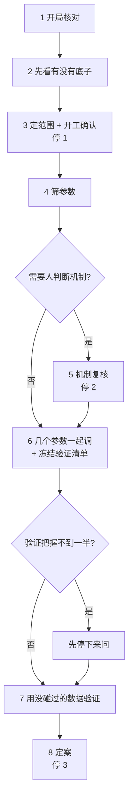

# tune-gates 是怎么调参的

> 面向：有统计基础、但没接触过这套方法的人。
> 读完你应该能回答：它在解决什么问题、为什么不用现成的优化器、一轮调参分哪几个阶段、每个阶段为什么排在那个位置、它最后交付的到底是什么。
> 术语第一次出现时都会解释；每一步的结论怎么读，见《调参判据卡》。

---

## 0. 一句话

**先确认这个走势比随机买入有底子，再在现在这套参数附近找出真正起作用的改动，把它们放在一起找一片「自己好、邻居也好」的区域，最后用没碰过的数据验一次再定案。**

这句话里的每个部分后面都会展开。先说清楚它要解决的是什么问题。

---

## 1. 这里的「调参」指什么

path2 是一个事件表达框架。一个 pattern（比如「底部突破」）由若干 **detector**（检测器）拼成，每个 detector 负责识别一类事件——突破、走势区段、平台、派发。它们之间用边连起来，构成一张有向图，图整体描述「什么形状算这个 pattern」。

需要定值的数字分两种：

- **detector 的构造参数**：确认根数、切串间距、突破幅度阈值、窗口长度……这些参数决定事件**怎么被识别出来**；
- **where 阈值**（下文也叫「闸」）：事件识别出来之后，再对它的属性提条件，比如「这段买点窗口里最大单日跌幅要小于 20%」。

一个成熟 pattern 有几十个数要定。调参就是给这几十个数选取值。

评价标准的主指标是**首次穿越率**：买入后在前瞻期（默认 40 个交易日）内，先涨到上方目标线、而不是先跌到下方止损线的比例，两条线按这只股票近期的波动幅度定。它把波动率的影响剥掉了，读到的是方向。前瞻收益只用来看幅度。

还有一个贯穿全流程的数：**最小关心改进**——改进不到几个点你就不在乎，默认 2 个点。它在开工确认时定下，之后不改。

---

## 2. 为什么不直接上 optuna

这是整套方法最根本的分歧点。用贝叶斯优化、随机搜索这类工具去找参数的最优组合，在这个场景下有三个问题。

### 2.1 要的本来就不是最优点

市场分布每天都在动。你的参数不可能精确停在当初那个最优点上——就算它一个字没改，它脚下的数据分布已经变了。

所以真正有价值的不是「哪个点分数最高」，而是「**参数或数据漂一点，结果不会崩**」。optuna 交付一个点，点一漂就完了；你要的是一片区域，漂了还在区间里。

### 2.2 取最大值系统性地偏向噪声

在有限样本上，每个参数组合的分数 = 真实效应 + 噪声。取最大值这个动作，会**优先选中那些运气特别好的组合**——它们的噪声恰好是正的、还特别大。而运气不会在新数据上重复。

这不只是「报告的数字虚高」（那个可以事后校正），而是**选出来的点本身系统性偏了**。

### 2.3 还有一种失败，跟噪声无关

设想某个组合分数很高，但紧邻的组合都很差。这往往意味着它坐在某个阈值的临界处——比如「确认根数 = 2」刚好卡在一批样本的边缘上，数据稍微一动，这批样本就掉到另一边去了。

这是**几何性质**，不是统计噪声。哪怕样本无限多、分数估得完全准，这种点在生产中依然危险。

**要求「邻居也好」同时防住了这两种失败。** 噪声很难同时把一片组合都抬高；而一片都好，说明你不在悬崖边上。

---

## 3. 真正稀缺的是独立样本

扫描出来的数据看着很大，动辄上千万行。但真正互相独立的样本少得多，原因有三层：

- **同一段买点被重复计入**。一个 pattern 里，同一段买点常常被好几条命中共享（比如上游不同的事件组合都锚到了同一段）。它们的涨跌结果完全相同，只能算一次。所以全流程所有计数、比例、误差都按「同一段买点只计一次」来算。
- **同一只股票的买点彼此牵连**。同一只股票的多段买点受同一个公司、同一种股性影响，不是独立的。误差一律按股票算——实际能用的独立信息量是股票数的量级，而不是行数的量级。
- **同一段时间的买点共享行情**。两年数据本质上只经历了很少几种市场状态。

由此得出的一个关键事实：**这类参数改动的真实效果，常常只有一两个点，和样本本身的噪声差不多大。** 失败的主要原因往往不是「试的组合太多」，而是「效果小于噪声」。这决定了整个流程的形状：

- 先确认有没有底子，没有就别调；
- 事先算清楚这份样本能分辨多小的改进，分辨不出的就老实说分辨不出；
- 先筛出真正起作用的少数参数，再放在一起调，不在几十维上硬找。

还有一个容易被忽略的事实：**同一个改动，取平均的效果和在现在这套参数上的效果可以差很远。** 某个参数在「其他参数随便放」时平均起来几乎没作用，放在现在这套参数上却可能有好几个点——因为它和别的闸有交互。所以筛选是在现在这套参数附近做的，而不是在所有组合上取平均。

---

## 4. 哪些参数改了必须重新检测

这个区分决定了整套方法的成本结构。

考虑两个参数：

- **「最大单日跌幅 < 20%」里的 20%**。改成 15%，事件还是那些事件，只是筛掉的多一些。所以**只要扫一次，把每个事件的「最大单日跌幅」记下来，之后想试任何阈值都只是在表上过滤一遍，零成本。**
- **「确认根数 = 2」里的 2**。改成 1，检测器的状态机走法就变了，识别出来的事件**本身**不一样了——起止位置变了、数量变了，有些事件根本不存在了。这种参数**没法事后切**，每换一个值都得把全部股票重新检测一遍。

于是参数被分成几类：

| 类别 | 含义 | 代价 |
|---|---|---|
| **where 阈值** | 事件属性上的条件 | 事后可切，零成本 |
| **过滤型构造参数** | detector 自己声明「这个参数只影响产不产事件、不改事件几何」 | 按最松的档跑一遍，事后按字段切 |
| **检测参数**（真正的构造参数） | 参与事件的识别、改变几何 | **必须真扫**，每加一个参数，检测量乘以它的档位数 |
| **只作用在边上的参数** | 只约束事件之间的关系 | 不进网格 |
| **衡量尺子** | 持有多久、涨跌多少才算数、和什么基线比 | **不参与调**。改尺子等于换考卷，前后分数不可比 |

两条要紧的事：

- **能事后切的就别塞进必须真扫的那一类。** 必须真扫的参数每多一个就乘一次检测量，能事后切的只是表上多一列。
- **分类不是看函数签名或参数名猜的，是用探针逐档实际测出来的。** 「这个参数到底改不改事件几何」「这个取值在机制上是不是等于没设」都是实现细节，名字会骗人。

---

## 5. 一轮调参的八个阶段

常规只停三次：开工确认、机制复核（有需要才出现）、定案。另有一个条件停点：验证把握不到一半时，打开验证数据之前先问。其余全部自动。

### 5.1 开局核对

认出是哪个 pattern；比较代码、底座参数（现在这套正式参数）、衡量尺子自上一轮以来有没有变过；从实际数据文件探测数据覆盖到哪一天。

然后，**在任何人看过收益之前**，把数据划成三段并记账：训练期；训练期之前留出的一段；训练期之后到数据末尾的一段。后两段就是最后用来验证的「没碰过的数据」，它们和训练期之间各隔开一个前瞻期，保证涨跌结果互不重叠。

为什么必须在看收益之前划：看过收益再划，划分本身就可能被结果影响。

### 5.2 先看有没有底子

这一步叫**优势检查**：把这个走势的买点，和**同一天、同样波动水平**的随机买入日比首次穿越率。

- 「同一天」排除了行情的影响——那几天大盘涨，谁买都赚；
- 「同样波动水平」排除了股票类型的影响——当天全部股票按波动高低分三档，只和同一档比。

分两种口径各比一次：**闸全部放开**（只看走势检测本身）、**按现在的正式参数**。逐年给出「有底子 / 还不能确定 / 没有」。如果闸全放开时没有、按正式参数有，说明底子来自现在开着的闸。

同时算出**分辨力**：这份样本能分辨多小的改进，同时改两个参数够不够分辨最小关心改进。

**为什么排在一切调参之前**：没有底子时，调参挑出来的好成绩是运气。而且这一步只看一套参数，全部股票几分钟跑完，不需要后面那些重型检查。

### 5.3 定范围 + 开工确认（停 1）

系统替每个检测参数提出候选：现值、松一档、紧一档。自动剔除衡量尺子，也剔除机制上等于没设的档。每道开着的闸标出它有没有被验证过「该不该存在」：

- 验证过、确实有用的，可以调；
- 在役但没验证过的，只许在开 / 关之间选；
- 不在役、也没验证过的，这一轮不许加进来。

停 1 一次说清：底子逐年怎么样；分辨力（筛参数时多少个点以上才分辨得出，只验一个预写改动时多少）；请你定最小关心改进；每个参数的松紧取值；两段验证数据留到最后各用一次；有想一起验证的想法现在说；总耗时，超过半小时的检查在这里一并批准。

**为什么排在优势检查之后、筛选之前**：看过各档收益再定范围，范围本身就成了又一次挑选。所以范围在这里定死。

### 5.4 筛参数

先扫描（见 6.1），再做一致性验证（见 6.2），对上了才读数。

然后在现在这套参数附近**逐个改一处**：

- 每个检测参数试松一档、紧一档；
- 每道开着的闸试关掉，看「删了亏不亏」；
- 另外把改动两两组合试一下，只用来发现「要一起调才看得出效果」的参数。

每个改动在两个底座上各比一次：**现在这套参数**（为主），和**闸全关掉**（作对照）。只在一个底座上有效的改动会被标出来。所有改动算在同一个族里做多重比较校正——比得越多，单个改动要过的门槛越高。

报告里还自动附上：两年是否明显不一样、各时期是否时好时坏、买点是否少了很多、是否只是换了一批股票，以及每个改动靠多少段买点撑着。分辨得出的改动和删了不亏的闸，会顺手写成待验证条目的草稿。

### 5.5 机制复核（停 2，有需要才出现）

能自动定的先定掉——比如某道闸是不是只是在挑低波动的股票，由「该不该存在」的检验来判。留给人的只有两类问题，合成一条消息：

- 某个检测参数的机制，业务上能不能接受（例如「确认根数加多，可能只是多等几天再买，不是更会挑股票」）；
- 建议删的闸，是不是这个走势定义的一部分。

顺带确认**采纳规则**：验证完之后按什么顺序决定采纳哪套参数。默认按训练数据上的证据从强到弱——先整套改动，再逐项退，最后维持现状。停 2 不出现时就用默认。

**为什么排在一起调之前**：被人否掉的参数不该占「几个参数一起调」时的格子。

### 5.6 几个参数一起调 + 冻结清单

只把筛选里分辨得出的参数（以及和它们一起改会互相影响的参数）放进一起调的网格，找「自己好、邻居也好」的组合（见 6.4、6.5）。参照点是现在这套参数。

如果样本只够一次改一个参数，就退化为「在单个改动里挑」，并如实告诉你。

挑完之后，按采纳规则把候选**机械展开**成一张决策表：先验整套，不过就验哪几个单项，都不过就维持现状。这张表连同要检验的全部假设、统计口径，**冻结成一份验证清单写进账本**。开工时交来的「在役闸该不该存在」检验也并进这份清单。

冻结时顺便估出**验证把握**：按训练期的效果（扣掉挑选带来的虚高）和验证数据的买点量，算出这次验证能把改进确认下来的概率。不到一半时停下来问——往前那段数据只能开一次，现在开还是等数据攒多一点再开，是业务决定。

### 5.7 用没碰过的数据验证

两段各开一次，用同一份清单：

- **训练期之前那段**做正式检验：按决策表的顺序逐个检验，选出第一个确认下来的配置；
- **训练期之后那段**做核对：选出的配置相对改前有没有变差、方向和训练期是否一致。

两段合起来按事先写好的判读表给出结论：采纳、暂定采纳、撤回，或不写进正式参数。详见《调参判据卡》第四节。

### 5.8 定案（停 3）

汇总训练期读数、扣掉挑选偏差后的数字、两段验证的读数，以及这组参数在训练数据上一共被比较过几次，按决策表机械给出结论。

你只能**确认写入**，或者**整体不写、维持现状**；不能换成别的配置，也不能只写一部分。不写时两段验证数据照样记为已用，理由记进账本。写入时，没经过独立验证确认的改动标「暂定」，并记下定案时其余参数的取值——之后它们变了，会提示这条定案需要复核。本轮途中不改正式参数。

---

## 6. 几个关键机制

### 6.1 扫描结果表：一次扫描，事后切

一次扫描产出一张**扫描结果表**：每一行是「某只股票 × 某个检测参数组合 × 一条命中」，带上全部闸字段的原始值、所在买点段的身份和首次穿越计数。

**之后所有分析都在这张表上做，不再重新检测。** 换阈值、换分析口径，都是对这张表的重新聚合——聚合时按「同一段买点只计一次」：同一段买点的多行里，任一行过了全部闸，这段买点就算过闸。

扫得动靠的是**反转循环**：外层是股票，内层是参数组合。这样上游的数据流每只股票只算一次，就能被所有组合复用，涨跌结果也按时间跨度复用。

### 6.2 一致性验证：快路径不许说谎

扫描结果表是「快路径」，靠缓存和复用把结果算出来；「慢路径」是老老实实对每个参数组合单独调一次引擎。**两条路必须给出完全一样的答案**，按同一段买点只计一次逐项比对，红线是零差异。验证不通过，不许读后面的任何结果。

它只抽样比对，买的不是「把慢路径重跑一遍」，而是**一次「快路径没说谎」的证明**。抽样的股票至少 500 只；扫描本身不到 500 只时，扫过的股票要全部比一遍。抽样不够的验证不算数。

这份证明跟着这批扫描结果走：验证时用的研究声明（网格怎么划、参数怎么分类）或涨跌结果的算法和现在不同，就要重做。

### 6.3 筛选：为什么只在附近逐个改

在所有组合上找主效应，会被「取平均」稀释掉交互（见第 3 节）；在几十维上直接联合找，格子多到每个格子的样本都不够。

所以先在现在这套参数附近逐个改一处，只留下分辨得出的。这里有三条读法上的纪律：

- **「分辨不出」≠「没用」**，只说明差别没大到这份样本看得出来；
- **删闸看最坏情况**：关掉之后首次穿越率最坏也只差在最小关心改进以内，才叫「删了不亏」，看的不是估计值的正负；
- 刚过门槛的要标「刚过线」。

### 6.4 找稳健区域：一层一层收紧

**第一层 · 样本够不够**：每个组合、每一年单独看样本量。门槛由最小关心改进和优势检查实测的样本牵连程度推出，另外至少要有 30 段买点。不够的标「评估不了」——评估不了 ≠ 坏，它不参与比较、不当邻居。**不许为了凑数降门槛。** 收紧一档的闸一个买点都没多筛掉时，那个组合和放松一档是同一批样本，也不单独算。

**第二层 · 相对现在这套参数的增量**：不看绝对分数，看相对现在这套参数的改善，每年各自和自己那年比——不同年份的基准水平本来就不同。

**第三层 · 年份取最差**：一个组合跨年取**最小值**。强制要求「每一年都要好」，杀掉靠某一年强效应撑起来的组合。

**第四层 · 邻域取最差**：一个组合的最终分数，取它自己和所有只差一档的相邻组合中的**最小值**。这就是「稳健」两个字的实现：噪声很难同时抬高一片；悬崖边上的组合，总有一个邻居很差，最小值会把它拉下来。

**第五层 · 排序**：取邻域分最高的组合作为推荐，并报出沿每个参数往前、往后各挪几档邻域分仍为正——**交付的是区间，不是点**。

### 6.5 怎么知道不是碰运气挑出来的

在成百上千个组合里挑一个最好的，就算数据里没有任何真实信号，挑出来那个的分数也会显著高于 0。所以结果并列报三个分数：

| 分数 | 含义 | 怎么用 |
|---|---|---|
| **朴素分数** | 直接读推荐组合的分数 | 包含全部挑选偏差，只作参考 |
| **扣掉挑选偏差后的分数** | 重新抽股票、每次连筛选一起重做再挑，估出挑选带来的虚高并扣掉 | 只会少扣，扣完仍偏乐观，当上界看 |
| **对半分验证** | 一半股票挑、另一半股票打分 | 对怎么分很敏感，只看方向 |

两个必须知道的点：

- **扣减为什么只会少扣**：重抽股票只模拟了「换一批股票」，没模拟「换一段行情」。真实的落差只会更大。
- **挑选偏差估出负数时**，扣完的数不能当保守的数读。

**为什么重抽要按股票**：同一只股票的多行高度相关，按行重抽会把独立样本量虚报成百上千倍，区间假窄。

**真正无偏的数字只来自没碰过的数据**——这就是第 7 阶段存在的理由。

### 6.6 两段验证数据与冻结清单

为什么要**事先冻结**：如果先看验证结果、再决定验哪套、按什么标准判，挑选偏差就从后门回来了。所以要检验的配置、顺序、判读规则、统计口径，全部在打开之前写进清单，打开之后只按清单执行。

为什么**两段**：训练期之前那段样本量足、可以做正式确认，但它的股票池里没有之后退市的股票（幸存者偏差），开窗前会估这个偏差，太大就只按暂定算；训练期之后那段最贴近现在，但通常较短，用来核对「没有变差、方向一致」。

为什么**各只能开一次**：开第二次、或者在同一段数据上换别的候选再验，结论就会偏乐观。用掉之后，只能等新数据积累。

### 6.7 账本：每一次挑选都记下来

两个 skill 共用一本样本使用账本，按 app 记：划了哪几段数据、谁在哪段数据上看过标签、看了几次、挑过什么、冻结过哪份清单、验证结果和定案。每条记录都带上当时代码版本、底座参数、detector 源码和衡量尺子的版本标记。

它解决三件事：

- **挑得越多、数字越乐观**——账本能说清一组参数在同一份数据上一共被比较过几次；
- **结论什么时候作废**——源码或尺子变了，相关结论失效；底座变了，要在新的正式参数上补算；
- **判断「该不该存在」时换没换样本**——在时间上和挑选记录重叠的数据，只能排除「少数股票碰巧」，排除不了「这段行情特有」，所以不能把一道闸判成「确实有用」。

调参里看出来的「这道闸没用 / 有用」，是在调参数据上得出的，要登记进待验证的发现清单，经换样本验证后才算结论。

---

## 7. 几条红线，以及它们各自防的是什么

| 红线 | 防的是什么 |
|---|---|
| **先一致性验证、后读数** | 扫描结果表可能算错。分析结果再漂亮，建立在错的表上就没意义 |
| **先确认有底子才调** | 没有底子时，挑出来的好成绩是运气 |
| **范围在看收益之前定死** | 看过各档收益再定范围，范围本身就成了一次挑选 |
| **衡量尺子不进网格** | 改尺子等于换考卷，前后分数不可比 |
| **筛选在「现在这套参数」和「闸全关掉」两个底座上都做** | 平均效应不等于现在这套参数上的效应；只在一个底座上有效的改动必须标出来 |
| **不取最高分，看邻居** | 第 2 节讲的两种失败 |
| **评估不了 ≠ 坏，不许降门槛凑数** | 样本不足是「不知道」，不是「不好」。当成坏的，会把区域边界画错 |
| **每一次挑选都记账** | 挑得越多，最终数字越乐观；不记账就说不清一共比较过几次 |
| **调参里得出的闸证据要登记、再换样本验证** | 在同一份数据上挑出来的「有用 / 没用」不能直接当结论 |
| **两段验证数据各只能按冻结清单开一次** | 开第二次、换候选再验，挑选偏差又回来了 |
| **不引入优化 / 采样框架** | optuna / LHS / GP / racing 都会把你带回「找最优点」那条路 |
| **每道闸要挣到位置** | 闸该不该存在要单独检验：确实有用才算挣到位置，删了不亏的可以删，说不清的维持现状。闸不是越多越好 |

---

## 8. 这套方法的边界

说清楚它**不能**做什么，比说它能做什么更重要。

**它能做的**：在已有的数据上尽量不被噪声骗；老实说出这份样本能分辨多小的改进；找到一片对参数漂移不敏感的区域；诚实地报出「这个数字里有多少是挑出来的」；最后用没碰过的数据给一次干净的检验。

**它不能做的**：外推到没见过的市场状态。

这不是实现上的欠缺，是数据本身的限制。行数看着很大，但同一段买点只计一次、同一只股票的买点彼此牵连之后，真正的独立信息少一个数量级；再往上一层，真正独立的**市场状态**更少——两年数据本质上只经历了很少几种。

所以最后那道防线不是统计，是停 2 和停 3 那个问题：**这个推荐值在机制上讲得通吗？** 讲得通的东西才有机会在没见过的世界里继续成立，因为它不是从这批数据里拟合出来的。

---

## 附：几个概念的速查

| 词 | 意思 |
|---|---|
| **闸** | 事件属性上的一个过滤条件（where 阈值或过滤型参数） |
| **现在这套参数** | 正式参数，含每道闸的现值 |
| **闸全关掉** | 检测参数取现值、全部闸放到最松 |
| **底子** | 买点比同一天、同样波动水平的随机买入日好出来的那部分 |
| **最小关心改进** | 改进不到几个点就不在乎，默认 2 点；判「没有底子」「没用」「删了不亏」共用 |
| **首次穿越率** | 前瞻期内先碰到上方目标线、而不是下方止损线的比例 |
| **同一段买点只计一次** | 被多条命中共享的同一段买点，计数、比例、误差里只算一次 |
| **扫描结果表** | 一次扫描的全部产出，每行 = 股票 × 检测参数组合 × 命中，带全部闸字段 |
| **一致性验证** | 扫描结果表聚合出的结果与逐组合直接调引擎的结果逐项比对，红线零差异 |
| **分辨力** | 这份样本能分辨出的最小改进 |
| **评估不了** | 组合的样本量不够下结论；不等于坏 |
| **邻域** | 参数空间里与某组合只差一档的全部组合 |
| **挑选偏差** | 在很多组合里挑最好的，挑中的那个在挑它的数据上总会显得偏好 |
| **两段验证数据** | 训练期之前、之后各留一段，与训练期隔开一个前瞻期，各只开一次 |
| **验证清单** | 打开验证数据前冻结的检验内容、顺序与判读规则 |
| **暂定** | 写进正式参数，但还没被没碰过的数据确认 |
| **账本** | 记录每段数据被谁看过、挑过什么、验证与定案结果的样本使用记录 |
| **回看缓冲** | 检测一个事件所需的历史长度；划验证数据时，起点之前也要留出这段 |
