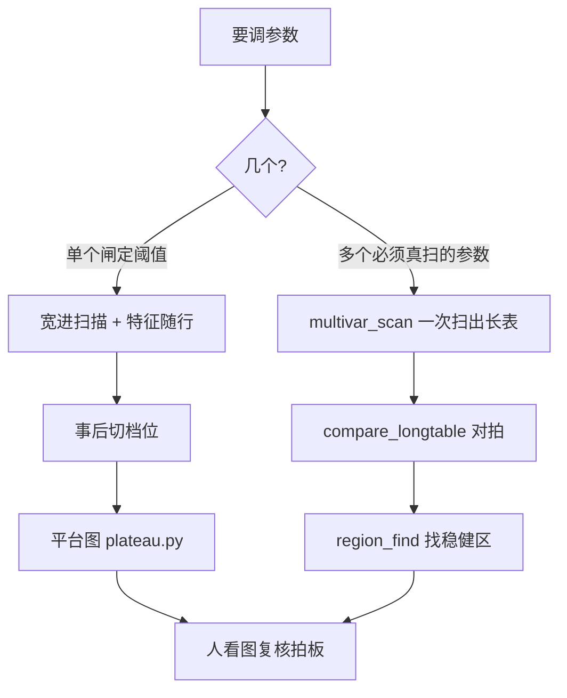
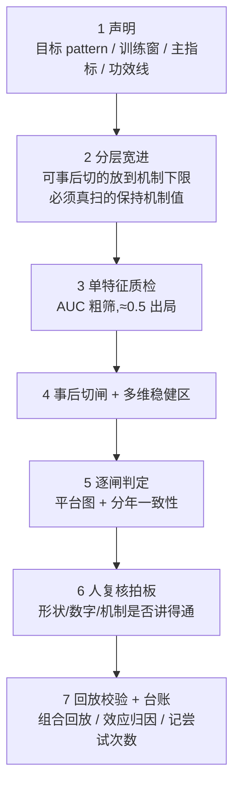

# tune-gates 是怎么调参的

> 面向：有统计基础、但没接触过这套方法的人。
> 读完你应该能回答：它在解决什么问题、为什么不用现成的优化器、它交付的到底是什么。
> 术语第一次出现时都会解释；操作细节不在这里，在 `.claude/skills/tune-gates/SKILL.md` 与 `reference.md`。

---

## 0. 一句话

**在参数空间里找一片「自己好、邻居也好」的连通区域，而不是找那个分数最高的点。**

这句话里的每个部分后面都会展开。先说清楚它要解决的是什么问题。

---

## 1. 这里的「调参」指什么

path2 是一个事件表达框架。一个 pattern（比如「底部突破」）由若干 **detector**（检测器）拼成，每个 detector 负责识别一类事件——突破、趋势段、密集区、回踩。它们之间用边连起来，构成一张有向图，图整体描述「什么形状算这个 pattern」。

需要定值的数字分两种：

- **detector 的构造参数**：确认根数、切串间距、突破幅度阈值、窗口长度……这些参数决定了事件**怎么被识别出来**；
- **where 闸**：事件识别出来之后，再对它的属性提条件，比如「这个回踩的最大单日跌幅要小于 20%」。

两者加起来，一个成熟 pattern 有几十个数要定。调参就是给这几十个数选取值。

评价标准是两个指标：**FP（首次穿越率）**——买入后先碰到止盈还是先碰到止损；**fr median（远期收益中位数）**。目标是在保住足够 match 数量的前提下把这两个指标做好。

---

## 2. 为什么不直接上 optuna

这是整套方法最根本的分歧点，值得先讲透。用贝叶斯优化、随机搜索这类工具去找参数的最优组合，在这个场景下有三个问题。

### 2.1 要的本来就不是最优点

生产环境里，市场分布每天都在动。你的参数不可能精确停在当初那个最优点上——就算它一个字没改，它脚下的数据分布已经变了。

所以真正有价值的不是「哪个点分数最高」，而是「**参数或数据漂一点，结果不会崩**」。这是两个不同的目标。optuna 交付一个点，点一漂就完了；你要的是一片区域，漂了还在区间里。

### 2.2 argmax 系统性地偏向噪声

在有限样本上，每个参数格子的分数 = 真实效应 + 噪声。取最大值这个动作，会**优先选中那些运气特别好的格子**——因为它们的噪声恰好是正的、还特别大。而运气不会在新数据上重复。

这不只是「报告的数字虚高」（那个可以事后校正），而是**选出来的点本身系统性偏差**。

### 2.3 还有一种失败，跟噪声无关

设想某个格子分数很高，但它紧邻的格子都很差。这往往意味着它坐在某个阈值的临界处——比如「确认根数 = 2」刚好卡在一批样本的边缘上，数据稍微一动，这批样本就掉到另一边去了。

这是**几何性质**，不是统计噪声。哪怕你有无限样本、分数估得完全准确，这种点在生产中依然危险。

**要求「邻居也好」同时防住了这两种失败。** 噪声很难同时把一片格子都抬高；而一片都好，说明你不在悬崖边上。

---

## 3. 第一个关键区分：哪些参数改了必须重新检测

这个区分决定了整套方法的成本结构，是理解后面一切的钥匙。

考虑两个参数：

- **「回踩的最大单日跌幅 < 20%」里的 20%**。改成 15%，事件还是那些事件，只是筛掉的多一些。所以——**你只要扫一次，把每个事件的「最大单日跌幅」这个值记下来，之后想试任何阈值都只是在表上过滤一遍，零成本。**
- **「确认根数 = 2」里的 2**。改成 1，检测器的状态机走法就变了，识别出来的事件**本身**不一样了——起止位置变了、数量变了、有些事件根本不存在了。这种参数**没法事后切**，每换一个值都得把全宇宙重新检测一遍。

于是所有参数被分成四类（记号是 skill 里的叫法）：

| 类别 | 含义 | 代价 |
|---|---|---|
| **W** | where 阈值。事件属性上的条件 | 事后可切，零成本 |
| **F** | 过滤型构造参数。detector 自己声明「我这个参数只影响产不产事件、不改事件几何」 | 按最松的档跑一遍，事后按字段谓词切 |
| **D** | 真正的构造参数。参与事件物化、改变几何 | **必须真扫**，每加一维检测量乘以档位数 |
| **E** | 只作用在边上的参数 | 不进网格 |

**这里最要紧的一条是：F 维不进笛卡尔积。** D 维每多一维、每维 4 档，检测量就乘以 4；而 F 维只是长表上多一列、多切几刀，是常数开销。所以选维时能放进 F 的就不要硬塞进 D——实测把一个参数从 D 挪到 F，单股耗时从 1688ms 降到 1114ms，而且这个收益不随维数增长而稀释。

还有一点很重要：**这个分类不是靠看函数签名或者参数名猜的，是用探针实际测出来的**（`multivar_core.classify`）。因为「这个参数到底改不改事件几何」是实现细节，名字骗人。

---

## 4. 两条路径

分类做完，根据你要调几个参数，走两条不同的路：

---

## 5. 单闸怎么调：平台图

### 5.1 宽进 + 特征随行

「宽进」的意思是：把所有可以事后切的闸都放到机制下限（where 放结构下界、毒药闸关掉），让尽可能完整的样本进池。然后扫一次，**每个 match 都把全部候选特征的原始值带上存下来**。

这样之后想试任何阈值，都不用再扫了。

### 5.2 选平台，不选峰值

把某个闸的阈值从小到大切成若干档，每档算出 FP、fr、match 数，画在同一张图上。

然后**找平台而不是找峰值**：平台的定义是「分数 ≥ 峰值 − 容差」的**最大连通档位区间**。取平台的中间，不取那个最高点。

理由和第 2 节一样：峰值是最可能被噪声堆出来的那个点。

### 5.3 match 数全程在场

match 数（该档下还剩多少个样本）在图上一直画着，它有两个作用：

- **功效线**：跌破某个数量（默认 100）就不看了，样本太少的比例数不可信；
- **假平台识别器**：样本很少的时候，指标曲线本来就平——那种「平台」是抖出来的假平稳，不是真的不敏感。

### 5.4 两个容易误判的地方

**「这个闸没有增量」** —— 先查这一列的取值分布。要区分两种情况：闸的阈值根本够不到数据分布（**闸形同虚设，从没触发过**），还是确实触发了但删掉的样本本来就不差。前者说明当前数据里这个闸空转，不是机制无用；不查分布就会把两者混为一谈。

**「整体有交集就可信」** —— 不够。还要看**分年方向是否一致**。整体上的交集可能是某一年的强效应盖过了另一年的反向效应。

---

## 6. 多参数怎么调：多维稳健区

当你要同时调几个「必须真扫」的参数，逐个调是不行的——它们之间有交互，单独调各自最优，合起来未必好。

### 6.1 长表

一次扫描，产出一张**长表**：每一行是「某只股票 × 某个检测组合 × 某个 match」，带上全部特征值和 FP 四态计数。实际规模是 780 万行、43 个 parquet 分片、38MB。

**关键在于：之后所有的分析都在这张表上做，不再重新检测。** 换网格、换阈值、换分析口径，都是对这张表的重新聚合，分钟级。

### 6.2 为什么扫得动

朴素做法是「对每个参数组合，扫一遍全宇宙」，那是组合数 × 股票数次完整检测。

实际用的是**每股反转循环**：外层是股票，内层是参数组合。这样上游的数据流只算一次就能被所有组合复用（流缓存），label 也能按时间跨度记忆化。实测 6720 只股票、1024 个检测组合，20 分钟跑完。

### 6.3 对拍：为什么必须有这一步

长表是「快路径」——它靠缓存和复用把结果算出来。而「慢路径」是老老实实对每个参数组合调一次引擎。

**这两条路必须给出完全一样的答案，否则长表上的一切结论都是空中楼阁。**

所以有一步专门的对拍：抽 ≥500 只股票、几百个参数项，把长表聚合出来的结果和直接调 `engine.analyze()` 的结果逐一比对，**红线是零差异**。对拍不绿，不许读后面的分析结果。

它只抽样比对（覆盖不到万分之一的格），因为全暴力跑完整个联合空间要几十天。它买的不是「把慢路径重跑一遍」，而是**一次「快路径没说谎」的证明**。

有个反直觉但重要的点：**对拍绑定的是「app × 图拓扑 × 维度分类」，不是每次运行。** 因为它证明的等价性是工具和 app 的**联合性质**——F 维的声明是 app 作者写的、工具静态验不了；where 当列谓词依赖边的拓扑；流缓存的影响范围是对这个 app 探出来的。所以换 app、改图、改 detector、新增 F/W 维必须重做；而同一个 app 同一个网格换时间窗或股票池**不用重做**（等价性与数据无关）。

### 6.4 识别：一层一层收紧

拿到长表之后，找稳健区的过程是这么几层，顺序不能乱：

**第一层 · 功效线**：每个格子、每个 fold（时间折，主口径是按年）单独看样本数，低于功效线的标成「**不可评估**」。不可评估 ≠ 坏——它不参与比例计算、不当邻居、也不当墙。而且**不许为了凑数把功效线降下来**。

**第二层 · 相对参照的增量**：不看绝对分数，看相对「宽进底座格」的改善。而且是**每个 fold 各自相对自己那年的参照**——因为不同年份的基准水平本来就不同。

**第三层 · fold 最小**：一个格子跨年取**最小值**。这一步强制要求「每一年都要好」，而不是「平均下来好」。它直接杀掉那些靠某一年的强效应撑起来的格子。

**第四层 · r=1 邻域最小**：一个格子的最终分数，取它自己和它在参数空间里所有直接邻居中的**最小值**。

这一层就是「稳健」两个字的实现。要求一片格子同时都好，噪声很难做到；而这也顺带解决了参数悬崖——悬崖边上的格子，它某个邻居一定很差，最小值就把它拉下来了。

**第五层 · 排序**：取邻域最小分最高的那个格子作为推荐。容错范围按「邻域分仍然为正的跨度」报告——**交付的是区间，不是点**。

### 6.5 怎么知道这个结果不是碰运气选出来的

在 44 万个格子里挑一个最好的，就算数据里没有任何真实信号，挑出来那个的分数也会显著高于 0。这叫**选择偏差**。

所以最后要报三个数：

| 数 | 含义 | 怎么用 |
|---|---|---|
| **naive** | 直接读推荐格的分数 | 只作参考，它包含全部选择偏差 |
| **optimism** | 选择偏差的估计量 | `naive − optimism` 是校正值 |
| **split-half** | 一半数据选、另一半数据评 | 当**下界**看 |

**optimism 是怎么估的**：按股票重抽样（bootstrap），每抽一次就在全部候选格里重新挑最好的，看「挑出来的分数」比「这个格在原始数据上的分数」高多少，取平均。这实际是在**模拟「挑选」这个动作本身带来的抬高**。

两个必须知道的坑：

- **optimism 的符号不保证为正**。在没有真实结构的数据上它期望 ≥ 0（那是选择偏差本体），但数据里有真实结构时它可以稳定为负。**只有 optimism ≥ 0 时，校正值才能当上界读**；小于 0 时不构成保守上界，报告要按符号分支给措辞。
- **判断 optimism 是否显著，看 `|optimism|` 相对它自己的标准误**，不是看它绝对值大不大。

**为什么 bootstrap 要按股票聚簇**：780 万行看着很大，但同一只股票的多行高度相关。按行重抽样会把有效样本量虚报几百倍，置信区间假窄。按股抽，有效样本量是 6720 只股票的量级——这才是真实的信息量。

**唯一真正无偏的数字是外推窗**：一段完全没参与搜索的时间。而且它跟主窗必须用同一个 `HEAD_BUFFER`（检测所需的历史长度），否则事件集合本身就不同，比出来的差异是窗口截断而不是参数效应。

---

## 7. 几条红线，以及它们各自防的是什么

这套方法有一批硬约束，每条背后都是一个具体的失败模式：

| 红线 | 防的是什么 |
|---|---|
| **先对拍后读数** | 长表可能算错。分析结果再漂亮，建立在错的表上就没意义 |
| **不取 argmax、不用绝对阈值** | 第 2 节讲的两种失败 |
| **联合空间，禁两段式** | 「先在宽进态找区域、再单独收紧 where」会造成组间切片漂移——两步各自最优，合起来不是 |
| **真扫维联合分析放在减法之后** | 先删掉那些已证明没有增量的闸，再做联合分析。冗余维度会稀释邻域的统计功效，也让结果难解释 |
| **不可评估 ≠ 坏，且不许降功效线凑数** | 样本不足是「不知道」，不是「不好」。把它当成坏的，会把区域边界画错 |
| **holdout 不碰** | 留一批完全没参与任何决策的数据。它是最后的、也是唯一一次真正干净的检验 |
| **head_buffer 训练与外推必须相同** | 它是个隐式过滤器。缓冲不同会静默地改变事件集合，借这个差异挑子窗等于选择性使用外推数据 |
| **不引入优化 / 采样框架** | optuna / LHS / GP / racing 都会把你带回「找最优点」那条路 |
| **每道闸要挣位置** | 一道闸滤掉的必须是显著坏的样本，否则不加。闸不是越多越好 |

---

## 8. 完整一轮长什么样

有两点值得单独说：

**第 6 步是人拍板，不是程序拍板。** 程序算出平台、算出推荐格，但「推荐值 ≠ 直接采用」。人要看形状对不对、要问这个值**在机制上讲不讲得通**。机制合理性是唯一能外推到没见过的市场状态的东西——因为它不是从这批数据里学来的。

**第 7 步的效应归因容易被跳过。** 指标改善了，必须回答是哪一种改善：**选得准**（match 换成了更好的样本）、**买得低**（入场价系统性下移）、还是**买点窗变了**（窗宽或位置移动，白拿了 label）。只有第一种算真改善，后两种要在报告里点名。

---

## 9. 一个配套设计：app 解耦与三指纹

这套工具是通用的，具体的 pattern（app）是可替换的。所有与某个 app 耦合的东西都放在 `apps/<app>/`：

- `study.py` —— 人写的 8 项声明（用哪个 app、底座配置、网格怎么划、参照点在哪……）
- `classification.json` —— 机器生成的维度分类结果和指纹
- `notes.md` —— 这个 app 的实测记录和踩过的坑

换 app 或者复用之前，跑一次检查，它会报三个**指纹**：

| 指纹 | 覆盖什么 |
|---|---|
| `source` | app 包目录下全部 .py，以及各 detector 所在的模块文件 |
| `base` | 底座参数的值（不只是条目名——改一个值，整张长表换了个世界） |
| `study` | `study.py` 这个文件本身 |

指纹变了说明有东西改过，可能需要重做对拍。但设计上有一条很清楚：**指纹是证据，不是裁定**——三行全说「一致」也要问用户一句，用户说复用就复用，只是要把这个决定记下来。

---

## 10. 这套方法的边界

说清楚它**不能**做什么，比说它能做什么更重要。

**它能做的**：在你已有的这批数据上，尽量不被噪声骗；找到一片对参数漂移不敏感的区域；诚实地报出「这个数字里有多少是挑出来的」。

**它不能做的**：外推到没见过的市场状态。

这不是实现上的欠缺，是数据本身的限制。780 万行长表看着很大，但按股票聚簇之后，有效样本是 6720 只股票的量级；再往上一层，真正独立的**市场状态**（regime）就更少了——跨 2024–2025 两年，本质上只有两个 regime 样本。

所以最后那道防线不是统计，是第 6 步那个问题：**这个推荐值在机制上讲得通吗？** 讲得通的东西才有机会在没见过的世界里继续成立，因为它不是从这批数据里拟合出来的。

---

## 附：几个概念的速查

| 词 | 意思 |
|---|---|
| **闸（gate）** | 一个过滤条件。有阈值的那种参数 |
| **宽进** | 把可事后切的闸放到最松，让完整样本进池 |
| **长表** | 一次扫描的全部产出，每行 = 股票 × 检测组合 × match，带全部特征值 |
| **格（cell）** | 参数空间里的一个点，即一组具体的参数取值 |
| **fold** | 时间折。主口径按年切，用来检查跨年是否一致 |
| **功效线** | 样本数下限，低于它的格子标「不可评估」 |
| **参照格** | 宽进底座对应的那个格，所有增量都相对它算 |
| **r=1 邻域** | 参数空间里与某格直接相邻的全部格子 |
| **对拍** | 长表结果与直接调引擎的结果逐一比对，红线零差异 |
| **HEAD_BUFFER** | 检测一个事件所需的历史长度。它是隐式过滤器，训练与外推必须一致 |
