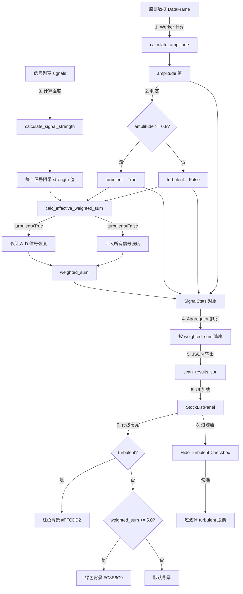

# Turbulent 过滤器逻辑详解

> **文档目标**: 详细解释 turbulent 异常走势检测机制的完整链路，从信号检测 → 振幅计算 → turbulent 判定 → 加权惩罚 → UI 展示
> **创建日期**: 2026-02-08
> **相关需求**: 联合信号系统 + UI 集成（Phase 1 数据增强 + Phase 2 视觉高亮）

---

## 一、概览

### 1.1 什么是 Turbulent

**Turbulent** 是一个异常走势过滤机制，用于识别在 lookback 窗口内价格波动过于剧烈的股票，避免在高位追涨或陷入暴涨暴跌陷阱。

**核心原理**:
- 计算 lookback 窗口内的价格振幅（amplitude）
- 当振幅超过阈值（默认 80%）时标记为 turbulent
- turbulent 股票在排序时仅计入 D（双底）信号的强度，其他信号（B/V/Y）不计入

**为什么需要 Turbulent**:
1. **风险控制**: 暴涨过的股票容易处于高位，追涨风险大
2. **信号质量**: 高波动环境下突破信号的可靠性降低
3. **保护机制**: D 信号（双底）在暴跌后反转场景中仍有价值，因此不被完全过滤

---

## 二、数据流程图



---

## 三、宏观逻辑

### 3.1 检测阶段（Scanner Worker）

**文件**: `BreakoutStrategy/signals/scanner.py`

#### 关键函数: `scan_single_stock()`

```python
# 1. 加载数据并计算 lookback 窗口
df_slice = df.iloc[slice_start : scan_date_idx + 1]

# 2. 检测信号（4 种检测器：BO, DT, HV, BY）
all_signals = []
detectors = _create_detectors(config)
for detector in detectors:
    all_signals.extend(detector.detect(df_slice, symbol))

# 3. 计算振幅（用于异常走势检测）
metadata["amplitude"] = calculate_amplitude(df_slice, lookback_days)

# 4. 过滤信号到 lookback 窗口
filtered_signals = [s for s in all_signals if cutoff_date <= s.date <= end_date]
```

**关键点**:
- `calculate_amplitude()` 在 worker 中执行，避免主进程阻塞
- amplitude 值通过 `metadata` 返回
- worker 返回 `(filtered_signals, skipped, skip_reason, amplitude)`

---

### 3.2 振幅计算（Composite 模块）

**文件**: `BreakoutStrategy/signals/composite.py`

#### 函数: `calculate_amplitude()`

```python
def calculate_amplitude(df_slice: pd.DataFrame, lookback_days: int) -> float:
    """
    计算 lookback 窗口内的价格振幅。

    amplitude = (max(high) - min(low)) / min(low)

    例如:
    - max(high) = 12.0, min(low) = 5.0 -> amplitude = (12-5)/5 = 1.4 (140%)
    - max(high) = 9.0, min(low) = 5.0 -> amplitude = (9-5)/5 = 0.8 (80%)
    """
    window = df_slice.iloc[-lookback_days:] if len(df_slice) > lookback_days else df_slice

    # 兼容大小写列名
    high_col = "High" if "High" in window.columns else "high"
    low_col = "Low" if "Low" in window.columns else "low"

    max_high = window[high_col].max()
    min_low = window[low_col].min()

    if min_low <= 0:
        return 0.0

    return (max_high - min_low) / min_low
```

**示例**:
| 场景 | max(high) | min(low) | amplitude | 含义 |
|------|-----------|----------|-----------|------|
| 平稳股 | 10.5 | 9.8 | 0.07 (7%) | 低波动 |
| 中等波动 | 12.0 | 10.0 | 0.20 (20%) | 正常走势 |
| 高波动 | 15.0 | 8.0 | 0.875 (87.5%) | **turbulent** |
| 暴涨暴跌 | 20.0 | 5.0 | 3.0 (300%) | **极度 turbulent** |

---

### 3.3 Turbulent 判定

#### 函数: `is_turbulent()`

```python
AMPLITUDE_THRESHOLD = 0.8  # 80%

def is_turbulent(amplitude: float, threshold: float = AMPLITUDE_THRESHOLD) -> bool:
    """
    判断股票是否处于异常走势。

    Args:
        amplitude: 价格振幅
        threshold: 判定阈值（默认 0.8 即 80%）

    Returns:
        True 表示异常走势
    """
    return amplitude >= threshold
```

**阈值设计依据**:
- **< 20%**: 正常波动，无需干预
- **20% - 60%**: 中等波动，信号仍可用
- **60% - 80%**: 较高波动，需警惕
- **>= 80%**: 异常走势，触发 turbulent 机制

**为什么选择 80%**:
- 经验值，大致对应"1 个月内翻倍或腰斩"的极端场景
- 避免误伤正常上涨趋势（如 30%-50% 的健康涨幅）
- 硬编码阈值，未来可考虑引入自适应机制（如 ATR 归一化）

---

### 3.4 有效加权强度计算

#### 函数: `calc_effective_weighted_sum()`

```python
def calc_effective_weighted_sum(
    signals: List[AbsoluteSignal],
    turbulent: bool,
) -> float:
    """
    计算有效加权强度总和。

    turbulent 时仅计入 D（双底）信号的强度，
    其余信号（B/V/Y）不计入排序权重。

    Args:
        signals: 信号列表（strength 已计算）
        turbulent: 是否为异常走势股票

    Returns:
        有效加权强度总和
    """
    if not turbulent:
        return sum(s.strength for s in signals)

    # turbulent：仅 D 信号计入
    return sum(
        s.strength for s in signals
        if s.signal_type == SignalType.DOUBLE_TROUGH
    )
```

**设计逻辑**:
1. **正常股票**: 所有信号（B/V/Y/D）全部计入
2. **turbulent 股票**: 仅 D 信号计入

**为什么保留 D 信号**:
- D 信号代表底部确认（Double Trough），在暴跌后反转场景中仍有买入价值
- 例如: 股票从 $10 暴跌到 $3（amplitude 很高），在 $3 附近形成双底并反弹
  - B/V/Y 信号可能是高位追涨的陷阱，不计入
  - D 信号确认了底部，可以作为低位买入机会，保留计入

**示例对比**:
| 股票 | 信号序列 | turbulent | weighted_sum 计算 | 结果 |
|------|---------|-----------|-------------------|------|
| AAPL | D(2) → B(3) → V | False | 2 + 3 + 1 = 6.0 | 正常排序 |
| NVDA | D(2) → B(3) → V | True | 仅 2 = 2.0 | **惩罚排序** |
| TSLA | V → Y → B | True | 仅 0 = 0.0 | **彻底过滤** |

---

### 3.5 聚合与排序（Aggregator）

**文件**: `BreakoutStrategy/signals/aggregator.py`

#### 函数: `aggregate()`

```python
def aggregate(
    self,
    all_signals: List[AbsoluteSignal],
    scan_date: date,
    amplitude_by_symbol: Optional[Dict[str, float]] = None,
) -> List[SignalStats]:
    """
    按股票聚合信号，统计信号数量

    1. 按 symbol 分组信号
    2. 计算每个信号的 strength
    3. 获取 amplitude（由 scanner 计算）
    4. 判定 turbulent
    5. 计算有效 weighted_sum
    6. 构建 SignalStats 对象
    7. 按 weighted_sum 降序排序
    """
    # ... 分组逻辑 ...

    for symbol, signals in signals_by_symbol.items():
        # 计算强度
        for signal in signals:
            signal.strength = calculate_signal_strength(signal)

        # 异常走势检测
        amplitude = amplitude_by_symbol.get(symbol, 0.0)
        turbulent = is_turbulent(amplitude)

        # turbulent 时仅 D 信号计入 weighted_sum
        weighted_sum = calc_effective_weighted_sum(signals, turbulent)

        stats = SignalStats(
            symbol=symbol,
            signal_count=len(signals),
            signals=signals_sorted,
            weighted_sum=weighted_sum,
            sequence_label=generate_sequence_label(signals),
            amplitude=amplitude,
            turbulent=turbulent,
        )
        stats_list.append(stats)

    # 按 weighted_sum 降序排序
    stats_list.sort(key=lambda s: (s.weighted_sum, s.signal_count), reverse=True)
    return stats_list
```

**关键流程**:
1. Scanner 多进程并行计算 `amplitude_by_symbol`
2. Aggregator 主进程消费 `amplitude_by_symbol`，执行快速判定和排序
3. 避免重复计算，职责清晰分离

---

## 四、微观细节

### 4.1 信号强度计算

**文件**: `BreakoutStrategy/signals/composite.py`

#### 函数: `calculate_signal_strength()`

```python
def calculate_signal_strength(signal: AbsoluteSignal) -> float:
    """
    用信号已有的内在属性计算强度。

    B → pk_num（穿越几层阻力就是几）
    D → tr_num（几次底部确认就是几）
    V → 1.0
    Y → 1.0

    Args:
        signal: 绝对信号

    Returns:
        信号强度值
    """
    if signal.signal_type == SignalType.BREAKOUT:
        return float(signal.details.get("pk_num", 1))
    elif signal.signal_type == SignalType.DOUBLE_TROUGH:
        return float(signal.details.get("tr_num", 1))
    else:
        return 1.0
```

**设计逻辑**:
- **B 信号**: `pk_num` 表示突破了几层前高，层数越多 = 阻力越强 = 突破越有效
- **D 信号**: `tr_num` 表示底部被测试了几次，次数越多 = 底部越坚固
- **V/Y 信号**: 无明确内在属性，固定 1.0

---

### 4.2 序列标签生成

#### 函数: `generate_sequence_label()`

```python
def generate_sequence_label(signals: List[AbsoluteSignal]) -> str:
    """
    按时间升序生成可读的信号序列标签。
    例: "D(2) → B(3) → V → Y"

    规则:
    - B: pk_num > 1 时显示 B(N)，否则显示 B
    - D: tr_num > 1 时显示 D(N)，否则显示 D
    - V, Y: 直接显示字母
    - 按日期升序排列，用 " → " 连接
    """
    sorted_signals = sorted(signals, key=lambda s: s.date)

    parts = []
    for s in sorted_signals:
        label = s.signal_type.value
        if s.signal_type == SignalType.BREAKOUT:
            pk_num = s.details.get("pk_num", 1)
            if pk_num > 1:
                label = f"B({pk_num})"
        elif s.signal_type == SignalType.DOUBLE_TROUGH:
            tr_num = s.details.get("tr_num", 1)
            if tr_num > 1:
                label = f"D({tr_num})"
        parts.append(label)

    return " → ".join(parts)
```

**示例输出**:
| signals | sequence_label |
|---------|----------------|
| [D(date=1/10, tr_num=2), B(date=1/15, pk_num=3)] | `D(2) → B(3)` |
| [V(date=1/8), Y(date=1/9), B(date=1/12)] | `V → Y → B` |
| [D(date=1/5), B(date=1/10), V(date=1/11)] | `D → B → V` |

**用途**:
- 可读的信号时间线，帮助用户快速理解市场行为
- 在 UI 中展示为 `Sequence` 列

---

### 4.3 JSON 输出字段扩展

**文件**: `BreakoutStrategy/UI/managers/signal_scan_manager.py`

#### Phase 1: 数据增强

在 `_results_to_json()` 方法中新增 4 个字段:

```python
result_item = {
    "symbol": stats.symbol,
    "signal_count": stats.signal_count,
    "weighted_sum": _make_json_serializable(stats.weighted_sum),  # 新增
    "sequence_label": stats.sequence_label,                        # 新增
    "amplitude": round(stats.amplitude, 3),                        # 新增
    "turbulent": bool(stats.turbulent),                            # 新增
    "b_count": b_count,
    "v_count": v_count,
    "y_count": y_count,
    "d_count": d_count,
    # ...
}
```

**JSON 示例**:
```json
{
  "results": [
    {
      "symbol": "AAPL",
      "signal_count": 5,
      "weighted_sum": 6.0,
      "sequence_label": "D(2) → B(3) → V",
      "amplitude": 0.35,
      "turbulent": false,
      "b_count": 1,
      "v_count": 1,
      "y_count": 0,
      "d_count": 1
    },
    {
      "symbol": "NVDA",
      "signal_count": 4,
      "weighted_sum": 2.0,
      "sequence_label": "D(2) → B(3) → V",
      "amplitude": 0.92,
      "turbulent": true,  // 注意：amplitude > 0.8，触发 turbulent
      "b_count": 1,
      "v_count": 1,
      "y_count": 0,
      "d_count": 1
    }
  ]
}
```

---

### 4.4 UI 集成

**文件**: `BreakoutStrategy/UI/panels/stock_list_panel.py`

#### Phase 2: 视觉高亮

##### 4.4.1 数据加载

```python
def load_data(self, scan_results: Dict):
    """加载扫描结果数据"""
    for result in scan_results.get("results", []):
        item = {"symbol": symbol, "raw_data": result}

        # 读取新增字段
        item["weighted_sum"] = result.get("weighted_sum", 0.0)
        item["sequence_label"] = result.get("sequence_label", "")
        item["amplitude"] = result.get("amplitude", 0.0)
        item["turbulent"] = result.get("turbulent", False)
        # ...
```

##### 4.4.2 行级颜色高亮

```python
# 在 _create_ui() 中注册 Tag 样式
for tree in (self.fixed_tree, self.main_tree):
    tree.tag_configure("turbulent", background="#FFCDD2", foreground="#000000")  # 浅红
    tree.tag_configure("high_ws", background="#C8E6C9", foreground="#000000")    # 浅绿

# 在 _update_tree() 中应用 Tag
for stock in self.filtered_data:
    tags = ()
    if stock.get("turbulent", False):
        tags = ("turbulent",)  # turbulent 优先级更高
    elif stock.get("weighted_sum", 0) >= self._high_ws_threshold:
        tags = ("high_ws",)

    self.fixed_tree.insert("", tk.END, iid=symbol, values=(symbol,), tags=tags)
    self.main_tree.insert("", tk.END, iid=symbol, values=values, tags=tags)
```

**颜色方案**:
| 条件 | 背景色 | 含义 |
|------|--------|------|
| `turbulent == True` | 红色 `#FFCDD2` | 高风险，异常走势 |
| `weighted_sum >= 5.0` | 绿色 `#C8E6C9` | 高质量，值得关注 |
| 其他 | 默认（无背景色） | 正常 |

**优先级规则**:
- turbulent 优先于 high_ws（即便 weighted_sum 很高，只要 turbulent 为 true 就显示红色）

##### 4.4.3 Hide Turbulent 过滤器

```python
# 在工具栏添加复选框
self._hide_turbulent_var = tk.BooleanVar(value=False)
ttk.Checkbutton(
    toolbar,
    text="Hide Turbulent",
    variable=self._hide_turbulent_var,
    command=self._on_filter_changed,
).pack(side=tk.LEFT, padx=(10, 0))

# 过滤逻辑
def _apply_filters(self):
    """应用所有过滤器到 stock_data，更新 filtered_data"""
    data = self.stock_data
    if self._hide_turbulent_var.get():
        data = [s for s in data if not s.get("turbulent", False)]
    self.filtered_data = data
```

**用户交互**:
1. 默认不勾选，显示所有股票（turbulent 红色高亮提醒）
2. 勾选后，turbulent 股票被完全过滤掉，列表只保留非 turbulent 股票
3. 快速聚焦优质机会，避免视觉干扰

---

### 4.5 配置管理

**文件**: `configs/signals/ui_config.yaml`

```yaml
ui:
  composite_highlight:
    high_ws_threshold: 5.0  # 绿色高亮的 weighted_sum 阈值
  stock_list_columns:
    column_labels:
      weighted_sum:
        display: W.Sum
        tooltip: 'Weighted Sum: Signal strength weighted by pk_num/tr_num'
      sequence_label:
        display: Sequence
        tooltip: 'Sequence: Signal timeline (e.g. D(2) -> B(3) -> V)'
      amplitude:
        display: Amp
        tooltip: 'Amplitude: Price range (max-min)/min in lookback window'
    visible_columns:
      - weighted_sum
      - sequence_label
      - amplitude
      - b_count
      - v_count
      - y_count
      - d_count
```

**设计特点**:
- `high_ws_threshold` 可配置，用户可根据偏好调整绿色高亮的门槛
- `amplitude` 列可选择性显示，用户可以直观看到具体振幅数值（如 0.92 = 92%）
- `turbulent` 字段本身是布尔值，通过颜色高亮展示，无需单独列

---

## 五、完整链路示例

### 5.1 案例: NVDA 从扫描到 UI 展示

#### 输入数据

```
NVDA 价格数据（42 天 lookback）:
Date       Open    High    Low     Close   Volume
2025-01-01  80.0    82.0   78.0    81.0    10M
...
2025-01-15  78.0    79.0   75.0    76.0    12M  ← D 信号（双底）
...
2025-01-25  75.0    140.0  73.0    135.0   50M  ← 暴涨，B + V 信号
...
2025-02-08  130.0   145.0  128.0   140.0   20M  ← scan_date
```

#### 步骤 1: Worker 计算振幅

```python
window = df.iloc[-42:]  # 42 天窗口
max_high = 145.0
min_low = 73.0

amplitude = (145.0 - 73.0) / 73.0 = 0.986 (98.6%)
```

#### 步骤 2: Turbulent 判定

```python
is_turbulent(0.986, 0.8) -> True  # 98.6% > 80%
```

#### 步骤 3: 信号检测

```
检测到信号:
1. D (date=1/15, tr_num=2, strength=2.0)
2. B (date=1/25, pk_num=3, strength=3.0)
3. V (date=1/25, strength=1.0)
```

#### 步骤 4: 有效加权强度

```python
# turbulent = True，仅计入 D 信号
weighted_sum = 2.0  # 只有 D 信号的 strength
```

如果不是 turbulent:
```python
# turbulent = False，计入所有信号
weighted_sum = 2.0 + 3.0 + 1.0 = 6.0
```

#### 步骤 5: 构建 SignalStats

```python
SignalStats(
    symbol="NVDA",
    signal_count=3,
    weighted_sum=2.0,         # 惩罚后的值
    sequence_label="D(2) → B(3) → V",
    amplitude=0.986,
    turbulent=True,
    signals=[...],
)
```

#### 步骤 6: JSON 输出

```json
{
  "symbol": "NVDA",
  "signal_count": 3,
  "weighted_sum": 2.0,
  "sequence_label": "D(2) → B(3) → V",
  "amplitude": 0.986,
  "turbulent": true,
  "b_count": 1,
  "v_count": 1,
  "y_count": 0,
  "d_count": 1
}
```

#### 步骤 7: UI 展示

| Symbol | All | W.Sum | Sequence | Amp | B | V | Y | D | 行颜色 |
|--------|-----|-------|----------|-----|---|---|---|---|--------|
| NVDA | 3 | 2.0 | D(2) → B(3) → V | 0.986 | 1 | 1 | 0 | 1 | **红色** |

**用户视角**:
- 红色背景立即提示"异常走势，高风险"
- `W.Sum = 2.0` 显示惩罚后的排序权重（原本是 6.0）
- `Amp = 0.986` 直观展示 98.6% 的振幅
- 勾选 "Hide Turbulent" 后，NVDA 从列表消失

---

### 5.2 对比案例: AAPL 正常走势

#### 输入数据

```
AAPL 价格数据（42 天 lookback）:
Date       Open    High    Low     Close   Volume
2025-01-01  150.0   152.0  148.0   151.0   20M
...
2025-01-10  149.0   150.0  147.0   148.0   18M  ← D 信号
...
2025-01-20  148.0   165.0  147.0   163.0   30M  ← B 信号
...
2025-02-08  160.0   165.0  158.0   162.0   25M  ← scan_date
```

#### 步骤 1: Worker 计算振幅

```python
max_high = 165.0
min_low = 147.0

amplitude = (165.0 - 147.0) / 147.0 = 0.122 (12.2%)
```

#### 步骤 2: Turbulent 判定

```python
is_turbulent(0.122, 0.8) -> False  # 12.2% < 80%
```

#### 步骤 3: 有效加权强度

```python
# turbulent = False，计入所有信号
weighted_sum = 2.0 (D) + 3.0 (B) + 1.0 (V) = 6.0
```

#### 步骤 4: JSON 输出

```json
{
  "symbol": "AAPL",
  "signal_count": 3,
  "weighted_sum": 6.0,
  "sequence_label": "D(2) → B(3) → V",
  "amplitude": 0.122,
  "turbulent": false
}
```

#### 步骤 5: UI 展示

| Symbol | All | W.Sum | Sequence | Amp | B | V | Y | D | 行颜色 |
|--------|-----|-------|----------|-----|---|---|---|---|--------|
| AAPL | 3 | 6.0 | D(2) → B(3) → V | 0.122 | 1 | 1 | 0 | 1 | **绿色** |

**用户视角**:
- 绿色背景提示"高质量信号，值得关注"（weighted_sum >= 5.0）
- `Amp = 0.122` 显示正常波动范围
- 在列表中排名靠前（weighted_sum 未被惩罚）

---

## 六、使用说明

### 6.1 用户操作流程

#### 场景 1: 查看所有股票（含 turbulent）

1. 启动 UI，加载扫描结果
2. 观察列表：
   - 红色行 = turbulent 股票（高风险）
   - 绿色行 = 高 weighted_sum 股票（优质机会）
3. 根据颜色快速判断，点击查看详情

#### 场景 2: 过滤 turbulent 股票

1. 勾选工具栏的 "Hide Turbulent" 复选框
2. 红色行自动从列表消失
3. 专注于绿色和普通行（相对安全的机会）

#### 场景 3: 分析 turbulent 股票

1. 点击红色行的股票
2. 查看 K 线图和信号标注
3. 判断是否为"暴跌后反转"（D 信号可能有价值）
4. 如果是高位追涨陷阱，跳过

---

### 6.2 配置调优

#### 调整 turbulent 阈值

**文件**: `BreakoutStrategy/signals/composite.py`

```python
# 默认 80%，可根据市场环境调整
AMPLITUDE_THRESHOLD = 0.8

# 牛市环境：容忍更高波动
AMPLITUDE_THRESHOLD = 1.0  # 100%

# 震荡市：更严格过滤
AMPLITUDE_THRESHOLD = 0.6  # 60%
```

#### 调整 high_ws_threshold

**文件**: `configs/signals/ui_config.yaml`

```yaml
ui:
  composite_highlight:
    high_ws_threshold: 5.0  # 默认值

# 提高门槛，只高亮最优质信号
high_ws_threshold: 7.0

# 降低门槛，高亮更多候选
high_ws_threshold: 3.0
```

---

### 6.3 开发者接口

#### 单股票扫描（UI 分析模式）

```python
from BreakoutStrategy.signals import scan_single_stock

all_signals, filtered_signals, metadata = scan_single_stock(
    symbol="AAPL",
    df=df,
    config=config,
    scan_date=date(2025, 2, 8),
    skip_validation=True,  # UI 模式跳过数据检查
)

amplitude = metadata["amplitude"]
turbulent = is_turbulent(amplitude)

print(f"Amplitude: {amplitude:.2%}, Turbulent: {turbulent}")
```

#### 批量扫描（浏览模式）

```python
from BreakoutStrategy.signals import AbsoluteSignalScanner

scanner = AbsoluteSignalScanner(config=config)
results = scanner.scan(
    symbols=["AAPL", "NVDA", "TSLA"],
    data_dir=Path("datasets/pkls"),
    scan_date=date(2025, 2, 8),
    max_workers=4,
)

for stats in results:
    print(f"{stats.symbol}: weighted_sum={stats.weighted_sum}, turbulent={stats.turbulent}")
```

---

## 七、设计决策与权衡

### 7.1 为什么保留 D 信号

**问题**: 既然 turbulent 股票风险高，为什么不完全过滤掉？

**答案**: D 信号（双底）在暴跌后反转场景中仍有价值

**案例**:
```
股票 A: 从 $100 暴跌到 $30（amplitude = 2.33，turbulent = true）
→ 在 $30 附近形成双底（D 信号）
→ 反弹到 $50（+67%）

如果完全过滤 turbulent 股票，会错过这个低位买入机会。
保留 D 信号的 weighted_sum，让用户可以在排序中看到它（虽然排名较低）。
```

**权衡**:
- **完全过滤**: 简单粗暴，但可能错过反转机会
- **保留 D 信号**: 复杂度略高，但保留了底部买入的可能性
- **最终选择**: 保留 D 信号，用红色高亮提醒用户风险

---

### 7.2 为什么用硬编码阈值（80%）

**问题**: 不同股票波动率不同，为什么不用自适应阈值（如 ATR）？

**答案**: 渐进式复杂度原则

**当前阶段（MVP）**:
- 硬编码 80% 简单直观，易于理解和调试
- 覆盖了大部分极端场景（暴涨暴跌）
- 用户可以通过配置文件调整

**未来优化方向**:
- 引入 ATR（Average True Range）归一化
- 根据股票历史波动率动态调整阈值
- 区分"暴涨后高位"和"暴跌后低位"（引入 position_risk）

**现状**: 硬编码阈值已经满足需求，无需过度设计

---

### 7.3 为什么 turbulent 优先于 high_ws

**问题**: 如果 weighted_sum 很高但 turbulent 为 true，为什么显示红色而不是绿色？

**答案**: 风险控制优先于机会提示

**逻辑**:
- turbulent 是风险信号，需要用户警惕
- high_ws 是机会信号，代表潜在收益
- 当风险和机会并存时，优先提示风险

**示例**:
```
NVDA: weighted_sum = 6.0, turbulent = true
→ 尽管 weighted_sum >= 5.0（符合绿色条件），仍显示红色
→ 用户看到红色会优先考虑"是否高位追涨"
→ 如果显示绿色，用户可能忽略风险直接买入
```

---

### 7.4 为什么不在 Worker 中判定 turbulent

**问题**: 为什么 `is_turbulent()` 在 Aggregator 中执行，而不是 Worker 中？

**答案**: 职责分离 + 性能优化

**职责分离**:
- Worker: 负责数据密集型任务（加载数据、计算振幅、检测信号）
- Aggregator: 负责业务逻辑（聚合、判定、排序）

**性能优化**:
- Worker 多进程并行，只计算 amplitude（快速数值计算）
- Aggregator 主进程单线程，执行快速判定逻辑（`>=` 比较）
- 避免序列化复杂对象（如 `is_turbulent` 函数）在进程间传递

**代码清晰**:
- Worker 只返回原始数据（amplitude）
- Aggregator 消费原始数据，执行业务逻辑
- 符合"数据 → 逻辑"单向流动原则

---

## 八、常见问题 (FAQ)

### Q1: 为什么我的 turbulent 股票 weighted_sum 很低？

**A**: 因为 turbulent 股票只计入 D 信号的强度。

**示例**:
```
股票 A: D(2) + B(3) + V → turbulent = true
  正常 weighted_sum: 2 + 3 + 1 = 6.0
  turbulent weighted_sum: 2 = 2.0（只计入 D）
```

**解决方案**: 如果你认为该股票值得关注，取消勾选 "Hide Turbulent"，手动分析 K 线图。

---

### Q2: 为什么有的股票 amplitude 很高但不是 turbulent？

**A**: 检查阈值配置。

**可能原因**:
- `AMPLITUDE_THRESHOLD` 被修改（默认 0.8）
- amplitude 刚好在阈值边缘（如 0.79 vs 0.8）

**验证方法**:
```python
from BreakoutStrategy.signals.composite import AMPLITUDE_THRESHOLD
print(f"Current threshold: {AMPLITUDE_THRESHOLD}")
```

---

### Q3: 如何调整 turbulent 的严格程度？

**A**: 修改 `AMPLITUDE_THRESHOLD` 常量。

**文件**: `BreakoutStrategy/signals/composite.py`

```python
# 更严格（过滤更多股票）
AMPLITUDE_THRESHOLD = 0.6  # 60%

# 更宽松（过滤更少股票）
AMPLITUDE_THRESHOLD = 1.0  # 100%
```

**注意**: 修改后需重新扫描，已保存的 JSON 不会自动更新。

---

### Q4: turbulent 机制会过滤掉强势上涨的股票吗？

**A**: 可能会，这是设计权衡。

**场景**:
- 股票从 $10 涨到 $20（+100%），amplitude = 1.0，turbulent = true
- 该股票可能仍在上涨趋势中，但被标记为 turbulent

**权衡**:
- **优点**: 避免高位追涨，控制风险
- **缺点**: 可能错过强势上涨的尾段

**建议**:
- turbulent 只是提示，不是硬性过滤
- 通过红色高亮提醒用户，用户自行判断
- 可以通过 K 线图确认是否处于上涨趋势

---

### Q5: 如何在 UI 中查看具体的 amplitude 数值？

**A**: 在列配置中显示 `amplitude` 列。

**步骤**:
1. 点击工具栏的 "Columns" 按钮
2. 勾选 `amplitude` 列
3. 列表中会显示 `Amp` 列（如 0.92 = 92%）

**配置文件**: `configs/signals/ui_config.yaml`
```yaml
visible_columns:
  - amplitude  # 添加此行
  - weighted_sum
  - sequence_label
```

---

## 九、扩展方向

### 9.1 引入 Position Risk

**目标**: 区分"高位 turbulent"和"低位 turbulent"

**实现**:
```python
def calculate_position_risk(df_slice: pd.DataFrame, lookback_days: int) -> float:
    """
    计算当前价格在窗口中的相对位置。

    position_risk = (current_price - window_low) / (window_high - window_low)

    - 0.0 = 窗口最低点
    - 0.5 = 窗口中点
    - 1.0 = 窗口最高点
    """
    window = df_slice.iloc[-lookback_days:]
    current_price = df_slice.iloc[-1]["Close"]
    max_high = window["High"].max()
    min_low = window["Low"].min()

    if max_high == min_low:
        return 0.5

    return (current_price - min_low) / (max_high - min_low)
```

**应用**:
```python
# turbulent + 高位 = 危险
if turbulent and position_risk > 0.8:
    weighted_sum *= 0.1  # 严格惩罚

# turbulent + 低位 + D 信号 = 可能是机会
if turbulent and position_risk < 0.3 and has_D_signal:
    weighted_sum *= 0.5  # 轻度惩罚
```

---

### 9.2 ATR 归一化

**目标**: 根据股票历史波动率调整阈值

**实现**:
```python
def calculate_atr(df: pd.DataFrame, period: int = 14) -> float:
    """计算 Average True Range"""
    high = df["High"]
    low = df["Low"]
    close = df["Close"].shift(1)

    tr1 = high - low
    tr2 = (high - close).abs()
    tr3 = (low - close).abs()

    tr = pd.concat([tr1, tr2, tr3], axis=1).max(axis=1)
    return tr.rolling(period).mean().iloc[-1]

def adaptive_turbulent_threshold(df_slice: pd.DataFrame) -> float:
    """根据 ATR 动态调整阈值"""
    atr = calculate_atr(df_slice)
    avg_price = df_slice["Close"].mean()

    # ATR / avg_price = 归一化波动率
    normalized_volatility = atr / avg_price

    # 低波动股票用更严格的阈值
    if normalized_volatility < 0.02:
        return 0.5
    # 高波动股票用更宽松的阈值
    elif normalized_volatility > 0.05:
        return 1.2
    else:
        return 0.8
```

---

### 9.3 时效性衰减

**目标**: 让新鲜信号权重更高

**实现**:
```python
def calculate_freshness_weight(signal_date: date, scan_date: date) -> float:
    """
    根据信号距离 scan_date 的天数计算时效权重。

    0-5 天: 1.0（全权重）
    6-21 天: 0.7（部分衰减）
    22+ 天: 0.3（大幅衰减）
    """
    days_ago = (scan_date - signal_date).days

    if days_ago <= 5:
        return 1.0
    elif days_ago <= 21:
        return 0.7
    else:
        return 0.3

# 应用到 weighted_sum
weighted_sum = sum(
    s.strength * calculate_freshness_weight(s.date, scan_date)
    for s in signals
)
```

---

## 十、总结

### 核心价值

1. **风险控制**: 通过 amplitude 计算自动识别异常走势股票
2. **智能排序**: turbulent 股票仅计入 D 信号，避免追高陷阱
3. **视觉提示**: 红色/绿色行级高亮，快速识别风险和机会
4. **灵活过滤**: "Hide Turbulent" 复选框，快速聚焦优质标的

### 技术特点

1. **职责分离**: Scanner 计算振幅，Aggregator 执行判定逻辑
2. **性能优化**: 多进程并行计算振幅，主进程快速聚合
3. **数据透明**: amplitude/turbulent 写入 JSON，UI 直接消费
4. **渐进式设计**: 当前用硬编码阈值，未来可扩展为自适应机制

### 使用建议

1. **默认使用**: 保持 "Hide Turbulent" 不勾选，观察所有股票
2. **快速筛选**: 勾选 "Hide Turbulent"，专注非 turbulent 股票
3. **手动分析**: 对于红色行，点击查看 K 线图确认是否为"低位反转"
4. **配置调优**: 根据市场环境调整 `AMPLITUDE_THRESHOLD` 和 `high_ws_threshold`

---

**文档完成日期**: 2026-02-08
**相关文件**:
- `BreakoutStrategy/signals/composite.py` - 核心逻辑
- `BreakoutStrategy/signals/aggregator.py` - 聚合集成
- `BreakoutStrategy/signals/scanner.py` - 数据传递
- `BreakoutStrategy/UI/panels/stock_list_panel.py` - UI 展示
- `BreakoutStrategy/UI/managers/signal_scan_manager.py` - JSON 输出
- `configs/signals/ui_config.yaml` - 配置管理
