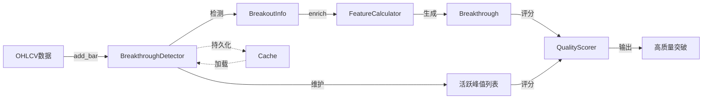
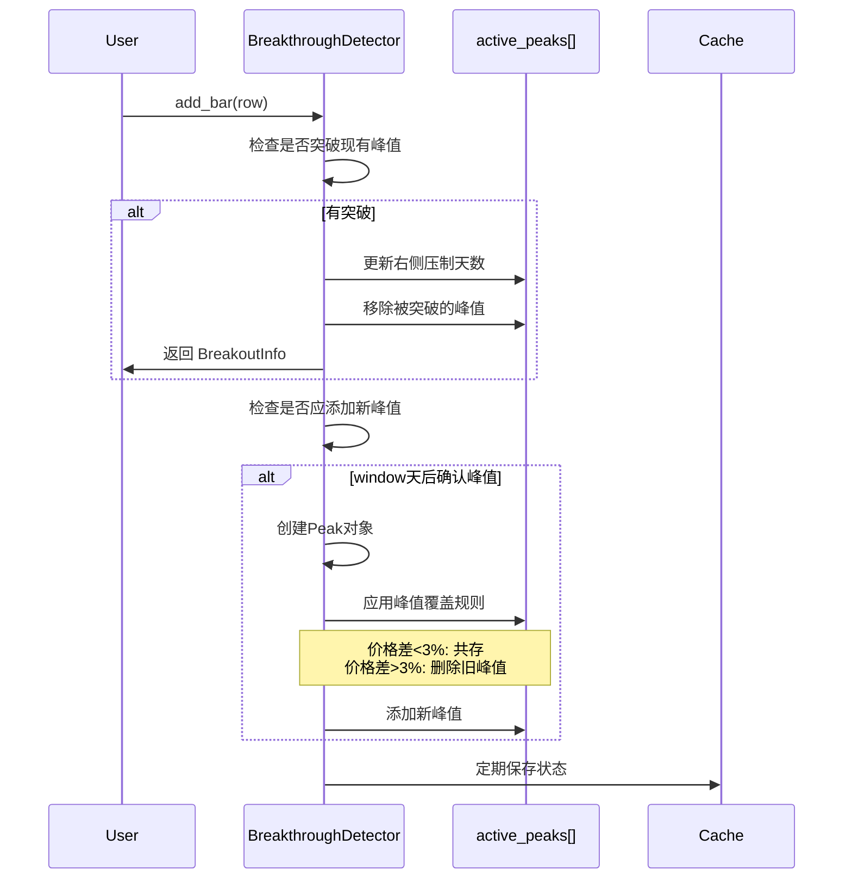

# 技术分析模块 - 实现文档

> 状态：已实现 (Implemented) | 最后更新：2025-12-05

**模块路径**：`BreakthroughStrategy/analysis/`

---

## 一、架构意图

### 核心设计决策

技术分析模块采用**增量式架构**重构，这是一个关键的架构决策：

**Why 增量式？**
- **实时监控需求**：支持逐笔添加新数据，无需重新计算全部历史
- **持久化缓存**：增量状态可序列化保存，系统重启后快速恢复
- **性能优化**：避免回测时重复计算，O(n)复杂度而非O(n²)

**核心创新**：
1. **峰值共存机制**：允许价格相近的峰值同时存在（形成"阻力区"），反映真实市场的价格密集带
2. **一次突破多峰**：单次突破可突破多个峰值，更准确反映市场行为
3. **峰值唯一ID**：每个峰值分配唯一ID，支持追踪和去重

---

## 二、数据流转图



**关键节点说明**：
- **BreakthroughDetector**：增量式核心，维护活跃峰值状态
- **BreakoutInfo**：轻量级突破信息（增量检测直接返回）
- **Breakthrough**：完整突破对象（包含丰富特征，用于评分）
- **Cache**：可选持久化层，支持状态恢复

---

## 三、核心流程

### 3.1 增量式峰值检测流程



**关键决策点**：
- **峰值确认延迟**：等待 `window` 天后才确认峰值（避免假峰值）
- **峰值覆盖阈值**：默认3%，可配置（平衡共存与清理）

### 3.2 峰值共存规则

```python
# 核心逻辑（伪代码）
for old_peak in active_peaks:
    if old_peak.price > new_peak.price:
        # 旧峰值更高 → 始终保留
        keep(old_peak)
    else:
        exceed_pct = (new_peak.price - old_peak.price) / old_peak.price
        if exceed_pct < peak_supersede_threshold:  # 默认3%
            # 价格相近 → 共存（形成阻力区）
            keep(old_peak)
        # else: 新峰值显著更高 → 删除旧峰值
```

**Why 3%阈值？**
- 经验值，反映市场"价格密集带"的典型范围
- 太小（如1%）→ 峰值过度清理，丢失密集区信息
- 太大（如5%）→ 峰值过度保留，噪音增大

---

## 四、质量评分体系

### 4.1 峰值质量评分（Peak Quality Score）

**评分因素（总分100）**：
```yaml
评分维度:
  - 放量（25%）: volume_surge_ratio (2倍=50分, 5倍=100分)
  - 长K线（20%）: candle_change_pct (5%=50分, 10%=100分)
  - 压制时间（25%）: left + right suppression days (30天=50分, 60天=100分)
  - 相对高度（15%）: relative_height (5%=50分, 10%=100分)
  - merged保留（15%）: 向后兼容（固定50分）
```

**核心逻辑**：
- 历史意义 = 形成难度（放量+长K线）+ 维持时间（压制天数）+ 相对位置（高度）

### 4.2 突破质量评分（Breakthrough Quality Score）

**评分因素（总分100）**：
```yaml
评分维度:
  - 涨跌幅（20%）: price_change_pct (3%=50分, 6%=100分)
  - 跳空（10%）: gap_up_pct (1%=50分, 2%=100分)
  - 放量（20%）: volume_surge_ratio (2倍=50分, 5倍=100分)
  - 连续性（15%）: continuity_days (3天=50分, 5天=100分)
  - 稳定性（15%）: stability_score (后续N天不跌破峰值)
  - 阻力强度（20%）: 综合指标（数量+密集度+质量）
```

### 4.3 阻力强度评分（改进版）

**核心改进**：修复密集度计算，识别密集子集而非整体范围

```python
# 示例对比
peaks = [3.79, 3.81, 3.82, 3.9]  # 4个峰值

# 旧版本（错误）
range = 3.9 - 3.79 = 0.11  # 看整体范围 → 评分低

# 新版本（正确）
densest_cluster = [3.79, 3.81, 3.82]  # 识别密集子集
cluster_range = 3.82 - 3.79 = 0.03  # < 3%阈值
density_score = 高分（有密集区 + 额外分散峰值）
```

**评分逻辑**：
1. **数量评分（30%）**：1-5个峰值线性映射到30-80分
2. **密集度评分（30%）**：
   - 找到最大密集子集（滑动窗口算法）
   - 基础分：子集大小（3+个=80分，2个=60分）
   - 密集度加成：子集内价格范围<1%=20分，<3%=10分
   - 多样性加成：有密集区+分散峰值=10分
3. **质量评分（40%）**：
   - 平均质量（基础分）
   - 最高质量加成（>80分=10分）
   - 一致性加成（所有峰值>60分=10分）

---

## 五、已知局限与权衡

### 5.1 峰值确认延迟

**现状**：峰值需等待 `window` 天后才能确认

**影响**：
- ✅ 优点：避免假峰值，提高准确性
- ❌ 缺点：实时监控时，最新峰值无法立即识别

**未来优化方向**：
- 引入"候选峰值"机制（未确认但可监控）
- 双模式：回测用严格确认，实时用候选峰值

### 5.2 持久化依赖 pickle

**现状**：使用 `pickle` 序列化状态

**权衡**：
- ✅ 优点：简单快速，支持复杂对象
- ❌ 缺点：不跨语言，版本兼容性差

**未来改进**：
- 考虑切换到 JSON/MessagePack（需自定义序列化）

### 5.3 质量评分线性模型

**现状**：手工设计权重 + 线性加权

**局限**：
- 无法捕捉非线性关系（如放量 × 涨跌幅的交互效应）
- 权重依赖人工调整

**未来方向**：
- 引入机器学习模型（XGBoost/LightGBM）
- 基于历史回测数据自动学习评分函数

---

## 六、与原计划（Plan）的偏差

### 主要变更

| 原计划 | 实际实现 | 原因 |
|--------|---------|------|
| 分离 `PeakDetector` 和 `BreakoutDetector` | 统一为 `BreakthroughDetector` | 增量式架构要求统一状态管理 |
| 凸点合并阈值1% | 峰值覆盖阈值3% | 更合理反映市场价格密集带 |
| 特殊意义点检测 | 未实现 | 复杂度高，暂时搁置（保留接口） |
| 使用 Backtrader | 自研特征计算 | 更灵活，避免框架锁定 |

### 新增功能

1. **峰值唯一ID**：原计划未涉及，实现时添加以支持追踪
2. **多峰值突破**：原计划为1:1关系，实现时改为1:N（更真实）
3. **持久化缓存**：原计划未强调，实现时作为核心特性

---

## 七、配置参数说明

```yaml
# 核心参数（示例）
window: 5                          # 峰值识别窗口
exceed_threshold: 0.005            # 突破确认阈值（0.5%）
peak_supersede_threshold: 0.03     # 峰值覆盖阈值（3%）

# 质量评分权重（峰值）
peak_weight_volume: 0.25           # 放量权重
peak_weight_candle: 0.20           # 长K线权重
peak_weight_suppression: 0.25      # 压制时间权重
peak_weight_height: 0.15           # 相对高度权重
peak_weight_merged: 0.15           # merged权重（兼容）

# 质量评分权重（突破）
bt_weight_change: 0.20             # 涨跌幅权重
bt_weight_gap: 0.10                # 跳空权重
bt_weight_volume: 0.20             # 放量权重
bt_weight_continuity: 0.15         # 连续性权重
bt_weight_stability: 0.15          # 稳定性权重
bt_weight_resistance: 0.20         # 阻力强度权重

# 阻力强度子权重
res_weight_quantity: 0.30          # 峰值数量权重
res_weight_density: 0.30           # 密集度权重
res_weight_quality: 0.40           # 峰值质量权重
```

---

## 八、API 使用示例

### 基础用法

```python
from BreakthroughStrategy.analysis import (
    BreakthroughDetector, FeatureCalculator, QualityScorer
)
import pandas as pd

# 1. 初始化检测器（增量式）
detector = BreakthroughDetector(
    symbol='AAPL',
    window=5,
    exceed_threshold=0.005,
    peak_supersede_threshold=0.03,
    use_cache=True  # 启用持久化
)

# 2. 批量添加历史数据
df = pd.read_csv('AAPL_history.csv')  # OHLCV数据
breakouts = detector.batch_add_bars(df, return_breakouts=True)

# 3. 增量添加新数据
new_bar = df.iloc[-1]
breakout_info = detector.add_bar(new_bar)

# 4. 丰富特征
if breakout_info:
    calculator = FeatureCalculator()
    breakthrough = calculator.enrich_breakthrough(df, breakout_info, 'AAPL')

    # 5. 质量评分
    scorer = QualityScorer()
    for peak in breakthrough.broken_peaks:
        scorer.score_peak(peak)
    scorer.score_breakthrough(breakthrough)

    print(f"突破质量: {breakthrough.quality_score:.1f}")
    print(f"突破了 {breakthrough.num_peaks_broken} 个峰值")
    print(f"峰值价格范围: {breakthrough.peak_price_range:.2%}")
```

### 状态查询与管理

```python
# 查看检测器状态
status = detector.get_status()
print(f"活跃峰值数量: {status['active_peaks']}")

# 清除缓存
detector.clear_cache()

# 获取突破信息
print(f"突破类型: {breakthrough.breakthrough_type}")  # 'yang', 'yin', 'shadow'
print(f"被突破的最高峰值: {breakthrough.highest_peak_broken.price}")
```

---

## 九、性能特征

### 时间复杂度

- **add_bar()**：O(P)，P为活跃峰值数量（通常<10）
- **batch_add_bars()**：O(N×P)，N为数据点数
- **峰值质量评分**：O(1)
- **突破质量评分**：O(P)，P为突破的峰值数

### 空间复杂度

- **内存占用**：O(N + P)，N为历史数据点，P为活跃峰值
- **缓存文件**：约100KB/股票（1000天历史数据）

### 性能优化手段

1. **增量计算**：避免重复计算历史数据
2. **向量化操作**：使用pandas/numpy向量化计算
3. **延迟评分**：峰值质量评分仅在需要时计算
4. **持久化缓存**：避免系统重启时重新计算

---

## 十、测试覆盖

### 单元测试

- ✅ 峰值识别正确性
- ✅ 峰值共存规则
- ✅ 突破检测准确性
- ✅ 质量评分范围（0-100）
- ✅ 持久化加载/保存

### 集成测试

- ✅ 完整流程测试（数据→检测→评分）
- ✅ 多股票批量处理
- ✅ 缓存一致性测试

**测试文件**：
- `BreakthroughStrategy/analysis/test/test_integrated_system.py`
- `BreakthroughStrategy/analysis/test/test_quality_improvement.py`

---

## 十一、未来演进方向

### 短期改进（v2.0）

1. **候选峰值机制**：支持实时监控最新峰值
2. **异常检测**：识别并过滤数据异常（如停牌、拆股）
3. **多时间周期**：支持周K、月K峰值

### 中期优化（v3.0）

1. **机器学习评分**：使用 XGBoost 替代线性模型
2. **自适应阈值**：根据市场波动率动态调整参数
3. **并行处理**：多进程批量扫描

### 长期目标（v4.0）

1. **深度学习**：使用 LSTM/Transformer 识别复杂形态
2. **多因子融合**：结合基本面、情绪面数据
3. **实时推理**：<100ms 响应时间

---

**维护者**：Claude Code
**最后审核**：2025-12-05
