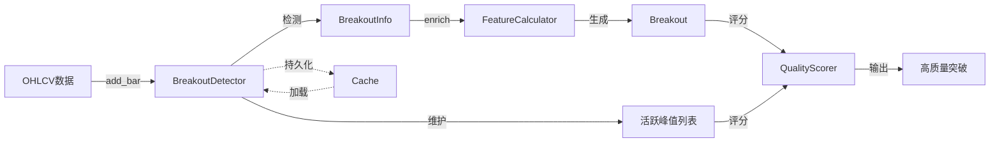
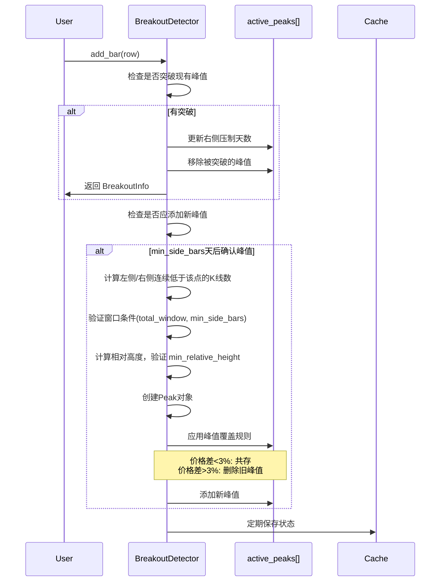

# 技术分析模块 - 实现文档

> 状态：已实现 (Implemented) | 最后更新：2025-12-27

**模块路径**：`BreakoutStrategy/analysis/`

---

## 一、架构意图

### 核心设计决策

技术分析模块采用**增量式架构**重构，这是一个关键的架构决策：

**Why 增量式？**
- **实时监控需求**：支持逐笔添加新数据，无需重新计算全部历史
- **持久化缓存**：增量状态可序列化保存，系统重启后快速恢复
- **性能优化**：避免回测时重复计算，O(n)复杂度而非O(n²)

**核心创新**：
1. **峰值共存机制**：允许价格相近的峰值同时存在（形成"阻力区"），反映真实市场的价格密集带
2. **一次突破多峰**：单次突破可突破多个峰值，更准确反映市场行为
3. **峰值唯一ID**：每个峰值分配唯一ID，支持追踪和去重
4. **不对称窗口检测**：峰值确认采用灵活的不对称窗口 + 相对高度下限，更符合实际市场形态
5. **Bonus 乘法评分模型**（v3.0）：突破评分采用基准分 × 多个 Bonus 乘数的模型，避免权重归一化问题

---

## 二、数据流转图



**关键节点说明**：
- **BreakoutDetector**：增量式核心，维护活跃峰值状态
- **BreakoutInfo**：轻量级突破信息（增量检测直接返回）
- **Breakout**：完整突破对象（包含丰富特征，用于评分）
- **Cache**：可选持久化层，支持状态恢复

---

## 三、核心流程

### 3.1 增量式峰值检测流程



**关键决策点**：
- **不对称窗口**：左右两侧合计 `total_window` 根，单侧至少 `min_side_bars` 根
- **相对高度下限**：峰值相对窗口内最低点的幅度 >= `min_relative_height`
- **峰值覆盖阈值**：默认3%，可配置（平衡共存与清理）

### 3.2 峰值判定规则（不对称窗口）

**核心逻辑**：
```python
def _detect_peak_in_window(current_idx):
    # 窗口：[current_idx - total_window, current_idx)
    window_highs = self.highs[window_start:current_idx]

    # 条件1：在窗口内是最高点
    max_high = max(window_highs)
    max_local_idx = window_highs.index(max_high)

    # 条件2：不在窗口前后 min_side_bars 位置
    if max_local_idx < min_side_bars:
        return  # 在窗口前部，不是有效峰值
    if max_local_idx >= window_size - min_side_bars:
        return  # 在窗口后部，不是有效峰值

    # 条件3：相对高度满足要求
    window_min_low = min(window_lows)
    relative_height = (max_high - window_min_low) / window_min_low
    if relative_height < min_relative_height:
        return  # 相对高度不足

    # 通过所有条件，创建峰值...
```

**Why 不对称窗口？**
- **符合实际形态**：上涨趋势中的顶部（左长右短）vs 下跌初期的顶部（左短右长）
- **灵活性**：允许 左8+右2 或 左2+右8，只要合计满足 total_window
- **单侧保障**：`min_side_bars` 防止极端情况（如0+10）

**Why 相对高度下限？**
- 过滤横盘震荡中的噪声峰值
- 确保峰值具有足够的"显著性"来构成有效阻力

### 3.3 峰值共存规则

```python
# 核心逻辑（伪代码）
for old_peak in active_peaks:
    if old_peak.price > new_peak.price:
        # 旧峰值更高 → 始终保留
        keep(old_peak)
    else:
        exceed_pct = (new_peak.price - old_peak.price) / old_peak.price
        if exceed_pct < peak_supersede_threshold:  # 默认3%
            # 价格相近 → 共存（形成阻力区）
            keep(old_peak)
        # else: 新峰值显著更高 → 删除旧峰值
```

**Why 3%阈值？**
- 经验值，反映市场"价格密集带"的典型范围
- 太小（如1%）→ 峰值过度清理，丢失密集区信息
- 太大（如5%）→ 峰值过度保留，噪音增大

---

## 四、质量评分体系

### 4.1 峰值质量评分（Peak Quality Score）

**评分因素（总分100，加权模型）**：
```yaml
评分维度:
  - 放量（60%）: volume_surge_ratio (1倍=0分, 10倍=100分，对数增长)
  - 长K线（40%）: candle_change_pct (3%=0分, 20%=100分)
```

**核心逻辑**：
- 峰值质量 = 筹码堆积程度（放量 + 长K线）
- **relative_height 已移至历史意义维度**：反映心理阻力而非筹码堆积

> **变更记录**：
> - 2025-12-12 移除了无效的 `merged` 权重
> - 2025-12-14 移除 `suppression`，压制时间改为历史意义子因素
> - 2025-12-21 将 `relative_height` 从峰值质量移至历史意义，权重调整为 volume:60%, candle:40%

### 4.2 突破质量评分（Breakout Quality Score）- Bonus 乘法模型

**核心设计（v3.0）**：
- 公式：`总分 = BASE × bonus1 × bonus2 × ... × bonusN`
- 基准分 `BASE = 50`：存在有效突破这件事本身的价值
- 满足条件时获得对应 bonus 乘数（>1.0），否则为 1.0（无加成）
- **总分可超过 100**，只要同一基准下可比即可

**Bonus 因素**：
```yaml
阻力属性 Bonus:
  Age:        # 最老峰值年龄（远期 > 近期）
    - 21天:  1.15
    - 63天:  1.30
    - 252天: 1.50
  Tests:      # 测试次数（簇内峰值数）
    - 2次: 1.10
    - 3次: 1.25
    - 4次: 1.40
  Height:     # 最大相对高度
    - 10%: 1.15
    - 20%: 1.30

突破行为 Bonus:
  Volume:     # 成交量放大
    - 1.5倍: 1.15
    - 2.0倍: 1.30
  Gap:        # 跳空缺口
    - 1%: 1.10
    - 2%: 1.20
  DailyReturn: # 日间涨幅（ATR标准化）
    - 1.5x ATR: 1.10
    - 3.0x ATR: 1.20
  Continuity: # 连续阳线
    - 3天: 1.15
  Momentum:   # 连续突破
    - 2次: 1.20
```

**Why Bonus 乘法模型？**
- **避免权重归一化问题**：传统加权模型需要权重和为1，新因素难以加入
- **乘法语义正确**：多个利好因素同时满足时，效果应该叠加
- **灵活扩展**：新增 Bonus 不影响现有评分逻辑
- **排序符合直觉**：远期+多测试+放量 > 近期+单测试+缩量

### 4.3 评分方法架构

**设计决策**：评分逻辑单一来源

```
score_peak()           ──委托──>  get_peak_score_breakdown()
score_breakout()   ──委托──>  get_breakout_score_breakdown_bonus()
```

**Why 这样设计？**
- `get_xxx_breakdown()` 方法返回详细的评分分解（用于 UI 浮动窗口显示）
- `score_xxx()` 方法只需要总分，直接复用 breakdown 计算
- **避免重复代码**：评分逻辑只存在于一处，修改权重时无需同步多处
- **一致性保证**：`score()` 返回的总分与 `breakdown.total_score` 永远一致

### 4.4 阻力簇分组

**核心设计**：
- 将被突破峰值按价格相近度分组成"阻力簇"
- 相邻峰值价差 < 3% 则归入同簇
- Tests Bonus 使用**峰值数量最多的簇**的大小

**簇选择逻辑**：
```python
# 直接取最大簇，不做复杂评分
best_cluster = max(clusters, key=len)
test_count = len(best_cluster)
```

**Why 取最大簇？**
- `test_count` 语义是"同一阻力区被测试的次数"
- 峰值数量直接反映测试次数，无需综合其他因素
- Age/Height 等属性已在各自的 Bonus 中单独评估

---

## 五、特征计算模块

**FeatureCalculator 职责**：从 BreakoutInfo 计算完整的 Breakout 对象

**核心特征**：
```yaml
突破类型（breakout_type）:
  - yang: 阳线突破（收盘 > 开盘）
  - yin: 阴线突破（收盘 < 开盘）
  - shadow: 上影线突破（收盘 ≈ 开盘，差异<1%）

价格特征:
  - price_change_pct: 突破日涨跌幅（收盘-开盘）/开盘
  - gap_up: 是否跳空
  - gap_up_pct: 跳空幅度

量能特征:
  - volume_surge_ratio: 放量倍数（相对63日均量）

时间特征:
  - continuity_days: 突破前连续阳线天数（不含突破日）
  - stability_score: 突破后N天内不跌破峰值的比例

动量特征:
  - recent_breakout_count: 近期突破次数（momentum_window 内）

ATR相关特征（可选）:
  - daily_return_atr_ratio: 日间涨幅的ATR标准化值 (close[i]-close[i-1])/ATR[i-1]
  - atr_value: ATR值（使用前一天的ATR，避免用自身作为标准）
  - atr_normalized_height: 突破幅度/ATR

回测标签:
  - labels: {"label_5_20": 0.15, ...}
```

---

## 六、技术指标模块

**TechnicalIndicators 职责**：基于 `pandas_ta` 库提供常用技术指标计算

**依赖**：`pandas_ta>=0.3.14b`（必需）

**支持的指标**：
- `calculate_ma(series, period)`: 移动平均线
- `calculate_rsi(close, period)`: RSI 指标（使用 pandas_ta）
- `calculate_atr(high, low, close, period)`: ATR 指标（Wilder's smoothing，与 TradingView 一致）
- `calculate_relative_volume(volume, period)`: 相对成交量
- `add_indicators(df)`: 批量添加 ma_20, ma_50, rsi_14, rv_63

---

## 七、已知局限与权衡

### 7.1 峰值确认延迟

**现状**：峰值需等待 `min_side_bars` 天后才能确认（确保右侧有足够数据）

**影响**：
- ✅ 优点：避免假峰值，提高准确性
- ❌ 缺点：实时监控时，最新峰值无法立即识别

**未来优化方向**：
- 引入"候选峰值"机制（未确认但可监控）
- 双模式：回测用严格确认，实时用候选峰值

### 7.2 持久化依赖 pickle

**现状**：使用 `pickle` 序列化状态

**权衡**：
- ✅ 优点：简单快速，支持复杂对象
- ❌ 缺点：不跨语言，版本兼容性差

**未来改进**：
- 考虑切换到 JSON/MessagePack（需自定义序列化）

### 7.3 Bonus 模型总分无上限

**现状**：乘法模型下总分可能超过100

**权衡**：
- ✅ 优点：避免权重归一化，扩展灵活
- ❌ 缺点：分数不直观，需要相对比较

**建议**：UI 中使用分位数或相对排名展示

---

## 八、配置参数说明

```yaml
# 核心参数（峰值检测）
total_window: 10                   # 总窗口大小（左右合计需超过的K线数）
min_side_bars: 2                   # 单侧最少K线数
min_relative_height: 0.05          # 最小相对高度（5%）
exceed_threshold: 0.005            # 突破确认阈值（0.5%）
peak_supersede_threshold: 0.03     # 峰值覆盖阈值（3%）
momentum_window: 20                # 连续突破统计窗口（20个交易日）

# 参数约束：min_side_bars * 2 <= total_window

# 峰值质量评分权重（加权模型）
peak_weight_volume: 0.60           # 放量权重
peak_weight_candle: 0.40           # 长K线权重

# Bonus 模型配置
bonus_base_score: 50               # 基准分

# Age bonus 阈值和乘数
age_bonus_thresholds: [21, 63, 252]     # 1月, 3月, 1年
age_bonus_values: [1.15, 1.30, 1.50]

# Test bonus 阈值和乘数
test_bonus_thresholds: [2, 3, 4]
test_bonus_values: [1.10, 1.25, 1.40]

# Height bonus 阈值和乘数
height_bonus_thresholds: [0.10, 0.20]
height_bonus_values: [1.15, 1.30]

# Volume bonus 阈值和乘数
volume_bonus_thresholds: [1.5, 2.0]
volume_bonus_values: [1.15, 1.30]

# Gap bonus 阈值和乘数
gap_bonus_thresholds: [0.01, 0.02]
gap_bonus_values: [1.10, 1.20]

# Continuity bonus 阈值和乘数
continuity_bonus_thresholds: [3]
continuity_bonus_values: [1.15]

# Momentum bonus 阈值和乘数
momentum_bonus_thresholds: [2]
momentum_bonus_values: [1.20]

# Peak Volume bonus 阈值和乘数（阻力属性）
peak_volume_bonus_thresholds: [2.0, 5.0]
peak_volume_bonus_values: [1.10, 1.20]

# Daily Return bonus 阈值和乘数（ATR标准化）
daily_return_bonus_thresholds: [1.5, 3.0]  # ATR倍数
daily_return_bonus_values: [1.10, 1.20]

# ATR 标准化配置（可选功能）
use_atr_normalization: false       # 是否启用 ATR 标准化高度 bonus
atr_normalized_height_thresholds: [1.5, 2.5]
atr_normalized_height_values: [1.10, 1.20]
atr_period: 14                     # ATR 计算周期

# 阻力簇参数
cluster_density_threshold: 0.03    # 簇密集度阈值（用于峰值分组）
```

---

## 九、API 使用示例

### 基础用法

```python
from BreakoutStrategy.analysis import (
    BreakoutDetector, FeatureCalculator, QualityScorer
)
import pandas as pd

# 1. 初始化检测器（增量式）
detector = BreakoutDetector(
    symbol='AAPL',
    total_window=10,
    min_side_bars=2,
    min_relative_height=0.05,
    exceed_threshold=0.005,
    peak_supersede_threshold=0.03,
    momentum_window=20,
    use_cache=True
)

# 2. 批量添加历史数据
df = pd.read_csv('AAPL_history.csv')
breakouts = detector.batch_add_bars(df, return_breakouts=True)

# 3. 增量添加新数据
new_bar = df.iloc[-1]
breakout_info = detector.add_bar(new_bar)

# 4. 丰富特征（传入 detector 以获取连续突破信息）
if breakout_info:
    calculator = FeatureCalculator()
    breakout = calculator.enrich_breakout(
        df, breakout_info, 'AAPL', detector=detector
    )

    # 5. 质量评分
    scorer = QualityScorer()
    for peak in breakout.broken_peaks:
        scorer.score_peak(peak)
    scorer.score_breakout(breakout)

    print(f"突破质量: {breakout.quality_score:.1f}")
    print(f"突破了 {breakout.num_peaks_broken} 个峰值")
```

### 评分分解查看

```python
# 获取突破评分的详细分解（Bonus 模型）
breakdown = scorer.get_breakout_score_breakdown_bonus(breakout)

print(f"基准分: {breakdown.base_score}")
print(f"总分: {breakdown.total_score:.1f}")
print(f"公式: {breakdown.get_formula_string()}")

for bonus in breakdown.bonuses:
    if bonus.triggered:
        print(f"  {bonus.name}: {bonus.raw_value}{bonus.unit} -> ×{bonus.bonus:.2f}")
```

---

## 十、性能特征

### 时间复杂度

- **add_bar()**：O(P)，P为活跃峰值数量（通常<10）
- **batch_add_bars()**：O(N×P)，N为数据点数
- **峰值质量评分**：O(1)
- **突破质量评分**：O(P²)（簇分组）

### 空间复杂度

- **内存占用**：O(N + P)，N为历史数据点，P为活跃峰值
- **缓存文件**：约100KB/股票（1000天历史数据）

### 性能优化手段

1. **增量计算**：避免重复计算历史数据
2. **向量化操作**：使用pandas/numpy向量化计算
3. **延迟评分**：峰值质量评分仅在需要时计算
4. **持久化缓存**：避免系统重启时重新计算

---

## 十一、测试覆盖

### 单元测试

- ✅ 峰值识别正确性
- ✅ 峰值共存规则
- ✅ 突破检测准确性
- ✅ 质量评分范围
- ✅ 持久化加载/保存

### 集成测试

- ✅ 完整流程测试（数据→检测→评分）
- ✅ 多股票批量处理
- ✅ 缓存一致性测试

**测试文件**：
- `BreakoutStrategy/analysis/test/test_integrated_system.py`

---

## 十二、架构演进记录

### 2025-12-21 簇选择逻辑简化

**改动**：
- 簇选择从复杂评分改为简单取最大簇：`max(clusters, key=len)`
- 删除的评分方法：`_score_cluster_importance()`, `_score_age_factor()`, `_score_test_factor()`, `_score_height_factor()`
- 删除的配置参数：`age_base_days`, `age_saturation_days`

**原因**：
- `test_count` 语义是"同一阻力区被测试的次数"，直接取最大簇更合理
- 旧的复杂评分逻辑混淆了"选簇"和"评分"的概念
- Age/Height 等属性已在各自的 Bonus 中单独评估，无需在选簇时重复考虑

### 2025-12-21 代码清理与 Bonus 模型完善

**改动**：
- 删除旧加权模型代码（约720行），仅保留 Bonus 乘法模型
- 删除的权重配置：`breakout_weights`, `resistance_weights`, `historical_weights`
- 删除的时间衰减参数：`time_decay_baseline`, `time_decay_half_life`, `historical_significance_saturation`
- 删除的旧评分方法：`_score_resistance_strength()`, `_score_quantity()`, `_score_density()`, `_find_densest_cluster()`, `_score_peak_quality_aggregate()`, `_score_suppression_span()`, `_calculate_time_decay_factor()`, `_score_effective_quality()`, `_score_recency()`
- 删除的旧分解方法：`get_breakout_score_breakdown()`, `_get_resistance_importance()`, `_get_resistance_breakdown()`, `_get_historical_breakdown()`, `_get_momentum_breakdown()` (FeatureScoreDetail版)

**保留的代码**：
- `FeatureScoreDetail` 和 `get_peak_score_breakdown()`：峰值评分仍使用加权模型
- `_group_peaks_into_clusters()`：Bonus 模型复用

**原因**：
- 全面切换到 Bonus 乘法模型后，旧代码不再使用
- 减少代码复杂度，提高可维护性

### 2025-12-21 Bonus 乘法模型升级

**改动**：
- 突破评分从加权模型切换到 Bonus 乘法模型
- 峰值质量权重调整：volume:45%→60%, candle:20%→40%, height:35%→0%

**原因**：
- 加权模型需要权重归一化，新增因素困难
- 乘法模型更符合"多个利好叠加"的直觉

### 2025-12-27 ATR 标准化与 DailyReturn Bonus

**改动**：
- 新增 `daily_return_atr_ratio` 特征：日间涨幅的 ATR 标准化值
- 新增 `_get_daily_return_bonus()` 方法：基于 ATR 标准化日间涨幅的 Bonus
- `TechnicalIndicators` 新增 `calculate_atr()` 方法，使用 `pandas_ta` 库
- `Breakout` 数据结构新增字段：`daily_return_atr_ratio`, `atr_value`, `atr_normalized_height`
- 可选功能：ATR 标准化高度 Bonus（通过 `use_atr_normalization` 启用）

**原因**：
- 日间涨幅（close[i] - close[i-1]）使用 ATR 标准化后可跨股票比较
- 低波动率股票的相同幅度涨幅更有意义
- ATR 使用前一天的值（ATR[i-1]），避免用自身作为标准

---

**维护者**：Claude Code
**最后审核**：2025-12-27
