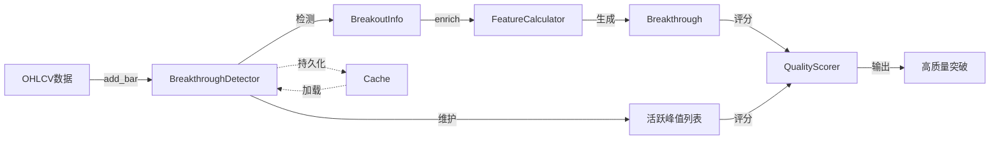
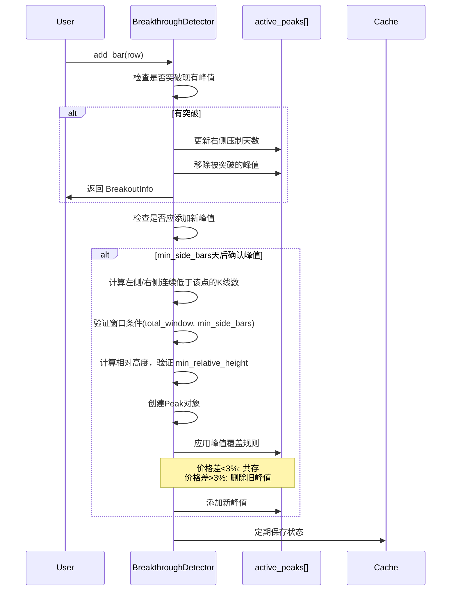

# 技术分析模块 - 实现文档

> 状态：已实现 (Implemented) | 最后更新：2025-12-14

**模块路径**：`BreakthroughStrategy/analysis/`

---

## 一、架构意图

### 核心设计决策

技术分析模块采用**增量式架构**重构，这是一个关键的架构决策：

**Why 增量式？**
- **实时监控需求**：支持逐笔添加新数据，无需重新计算全部历史
- **持久化缓存**：增量状态可序列化保存，系统重启后快速恢复
- **性能优化**：避免回测时重复计算，O(n)复杂度而非O(n²)

**核心创新**：
1. **峰值共存机制**：允许价格相近的峰值同时存在（形成"阻力区"），反映真实市场的价格密集带
2. **一次突破多峰**：单次突破可突破多个峰值，更准确反映市场行为
3. **峰值唯一ID**：每个峰值分配唯一ID，支持追踪和去重
4. **不对称窗口检测**（v2.0新增）：峰值确认采用灵活的不对称窗口 + 相对高度下限，更符合实际市场形态

---

## 二、数据流转图



**关键节点说明**：
- **BreakthroughDetector**：增量式核心，维护活跃峰值状态
- **BreakoutInfo**：轻量级突破信息（增量检测直接返回）
- **Breakthrough**：完整突破对象（包含丰富特征，用于评分）
- **Cache**：可选持久化层，支持状态恢复

---

## 三、核心流程

### 3.1 增量式峰值检测流程



**关键决策点**：
- **不对称窗口**：左右两侧合计 `total_window` 根，单侧至少 `min_side_bars` 根
- **相对高度下限**：峰值相对窗口内最低点的幅度 >= `min_relative_height`
- **峰值覆盖阈值**：默认3%，可配置（平衡共存与清理）

### 3.2 峰值判定规则（v2.0 不对称窗口）

**核心逻辑**：
```python
def _check_and_add_peak(idx):
    high = self.highs[idx]

    # 1. 计算左侧连续低于 high 的K线数量
    left_bars = 0
    for i in range(idx - 1, -1, -1):
        if self.highs[i] >= high:
            break
        left_bars += 1

    # 2. 计算右侧连续低于 high 的K线数量
    right_bars = 0
    for i in range(idx + 1, len(self.highs)):
        if self.highs[i] >= high:
            break
        right_bars += 1

    # 3. 验证窗口条件
    if left_bars < min_side_bars or right_bars < min_side_bars:
        return  # 单侧不满足最小要求
    if left_bars + right_bars < total_window:
        return  # 总窗口不满足要求

    # 4. 计算相对高度（取两侧窗口最低点中的较低者）
    left_low = min(lows[idx-left_bars:idx])
    right_low = min(lows[idx+1:idx+1+right_bars])
    window_low = min(left_low, right_low)

    relative_height = (high - window_low) / window_low
    if relative_height < min_relative_height:
        return  # 相对高度不满足要求

    # 5. 通过所有条件，创建峰值
    ...
```

**Why 不对称窗口？**
- **符合实际形态**：上涨趋势中的顶部（左长右短）vs 下跌初期的顶部（左短右长）
- **灵活性**：允许 左8+右2 或 左2+右8，只要合计满足 total_window
- **单侧保障**：`min_side_bars` 防止极端情况（如0+10）

**Why 相对高度下限？**
- 过滤横盘震荡中的噪声峰值
- 确保峰值具有足够的"显著性"来构成有效阻力

### 3.3 峰值共存规则

```python
# 核心逻辑（伪代码）
for old_peak in active_peaks:
    if old_peak.price > new_peak.price:
        # 旧峰值更高 → 始终保留
        keep(old_peak)
    else:
        exceed_pct = (new_peak.price - old_peak.price) / old_peak.price
        if exceed_pct < peak_supersede_threshold:  # 默认3%
            # 价格相近 → 共存（形成阻力区）
            keep(old_peak)
        # else: 新峰值显著更高 → 删除旧峰值
```

**Why 3%阈值？**
- 经验值，反映市场"价格密集带"的典型范围
- 太小（如1%）→ 峰值过度清理，丢失密集区信息
- 太大（如5%）→ 峰值过度保留，噪音增大

---

## 四、质量评分体系

### 4.1 峰值质量评分（Peak Quality Score）

**评分因素（总分100）**：
```yaml
评分维度:
  - 放量（45%）: volume_surge_ratio (2倍=50分, 5倍=100分)
  - 长K线（20%）: candle_change_pct (5%=50分, 10%=100分)
  - 相对高度（35%）: relative_height (5%=50分, 10%=100分)
```

**核心逻辑**：
- 峰值质量 = 形成难度（放量+长K线）+ 相对位置（高度）
- **不含压制时间**：压制时间已移至"历史意义"维度单独评估

> **变更记录**：
> - 2025-12-12 移除了无效的 `merged` 权重
> - 2025-12-14 **Phase 1** 移除 `suppression`，压制时间改为历史意义子因素

### 4.2 突破质量评分（Breakthrough Quality Score）

**评分因素（总分100）**：
```yaml
评分维度:
  - 涨跌幅（10%）: price_change_pct (3%=50分, 6%=100分)
  - 跳空（5%）: gap_up_pct (1%=50分, 2%=100分)
  - 放量（17%）: volume_surge_ratio (2倍=50分, 5倍=100分)
  - 连续性（13%）: continuity_days (3天=50分, 5天=100分)
  - 稳定性（10%）: stability_score (后续N天不跌破峰值)
  - 阻力强度（25%）: 数量 + 密集度 + 有效质量(质量×时间因子)
  - 历史意义（20%）: 最远峰值年龄 + 压制跨度（仅高质量峰值参与）
```

> **变更记录**：
> - 2025-12-14 **Phase 1** 新增"历史意义"独立维度，阻力强度中的 recency 整合入 quality
> - 2025-12-14 **Phase 2** 历史意义仅计算高质量峰值（>=阈值）

### 4.3 评分方法架构（重构后）

**设计决策**：评分逻辑单一来源

```
score_peak()           ──委托──>  get_peak_score_breakdown()
score_breakthrough()   ──委托──>  get_breakthrough_score_breakdown()
_score_resistance_strength() ──委托──> _get_resistance_breakdown()
```

**Why 这样设计？**
- `get_xxx_breakdown()` 方法返回详细的评分分解（用于 UI 浮动窗口显示）
- `score_xxx()` 方法只需要总分，直接复用 breakdown 计算
- **避免重复代码**：评分逻辑只存在于一处，修改权重时无需同步多处
- **一致性保证**：`score()` 返回的总分与 `breakdown.total_score` 永远一致

> **变更记录**：2025-12-12 重构，消除 `score_xxx()` 与 `get_xxx_breakdown()` 之间的代码重复

### 4.4 阻力强度评分（双维度时间模型版）

**核心改进**：
1. 修复密集度计算，识别密集子集而非整体范围
2. **Phase 1**：`recency` 整合入 `quality`，采用乘法模型

```python
# 有效质量计算（Phase 1 核心改动）
for peak in broken_peaks:
    age_bars = breakthrough.index - peak.index
    decay = 0.5 ** (age_bars / half_life)  # 指数衰减
    time_factor = baseline + (1 - baseline) * decay  # 保留30%基线
    effective_quality = peak.quality_score * time_factor
```

**Why 乘法模型？**
- 语义正确：时间衰减作用于质量，而非独立相加
- 边界合理：峰值很老时，有效质量趋近于 `quality × baseline`
- 避免：无峰值时 recency 仍有分数的荒谬情况

**评分逻辑（Phase 1 后）**：
1. **数量评分（30%）**：1-5个峰值线性映射到30-80分（结构因素，不衰减）
2. **密集度评分（30%）**：识别密集子集（结构因素，不衰减）
3. **有效质量评分（40%）**：`avg(quality × time_factor)`

### 4.5 历史意义评分（双维度时间模型版）

**核心设计**：与阻力强度形成**对称的双维度**

| 维度 | 时间效应 | 数学模型 | 物理意义 |
|------|---------|---------|---------|
| 阻力强度 | 衰减 | 指数衰减 `0.5^(t/半衰期)` | 套牢盘离场 |
| 历史意义 | 增长 | 对数增长 `log(t)/log(饱和点)` | 突破历史记录 |

**子因素**：
1. **最远峰值年龄（55%）**：突破的最远峰值距今多久（对数增长）
2. **压制跨度（45%）**：被突破峰值的平均压制时间

**Phase 2 改进：条件性历史加成**
```python
# 仅高质量峰值参与历史意义计算
threshold = historical_quality_threshold  # 默认60
significant_peaks = [p for p in broken_peaks if p.quality_score >= threshold]
if not significant_peaks:
    significant_peaks = broken_peaks  # 回退机制
```

**Why 条件性？**
- 低质量峰值 = 弱阻力 → 突破它们不具有"历史意义"
- 避免噪声干扰 → 小的价格波动不应影响历史意义评分

---

## 五、已知局限与权衡

### 5.1 峰值确认延迟

**现状**：峰值需等待 `min_side_bars` 天后才能确认（确保右侧有足够数据）

**影响**：
- ✅ 优点：避免假峰值，提高准确性
- ❌ 缺点：实时监控时，最新峰值无法立即识别

**未来优化方向**：
- 引入"候选峰值"机制（未确认但可监控）
- 双模式：回测用严格确认，实时用候选峰值

### 5.2 持久化依赖 pickle

**现状**：使用 `pickle` 序列化状态

**权衡**：
- ✅ 优点：简单快速，支持复杂对象
- ❌ 缺点：不跨语言，版本兼容性差

**未来改进**：
- 考虑切换到 JSON/MessagePack（需自定义序列化）

### 5.3 质量评分线性模型

**现状**：手工设计权重 + 线性加权

**局限**：
- 无法捕捉非线性关系（如放量 × 涨跌幅的交互效应）
- 权重依赖人工调整

**未来方向**：
- 引入机器学习模型（XGBoost/LightGBM）
- 基于历史回测数据自动学习评分函数

---

## 七、配置参数说明

```yaml
# 核心参数（v2.0 不对称窗口）
total_window: 10                   # 总窗口大小（左右合计需超过的K线数）
min_side_bars: 2                   # 单侧最少K线数
min_relative_height: 0.10          # 最小相对高度（10%）
exceed_threshold: 0.005            # 突破确认阈值（0.5%）
peak_supersede_threshold: 0.03     # 峰值覆盖阈值（3%）

# 参数约束：min_side_bars * 2 <= total_window

# 质量评分权重（峰值）- 总和 1.0（Phase 1 后移除 suppression）
peak_weight_volume: 0.45           # 放量权重
peak_weight_candle: 0.20           # 长K线权重
peak_weight_height: 0.35           # 相对高度权重

# 质量评分权重（突破）- 总和 1.0（Phase 1 后新增 historical）
bt_weight_change: 0.10             # 涨跌幅权重
bt_weight_gap: 0.05                # 跳空权重
bt_weight_volume: 0.17             # 放量权重
bt_weight_continuity: 0.13         # 连续性权重
bt_weight_stability: 0.10          # 稳定性权重
bt_weight_resistance: 0.25         # 阻力强度权重
bt_weight_historical: 0.20         # 历史意义权重

# 阻力强度子权重 - 总和 1.0（Phase 1 后移除 recency）
res_weight_quantity: 0.30          # 峰值数量权重
res_weight_density: 0.30           # 密集度权重
res_weight_quality: 0.40           # 有效质量权重（含时间衰减）

# 历史意义子权重 - 总和 1.0
hist_weight_oldest_age: 0.55       # 最远峰值年龄权重
hist_weight_suppression: 0.45      # 压制跨度权重

# 时间函数参数（Phase 1/2 新增）
time_decay_half_life: 84           # 阻力衰减半衰期（交易日，84≈4个月）
time_decay_baseline: 0.3           # 衰减基线（即使无限远仍保留30%阻力）
historical_significance_saturation: 252  # 历史意义饱和点（交易日，252≈1年）
historical_quality_threshold: 60   # 历史意义质量阈值（Phase 2，低于此不计入）
```

---

## 八、API 使用示例

### 基础用法

```python
from BreakthroughStrategy.analysis import (
    BreakthroughDetector, FeatureCalculator, QualityScorer
)
import pandas as pd

# 1. 初始化检测器（增量式，v2.0 不对称窗口）
detector = BreakthroughDetector(
    symbol='AAPL',
    total_window=10,           # 左右合计至少10根K线
    min_side_bars=2,           # 单侧至少2根
    min_relative_height=0.10,  # 相对高度至少10%
    exceed_threshold=0.005,
    peak_supersede_threshold=0.03,
    use_cache=True  # 启用持久化
)

# 2. 批量添加历史数据
df = pd.read_csv('AAPL_history.csv')  # OHLCV数据
breakouts = detector.batch_add_bars(df, return_breakouts=True)

# 3. 增量添加新数据
new_bar = df.iloc[-1]
breakout_info = detector.add_bar(new_bar)

# 4. 丰富特征
if breakout_info:
    calculator = FeatureCalculator()
    breakthrough = calculator.enrich_breakthrough(df, breakout_info, 'AAPL')

    # 5. 质量评分
    scorer = QualityScorer()
    for peak in breakthrough.broken_peaks:
        scorer.score_peak(peak)
    scorer.score_breakthrough(breakthrough)

    print(f"突破质量: {breakthrough.quality_score:.1f}")
    print(f"突破了 {breakthrough.num_peaks_broken} 个峰值")
    print(f"峰值价格范围: {breakthrough.peak_price_range:.2%}")
```

### 状态查询与管理

```python
# 查看检测器状态
status = detector.get_status()
print(f"活跃峰值数量: {status['active_peaks']}")

# 清除缓存
detector.clear_cache()

# 获取突破信息
print(f"突破类型: {breakthrough.breakthrough_type}")  # 'yang', 'yin', 'shadow'
print(f"被突破的最高峰值: {breakthrough.highest_peak_broken.price}")
```

---

## 九、性能特征

### 时间复杂度

- **add_bar()**：O(P)，P为活跃峰值数量（通常<10）
- **batch_add_bars()**：O(N×P)，N为数据点数
- **峰值质量评分**：O(1)
- **突破质量评分**：O(P)，P为突破的峰值数

### 空间复杂度

- **内存占用**：O(N + P)，N为历史数据点，P为活跃峰值
- **缓存文件**：约100KB/股票（1000天历史数据）

### 性能优化手段

1. **增量计算**：避免重复计算历史数据
2. **向量化操作**：使用pandas/numpy向量化计算
3. **延迟评分**：峰值质量评分仅在需要时计算
4. **持久化缓存**：避免系统重启时重新计算

---

## 十、测试覆盖

### 单元测试

- ✅ 峰值识别正确性
- ✅ 峰值共存规则
- ✅ 突破检测准确性
- ✅ 质量评分范围（0-100）
- ✅ 持久化加载/保存

### 集成测试

- ✅ 完整流程测试（数据→检测→评分）
- ✅ 多股票批量处理
- ✅ 缓存一致性测试

**测试文件**：
- `BreakthroughStrategy/analysis/test/test_integrated_system.py`
- `BreakthroughStrategy/analysis/test/test_quality_improvement.py`

---

## 十一、未来演进方向

### 短期改进（v2.0）

1. **候选峰值机制**：支持实时监控最新峰值
2. **异常检测**：识别并过滤数据异常（如停牌、拆股）
3. **多时间周期**：支持周K、月K峰值

### 中期优化（v3.0）

1. **机器学习评分**：使用 XGBoost 替代线性模型
2. **自适应阈值**：根据市场波动率动态调整参数
3. **并行处理**：多进程批量扫描

### 长期目标（v4.0）

1. **深度学习**：使用 LSTM/Transformer 识别复杂形态
2. **多因子融合**：结合基本面、情绪面数据
3. **实时推理**：<100ms 响应时间

---

## 十二、架构演进记录

### 2025-12-14 双维度时间模型重构

**Phase 1：recency 整合入 quality**
- 问题：原 `recency` 作为独立评分项与其他维度平行相加，语义错误
- 改进：采用乘法模型 `effective_quality = quality × time_factor`
- 新增 `time_decay_baseline` 参数（默认0.3），确保极老峰值仍有基础阻力

**Phase 2：条件性历史加成**
- 问题：所有峰值都参与历史意义计算，噪声干扰
- 改进：仅高质量峰值（>=阈值）参与历史意义评分
- 新增 `historical_quality_threshold` 参数（默认60）
- 回退机制：若无高质量峰值，使用所有峰值

**理论依据**：详见 `docs/research/阻力衰减.md`

---

**维护者**：Claude Code
**最后审核**：2025-12-14
