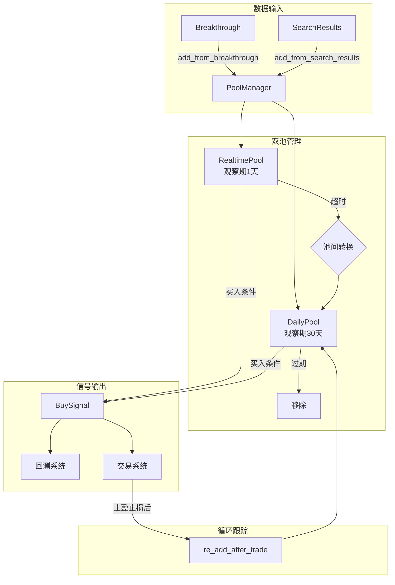

# 04 观察池系统 (Observation Pool)

> 状态：已实现 (Implemented) | 最后更新：2025-12-22

## 一、模块概述

观察池系统管理突破后的股票跟踪，采用**双池架构**（实时池 + 日K池），支持回测和实盘两种场景共用代码。

**核心职责**：
- 管理双观察池（实时池观察当日突破，日K池长期跟踪）
- 自动处理池间转换（实时池超时 → 日K池）
- 检测买入信号
- 支持循环跟踪（止盈止损后重新加入）

**模块路径**：`BreakthroughStrategy/observation/`

## 二、架构设计

### 2.1 目录结构

```
BreakthroughStrategy/observation/
├── __init__.py           # 模块导出 + 工厂函数
├── pool_entry.py         # PoolEntry 数据结构
├── signals.py            # BuySignal, PoolEvent, PoolEventType
├── interfaces.py         # 抽象接口 (ITimeProvider, IPoolStorage)
├── pool_base.py          # ObservationPoolBase 基类
├── pool_manager.py       # PoolManager 统一管理器
└── strategies/
    ├── __init__.py
    ├── time_providers.py # BacktestTimeProvider, LiveTimeProvider
    └── storages.py       # MemoryStorage, DatabaseStorage
```

### 2.2 核心数据流



## 三、关键设计决策

### 3.1 策略模式实现回测/实盘共用

**问题**：回测和实盘场景在时间管理、存储方式上有本质差异。

**解决方案**：使用策略模式抽象差异点

| 抽象接口 | 回测实现 | 实盘实现 |
|---------|---------|---------|
| `ITimeProvider` | `BacktestTimeProvider` - 虚拟时间可推进 | `LiveTimeProvider` - 系统真实时间 |
| `IPoolStorage` | `MemoryStorage` - 内存字典 | `DatabaseStorage` - 数据库持久化 |

**代码复用率**：核心池操作（add/get/remove/check_timeout）100% 共用

### 3.2 工厂函数简化使用

```python
# 回测场景
pool_mgr = create_backtest_pool_manager(start_date=date(2024, 1, 1))

# 实盘场景（预留）
pool_mgr = create_live_pool_manager(db_manager=my_db)
```

### 3.3 事件驱动解耦

通过 `PoolEvent` 实现模块间松耦合通信：

```python
pool_mgr.add_event_listener(lambda e: print(f"Event: {e.event_type}"))
```

事件类型：
- `ENTRY_ADDED` - 条目添加
- `POOL_TRANSFER` - 池间转移
- `ENTRY_EXPIRED` - 条目过期
- `BUY_SIGNAL` - 买入信号产生

### 3.4 双池超时机制

| 池类型 | 默认观察期 | 超时后行为 |
|--------|-----------|-----------|
| 实时池 | 1 天 | 状态变为 `timeout`，转入日K池 |
| 日K池 | 30 天 | 状态变为 `expired`，移除 |

### 3.5 与原设计的差异

| 原设计 | 实际实现 | 原因 |
|--------|---------|------|
| `RealtimePool` / `DailyPool` 独立类 | 统一 `ObservationPoolBase` + `pool_type` 参数 | 减少重复代码 |
| 强依赖数据库 | 策略模式注入存储 | 支持回测内存存储 |
| 使用 Logger 模块 | 使用 `print()` | 与 analysis 模块风格一致 |

## 四、核心组件

### 4.1 PoolEntry

观察池条目数据结构，支持：
- 从 `Breakthrough` 对象创建：`PoolEntry.from_breakthrough(bt)`
- 数据库序列化：`to_db_dict()` / `from_db_dict()`
- 状态追踪：`active` → `bought` / `timeout` / `expired`

### 4.2 PoolManager

统一入口，提供：
- **输入接口**：`add_from_breakthrough()`, `add_from_search_results()`
- **时间推进**：`advance_day()` - 处理超时转换（回测用）
- **信号检测**：`check_buy_signals(price_data)`
- **查询接口**：`get_all_active()`, `is_in_pool()`, `get_statistics()`

### 4.3 BuySignal

买入信号数据结构，包含：
- 信号基本信息（symbol, date, price）
- 信号强度（0-1，基于质量评分）
- 交易建议（入场价、止损价、仓位比例）

## 五、使用示例

### 5.1 回测场景

```python
from datetime import date
from BreakthroughStrategy.observation import create_backtest_pool_manager

# 创建观察池
pool_mgr = create_backtest_pool_manager(
    start_date=date(2024, 1, 1),
    config={'daily_observation_days': 30}
)

# 回测循环
for trading_day in trading_days:
    # 添加当日突破
    for bt in today_breakthroughs:
        pool_mgr.add_from_breakthrough(bt)

    # 检查买入信号
    signals = pool_mgr.check_buy_signals(price_data)
    for signal in signals:
        execute_buy(signal)

    # 推进一天（处理超时转换）
    pool_mgr.advance_day()
```

### 5.2 与回测系统集成

```python
class BacktestEngine:
    def __init__(self, config):
        self.pool = create_backtest_pool_manager(
            start_date=config['start_date']
        )
        # 注册事件监听
        self.pool.add_event_listener(self._on_pool_event)

    def _on_pool_event(self, event):
        if event.event_type == PoolEventType.BUY_SIGNAL:
            self._execute_buy(event.metadata['signal'])
```

## 六、配置参数

| 参数 | 默认值 | 说明 |
|------|--------|------|
| `realtime_observation_days` | 1 | 实时池观察天数 |
| `daily_observation_days` | 30 | 日K池观察天数 |
| `min_quality_score` | 0 | 最低质量评分阈值 |
| `buy_confirm_threshold` | 0.02 | 买入确认阈值（超过峰值的比例） |

## 七、已知局限

1. **买入条件简化**：当前仅实现"价格站稳峰值上方"的简单逻辑
2. **DatabaseStorage 预留**：数据库存储为框架预留，具体实现待数据库模块完成
3. **实盘行情接口预留**：`IQuoteSubscriber` 接口定义完成，实现待实时数据接入

## 八、扩展点

- **更复杂的买入条件**：可在 `_evaluate_buy_condition()` 中扩展
- **卖出信号检测**：`SellSignal` 数据结构已定义
- **多策略支持**：通过策略模式可灵活添加新的存储/时间策略
