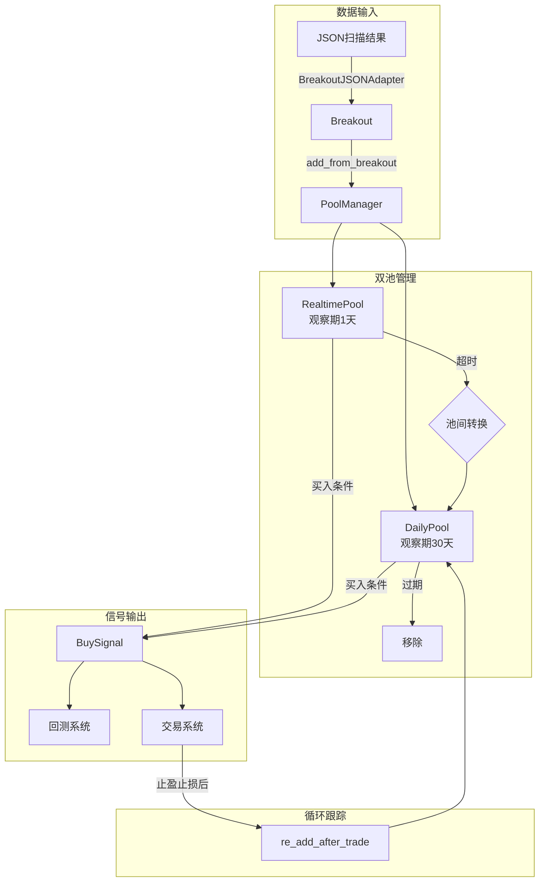
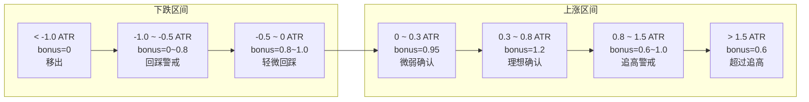

# 04 观察池系统 (Observation Pool)

> 状态：已实现 (Implemented) | 最后更新：2026-01-01

## 一、模块概述

观察池系统管理突破后的股票跟踪，采用**双池架构**（实时池 + 日K池），支持回测和实盘两种场景共用代码。

**核心职责**：
- 管理双观察池（实时池观察当日突破，日K池长期跟踪）
- 自动处理池间转换（实时池超时 → 日K池）
- 检测买入信号
- 支持循环跟踪（止盈止损后重新加入）

**模块路径**：`BreakoutStrategy/observation/`

## 二、架构设计

### 2.1 目录结构

```
BreakoutStrategy/observation/
├── __init__.py           # 模块导出 + 工厂函数
├── pool_entry.py         # PoolEntry 数据结构
├── signals.py            # BuySignal, PoolEvent, PoolEventType
├── interfaces.py         # 抽象接口 (ITimeProvider, IPoolStorage)
├── pool_base.py          # ObservationPoolBase 基类
├── pool_manager.py       # PoolManager 统一管理器
└── strategies/
    ├── __init__.py
    ├── time_providers.py # BacktestTimeProvider, LiveTimeProvider
    └── storages.py       # MemoryStorage, DatabaseStorage
```

### 2.2 核心数据流


```mermaid
flowchart TD
    subgraph 数据输入
        BO[Breakout] -->|add_from_breakout| PM[PoolManager]
        JSON[JSON扫描结果] -->|BreakoutJSONAdapter| BO
    end

    subgraph 双池管理
        PM --> RP[RealtimePool<br/>观察期1天]
        PM --> DP[DailyPool<br/>观察期30天]
        RP -->|超时| Transfer{池间转换}
        Transfer --> DP
        DP -->|过期| Remove[移除]
    end

    subgraph 信号输出
        RP -->|买入条件| BS[BuySignal]
        DP -->|买入条件| BS
        BS --> Backtest[回测系统]
        BS --> Trading[交易系统]
    end

    subgraph 循环跟踪
        Trading -->|止盈止损后| ReAdd[re_add_after_trade]
        ReAdd --> DP
    end
```

## 三、关键设计决策

### 3.1 策略模式实现回测/实盘共用

**问题**：回测和实盘场景在时间管理、存储方式上有本质差异。

**解决方案**：使用策略模式抽象差异点

| 抽象接口 | 回测实现 | 实盘实现 |
|---------|---------|---------|
| `ITimeProvider` | `BacktestTimeProvider` - 虚拟时间可推进 | `LiveTimeProvider` - 系统真实时间 |
| `IPoolStorage` | `MemoryStorage` - 内存字典 | `DatabaseStorage` - 数据库持久化 |

**代码复用率**：核心池操作（add/get/remove/check_timeout）100% 共用

### 3.2 工厂函数简化使用

```python
# 回测场景
pool_mgr = create_backtest_pool_manager(start_date=date(2024, 1, 1))

# 实盘场景（预留）
pool_mgr = create_live_pool_manager(db_manager=my_db)
```

### 3.3 事件驱动解耦

通过 `PoolEvent` 实现模块间松耦合通信：

```python
pool_mgr.add_event_listener(lambda e: print(f"Event: {e.event_type}"))
```

事件类型：
- `ENTRY_ADDED` - 条目添加
- `POOL_TRANSFER` - 池间转移
- `ENTRY_EXPIRED` - 条目过期
- `BUY_SIGNAL` - 买入信号产生

### 3.4 双池超时机制

| 池类型 | 默认观察期 | 超时后行为 |
|--------|-----------|-----------|
| 实时池 | 1 天 | 状态变为 `timeout`，转入日K池 |
| 日K池 | 30 天 | 状态变为 `expired`，移除 |

### 3.5 与原设计的差异

| 原设计 | 实际实现 | 原因 |
|--------|---------|------|
| `RealtimePool` / `DailyPool` 独立类 | 统一 `ObservationPoolBase` + `pool_type` 参数 | 减少重复代码 |
| 强依赖数据库 | 策略模式注入存储 | 支持回测内存存储 |
| 使用 Logger 模块 | 使用 `print()` | 与 analysis 模块风格一致 |

## 四、核心组件

### 4.1 PoolEntry

观察池条目数据结构，支持：
- 从 `Breakout` 对象创建：`PoolEntry.from_breakout(bo)`
- 数据库序列化：`to_db_dict()` / `from_db_dict()`
- 状态追踪：`active` → `bought` / `timeout` / `expired`

### 4.2 PoolManager

统一入口，提供：
- **输入接口**：`add_from_breakout()`, `add_batch_by_date()`
- **时间推进**：`advance_day()` - 处理超时转换（回测用）
- **信号检测**：`check_buy_signals(price_data)`
- **查询接口**：`get_all_active()`, `is_in_pool()`, `get_statistics()`

### 4.3 BuySignal

买入信号数据结构，包含：
- 信号基本信息（symbol, date, price）
- 信号强度（0-1，基于质量评分）
- 交易建议（入场价、止损价、仓位比例）

## 五、使用示例

### 5.1 回测场景

```python
from datetime import date
from BreakoutStrategy.observation import create_backtest_pool_manager

# 创建观察池
pool_mgr = create_backtest_pool_manager(
    start_date=date(2024, 1, 1),
    config={'daily_observation_days': 30}
)

# 回测循环
for trading_day in trading_days:
    # 添加当日突破
    for bo in today_breakouts:
        pool_mgr.add_from_breakout(bo)

    # 检查买入信号
    signals = pool_mgr.check_buy_signals(price_data)
    for signal in signals:
        execute_buy(signal)

    # 推进一天（处理超时转换）
    pool_mgr.advance_day()
```

### 5.2 与回测系统集成

```python
class BacktestEngine:
    def __init__(self, config):
        self.pool = create_backtest_pool_manager(
            start_date=config['start_date']
        )
        # 注册事件监听
        self.pool.add_event_listener(self._on_pool_event)

    def _on_pool_event(self, event):
        if event.event_type == PoolEventType.BUY_SIGNAL:
            self._execute_buy(event.metadata['signal'])
```

## 六、配置参数

| 参数 | 默认值 | 说明 |
|------|--------|------|
| `realtime_observation_days` | 1 | 实时池观察天数 |
| `daily_observation_days` | 30 | 日K池观察天数 |
| `min_quality_score` | 0 | 最低质量评分阈值 |
| `buy_confirm_threshold` | 0.02 | 买入确认阈值（超过峰值的比例） |

## 七、买入条件评估系统

### 7.1 评估器架构

```
BreakoutStrategy/observation/evaluators/
├── __init__.py           # 导出接口
├── base.py               # IBuyConditionEvaluator 抽象接口
├── config.py             # BuyConditionConfig 配置类
├── result.py             # EvaluationResult, DimensionScore
├── composite.py          # CompositeBuyEvaluator 组合评估器
└── components/
    ├── time_window.py    # 时间窗口评估
    ├── price_confirm.py  # 价格确认评估 (支持 ATR 标准化)
    ├── volume_verify.py  # 成交量验证评估
    └── risk_filter.py    # 风险过滤评估
```

### 7.2 四维度评估模型

| 维度 | 职责 | 权重 |
|------|------|------|
| TimeWindow | 判断是否处于最佳买入窗口 | 20% |
| PriceConfirm | 价格是否在确认区间 | 40% |
| VolumeVerify | 成交量是否支持突破有效性 | 25% |
| RiskFilter | 检查风险条件（不参与加权） | 0% |

### 7.3 评分公式

```
final = BASE(50) × bonus
```

所有维度评估器均使用 Bonus 乘数模型，不再使用直接赋分。

### 7.4 价格确认评估器 (PriceConfirmEvaluator)

**文件**：`BreakoutStrategy/observation/evaluators/components/price_confirm.py`

支持两种模式：

| 模式 | 配置项 | 阈值类型 |
|------|--------|----------|
| 传统百分比 | `use_atr_normalization: false` | 固定百分比 (1%, 2%, 3%) |
| ATR 标准化 | `use_atr_normalization: true` | ATR 倍数 (0.3, 0.5, 1.0 ATR) |

**ATR 标准化的优势**：
- $5 股票 ATR=$0.50，涨 $0.25 = 0.5 ATR
- $500 股票 ATR=$10，涨 $5 = 0.5 ATR
- 两者评分相同，自动适应不同价位和波动率

**Bonus 区间划分（ATR 模式）**：


```mermaid
graph LR
    subgraph 下跌区间
        A["< -1.0 ATR<br/>bonus=0<br/>移出"] --> B["-1.0 ~ -0.5 ATR<br/>bonus=0~0.8<br/>回踩警戒"]
        B --> C["-0.5 ~ 0 ATR<br/>bonus=0.8~1.0<br/>轻微回踩"]
    end
    subgraph 上涨区间
        C --> D["0 ~ 0.3 ATR<br/>bonus=0.95<br/>微弱确认"]
        D --> E["0.3 ~ 0.8 ATR<br/>bonus=1.2<br/>理想确认"]
        E --> F["0.8 ~ 1.5 ATR<br/>bonus=0.6~1.0<br/>追高警戒"]
        F --> G["> 1.5 ATR<br/>bonus=0.6<br/>超过追高"]
    end
```

### 7.5 配置示例

```yaml
# configs/buy_condition_config.yaml
price_confirm:
  use_atr_normalization: true

  # 理想确认区间（ATR 倍数）
  confirm_zone_min_atr: 0.3
  confirm_zone_max_atr: 0.8

  # 下跌阈值（直接使用负数）
  pullback_threshold_atr: -0.5
  remove_threshold_atr: -1.0

  # Bonus 配置
  ideal_zone_bonus: 1.2
  marginal_zone_penalty: 0.8
```

### 7.6 关键设计决策

| 决策 | 原因 |
|------|------|
| 统一 Bonus 模型 | 避免硬编码分值（如 score=30），便于参数化调优 |
| ATR 标准化 | 解决固定百分比对不同价位股票不公平的问题 |
| 负数阈值直接使用 | 配置直观，避免代码中 `-threshold` 的混乱 |
| 向后兼容 | `use_atr_normalization=false` 时保持原有百分比模式 |

## 八、适配器模块

### 8.1 模块结构

```
BreakoutStrategy/observation/adapters/
├── __init__.py           # 导出接口
├── json_adapter.py       # JSON ↔ Breakout 转换
└── context_builder.py    # 评估上下文构建器
```

### 8.2 BreakoutJSONAdapter

将 JSON 扫描结果转换为 Breakout 对象：

```python
from BreakoutStrategy.observation.adapters import BreakoutJSONAdapter

adapter = BreakoutJSONAdapter()

# 单股票加载
result = adapter.load_single(symbol, stock_data, df)
breakouts = result.breakouts
detector = result.detector

# 批量加载（按日期分组）
breakouts_by_date = adapter.load_from_file('outputs/scan.json', 'datasets/pkls')
# 返回 {date: [Breakout, ...]}
```

**核心逻辑**：从 `UI/main.py:_load_from_json_cache()` 提取，处理时间范围过滤和索引重映射。

### 8.3 EvaluationContextBuilder

构建买入评估所需的上下文数据：

```python
from BreakoutStrategy.observation.adapters import EvaluationContextBuilder

builder = EvaluationContextBuilder()

# 构建单个条目的上下文
context = builder.build_context_for_entry(symbol, df, breakout, as_of_date)
# 返回 {'atr_value': float, 'volume_ma20': float, 'prev_close': float, ...}

# 批量构建
price_data, contexts = builder.build_full_evaluation_data(
    entries_with_breakouts, df_cache, as_of_date
)
```

**上下文字段来源**：

| 字段 | 来源 |
|------|------|
| `atr_value` | Breakout.atr_value（已在 JSON 中） |
| `volume_ma20` | DataFrame 计算 |
| `prev_close` | DataFrame |
| `baseline_volume` | 同 volume_ma20 |

## 九、回测引擎

### 9.1 模块结构

```
BreakoutStrategy/backtest/
├── __init__.py
└── engine.py      # BacktestEngine, BacktestConfig, BacktestResult
```

### 9.2 使用示例

```python
from BreakoutStrategy.backtest import BacktestEngine, BacktestConfig

config = BacktestConfig(
    initial_capital=100000,
    stop_loss_pct=0.05,
    take_profit_pct=0.15,
    max_holdings=10,
)

engine = BacktestEngine(
    config=config,
    scan_result_path='outputs/scan_results.json',
    data_dir='datasets/pkls'
)

result = engine.run(start_date='2024-01-01', end_date='2024-06-30')

print(result.summary())
# ===== Backtest Results =====
# Total Trades: 45
# Win Rate: 62.22%
# Total Return: 15.34%
# Max Drawdown: 8.21%
```

### 9.3 回测流程

```
for trading_day in trading_days:
    1. 获取当日突破 → add_from_breakout()
    2. 构建 price_data 和 context
    3. 评估买入信号 → check_buy_signals()
    4. 执行买入
    5. 更新持仓（止盈止损）
    6. 推进观察池 → advance_day()
```

### 9.4 入口脚本

```bash
python scripts/backtest/realtime_pool_backtest.py
```

配置参数在 `main()` 函数中设置（无需命令行参数）。

## 十、UI 集成

### 10.1 "Add to Pool" 按钮

在 UI 顶部参数面板添加了 "Add to Pool" 按钮，点击后将当前显示的突破添加到观察池。

### 10.2 观察池方法

`InteractiveUI` 类新增以下方法：

| 方法 | 功能 |
|------|------|
| `add_to_observation_pool()` | 将当前突破添加到观察池 |
| `show_pool_status()` | 显示观察池统计信息 |
| `clear_observation_pool()` | 清空观察池 |

### 10.3 懒加载设计

观察池管理器使用懒加载模式，仅在首次使用时初始化：

```python
def _get_or_create_pool_manager(self):
    if self._pool_mgr is None:
        self._pool_mgr = create_backtest_pool_manager(date.today())
    return self._pool_mgr
```

## 十一、已知局限

1. **买入条件简化**：当前仅实现"价格站稳峰值上方"的简单逻辑
2. **DatabaseStorage 预留**：数据库存储为框架预留，具体实现待数据库模块完成
3. **实盘行情接口预留**：`IQuoteSubscriber` 接口定义完成，实现待实时数据接入
4. **Bonus 参数待优化**：当前阈值为经验值，后续需通过数据挖掘优化

## 十二、扩展点

- **更复杂的买入条件**：可在 `_evaluate_buy_condition()` 中扩展
- **卖出信号检测**：`SellSignal` 数据结构已定义
- **多策略支持**：通过策略模式可灵活添加新的存储/时间策略
- **数据驱动参数优化**：Bonus 阈值可通过贝叶斯优化进行调参
