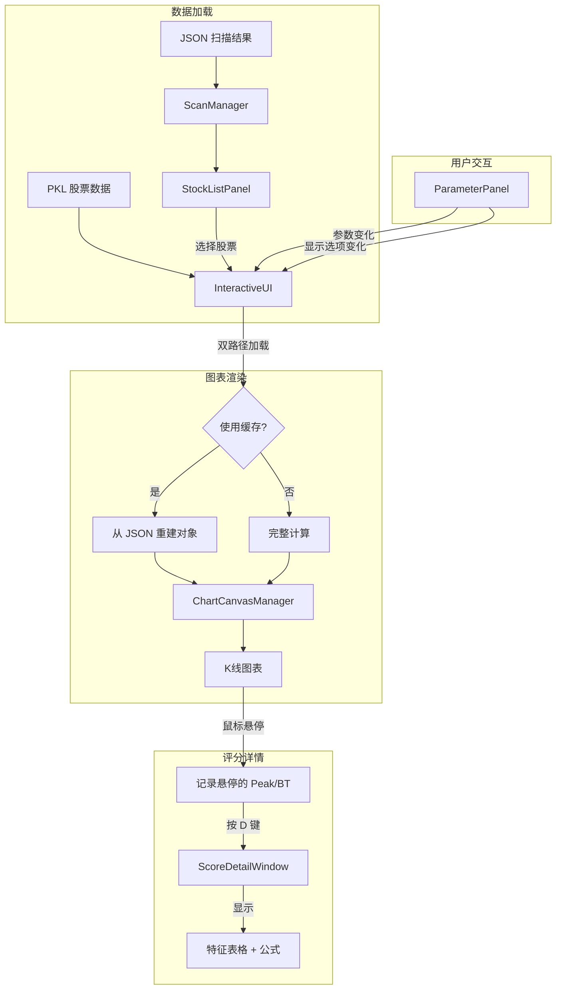

# 12 交互式UI模块 (UI)

> 状态：已实现 (Implemented) | 最后更新：2025-12-11

## 一、模块概述

UI 模块是一个基于 Tkinter 的桌面交互式应用，用于浏览和分析突破检测结果。它提供了批量扫描管理、股票列表浏览、K线图表可视化、参数实时调整等功能。

**核心职责**：
- 加载并展示批量扫描生成的 JSON 结果
- 提供交互式 K线图表，标注突破点和峰值
- 支持参数编辑和实时图表刷新
- 提供键盘导航和列配置等便捷交互
- **评分详情浮动窗口**：通过快捷键查看峰值/突破的评分明细

## 二、架构设计

### 2.1 分层结构

```
BreakthroughStrategy/UI/
├── main.py              # 主窗口 (InteractiveUI)
├── styles.py            # 全局样式配置
├── utils.py             # 工具函数
├── panels/              # UI 面板组件
│   ├── parameter_panel.py   # 参数面板
│   └── stock_list_panel.py  # 股票列表面板
├── charts/              # 图表渲染
│   ├── canvas_manager.py    # 图表管理器
│   └── components/          # 绘图组件
│       ├── candlestick.py   # K线组件
│       ├── markers.py       # 标记组件
│       ├── panels.py        # 统计面板
│       └── score_tooltip.py # 评分详情浮动窗口
├── editors/             # 参数编辑器
│   ├── parameter_editor.py  # 编辑器窗口
│   └── input_factory.py     # 输入控件工厂
├── dialogs/             # 对话框
│   ├── file_dialog.py       # 文件对话框
│   └── column_config_dialog.py  # 列配置对话框
├── managers/            # 业务逻辑管理器
│   ├── scan_manager.py      # 扫描管理器
│   └── navigation_manager.py # 键盘导航管理器
└── config/              # 配置管理
    ├── ui_loader.py         # UI 配置加载器
    ├── param_loader.py      # 参数加载器
    ├── param_state_manager.py # 参数状态管理（三层状态）
    ├── param_editor_schema.py # 编辑器 Schema
    ├── validator.py         # 输入验证器
    └── yaml_parser.py       # YAML 解析器
```

### 2.2 核心数据流



## 三、关键设计决策

### 3.1 双路径加载策略 (JSON Cache vs Full Computation)

**问题**：每次切换股票都重新计算突破检测，延迟明显。

**解决方案**：
- **JSON 缓存路径**（快速）：如果参数未变且 JSON 时间范围覆盖，直接从 JSON 重建 `Breakthrough` 和 `Peak` 对象
- **完整计算路径**（慢速）：参数变化或缓存失效时，调用 `BreakthroughDetector` 重新计算

**切换逻辑** (`_can_use_json_cache`):
1. 如果勾选 "Use UI Params" → 强制重新计算
2. 否则检查 JSON 时间范围是否覆盖 UI 请求范围

### 3.2 索引重映射机制

**问题**：JSON 中的 `peak.index` 和 `bt.index` 是基于扫描时的 DataFrame 索引，但 UI 可能加载不同时间范围的数据。

**解决方案**：在 `_load_from_json_cache` 中：
1. 根据日期在新 DataFrame 中查找位置 (`df.index.get_loc`)
2. 重新映射索引到当前 DataFrame 的位置
3. 过滤掉超出 UI 时间范围的峰值和突破点

### 3.3 参数编辑器三层状态管理

**问题**：参数编辑器、下拉菜单、UIParamLoader 三方状态需要同步，且需要区分"已保存"与"已应用但未保存"。

**解决方案**：`ParameterStateManager` 管理三层状态
- **File State**: 磁盘上的 YAML 文件（持久化）
- **Editor State**: 编辑器临时参数（用户正在调整）
- **Memory State**: `UIParamLoader._params`（运行时）

状态流转：
```
File → load_file() → Editor (snapshot) → mark_dirty() → Apply → Memory
                                                      ↓
                                              save_file() → File
```

### 3.4 双 Treeview 选择同步

**问题**：股票列表使用左右两个 Treeview（固定列 + 可滚动列），需要保持选择状态同步。

**解决方案**：
- 使用 `_selection_in_progress` 标志防止递归触发
- 左右 Treeview 使用相同的 `iid`（股票代码）
- 选择事件中互相同步：`fixed_tree.selection_set(selection)`

### 3.5 评分详情浮动窗口

**问题**：用户需要在图表上快速查看峰值/突破的评分明细，了解各特征的贡献。

**解决方案**：
- `ChartCanvasManager` 追踪鼠标悬停状态（`_hovered_peak`, `_hovered_bt`）
- 按 `D` 键触发 `ScoreDetailWindow`，显示评分表格
- 窗口支持多个同时打开，方便对比
- `Escape` 关闭最近窗口，`Shift+Escape` 关闭全部

## 四、组件职责

### 4.1 InteractiveUI (main.py)

主窗口协调器，负责：
- 创建和布局所有子面板
- 管理 DataFrame 缓存 (`_data_cache`)
- 协调股票选择 → 数据加载 → 图表渲染的完整流程
- 处理参数变化和显示选项变化回调

### 4.2 ScanManager (managers/scan_manager.py)

批量扫描管理器，同时服务于：
- **批量扫描脚本**：`parallel_scan()` 多进程扫描，生成 JSON
- **UI 加载**：`load_results()` 加载 JSON，版本迁移

### 4.3 ChartCanvasManager (charts/canvas_manager.py)

图表渲染管理器，负责：
- 创建 Matplotlib Figure 并嵌入 Tkinter
- 协调 K线、成交量、标记、统计面板的绘制
- 实现鼠标悬停 Tooltip 和十字线
- 管理评分详情窗口的生命周期

### 4.4 ScoreDetailWindow (charts/components/score_tooltip.py)

评分详情浮动窗口，提供：
- 峰值/突破的评分表格（特征名、原始值、分数、权重）
- 阻力强度子因素展开（突破评分）
- 计算公式显示
- 复合模式（同一 K 线的峰值+突破）

### 4.5 ParameterPanel (panels/parameter_panel.py)

参数面板，提供：
- 加载扫描结果按钮
- 参数文件下拉菜单和 Edit 按钮
- 显示选项复选框（Peak Score, BT Score）
- 状态栏显示

### 4.6 StockListPanel (panels/stock_list_panel.py)

股票列表面板，提供：
- 左右分离的双 Treeview（固定 Symbol 列 + 可滚动属性列）
- 列排序、列拖拽重排、列显示开关
- 右键菜单快速切换列可见性
- 列标题 Tooltip

## 五、配置系统

### 5.1 配置文件

| 文件 | 用途 |
|------|------|
| `configs/UI/ui_config.yaml` | UI 布局配置（窗口大小、数据路径、列配置） |
| `configs/analysis/params/*.yaml` | 分析参数文件（检测器、评分器参数） |

### 5.2 配置加载器

- **UIConfigLoader**：加载 UI 布局配置
- **UIParamLoader**：加载分析参数，维护内存状态

## 六、快捷键

| 快捷键 | 功能 |
|--------|------|
| `↑/↓` | 上下导航股票列表 |
| `D` | 显示当前悬停峰值/突破的评分详情 |
| `Escape` | 关闭最近打开的评分详情窗口 |
| `Shift+Escape` | 关闭所有评分详情窗口 |

## 七、已知局限

1. **单线程 UI**：数据加载在主线程，大文件可能卡顿
2. **内存缓存**：DataFrame 缓存无大小限制，长时间运行可能占用较多内存
3. **Matplotlib 渲染**：大数据量时渲染较慢，未做数据抽样
4. **跨平台兼容**：窗口最大化逻辑在不同系统表现可能不同

## 八、扩展点

- **导出功能**：图表导出为图片、数据导出为 CSV
- **多窗口对比**：同时打开多个股票对比分析
- **自定义指标**：在图表上叠加自定义技术指标
- **实时数据**：集成实时行情，动态更新图表
