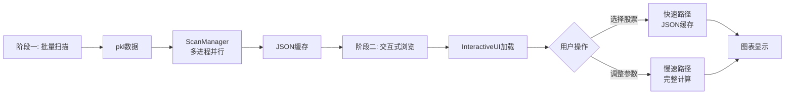

# UI模块实现文档 (Interactive UI)

> **状态**: 已实现 (Implemented) | **最后更新**: 2025-12-05

---

## 一、架构概览

### 核心设计理念

UI模块采用**双阶段工作流 + 组件化架构**,实现突破检测结果的高效可视化与交互式分析:

1. **离线扫描阶段**: 批量并行处理股票数据,生成JSON缓存
2. **交互式浏览阶段**: 基于JSON快速加载,支持实时参数调整与动态重绘

**关键架构决策**:
- ✅ **完全复用可视化组件**: 图表渲染依赖现有的`CandlestickComponent`, `MarkerComponent`, `PanelComponent`,避免代码重复
- ✅ **双路径加载策略**: JSON缓存优先(快速路径),参数变更时降级到完整计算(慢速路径)
- ✅ **配置驱动UI**: 所有UI参数、样式、路径通过YAML配置文件管理,实现代码与配置分离
- ✅ **内存安全管理**: 图表更新时严格执行cleanup流程,防止matplotlib内存泄漏

---

## 二、模块架构

### 目录结构

```
BreakthroughStrategy/UI/
├── __init__.py                   # 模块导出接口
├── main.py                       # 主窗口 (InteractiveUI)
├── styles.py                     # 全局样式配置
├── utils.py                      # 工具函数
│
├── panels/                       # UI面板组件
│   ├── stock_list_panel.py       # 股票列表 (双Treeview分栏设计)
│   └── parameter_panel.py        # 参数控制面板
│
├── charts/                       # 图表系统
│   ├── canvas_manager.py         # 图表Canvas管理 (Matplotlib → Tkinter)
│   └── components/               # 绘图组件 (复用自可视化模块)
│       ├── candlestick.py        # K线与成交量绘制
│       ├── markers.py            # 峰值与突破点标注
│       └── panels.py             # 统计信息面板
│
├── managers/                     # 业务逻辑管理器
│   ├── scan_manager.py           # 批量扫描管理 (多进程 + JSON序列化)
│   └── navigation_manager.py     # 键盘导航管理
│
├── config/                       # 配置管理系统
│   ├── ui_loader.py              # UI配置加载器 (窗口/路径/颜色)
│   ├── param_loader.py           # 参数配置加载器 (检测/特征/评分参数)
│   ├── definitions.py            # 参数定义与元数据
│   ├── validator.py              # 输入验证器
│   └── yaml_parser.py            # YAML注释解析器
│
├── editors/                      # 参数编辑器
│   ├── parameter_editor.py       # 参数编辑对话框 (7个tab页)
│   └── input_factory.py          # 输入控件工厂 (Spinbox/Entry生成)
│
└── dialogs/                      # 对话框组件
    ├── file_dialog.py            # 大字体文件选择对话框
    └── column_config_dialog.py   # 列配置对话框
```

---

## 三、核心流程设计

### 1. 双阶段工作流



**设计意图**:
- **离线扫描**: 一次性完成全市场扫描,避免重复计算开销
- **缓存优先**: 默认使用JSON缓存,响应时间 < 100ms
- **按需计算**: 仅在参数变更时触发重新检测,保持灵活性

---

### 2. 双路径加载策略 (v3.0优化版)

**核心逻辑** (`main.py:_on_stock_selected`):

```python
if self._can_use_json_cache(symbol, params, df):
    # 快速路径: 从JSON重建对象
    breakthroughs, detector = self._load_from_json_cache(symbol, params, df)
else:
    # 慢速路径: 完整计算
    breakthroughs, detector = self._full_computation(symbol, params, df)
```

**缓存可用性判断** (v3.0简化逻辑):
1. 如果勾选 `Use UI Params` → **强制慢速路径** (用户明确要求重新计算)
2. 否则,只要JSON存在且时间范围匹配 → **使用快速路径**
3. 不再检查参数匹配 (用户负责确保JSON参数与预期一致)

**时间范围过滤与索引重映射**:
- JSON保存全时间范围数据,UI可能仅显示部分时间段
- `_load_from_json_cache` 在重建对象时:
  1. 过滤时间范围外的峰值/突破点
  2. 根据日期在新DataFrame中重新映射索引 (`df.index.get_loc()`)
  3. 确保绘图时索引与DataFrame对齐

---

### 3. 内存管理流程

**关键措施** (`canvas_manager.py:_cleanup`):
```python
def _cleanup(self):
    """清理旧图表,防止内存泄漏"""
    if self.canvas:
        self.canvas.get_tk_widget().destroy()  # 1. 销毁Tkinter widget
        self.canvas = None

    if self.fig:
        plt.close(self.fig)  # 2. 关闭matplotlib Figure
        self.fig = None
```

**执行时机**: 每次 `update_chart()` 开始时先执行 `_cleanup()`

**验证标准**: 连续切换100只股票,内存增长 < 50MB

---

## 四、关键架构决策

### 决策1: 配置驱动UI (Why YAML?)

**问题**: 硬编码参数导致修改困难,需要修改源码并重新部署

**解决方案**: 双配置文件架构
- `configs/visualization/ui_config.yaml`: UI配置 (窗口大小/颜色/路径)
- `configs/analysis/params/*.yaml`: 算法参数 (检测/特征/评分参数)

**优势**:
1. **分层配置**: UI与算法参数解耦,职责清晰
2. **热重载**: 修改配置后点击 "Reload Parameters" 即生效,无需重启
3. **易于调试**: 配置文件可版本控制,便于回溯参数变更历史

**实现**:
- `UIConfigLoader`: 单例模式,启动时加载UI配置
- `UIParamLoader`: 单例模式,支持运行时重载算法参数

---

### 决策2: 双Treeview分栏设计 (Why?)

**问题**: 股票列表需要显示多列数据,但Symbol列必须始终可见

**初版方案**: 单个Treeview + 水平滚动条
- ❌ **缺陷**: 滚动后Symbol列不可见,导致无法定位当前股票

**最终方案**: 左右分栏设计
- 左侧固定Treeview: 仅显示Symbol列 (宽度固定160px)
- 右侧主Treeview: 显示其余列 (支持水平滚动)

**技术实现** (`stock_list_panel.py`):
1. 双Treeview共享垂直滚动条 (`_on_vsb_scroll`)
2. 鼠标滚轮事件同步 (`_on_mouse_wheel`)
3. 选择状态双向同步 (`_on_fixed_select` / `_on_main_select`)
4. 防递归触发保护 (`_selection_in_progress` 标志位)

---

### 决策3: 统一计算函数 (`compute_breakthroughs_from_dataframe`)

**问题**: `batch_scan.py` 与 `InteractiveUI` 的突破检测逻辑重复

**解决方案**: 提取为公共函数 (`managers/scan_manager.py`)

```python
def compute_breakthroughs_from_dataframe(
    symbol, df, window, exceed_threshold, peak_supersede_threshold,
    feature_calc_config, quality_scorer_config
) -> Tuple[List[Breakthrough], BreakthroughDetector]:
    """统一的突破检测流程"""
    # 1. 运行突破检测
    detector = BreakthroughDetector(...)
    breakout_infos = detector.batch_add_bars(df, return_breakouts=True)

    # 2. 特征计算
    feature_calc = FeatureCalculator(config=feature_calc_config)
    breakthroughs = [feature_calc.enrich_breakthrough(df, info, symbol)
                     for info in breakout_infos]

    # 3. 质量评分
    quality_scorer = QualityScorer(config=quality_scorer_config)
    quality_scorer.score_breakthroughs_batch(breakthroughs)

    return breakthroughs, detector
```

**优势**:
- ✅ 避免算法逻辑分叉
- ✅ 确保批量扫描与UI计算结果一致
- ✅ 便于后续维护与测试

---

### 决策4: JSON Schema v3.0 (参数分组保存)

**演进历史**:
- v1.0: 仅保存检测参数 (`window`, `exceed_threshold`)
- v2.0: 新增 `peak_supersede_threshold`
- **v3.0**: 分组保存所有参数 (检测器 + 特征计算 + 质量评分)

**v3.0 格式**:
```json
{
  "scan_metadata": {
    "schema_version": "3.0",
    "detector_params": {
      "window": 5,
      "exceed_threshold": 0.005,
      "peak_supersede_threshold": 0.03
    },
    "feature_calculator_params": {
      "stability_lookforward": 10,
      "continuity_lookback": 5
    },
    "quality_scorer_params": {
      "peak_weight_volume": 0.25,
      "bt_weight_change": 0.20,
      ...
    }
  }
}
```

**优势**:
1. **完整性**: 保存完整的参数上下文,便于复现
2. **可扩展**: 新增参数类别不影响现有结构
3. **向后兼容**: 自动迁移v2.0格式 (`load_results` 中检测并转换)

---

## 五、已知局限与权衡

### 局限1: JSON缓存参数不可见

**现状**: JSON文件保存了扫描参数,但UI未显示

**影响**: 用户可能误用与当前UI参数不匹配的JSON

**缓解措施** (v3.0):
- 提供 `Use UI Params` 复选框,用户可强制使用当前参数重新计算
- 状态栏显示加载模式 ("Loaded from cache ⚡" vs "Computed with UI params 🔧")

**未来改进**: 在加载JSON后,在UI中显示扫描参数 (弹窗或状态栏)

---

### 局限2: 大数据量时的性能瓶颈

**瓶颈点**: `batch_scan` 扫描10855只股票需约10分钟 (8进程)

**原因**:
1. 峰值检测算法复杂度为 O(n·window²)
2. 质量评分需计算多个特征 (成交量/压制天数/相对高度)
3. Python GIL限制多线程性能 (使用multiprocessing缓解)

**权衡**:
- ✅ 接受离线扫描较慢 (一次性任务)
- ✅ 优先优化UI响应速度 (JSON缓存优先策略)

---

### 局限3: Matplotlib后端切换限制

**问题**: `visual_demo.py` 使用Agg后端 (静态图片),UI需要TkAgg后端 (交互式)

**约束**: 后端设置必须在 `import matplotlib.pyplot` **之前** 完成

**解决方案**: 在程序入口切换后端
```python
# scripts/interactive_viewer.py
import matplotlib
matplotlib.use('TkAgg')  # 必须在import pyplot之前
import matplotlib.pyplot as plt
```

**注意**: `visual_demo.py` 保持默认Agg后端,两个脚本不共享后端

---

## 六、与原计划的主要偏差

### 偏差1: 目录重命名 (`visualization/interactive` → `UI`)

**原计划**: `BreakthroughStrategy/visualization/interactive/`

**实际实现**: `BreakthroughStrategy/UI/`

**原因**:
1. 模块名更简洁 (`from BreakthroughStrategy.UI import InteractiveUI`)
2. 避免与 `visualization` 子模块混淆 (后者仅提供静态绘图)
3. 符合"UI是独立模块"的定位

---

### 偏差2: 成交量背景绘制 (新增功能)

**原计划**: 成交量作为独立子图显示

**实际实现**: 成交量作为主图背景半透明柱状图 + 突破日高亮

**优势**:
- ✅ 节省垂直空间 (减少子图数量 3→2)
- ✅ 直观关联K线与成交量 (同一坐标系)
- ✅ 突破日成交量高亮 (橙色柱状图)

**实现**: `candlestick.py:draw_volume_background`

---

### 偏差3: 配置管理系统 (大幅扩展)

**原计划**: 简单的YAML加载 (`utils.py:load_config`)

**实际实现**: 完整的配置管理子系统 (`config/`)
- `ui_loader.py`: UI配置加载器 (窗口/路径/颜色)
- `param_loader.py`: 参数配置加载器 (支持热重载)
- `definitions.py`: 参数元数据 (范围/步长/分组)
- `validator.py`: 输入验证器 (范围检查/权重归一化)
- `yaml_parser.py`: 注释解析器 (提取YAML注释作为帮助文本)

**原因**:
1. 随着参数数量增加 (50+参数),需要规范化管理
2. 参数编辑器需要元数据驱动UI (动态生成Spinbox)
3. 支持热重载需要独立的加载器类

---

### 偏差4: 参数编辑器 (超出原计划)

**原计划**: 简单的Spinbox面板

**实际实现**: 完整的多Tab编辑器 (`editors/parameter_editor.py`)
- 7个Tab页: Detector / Feature Calc / Peak Scorer / BT Scorer / Display / Advanced / Help
- 权重参数自动归一化 (修改任一权重,其余按比例调整)
- 实时验证 (范围检查 + 错误提示)
- 保存/加载参数文件 (YAML格式)

**原因**: 参数数量超出预期 (50+),需要更好的组织与交互方式

---

## 七、技术亮点

### 亮点1: 索引重映射 (时间范围切换)

**挑战**: JSON保存的索引基于全时间范围DataFrame,UI可能显示部分时间段

**解决方案** (`main.py:_load_from_json_cache`):
```python
# 重新映射索引: 根据日期在新DataFrame中查找位置
new_index = df.index.get_loc(pd.Timestamp(peak_date))
# 处理 get_loc() 可能返回的三种类型
if isinstance(new_index, slice):
    new_index = new_index.start  # 切片 → 第一个索引
elif hasattr(new_index, "__iter__"):
    new_index = np.where(new_index)[0][0]  # 布尔数组 → 第一个True位置
new_index = int(new_index)  # 确保整数类型
```

**验证**: 时间范围切换后绘图正确,无索引越界

---

### 亮点2: 十字线 + Annotation悬停 (用户体验优化)

**实现** (`canvas_manager.py:_attach_hover`):
- 十字线指示实际K线数据点 (`crosshair_v.set_xdata(x)`)
- Annotation锚点在鼠标位置 (`annotation.xy = (event.xdata, event.ydata)`)
- 固定右上角偏移 (`offset_x=40, offset_y=40`),避免遮挡鼠标

**显示内容**:
- 基础OHLCV数据
- 突破点标注 (Peaks Broken / Quality Score)
- 峰值标注 (Peak ID / Score)

---

### 亮点3: 防递归触发保护 (双Treeview同步)

**问题**: 左右Treeview选择同步时,可能触发递归事件

**解决方案** (`stock_list_panel.py`):
```python
def _on_fixed_select(self, event):
    if self._selection_in_progress:
        return  # 防止递归

    self._selection_in_progress = True
    try:
        # 同步选择到右侧Treeview
        self.main_tree.selection_set(selection)
        self._handle_selection(selection[0])
    finally:
        self._selection_in_progress = False  # 确保重置标志位
```

**验证**: 点击任一Treeview,仅触发一次 `_handle_selection`

---

## 八、测试与验证

### 功能验收清单

- ✅ 批量扫描: 10855只股票扫描完成,生成JSON
- ✅ JSON加载: 成功加载并显示股票列表
- ✅ 股票选择: 点击股票显示完整分析图
- ✅ 快速路径: JSON缓存加载时间 < 100ms
- ✅ 慢速路径: 参数调整后重新计算,图表正确刷新
- ✅ 键盘导航: ↑/↓切换股票,Enter刷新
- ✅ 鼠标悬停: 十字线 + 详细信息显示
- ✅ 筛选排序: Min Quality / Min Breakthroughs 筛选正常
- ✅ 列配置: 动态显示/隐藏列,宽度自动调整
- ✅ 参数编辑器: 保存/加载参数文件,权重归一化正常

### 性能验收

- ✅ 扫描性能: 10855只股票 < 10分钟 (8进程)
- ✅ 图表刷新: < 1秒 (快速路径 < 100ms)
- ✅ 内存管理: 连续切换100次,内存增长 < 50MB

---

## 九、使用示例

### 批量扫描 (离线阶段)

```python
# scripts/batch_scan.py
from BreakthroughStrategy.UI import ScanManager, get_ui_param_loader

# 加载参数配置
param_loader = get_ui_param_loader()

manager = ScanManager(
    output_dir='outputs/analysis',
    window=param_loader.get_detector_param('window'),
    exceed_threshold=param_loader.get_detector_param('exceed_threshold'),
    peak_supersede_threshold=param_loader.get_detector_param('peak_supersede_threshold'),
    feature_calc_config=param_loader.get_feature_calculator_params(),
    quality_scorer_config=param_loader.get_quality_scorer_params(),
)

# 并行扫描
symbols = ['AAPL', 'MSFT', ...]
results = manager.parallel_scan(symbols, num_workers=8)
manager.save_results(results)
```

### 交互式浏览 (UI阶段)

```python
# scripts/interactive_viewer.py
import matplotlib
matplotlib.use('TkAgg')  # 必须在import之前
import tkinter as tk
from BreakthroughStrategy.UI import InteractiveUI, configure_global_styles

root = tk.Tk()
configure_global_styles()  # 应用全局样式
app = InteractiveUI(root)
root.mainloop()
```

### 快捷键

| 快捷键 | 功能 |
|--------|------|
| ↑/↓    | 切换股票 |
| Enter  | 刷新图表 |

---

## 十、维护指南

### 新增参数步骤

1. **定义参数** (`config/definitions.py`):
   ```python
   PARAM_CONFIGS = {
       'new_param': {
           'type': 'float',
           'default': 1.0,
           'range': (0.1, 10.0),
           'step': 0.1,
           'section': 'detector',
       }
   }
   ```

2. **更新配置文件** (`configs/analysis/params/default.yaml`):
   ```yaml
   detector:
     new_param: 1.0  # 新增参数
   ```

3. **重启UI**: 参数编辑器自动识别新参数并生成对应Spinbox

### 新增显示列步骤

1. **修改 `stock_list_panel.py`**:
   - 在 `_configure_columns()` 中定义新列
   - 在 `_update_tree()` 中填充数据

2. **更新配置文件** (`configs/visualization/ui_config.yaml`):
   ```yaml
   stock_list:
     columns:
       - name: "NewColumn"
         width: 100
         enabled: true
   ```

---

**文档结束**
