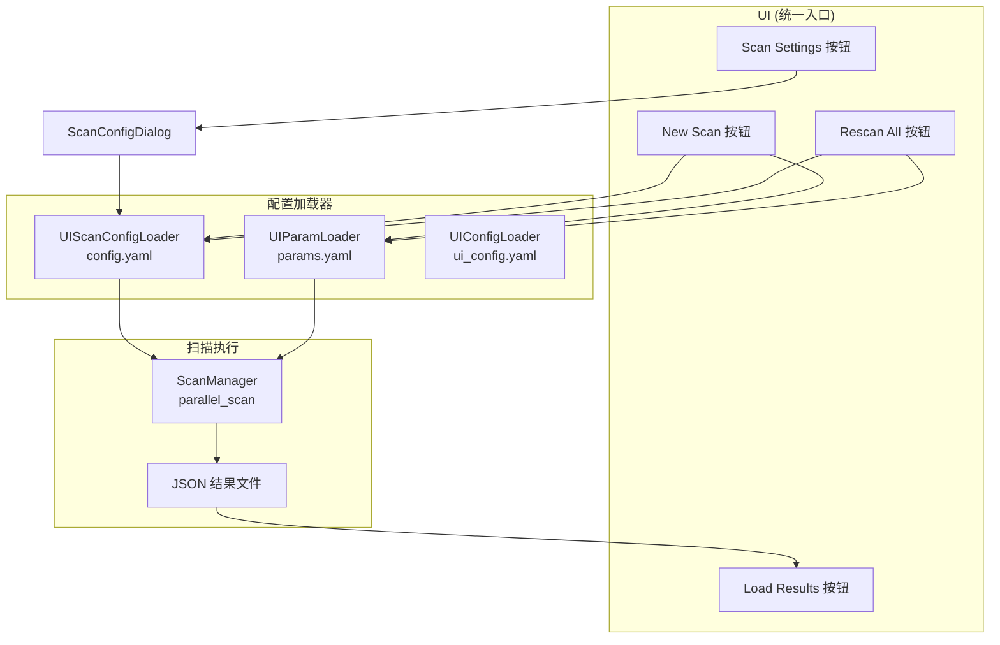
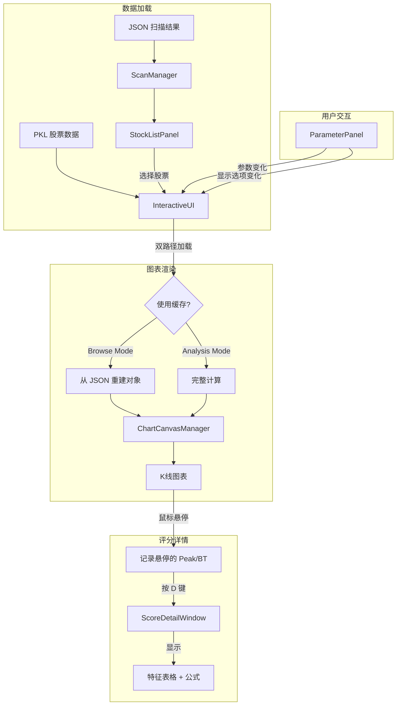

# 12 交互式UI模块 (UI)

> 状态：已实现 (Implemented) | 最后更新：2025-12-22

## 一、模块概述

UI 模块是一个基于 Tkinter 的桌面交互式应用，作为整个系统的**统一入口**，完全替代命令行 `batch_scan.py` 脚本。它提供了批量扫描、股票列表浏览、K线图表可视化、参数实时调整等完整功能。

**核心职责**：
- **统一扫描入口**：New Scan（从头扫描）、Rescan All（重新扫描）
- **配置管理**：扫描配置（config.yaml）、检测参数（params.yaml）
- 加载并展示批量扫描生成的 JSON 结果
- 提供交互式 K线图表，标注突破点和峰值
- 支持参数编辑和实时图表刷新
- 提供键盘导航和列配置等便捷交互

## 二、架构设计

### 2.1 分层结构

```
BreakthroughStrategy/UI/
├── main.py              # 主窗口 (InteractiveUI) - 统一入口
├── styles.py            # 全局样式配置
├── utils.py             # 工具函数
├── panels/              # UI 面板组件
│   ├── parameter_panel.py   # 参数面板（含 New Scan、Scan Settings）
│   └── stock_list_panel.py  # 股票列表面板
├── charts/              # 图表渲染
│   ├── canvas_manager.py    # 图表管理器
│   └── components/          # 绘图组件
│       ├── candlestick.py   # K线组件
│       ├── markers.py       # 标记组件
│       ├── panels.py        # 统计面板
│       └── score_tooltip.py # 评分详情浮动窗口
├── editors/             # 参数编辑器
│   ├── parameter_editor.py  # 编辑器窗口
│   └── input_factory.py     # 输入控件工厂
├── dialogs/             # 对话框
│   ├── file_dialog.py           # 文件对话框
│   ├── column_config_dialog.py  # 列配置对话框
│   ├── scan_config_dialog.py    # 扫描配置对话框
│   ├── rescan_mode_dialog.py    # Rescan 模式选择对话框
│   └── filename_dialog.py       # 文件命名对话框
├── managers/            # 业务逻辑管理器
│   ├── scan_manager.py      # 扫描管理器
│   └── navigation_manager.py # 键盘导航管理器
└── config/              # 配置管理
    ├── ui_loader.py         # UI 配置加载器
    ├── param_loader.py      # 参数加载器
    ├── scan_config_loader.py # 扫描配置加载器 (NEW)
    ├── param_state_manager.py # 参数状态管理
    ├── param_editor_schema.py # 编辑器 Schema
    ├── validator.py         # 输入验证器
    └── yaml_parser.py       # YAML 解析器
```

### 2.2 UI 统一入口架构



### 2.3 核心数据流



## 三、关键设计决策

### 3.1 双模式架构 (Browse / Analysis)

**问题**：用户修改参数后，stock list 中不同股票基于不同参数的数据会产生混乱。

**解决方案**：明确区分两种工作模式

| 模式 | 触发条件 | 数据来源 | UI 状态 |
|------|---------|---------|--------|
| **Browse** | 取消勾选复选框 | Stock list 和图表都使用 JSON 缓存 | 参数编辑禁用 |
| **Analysis** | 启动时默认 / 勾选复选框 | 图表使用 UI 参数实时计算，stock list 不变 | 参数编辑启用 |

**关键行为**：
- Browse Mode：切换股票时使用 JSON 缓存，速度快
- Analysis Mode（默认）：使用 UI 参数进行 full compute，切换股票时实时计算
- Rescan All：在 Analysis Mode 中可用，用当前参数重新扫描所有股票

> **2025-12-22 变更**：默认模式从 Browse 改为 Analysis，更符合分析工作流

### 3.2 扫描配置管理 (UIScanConfigLoader)

**问题**：Rescan All 不知道时间范围配置，与 batch_scan.py 行为不一致。

**解决方案**：引入 `UIScanConfigLoader` 统一管理 `config.yaml`

**支持两种扫描模式**：
- **Global 模式**：使用 `start_date` / `end_date` 全局时间范围
- **CSV 模式**：从 CSV 文件读取股票列表，每只股票有独立的时间窗口（`date ± mon_before/mon_after`）

**配置项**：
```yaml
data:
  data_dir: "/path/to/pkls"
  csv_file: "/path/to/list.csv"  # null = Global模式
  start_date: "2023-01-01"
  end_date: null
  mon_before: 6
  mon_after: 1
performance:
  num_workers: 8
```

### 3.3 New Scan vs Rescan All

| 功能 | New Scan | Rescan All |
|------|----------|------------|
| **前提条件** | 无需加载 JSON | 必须先加载 JSON |
| **股票列表来源** | config.yaml（CSV/pkl目录） | 已加载的 scan_data |
| **适用场景** | 首次扫描、更换数据集 | 参数调整后重新扫描 |

### 3.4 双路径加载策略 (JSON Cache vs Full Computation)

**问题**：每次切换股票都重新计算突破检测，延迟明显。

**解决方案**：
- **JSON 缓存路径**（快速）：Browse Mode 时从 JSON 重建 `Breakthrough` 和 `Peak` 对象
- **完整计算路径**（默认）：Analysis Mode 时调用 `BreakthroughDetector` 实时计算

> **注意**：默认使用完整计算路径，确保图表反映当前 UI 参数设置

### 3.5 索引重映射机制

**问题**：JSON 中的索引是基于扫描时的 DataFrame，但 UI 可能加载不同时间范围的数据。

**解决方案**：在 `_load_from_json_cache` 中根据日期重新映射索引到当前 DataFrame 的位置。

### 3.6 参数编辑器三层状态管理

**问题**：参数编辑器、下拉菜单、UIParamLoader 三方状态需要同步。

**解决方案**：`ParameterStateManager` 管理三层状态
- **File State**: 磁盘上的 YAML 文件
- **Editor State**: 编辑器临时参数
- **Memory State**: 运行时参数

## 四、组件职责

### 4.1 InteractiveUI (main.py)

主窗口协调器，负责：
- 创建和布局所有子面板
- 管理 DataFrame 缓存
- 协调股票选择 → 数据加载 → 图表渲染流程
- **实现 New Scan 和 Rescan All 后台扫描逻辑**

### 4.2 ParameterPanel (panels/parameter_panel.py)

参数面板，提供：
- **Load Scan Results** 按钮
- **New Scan** 按钮
- 参数文件下拉菜单和 **Edit** 按钮
- **Rescan All** 按钮
- **Scan Settings** 按钮
- 显示选项复选框

### 4.3 ScanConfigDialog (dialogs/scan_config_dialog.py)

扫描配置对话框，提供：
- 模式切换（Global / CSV）
- Global 模式：start_date, end_date 编辑
- CSV 模式：csv_file 选择, mon_before/mon_after 设置
- 通用配置：data_dir, output_dir, num_workers
- Apply / Save / Reload 操作

### 4.4 UIScanConfigLoader (config/scan_config_loader.py)

扫描配置加载器，负责：
- 加载和解析 `configs/analysis/config.yaml`
- 提供两种扫描模式的配置访问 API
- CSV 文件解析和 per-stock 时间范围计算
- 配置持久化

### 4.5 ScanManager (managers/scan_manager.py)

批量扫描管理器，服务于：
- **New Scan / Rescan All**：`parallel_scan()` 多进程扫描
- **UI 加载**：`load_results()` 加载 JSON

### 4.6 ChartCanvasManager (charts/canvas_manager.py)

图表渲染管理器，负责：
- 创建 Matplotlib Figure 并嵌入 Tkinter
- 协调 K线、成交量、标记、统计面板的绘制
- 实现鼠标悬停 Tooltip 和十字线
- 管理评分详情窗口的生命周期

### 4.7 RescanModeDialog (dialogs/rescan_mode_dialog.py)

Rescan 模式选择对话框，提供：
- **覆盖原文件**：使用当前参数重新扫描，覆盖原 JSON 文件
- **另存为新文件**：保存到新文件，保留原文件

### 4.8 FilenameDialog (dialogs/filename_dialog.py)

文件命名对话框，提供：
- 用于 New Scan 和另存为时输入输出文件名
- 自动补全 `.json` 扩展名

## 五、配置系统

### 5.1 配置文件

| 文件 | 用途 | 加载器 |
|------|------|--------|
| `configs/UI/ui_config.yaml` | UI 布局配置 | UIConfigLoader |
| `configs/analysis/config.yaml` | 扫描配置（数据源、时间范围） | UIScanConfigLoader |
| `configs/analysis/params/*.yaml` | 检测器参数 | UIParamLoader |

### 5.2 配置加载器关系

```
UIConfigLoader ─────→ UI 布局、窗口大小、列配置
UIScanConfigLoader ─→ 数据目录、时间范围、并行数
UIParamLoader ──────→ 检测器参数、评分器参数
```

## 六、UI 布局

```
┌─────────────────────────────────────────────────────────────────────────────────────────┐
│ [Load] [New Scan] │ [○] [▼ params.yaml] [Edit] [Rescan All] [Scan Settings] │ ☑Peak ☑BT │
├───────────────────┴─────────────────────────────────────────────────────────────────────┤
│                                                                                          │
│   Stock List        │              K-Line Chart                                         │
│   ┌──────────────┐  │   ┌─────────────────────────────────────────────────────────┐    │
│   │ Symbol │ ... │  │   │                                                         │    │
│   ├────────┼─────┤  │   │                     Candlestick                         │    │
│   │ AAPL   │ ... │  │   │                        Chart                            │    │
│   │ GOOGL  │ ... │  │   │                                                         │    │
│   │ ...    │ ... │  │   └─────────────────────────────────────────────────────────┘    │
│   └────────┴─────┘  │                                                                   │
│                     │                                                                   │
└─────────────────────┴───────────────────────────────────────────────────────────────────┘
```

## 七、快捷键

| 快捷键 | 功能 |
|--------|------|
| `↑/↓` | 上下导航股票列表 |
| `D` | 显示当前悬停峰值/突破的评分详情 |
| `Escape` | 关闭最近打开的评分详情窗口 |
| `Shift+Escape` | 关闭所有评分详情窗口 |

## 八、已知局限

1. **单线程 UI**：数据加载在主线程，大文件可能卡顿（扫描已用后台线程）
2. **内存缓存**：DataFrame 缓存无大小限制，长时间运行可能占用较多内存
3. **Matplotlib 渲染**：大数据量时渲染较慢，未做数据抽样
4. **跨平台兼容**：窗口最大化逻辑在不同系统表现可能不同

## 九、扩展点

- **导出功能**：图表导出为图片、数据导出为 CSV
- **多窗口对比**：同时打开多个股票对比分析
- **自定义指标**：在图表上叠加自定义技术指标
- **实时数据**：集成实时行情，动态更新图表
