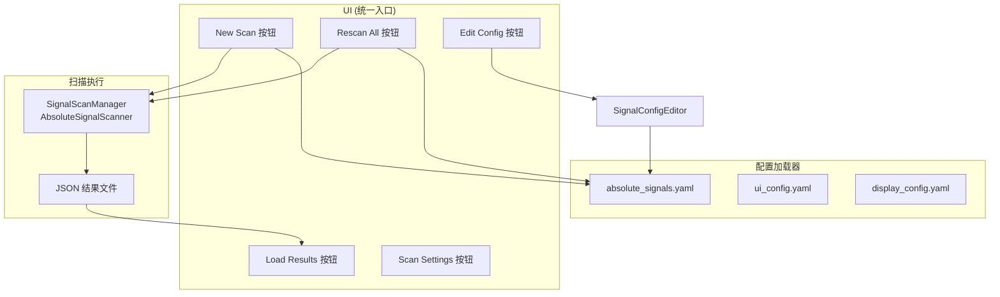
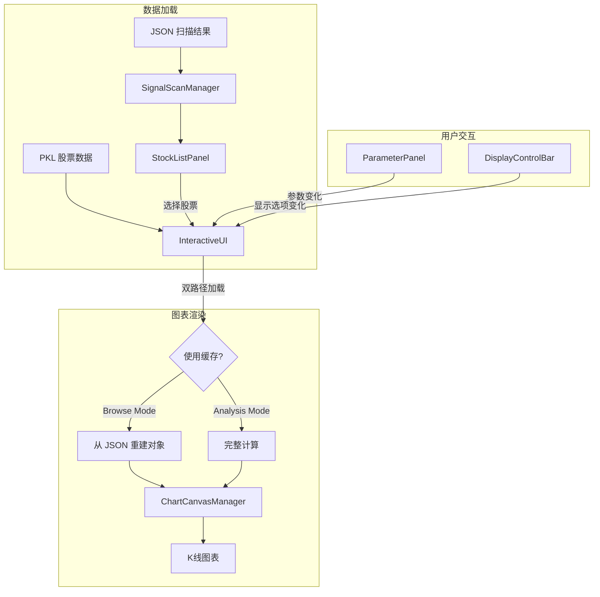
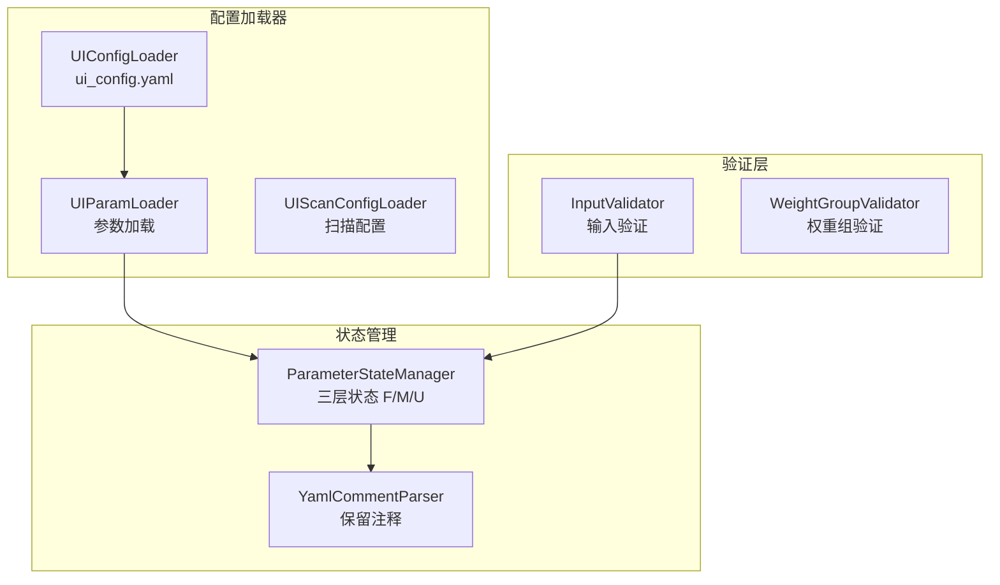

# 12 交互式UI模块 (UI)

> 状态：已实现 (Implemented) | 最后更新：2026-02-04

## 一、模块概述

UI 模块是一个基于 Tkinter 的桌面交互式应用，作为**信号扫描系统的统一入口**，承担批量扫描、股票列表浏览、K线图表可视化、参数实时调整等完整功能。

**核心职责**：
- **信号扫描入口**：New Scan（从头扫描）、Rescan All（重新扫描）
- **配置管理**：信号配置（absolute_signals.yaml）、显示配置（display_config.yaml）
- 加载并展示批量扫描生成的 JSON 结果（按信号数量排序）
- 提供交互式 K线图表，标注信号标记（B/V/Y/D + Peak/Trough）
- 支持参数编辑和实时图表刷新
- **符号筛选**：控制图表上显示哪些信号标记

## 二、架构设计

### 2.1 分层结构

```
BreakoutStrategy/UI/
├── main.py              # 主窗口 (InteractiveUI) - 统一入口
├── styles.py            # 全局样式配置
├── utils.py             # 工具函数
├── panels/              # UI 面板组件
│   ├── parameter_panel.py     # 参数面板（含 New Scan、Scan Settings）
│   ├── stock_list_panel.py    # 股票列表面板
│   ├── display_control_bar.py # 显示控制栏
│   ├── mode_indicator.py      # 模式指示器
│   └── symbol_filter_panel.py # 符号筛选面板（6 checkbox: B/V/Y/D/Peak/Trough）
├── charts/              # 图表渲染
│   ├── canvas_manager.py    # 图表管理器
│   └── components/          # 绘图组件
│       ├── candlestick.py   # K线组件
│       ├── markers.py       # 标记组件（信号、峰值、支撑 trough）
│       ├── panels.py        # 统计面板
│       └── score_tooltip.py # 评分 Tooltip
├── editors/             # 参数编辑器
│   ├── signal_config_editor.py  # 信号配置编辑器
│   ├── parameter_editor.py      # 通用参数编辑器
│   └── input_factory.py         # 输入控件工厂
├── dialogs/             # 对话框
│   ├── file_dialog.py           # 文件对话框
│   ├── scan_settings_dialog.py  # 扫描设置对话框
│   ├── scan_config_dialog.py    # 扫描配置对话框
│   ├── filename_dialog.py       # 文件命名对话框
│   ├── rescan_mode_dialog.py    # Rescan 模式选择对话框
│   └── column_config_dialog.py  # 列配置对话框
├── managers/            # 业务逻辑管理器
│   ├── signal_scan_manager.py   # 信号扫描管理器
│   ├── scan_manager.py          # 通用扫描管理器
│   └── navigation_manager.py    # 键盘导航管理器
└── config/              # 配置管理
    ├── ui_loader.py           # UI 配置加载器
    ├── param_loader.py        # 参数加载器
    ├── scan_config_loader.py  # 扫描配置加载器
    ├── param_state_manager.py # 参数状态管理器
    ├── param_editor_schema.py # 参数编辑器 Schema
    ├── validator.py           # 输入验证器
    └── yaml_parser.py         # YAML 注释解析器
```

### 2.2 UI 统一入口架构


```mermaid
flowchart TD
    subgraph UI["UI (统一入口)"]
        NewScan[New Scan 按钮]
        RescanAll[Rescan All 按钮]
        LoadResults[Load Results 按钮]
        ScanSettings[Scan Settings 按钮]
        EditConfig[Edit Config 按钮]
    end

    subgraph ConfigLoaders["配置加载器"]
        SignalConfig[absolute_signals.yaml]
        UIConfig[ui_config.yaml]
        DisplayConfig[display_config.yaml]
    end

    subgraph ScanExecution["扫描执行"]
        ScanManager[SignalScanManager<br/>AbsoluteSignalScanner]
        JSONOutput[JSON 结果文件]
    end

    NewScan --> SignalConfig
    RescanAll --> SignalConfig
    EditConfig --> SignalConfigEditor[SignalConfigEditor]
    SignalConfigEditor --> SignalConfig

    NewScan --> ScanManager
    RescanAll --> ScanManager

    ScanManager --> JSONOutput
    JSONOutput --> LoadResults
```

### 2.3 核心数据流


```mermaid
flowchart TD
    subgraph 数据加载
        JSON[JSON 扫描结果] --> ScanMgr[SignalScanManager]
        ScanMgr --> StockList[StockListPanel]
        PKL[PKL 股票数据] --> Main[InteractiveUI]
    end

    subgraph 用户交互
        StockList -->|选择股票| Main
        ParamPanel[ParameterPanel] -->|参数变化| Main
        DisplayBar[DisplayControlBar] -->|显示选项变化| Main
    end

    subgraph 图表渲染
        Main -->|双路径加载| Decision{使用缓存?}
        Decision -->|Browse Mode| JSONCache[从 JSON 重建对象]
        Decision -->|Analysis Mode| FullComp[完整计算]
        JSONCache --> ChartMgr[ChartCanvasManager]
        FullComp --> ChartMgr
        ChartMgr --> Canvas[K线图表]
    end
```

## 三、关键设计决策

### 3.1 双模式架构 (Browse / Analysis)

**问题**：用户修改参数后，stock list 中不同股票基于不同参数的数据会产生混乱。

**解决方案**：明确区分两种工作模式

| 模式 | 触发条件 | 数据来源 | UI 状态 |
|------|---------|---------|--------|
| **Browse** | 取消勾选复选框 | Stock list 和图表都使用 JSON 缓存 | 参数编辑禁用 |
| **Analysis** | 启动时默认 / 勾选复选框 | 图表使用 UI 参数实时计算，stock list 不变 | 参数编辑启用 |

**关键行为**：
- Browse Mode：切换股票时使用 JSON 缓存，速度快
- Analysis Mode（默认）：使用 UI 参数进行 full compute，切换股票时实时计算
- Rescan All：在 Analysis Mode 中可用，用当前参数重新扫描所有股票

### 3.2 信号配置编辑器 (SignalConfigEditor)

**问题**：用户需要在 UI 中方便地编辑信号检测参数。

**解决方案**：引入 `SignalConfigEditor` 统一编辑 `absolute_signals.yaml`

**三层状态管理**：
- **File State (F)**: 磁盘上的 YAML 文件
- **Memory State (M)**: 运行时内存配置
- **UI State (U)**: 编辑器临时输入值

**按钮行为**：
- **Apply**: `M := U`（应用到内存，不保存文件）
- **Save**: `F := U, M := U`（保存到文件并应用）
- **Reset**: `U := F, M := F`（重置到文件状态）

**按钮启用规则**：
- Apply: 仅当 `U != M` 时启用
- Save/Reset: 当 `U != M` 或 `M != F` 时启用

### 3.3 New Scan vs Rescan All

| 功能 | New Scan | Rescan All |
|------|----------|------------|
| **前提条件** | 无需加载 JSON | 必须先加载 JSON |
| **股票列表来源** | 数据目录（pkl 文件） | 已加载的 scan_data |
| **适用场景** | 首次扫描、更换数据集 | 参数调整后重新扫描 |

### 3.4 显示配置独立

**决策**：K线图表显示范围配置（before_months, after_months）独立于信号检测配置。

**原因**：
- 显示范围只影响图表可视化，不参与信号检测
- 用户可独立调整，无需重新扫描
- 配置保存在 `configs/signals/display_config.yaml`

## 四、组件职责

### 4.1 InteractiveUI (main.py)

主窗口协调器，负责：
- 创建和布局所有子面板
- 管理 DataFrame 缓存
- 协调股票选择 → 数据加载 → 图表渲染流程
- **实现 New Scan 和 Rescan All 后台扫描逻辑**

### 4.2 ParameterPanel (panels/parameter_panel.py)

参数面板，提供：
- **Load Scan Results** 按钮
- **New Scan** 按钮
- **Edit** 按钮（打开信号配置编辑器）
- **Rescan All** 按钮
- **Scan Settings** 按钮

### 4.3 SignalConfigEditor (editors/signal_config_editor.py)

信号配置编辑器，提供：
- 4 种信号检测器的参数配置区块
- 每个检测器可单独启用/禁用
- Apply / Save / Reset / Cancel 操作
- 变量变化追踪和按钮状态管理

**D 信号 (Double Trough) 参数**：
| 参数 | 类型 | 说明 |
|------|------|------|
| TR1_Measure | 下拉框 | TR1 价格衡量方式 (low/close/body_bottom) |
| TR2_Measure | 下拉框 | TR2 价格衡量方式 (low/close/body_bottom) |
| Bounce_High_Measure | 下拉框 | 区间最高价衡量方式 (close/high) |

### 4.4 SymbolFilterPanel (panels/symbol_filter_panel.py)

符号筛选面板，提供 6 个 checkbox 控制 K 线图上的符号显示：
- **B**: 突破信号标签
- **V**: 超大成交量信号标签
- **Y**: 大阳线信号标签
- **D**: 双底信号标签（含 TR 标记）
- **Peak**: 峰值标记（空心倒三角 + ID）
- **Trough**: 支撑 trough 标记（空心正三角 + ID）

### 4.5 NavigationManager (managers/navigation_manager.py)

键盘导航管理器，提供：
- 全局键盘事件绑定（↑/↓/Enter）
- 智能焦点检测（避免与可编辑控件冲突）
- 股票列表快速导航
- 临时行跳过逻辑

### 4.7 SignalScanManager (managers/signal_scan_manager.py)

信号扫描管理器，服务于：
- **New Scan / Rescan All**：调用 `AbsoluteSignalScanner` 执行扫描
- **UI 加载**：加载 JSON 结果
- 进度回调和错误处理
- 配置指纹计算（用于检测配置变化）

### 4.8 RescanModeDialog (dialogs/rescan_mode_dialog.py)

Rescan 模式选择对话框：
- **Overwrite**: 覆盖当前文件（需二次确认）
- **New File**: 新建文件（支持自定义文件名）

### 4.9 ColumnConfigDialog (dialogs/column_config_dialog.py)

列配置对话框（多选 Listbox）：
- 配置股票列表显示的列
- Select All / Clear All / Reset 快捷按钮

### 4.11 ChartCanvasManager (charts/canvas_manager.py)

图表渲染管理器，负责：
- 创建 Matplotlib Figure 并嵌入 Tkinter
- 协调 K线、成交量、标记、统计面板的绘制
- 实现鼠标悬停 Tooltip 和十字线
- 信号标记绘制（B/V/Y/D + pk_num/tr_num 标注）
- Peak/Trough 标记绘制（空心三角 + ID）

### 4.13 DisplayControlBar (panels/display_control_bar.py)

显示控制栏，提供：
- before_months / after_months 调整
- lookback_days 调整（信号统计窗口）
- 图表显示范围实时更新
- 配置持久化

## 五、配置系统

### 5.1 配置文件

| 文件 | 用途 | 加载器 |
|------|------|--------|
| `configs/signals/ui_config.yaml` | UI 布局配置、数据目录 | UIConfigLoader |
| `configs/signals/absolute_signals.yaml` | 信号检测器参数 | main.py 直接加载 |
| `configs/signals/display_config.yaml` | K线图表显示范围 | UIConfigLoader |

### 5.2 配置加载器关系

```
UIConfigLoader ─────→ UI 布局、窗口大小、数据目录、显示范围
absolute_signals.yaml ─→ 4 种信号检测器参数
```

## 六、UI 布局

```
┌─────────────────────────────────────────────────────────────────────────────────────────┐
│ [Mode: Analysis] │ [Load] [New Scan] [Edit] [Rescan All] [Scan Settings]                │
├───────────────────┴─────────────────────────────────────────────────────────────────────┤
│                                                                                          │
│   Stock List        │              K-Line Chart                                         │
│   ┌──────────────┐  │   ┌─────────────────────────────────────────────────────────┐    │
│   │ Symbol │ Cnt │  │   │                                                         │    │
│   ├────────┼─────┤  │   │                     Candlestick                         │    │
│   │ AAPL   │  5  │  │   │                        Chart                            │    │
│   │ GOOGL  │  4  │  │   │                                                         │    │
│   │ ...    │ ... │  │   └─────────────────────────────────────────────────────────┘    │
│   └────────┴─────┘  │                                                                   │
│                     │   ┌─ Display Control ─────────────────────────────────────────┐   │
│                     │   │ Before: [6] months  After: [1] months                     │   │
│                     │   └───────────────────────────────────────────────────────────┘   │
└─────────────────────┴───────────────────────────────────────────────────────────────────┘
```

## 七、快捷键

| 快捷键 | 功能 |
|--------|------|
| `↑/↓` | 上下导航股票列表 |
| `Escape` | 关闭弹出窗口 |

## 八、已知局限

1. **单线程 UI**：数据加载在主线程，大文件可能卡顿（扫描已用后台线程）
2. **内存缓存**：DataFrame 缓存无大小限制，长时间运行可能占用较多内存
3. **Matplotlib 渲染**：大数据量时渲染较慢，未做数据抽样
4. **跨平台兼容**：窗口最大化逻辑在不同系统表现可能不同

## 九、扩展点

- **导出功能**：图表导出为图片、数据导出为 CSV
- **多窗口对比**：同时打开多个股票对比分析
- **自定义指标**：在图表上叠加自定义技术指标
- **实时数据**：集成实时行情，动态更新图表

## 十、配置管理子系统

### 10.1 配置加载器层级


```mermaid
flowchart TD
    subgraph Loaders["配置加载器"]
        UIConfigLoader[UIConfigLoader<br/>ui_config.yaml]
        UIParamLoader[UIParamLoader<br/>参数加载]
        UIScanConfigLoader[UIScanConfigLoader<br/>扫描配置]
    end

    subgraph StateManagement["状态管理"]
        ParamStateManager[ParameterStateManager<br/>三层状态 F/M/U]
        YamlCommentParser[YamlCommentParser<br/>保留注释]
    end

    subgraph Validation["验证层"]
        InputValidator[InputValidator<br/>输入验证]
        WeightGroupValidator[WeightGroupValidator<br/>权重组验证]
    end

    UIConfigLoader --> UIParamLoader
    UIParamLoader --> ParamStateManager
    ParamStateManager --> YamlCommentParser
    InputValidator --> ParamStateManager
```

### 10.2 YAML 注释保留

`YamlCommentParser` 实现 YAML 文件的注释保留：
- 解析原文件结构，保留行内注释和块注释
- 仅更新值，不影响格式和注释
- 用于 `absolute_signals.yaml` 等配置文件的编辑
