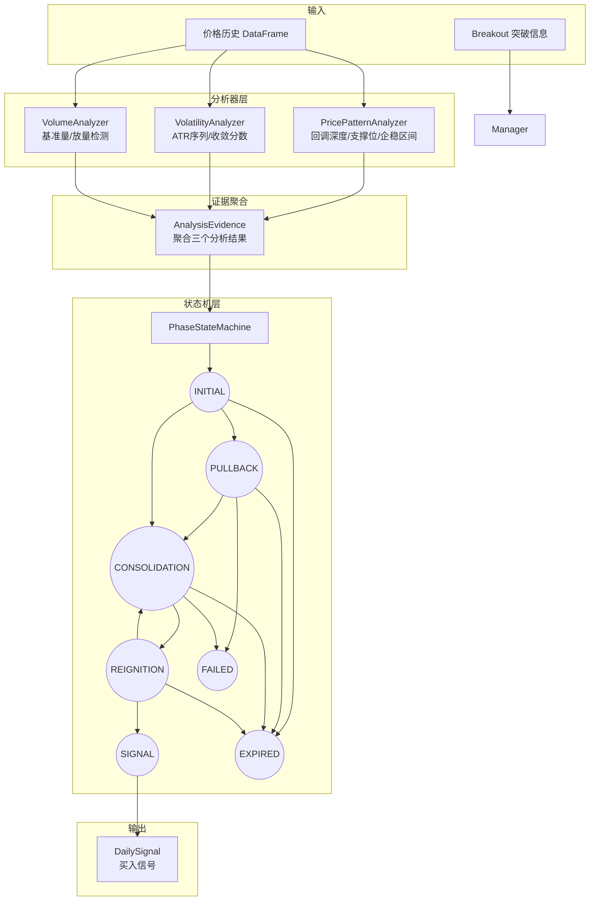

# Daily 观察池模块

> 状态：已实现 (Implemented) | 最后更新：2026-01-04

## 概述

独立的日K级别观察池系统，基于**阶段状态机模型**评估突破后的"回调-企稳-再启动"过程。

**核心设计理念**：
- **过程优于状态**：阶段状态机替代加权评分，准确建模价格变化过程
- **证据聚合模式**：三个分析器独立分析，状态机综合判断
- **ATR标准化**：所有阈值以ATR为单位，自动适应不同股票

## 核心流程



## 阶段状态机

### 状态转换图

```
INITIAL ──┬──> PULLBACK ──> CONSOLIDATION ──> REIGNITION ──> SIGNAL
          └──> CONSOLIDATION ────────────────────────────────────┘
                    ↑                                      │
                    └──────────── (假突破回退) ────────────┘

任意阶段 ──> FAILED (回调过深/阶段超时)
任意阶段 ──> EXPIRED (观察期满30天)
```

### 阶段语义

| 阶段 | 业务含义 | 持续时间 | 关键观察指标 |
|------|---------|---------|-------------|
| INITIAL | 刚入池，等待行情发展 | 1-3天 | 价格走向 |
| PULLBACK | 健康回调，寻找支撑 | 3-15天 | 回调深度、支撑测试 |
| CONSOLIDATION | 企稳整理，蓄势待发 | 5-20天 | 波动收敛、区间宽度 |
| REIGNITION | 放量启动，等待确认 | 1-3天 | 量能、价格维持 |
| SIGNAL | 信号生成，可以交易 | 终态 | - |
| FAILED | 观察失败，移出池 | 终态 | - |
| EXPIRED | 观察期满，移出池 | 终态 | - |

### 转换条件

| 当前阶段 | 目标阶段 | 转换条件 |
|---------|---------|---------|
| INITIAL | PULLBACK | `pullback_depth_atr >= 0.3` |
| INITIAL | CONSOLIDATION | `convergence_score >= 0.5 AND pullback < 0.3` |
| PULLBACK | CONSOLIDATION | `convergence_score >= 0.5 AND support_tests >= 2` |
| PULLBACK | FAILED | `days_in_phase > 15` |
| CONSOLIDATION | REIGNITION | `volume_ratio >= 1.5 AND price_above_top` |
| CONSOLIDATION | FAILED | `days_in_phase > 20` |
| REIGNITION | SIGNAL | `days_in_phase >= 1 AND still_above_top` |
| REIGNITION | CONSOLIDATION | 假突破回退 |
| ANY | FAILED | `pullback > 1.5 ATR` |
| ANY | EXPIRED | `total_days >= 30` |

## 三维度分析器

### PricePatternAnalyzer

**职责**：分析价格走势中的关键模式

- **回调深度**：`(post_breakout_high - current) / initial_atr`
- **支撑位检测**：
  1. 局部最低点识别（窗口=2）
  2. 按价格聚类（容差=0.1 ATR）
  3. 触及次数过滤（最小2次）
  4. 强度计算：`0.4*(测试次数/5) + 0.3*(时间跨度/15天) + 0.3*反弹质量`
- **企稳区间**：`mean ± 1.5*std`（近10天收盘价），有效性判断基于宽度

### VolatilityAnalyzer

**职责**：分析波动率的变化趋势

- **ATR序列**：14周期简单移动平均
- **收敛分数公式**：
  - 斜率分数(0.5)：线性回归斜率为负时得分
  - ATR比率分数(0.3)：`current_atr/initial_atr <= 0.8` 时满分
  - 稳定性分数(0.2)：基于变异系数(CV)
- **状态判定**：contracting / stable / expanding

### VolumeAnalyzer

**职责**：分析成交量变化

- **基准量**：MA(20)
- **放量检测**：`current / baseline >= 1.5`
- **趋势判断**：比较 MA(5) vs MA(20)

## 关键决策

### Why 状态机而非评分？

Realtime 池使用加权评分(0-100)评估"此刻是否买入"，但 Daily 池关注的是**变化过程**——"经历了什么变化才值得买入"。

状态机模型更适合：
- 建模"回调-企稳-再启动"的时序过程
- 记录完整的阶段转换历史
- 提供更好的信号可解释性

### Why 独立于 Realtime 池？

| 维度 | Realtime 池 | Daily 池 |
|------|------------|---------|
| 时间粒度 | 5分钟级 | 日K级 |
| 评估模型 | 加权评分 | 阶段状态机 |
| 核心问题 | "此刻是否买入?" | "经历了什么变化?" |
| 输入数据 | 单条K线 | 历史序列 |

### 信号置信度计算

信号生成时的置信度公式：
```
confidence = 0.30 * 收敛分数 + 0.25 * 支撑强度 + 0.25 * 放量程度 + 0.20 * 突破质量
```

基于置信度确定信号强度：
- `>= 0.7`: STRONG
- `>= 0.5`: NORMAL
- `< 0.5`: WEAK

## 已知局限

1. **随机数据问题**：测试中随机数据容易触发 FAILED（回调过深），需真实历史数据验证
2. **参数敏感性**：阈值参数（如 `min_convergence_score=0.5`）需要通过回测调优
3. **假突破处理**：REIGNITION→CONSOLIDATION 的回退逻辑较简单，可能需要更复杂的确认机制

## 目录结构

```
BreakoutStrategy/daily_pool/
├── __init__.py              # 26个导出
├── models/                  # 数据模型
│   ├── phase.py            # Phase 枚举 (7个阶段)
│   ├── history.py          # PhaseTransition, PhaseHistory
│   ├── entry.py            # DailyPoolEntry
│   └── signal.py           # DailySignal, SignalType, SignalStrength
├── config/                  # 配置系统
│   ├── config.py           # 6个配置类
│   └── loader.py           # YAML 加载/保存
├── state_machine/           # 状态机
│   ├── evidence.py         # AnalysisEvidence
│   ├── transitions.py      # PhaseTransitionResult
│   └── machine.py          # PhaseStateMachine
├── analyzers/               # 分析器
│   ├── results.py          # 5个结果数据类
│   ├── price_pattern.py    # PricePatternAnalyzer
│   ├── volatility.py       # VolatilityAnalyzer
│   └── volume.py           # VolumeAnalyzer
├── evaluator/               # 评估器
│   └── daily_evaluator.py  # DailyPoolEvaluator
├── manager/                 # 管理器
│   └── pool_manager.py     # DailyPoolManager
└── backtest/                # 回测
    └── engine.py           # DailyBacktestEngine
```

## 配置文件

`configs/daily_pool/default.yaml` - 默认配置

支持策略变体：
- `DailyPoolConfig.default()` - 默认策略
- `DailyPoolConfig.conservative()` - 保守策略（更严格的企稳要求）
- `DailyPoolConfig.aggressive()` - 激进策略（更宽松的触发条件）

## 使用示例

```python
from BreakoutStrategy.daily_pool import (
    DailyPoolManager, DailyBacktestEngine, DailyPoolConfig
)
from datetime import date

# 创建管理器
config = DailyPoolConfig.default()
manager = DailyPoolManager(config)

# 添加条目
entry = manager.add_entry(
    symbol='AAPL',
    breakout_date=date(2024, 1, 15),
    breakout_price=185.0,
    highest_peak_price=190.0,
    initial_atr=3.5,
    quality_score=75.0
)

# 每日更新
signals = manager.update_all(as_of_date, price_data)

# 回测
engine = DailyBacktestEngine(config)
result = engine.run(breakouts, price_data, start_date, end_date)
print(result.summary())
```

## 与其他模块的关系

- **依赖**：无外部依赖，完全独立
- **被依赖**：可被 UI 模块集成显示 Daily 池状态
- **平行模块**：与 `observation/`（Realtime 池）并行存在，服务不同场景
