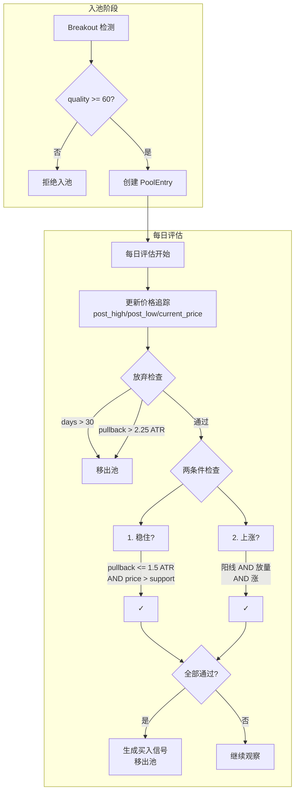

# 14 Simple Pool (MVP 观察池)

> 状态：已实现 (Implemented) | 最后更新：2026-01-13

## 概述

Simple Pool 是日 K 级别观察池的 MVP (Minimum Viable Product) 版本，采用**即时判断模型**替代状态机。

**设计背景**：原 Daily Pool 使用 7 状态状态机和 29 个参数，导致信号率过低（~3%）且难以迭代。MVP 版本将参数减少到 4 个，使用简单的两条件并行判断，便于观察规律和优化。

**核心理念**：
- 从"理论最优模板"转向"最大公约数规则"
- 即时判断替代状态机路径依赖
- 每条规则对应明确的市场机制
- Quality 检查前置到入池阶段，评估阶段仅检查两条件

---

## 架构概览

```
BreakoutStrategy/simple_pool/
├── config.py       # 配置类 (4 核心参数 + 5 固定参数)
├── models.py       # PoolEntry + BuySignal + SignalPerformance
├── utils.py        # ATR、放量、支撑等计算
├── evaluator.py    # 核心评估逻辑 (两条件判断)
├── manager.py      # 池生命周期管理
├── backtest.py     # 回测引擎 + MFE/MAE 计算
└── __init__.py     # 模块导出
```

**与 Daily Pool 的关系**：完全独立，不依赖任何 daily_pool 代码。将来可直接删除 daily_pool 目录。

---

## 核心流程



---

## 关键决策

### 1. 为什么用即时判断而非状态机？

**问题诊断**：
- 状态机的路径依赖：必须按序经历 INITIAL → PULLBACK → CONSOLIDATION → REIGNITION → SIGNAL
- 错过任何转换窗口即失败，导致大量"无辜好股票"被过滤
- 28 个参数 vs ~100 样本，过拟合风险高

**MVP 方案**：
- 用户的直觉是"放量突破！稳住了！开始涨？买！" —— 这是瞬时条件，不是时序过程
- 每天检查当前快照是否满足条件，任意时点满足即触发
- 今天不满足，明天可能满足，无路径依赖

### 2. 为什么只用 4 个核心参数？

| 参数 | 默认值 | 市场机制 |
|------|-------|---------|
| `max_pullback_atr` | 1.5 | 回调控制 = 供需平衡 |
| `support_lookback` | 10 | 近期支撑 = 买盘承接 |
| `volume_threshold` | 1.3 | 放量 = 资金进场 |
| `min_quality_score` | 60 | 突破质量 = 初始动能 |

**原则**：每个参数必须对应独立的市场机制，且可被独立验证。

### 3. 为什么把 quality 检查移到入池阶段？

**原设计**：quality 与 stable/rising 并列为评估阶段的三条件。

**优化理由**：
- Quality 是入池时的固有属性，不随时间变化
- 每次评估都检查 quality 是冗余计算
- 入池前过滤不达标的突破，减少池内条目数量
- 评估逻辑更清晰：只关注动态条件（稳定性 + 上涨趋势）

### 4. 支撑位为什么用 `min(low[-N:])`？

原 Daily Pool 使用复杂的局部最低点聚类 + 强度评分（3 因素加权）。

**简化理由**：
- 近期最低价 = 最近的买盘承接位，直观有效
- 减少参数（原算法有 `min_touches`, `touch_tolerance_atr` 等）
- 后续可通过数据验证决定是否需要更复杂的算法

---

## 两条件详解

### 条件 1：稳住 (Stability)

```python
def _check_stability(entry, metrics) -> bool:
    pullback_ok = metrics['pullback_atr'] <= config.max_pullback_atr
    above_support = metrics['current_price'] > metrics['recent_support']
    return pullback_ok and above_support
```

**市场机制**：获利盘卖出 vs 新资金接盘 = 供需再平衡。

- 回调可控：从入池后高点 (`post_high`) 的回调不超过阈值
- 未破支撑：价格仍在近期最低价之上

### 条件 2：上涨 (Rising)

```python
def _check_rising(metrics) -> bool:
    is_bullish = metrics['is_bullish']  # close > open
    volume_ok = metrics['volume_ratio'] >= config.volume_threshold
    price_up = metrics['price_change'] > 0 or metrics['above_ma']
    return is_bullish and volume_ok and price_up
```

**市场机制**：新资金确认突破有效，再次供需失衡。

- 阳线：收盘价 > 开盘价
- 放量：成交量 >= MA20 * 1.3
- 价格涨：收盘价 > 昨日收盘 或 收盘价 > MA5

---

## 放弃条件

```python
def _check_abandon(entry, metrics, as_of_date) -> Optional[Evaluation]:
    # 条件1: 观察期满 (默认 30 天)
    if days > config.max_observation_days:
        return abandon("Observation expired")

    # 条件2: 回调过深 (默认 1.5 * 1.5 = 2.25 ATR)
    if pullback_atr > config.abandon_threshold:
        return abandon("Pullback too deep")
```

`abandon_threshold = max_pullback_atr * abandon_buffer`，给 50% 缓冲空间。

---

## 数据模型

### PoolEntry (池条目)

```python
@dataclass
class PoolEntry:
    # 标识
    symbol: str
    entry_id: str  # {symbol}_{breakout_date}

    # 突破信息 (不可变)
    breakout_date: date
    breakout_price: float
    peak_price: float       # 突破的峰值价格
    initial_atr: float      # 突破时的 ATR
    quality_score: float    # 突破质量评分 (0-100)

    # 价格追踪 (每日更新)
    post_high: float        # 入池后最高价
    post_low: float         # 入池后最低价
    current_price: float    # 当前收盘价

    # 状态
    is_active: bool         # 是否活跃
    signal_generated: bool  # 是否已生成信号

    # 计算属性
    @property
    def pullback_from_high_atr(self) -> float:
        """从入池后高点的回调幅度 (ATR单位)"""
```

### BuySignal (买入信号)

```python
@dataclass
class BuySignal:
    symbol: str
    signal_date: date
    entry_price: float      # 建议买入价 (当日收盘价)
    stop_loss: float        # 止损价 (recent_support - 0.5 ATR)
    days_to_signal: int     # 入池到信号的天数
    metrics: Dict           # 诊断信息
```

### SignalPerformance (信号后验表现)

```python
@dataclass
class SignalPerformance:
    # MFE/MAE 核心指标
    mfe: float              # 最大有利偏移 (%)
    mae: float              # 最大不利偏移 (%)
    mfe_day: int            # 达到 MFE 的天数
    mae_before_mfe: float   # MFE 前的最大回撤 (%)

    # 终点指标
    final_return: float     # 终点收益率 (%)
    max_drawdown: float     # 最大回撤 (%)

    # 成功标签
    success_10: bool        # MFE >= 10%
    success_20: bool        # MFE >= 20%
```

---

## 回测引擎

`SimpleBacktestEngine` 支持历史数据回放和 MFE/MAE 后验分析。

```python
engine = SimpleBacktestEngine(config)
result = engine.run(
    breakouts=breakouts,
    price_data=price_data,
    start_date=date(2024, 1, 1),
    end_date=date(2024, 12, 31),
    tracking_days=30  # 信号后跟踪天数
)
print(result.summary())
```

**输出统计**：
- `total_entries`: 入池总数
- `signaled_entries`: 生成信号数 (成功)
- `abandoned_count`: 放弃数 (失败)
- `signal_rate`: 信号率
- `mfe_mean/median/std`: MFE 统计
- `mae_mean/median`: MAE 统计
- `success_rate_10/20`: 成功率 (MFE >= 10%/20%)

---

## 配置预设

```python
# 默认配置
config = SimplePoolConfig.default()

# 保守配置 - 更严格
config = SimplePoolConfig.conservative()
# max_pullback_atr=1.2, volume_threshold=1.5, min_quality_score=70

# 激进配置 - 更宽松
config = SimplePoolConfig.aggressive()
# max_pullback_atr=2.0, volume_threshold=1.2, min_quality_score=50

# 从 YAML 加载
config = SimplePoolConfig.from_yaml('configs/simple_pool/default.yaml')
```

---

## 使用示例

```python
from datetime import date
from BreakoutStrategy.simple_pool import SimplePoolManager, SimplePoolConfig

# 创建管理器
config = SimplePoolConfig()
manager = SimplePoolManager(config)

# 添加突破 (quality < 60 会被拒绝)
entry = manager.add_entry(
    symbol="AAPL",
    breakout_date=date(2024, 1, 15),
    breakout_price=185.0,
    peak_price=187.5,
    initial_atr=2.5,
    quality_score=75.0
)

# 每日更新 (返回新信号)
signals = manager.update_all(as_of_date, price_data)

# 查看统计
stats = manager.get_statistics()
# {'total_entries': 10, 'active_entries': 8, 'signaled_entries': 2, ...}

# 获取所有历史信号
all_signals = manager.get_all_signals()
```

---

## 已知局限

1. **支撑位简化**：`min(low[-N:])` 可能不如聚类算法精确，但易于理解和调试
2. **无历史记忆**：每次评估独立，无法捕捉"多次测试支撑"等时序模式
3. **单次信号**：每个条目仅生成一次信号，生成后即移出池
4. **参数固定**：4 个核心参数是初始版本，后续需通过数据验证调整

---

## 文件清单

| 文件 | 行数 | 职责 |
|------|------|------|
| `config.py` | 109 | 配置 dataclass，4 核心参数 + 5 固定参数 |
| `models.py` | 266 | PoolEntry + BuySignal + SignalPerformance |
| `utils.py` | 167 | ATR、放量、支撑等计算工具 |
| `evaluator.py` | 282 | 核心评估逻辑（两条件判断） |
| `manager.py` | 210 | 池生命周期管理 |
| `backtest.py` | 334 | 回测引擎 + MFE/MAE 计算 |
| `__init__.py` | 59 | 模块导出 |

**总计**：~1427 行 Python 代码

---

## 迭代路径

根据 `docs/research/Daily_Pool_重构路线图.md`：

1. **Phase 1 (Shadow Mode)**：收集大量突破样本的完整行为数据
2. **Phase 2 (特征分析)**：对比成功组 vs 失败组，发现高区分度特征
3. **Phase 3 (MVP)**：当前版本 ✓
4. **Phase 4 (A/B 对比)**：与状态机版本对比验证
5. **Phase 5 (迭代优化)**：基于失败案例逐步添加规则（上限 5-7 条）
