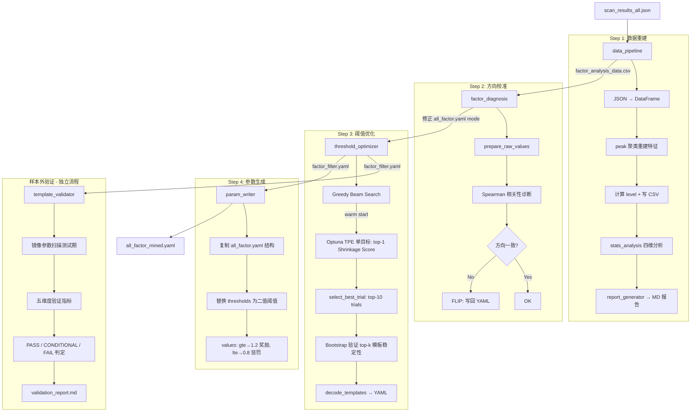

> 状态：已实现 (Implemented) | 最后更新：2026-03-13 (v4: SSOT 泄漏修复, 12 因子)

# 15. 数据挖掘模块 (mining)

## 定位

从扫描结果中挖掘因子的最优阈值组合，替代人工调参。
输入是 `scan_results_all.json`，输出是可直接用于生产评分的 `all_factor_mined.yaml`。

## 核心流程

## 关键设计决策

### 统一因子注册表 (factor_registry)

**Why**: 原系统在 4 个位置维护因子映射（`BONUS_COLS`, `BONUS_DISPLAY`, `FACTOR_CONFIG`, `FACTOR_MAP`），新增因子需改 4 处。`FactorInfo` dataclass 将所有元数据（key, name, cn_name, thresholds, values, is_discrete, has_nan_group, mining_mode）集中管理，派生函数按需生成各视图。当前注册 12 个因子。

### 二值化触发矩阵 + Bit-packed 评估

**Why**: 模板枚举的核心瓶颈是组合数爆炸。将 N 个因子的触发状态编码为 N-bit 整数 key（`triggered @ powers`），单次矩阵运算完成全样本分组，`fast_evaluate()` 在 ~1ms 内评估一套阈值下的所有模板。这使得数万次 Optuna trial 在合理时间内完成。

### James-Stein 收缩评估

**Why**: 小样本模板的 raw median 噪声大，高估实际效果。`fast_evaluate()` 对 top-k 模板的 median 做 James-Stein 收缩：`adjusted_i = w_i * median_i + (1 - w_i) * baseline_median`，其中 `w_i = count_i / (count_i + n0)`。样本越少，越向全局基线收缩，惩罚过拟合。当前配置：`shrinkage_n0=160`, `top_k=1`（单目标优化最优模板的收缩期望）。

### 两阶段搜索策略

**Why**:
- **Greedy Beam Search** 快速找到因子子集和粗略阈值范围（搜索空间为离散百分位），作为 warm start 种子
- **Optuna TPE** 在连续空间中精细搜索，支持 `tpe` 和 `multivariate_tpe`（多变量相关性建模）两种采样器

单独用 Optuna 从零搜索 11 维连续空间收敛太慢；单独用贪心容易陷入局部最优。

### 方向诊断基于 raw value 而非 level

**Why**: level 是阈值预设的产物，可能本身就是错的（如 Streak 本应 lte 却用了 gte 阈值）。直接对 raw value 做 Spearman 相关，得到的方向信号不受预设污染。部分因子（如 overshoot）通过 `mining_mode='lte'` 强制覆盖 Spearman 推断。

### Bootstrap 稳定性验证

**Why**: 高 median 可能来自小样本偶然。`select_best_trial()` 对 Optuna 前 10 名 trial，逐一对其 top-k 模板做 1000 次 bootstrap 重采样，计算每个模板的 95% CI 和 `stability = 1 - ci_width / median`，取 `min_stability` 作为最差模板稳定性。附加门槛：top-1 模板 count >= `min_viable_count`(30)。最终按 shrinkage_score 排序选最佳解。

### 参数文件方向编码 (param_writer)

**Why**: 统一使用 `>=` 评分模型后，mode 方向需编码为 values 的奖惩值。`gte` 因子达标是好事，`values=[1.2]`（奖励加分）；`lte` 因子达标是坏事，`values=[0.8]`（惩罚减分）。这样评分器只需统一用 `>=` 比较，方向信息隐含在 reward/penalty 数值中。

### SSOT 完整闭环：缺失因子自动合成

**Why**: `param_writer` 和 `factor_diagnosis` 在写回结果时，原来要求因子的 `yaml_key` 已存在于 `all_factor.yaml`，否则静默跳过。这是 SSOT 架构的泄漏点——新注册因子在 Step 1-3 能被自动发现和挖掘，但 Step 4 写回和 Step 2 方向校准会丢失。

**修复**: 当 `yaml_key` 不在内存中的 `qs` dict 时，从 `FACTOR_REGISTRY` 合成默认条目（`enabled`, `thresholds`, `values`, `sub_params`），然后走正常覆写逻辑。合成仅发生在内存副本中，保证挖掘流水线对新因子的完整覆盖。

### 五维度样本外验证 (template_validator)

**Why**: 训练集上的模板优化存在过拟合风险。`template_validator` 在独立测试期数据上验证模板泛化能力，五维度评估：
- **D1 基础统计**: per-template 的训练/测试 median、q25、q75 对比
- **D2 排序保持**: Spearman/Kendall 相关性，Top-K 模板保留率
- **D3 分布稳定**: KS 检验 + Bootstrap CI，训练 median 是否落入测试 CI
- **D4 全局有效性**: baseline shift、above-baseline ratio、template lift
- **D5 样本覆盖**: 模板在测试集的匹配覆盖率

三级判定: PASS / CONDITIONAL PASS / FAIL。当前 validator 从 `factor_filter.yaml` 读取优化结果（阈值+模板），不直接加载 Optuna PKL 检查点。

## 组件职责

| 文件 | 职责 | 可独立运行 |
|------|------|:---:|
| `factor_registry.py` | 12 因子元数据 + 派生视图函数 | - |
| `data_pipeline.py` | JSON → DataFrame，peak 聚类重建特征 | Yes |
| `factor_diagnosis.py` | Spearman 方向诊断 + 对数空间诊断 + YAML 修正（含缺失因子自动合成） | Yes |
| `threshold_optimizer.py` | Beam Search + Optuna TPE + Bootstrap 验证 | Yes |
| `template_generator.py` | 二值组合枚举 + YAML 输出工具 | Yes |
| `template_validator.py` | 五维度样本外验证 + 判定报告 | Yes |
| `param_writer.py` | 合并 all_factor + 优化阈值 → mined YAML（含缺失因子自动合成） | Yes |
| `stats_analysis.py` | 四维统计分析（单因子/组合/交互/树模型） | - |
| `report_generator.py` | 分析结果 → Markdown 报告 | - |
| `distribution_analysis.py` | 分布形态检测（U型/倒U型/单调） | Yes |
| `pipeline.py` | 管线编排 1→2→3→4 | Yes |

## IO 契约

| 输入 | 输出 | 用途 |
|------|------|------|
| `outputs/scan_results/scan_results_all.json` | `outputs/analysis/factor_analysis_data.csv` | 分析数据集 |
| `factor_analysis_data.csv` | `docs/statistics/raw_report.md` | 统计报告 |
| `factor_analysis_data.csv` + `all_factor.yaml` | `all_factor.yaml` (mode 修正) | 因子方向校准 |
| `factor_analysis_data.csv` + `all_factor.yaml` | `configs/params/factor_filter.yaml` | 组合模板 + 优化阈值 |
| `all_factor.yaml` + `factor_filter.yaml` | `configs/params/all_factor_mined.yaml` | 生产参数文件 |
| `factor_filter.yaml` + 测试期扫描数据 | `docs/statistics/validation_report.md` | 样本外验证报告 |

## 已知局限

1. **Label 单一**: 仅用 `label`（从 JSON metadata 动态推断，当前为 max_days 内最大收益），不支持多目标标签
2. **Validator 不读 PKL**: `template_validator` 从 `factor_filter.yaml` 间接获取 best_trial 结果，不支持直接加载 Optuna study PKL 进行验证
3. **DayStr 因子退化**: 当前数据中 DayStr 分布极度集中，触发率 100%，实际无区分度
4. **收缩参数经验值**: shrinkage_n0=160, shrinkage_k=1 基于实验调整，未做系统敏感性分析
