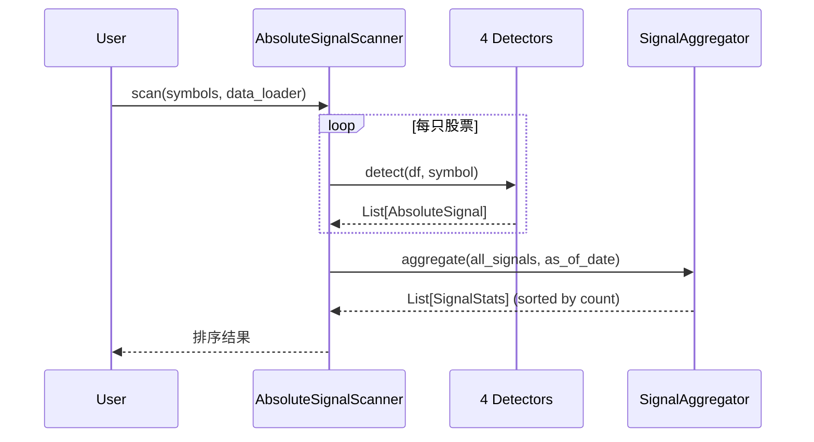
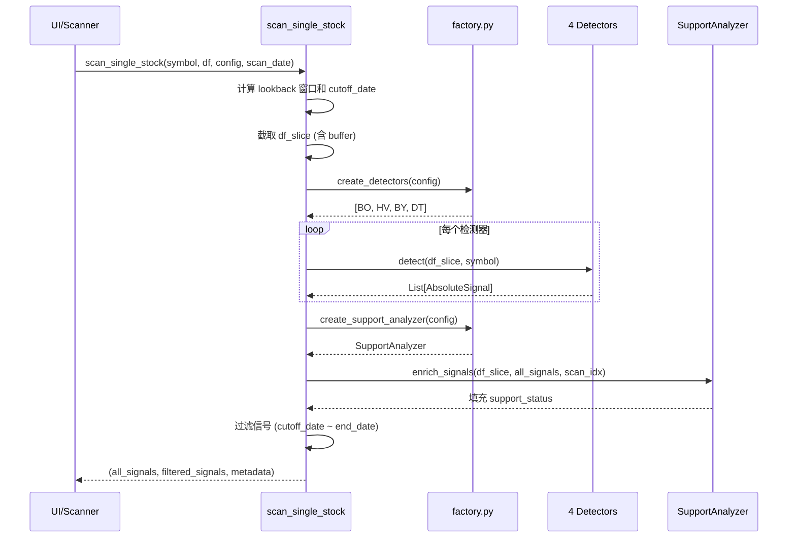

# 绝对信号系统 (Absolute Signals)

> 状态：已实现 (Implemented) | 最后更新：2026-02-04

## 概述

绝对信号是反映市场真实意图的实质性事件，不依赖人为定义的参数（如均线周期），代表大资金入场或重大事件驱动。

**核心价值**：通过检测多种信号类型并按数量排序，快速筛选出市场关注度高的股票。

## 核心架构

```mermaid
flowchart TD
    subgraph Detectors["检测器层"]
        BO[BreakoutSignalDetector]
        HV[HighVolumeDetector]
        BY[BigYangDetector]
        DT[DoubleTroughDetector]
    end

    subgraph Core["核心层"]
        BASE[SignalDetector 基类]
        MODELS[数据模型]
        FACTORY[factory.py<br/>检测器工厂]
    end

    subgraph Aggregation["聚合层"]
        AGG[SignalAggregator]
        SCANNER[AbsoluteSignalScanner]
        SINGLE[scan_single_stock<br/>公共 API]
    end

    subgraph Support["支撑分析"]
        SA[SupportAnalyzer]
    end

    BASE --> BO & HV & BY & DT
    MODELS --> BASE
    FACTORY --> BO & HV & BY & DT
    FACTORY --> SA
    BO & HV & BY & DT --> SINGLE
    SA --> SINGLE
    SINGLE --> SCANNER
    AGG --> SCANNER
    SCANNER --> |SignalStats[]| OUTPUT[按信号数量排序的结果]
```

## 信号类型

| 类型 | 代码 | 检测逻辑 |
|------|------|----------|
| 突破 | B | 收盘价突破前期凸点（Peak），复用 BreakoutDetector |
| 超大成交量 | V | 成交量 >= 3x MA20 或 126 日内最大 |
| 大阳线 | Y | 日内涨幅 >= N sigma（基于年化波动率） |
| 双底 | D | 126日最低点 + 有效反弹 + 更高次底确认 |

## 关键决策

### 1. 为什么使用抽象基类 + 独立检测器？

**决策**：每种信号类型对应一个独立检测器，共享 `SignalDetector` 基类。

**原因**：
- 检测器可独立开发、测试、启用/禁用
- 新增信号类型只需添加新检测器，无需修改现有代码
- 便于配置化控制（通过 YAML `enabled: true/false`）

### 2. 为什么双底 (D) 替代了 V 形反转 (VR)？

**决策**：用 `DoubleTroughDetector` 替代原来的 `VReversalDetector`。

**原因**：
- V 形反转 (VR) 仅检测 126 日最低点（纯价格定义），在持续下跌中频繁触发误报
- 双底 (D) 增加了**反弹约束**：TR1 之后必须有 ≥10% 的反弹才认为是有效底部
- 双底结构更清晰：TR1（绝对底）→ 反弹 → TR2（次底确认）

**双底检测核心参数**：
- `min_of`: TR1 回看窗口（默认 126 日）
- `first_bounce_height`: TR1→TR2 间最小反弹高度（默认 10%）
- `max_gap_days`: TR1 和 TR2 最大间隔天数（默认 60）
- `tr1_measure`: TR1 价格衡量方式 (low/close/body_bottom)
- `tr2_measure`: TR2 价格衡量方式 (low/close/body_bottom)
- `bounce_high_measure`: 区间最高价衡量方式 (close/high)，用于计算反弹幅度和 TR2 深度
- 信号日期 = TR2 确认日

### 3. 为什么大阳线使用波动率标准化？

**决策**：涨幅阈值 = sigma_threshold × 日波动率，而非固定百分比。

**原因**：
- 高波动股的 5% 涨幅是常态，低波动股的 5% 涨幅是异常
- 统一使用 sigma 阈值可跨股票比较

### 4. 检测器工厂模式

**决策**：使用 `factory.py` 统一创建检测器，并提供 `calculate_max_buffer_days` 计算缓冲区需求。

**原因**：
- 批量扫描和分析模式复用相同的检测器创建逻辑
- 动态计算各检测器的数据缓冲区需求，确保截取数据时不丢失历史信息

### 5. scan_single_stock 公共 API

**决策**：抽取 `scan_single_stock()` 作为公共 API，供批量扫描和 UI 分析模式复用。

**原因**：
- 确保单股实时计算与批量扫描使用完全相同的检测逻辑
- 统一的 lookback 窗口计算、信号过滤、支撑分析流程
- 返回 `(all_signals, filtered_signals, metadata)` 三元组，便于调试

### 6. 支撑分析集成

**决策**：通过 `SupportAnalyzer` 为 B/D 信号填充 `support_status` 字段。

**原因**：
- 突破信号 (B) 可能有后续的支撑测试（价格回踩 Peak 区域）
- 双底信号 (D) 可能有后续的支撑确认（价格回踩 TR1 区域）
- 支撑分析结果用于 UI 图表显示支撑 trough 标记

## 数据流



## 配置系统

### 配置文件位置

`configs/signals/absolute_signals.yaml`

### 配置结构

```yaml
breakout:
  enabled: true
  total_window: 60
  min_side_bars: 15
  min_relative_height: 0.2
  exceed_threshold: 0.01
  peak_supersede_threshold: 0.01
  peak_measure: "body_top"
  breakout_modes: ["close"]

high_volume:
  enabled: true
  lookback_days: 126
  volume_ma_period: 20
  volume_multiplier: 3.0

big_yang:
  enabled: true
  volatility_lookback: 252
  sigma_threshold: 2.0

double_trough:
  enabled: false  # 默认禁用
  min_of: 126
  first_bounce_height: 10.0
  max_gap_days: 60
  min_recovery_pct: 0.0
  tr1_measure: "low"
  tr2_measure: "low"
  bounce_high_measure: "close"  # 区间最高价衡量方式
  trough:
    window: 6
    min_side_bars: 2
  support_trough:
    window: 6
    min_side_bars: 1

support_analysis:
  enabled: true
  breakout_tolerance_pct: 5.0
  trough_tolerance_pct: 5.0
  max_lookforward_days: 90

aggregator:
  lookback_days: 42
```

## 已知局限

1. **性能**：批量扫描已实现多进程并行（ProcessPoolExecutor）
2. **双底检测精度**：部分股票可能触发除零警告（tr1_price = 0），已添加跳过逻辑
3. **信号权重**：当前所有信号等权（strength=1.0），未区分信号质量

## 文件结构

```
BreakoutStrategy/signals/
├── __init__.py           # 模块导出
├── models.py             # SignalType, AbsoluteSignal, SignalStats
├── aggregator.py         # SignalAggregator
├── scanner.py            # AbsoluteSignalScanner, scan_single_stock
├── factory.py            # 检测器工厂函数, calculate_max_buffer_days
├── detectors/
│   ├── __init__.py       # 检测器模块导出
│   ├── base.py           # SignalDetector 抽象基类
│   ├── volume.py         # HighVolumeDetector
│   ├── big_yang.py       # BigYangDetector
│   ├── trough.py         # Trough, TroughDetector (辅助类)
│   ├── double_trough.py  # DoubleTroughDetector (替代 VReversalDetector)
│   └── breakout.py       # BreakoutSignalDetector (适配器)
└── tests/                # 测试用例
    ├── test_base_detector.py
    ├── test_volume_detector.py
    ├── test_big_yang_detector.py
    ├── test_trough_detector.py
    ├── test_double_trough_detector.py
    ├── test_breakout_signal_detector.py
    ├── test_aggregator.py
    ├── test_scanner.py
    └── test_models.py
```

## 入口脚本

`scripts/signals/scan_signals.py`

## 数据流详解

### scan_single_stock 流程



### 信号 details 字段

| 信号类型 | details 字段 |
|---------|-------------|
| B (突破) | `peak_id`, `peak_date`, `peak_price`, `pk_num`, `support_status` |
| V (成交量) | `volume`, `avg_volume`, `multiplier` |
| Y (大阳线) | `change_pct`, `sigma`, `volatility` |
| D (双底) | `trough1_*`, `trough2_*`, `recovery_pct`, `bounce_pct`, `tr_num`, `support_troughs`, `support_status` |