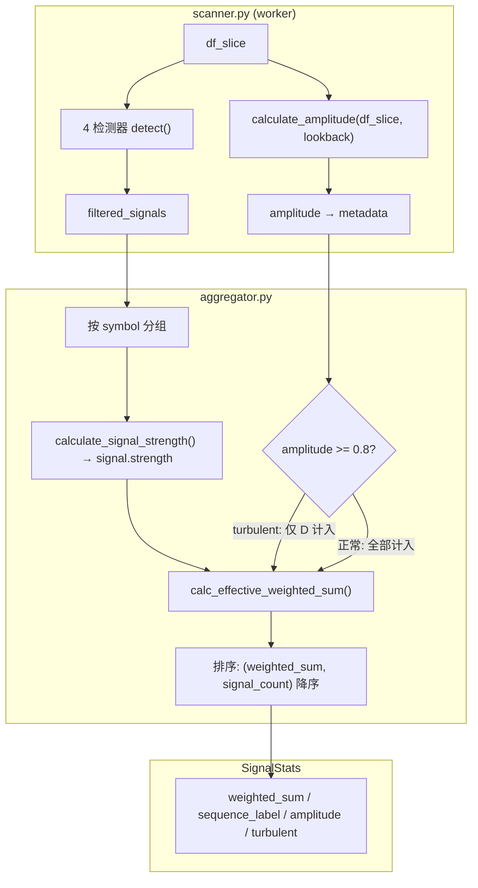

# 联合信号判断系统 (Composite Signal)

> 状态：已实现 (Implemented) | 最后更新：2026-02-06
> 前序设计：[v1 PLAN](16_联合信号判断系统_PLAN.md) / [v2 PLAN](17_联合信号判断系统_v2_PLAN.md)

## 一、概述

联合信号系统在原有的等权信号计数基础上，增加了两项能力：

1. **加权强度**：用信号内在属性（pk_num, tr_num）替代等权计数
2. **异常走势过滤**：检测 lookback 窗口内的极端价格振幅，对暴涨/暴跌股票降权

当前实现对应 v2 PLAN 的 **Layer 1 子集**（强度加权 + 超涨过滤），未实现 Layer 2（多维评分）和 Layer 3（分级输出）。

---

## 二、核心数据流



**关键路径**：amplitude 在 scanner worker 中计算（有 DataFrame），通过 `amplitude_by_symbol` 字典传递给 aggregator（无 DataFrame）。

---

## 三、已实现功能

### 3.1 加权信号强度

用信号已有的内在属性作为强度，不引入任何人为定义的权重参数：

| 信号 | 强度来源 | 公式 | 示例 |
|------|---------|------|------|
| B | `details["pk_num"]` | `strength = pk_num` | B(pk_num=3) → 3.0 |
| D | `details["tr_num"]` | `strength = tr_num` | D(tr_num=2) → 2.0 |
| V | — | `strength = 1.0` | 固定 |
| Y | — | `strength = 1.0` | 固定 |

**V/Y 暂不加权的理由**：V 有 `volume_ratio`，Y 有 `sigma`，但归一化需要选择"基准值"（如 volume_base=3.0），这是人为参数，留给后续 Level 2。

**退化兼容**：当 pk_num=1, tr_num=1 时所有信号 strength=1.0，`weighted_sum` = `signal_count`。

### 3.2 序列标签

按时间升序展示信号序列，形成可读的"技术故事线"：

```
D(2) → B(3) → V → Y
```

规则：B/D 内在属性 > 1 时显示括号，V/Y 直接显示字母。

### 3.3 异常走势检测（Turbulent Filter）

#### 问题

超涨股在顶部密集触发 B/V/Y，推高 weighted_sum。更隐蔽的是暴涨-暴跌完成型：lookback 窗口内完成了完整的拉升→派发→暴跌周期，scan_date 时价格已回到低位，但信号仍残留。

#### 设计决策

**股票级别判断，不审判信号**。信号是历史事实（"某天发生了突破"），不应被事后否定。我们评估的是股票的走势环境，不是信号的质量。

#### 检测指标

```
amplitude = (max(High) - min(Low)) / min(Low)     # lookback 窗口内
turbulent = amplitude >= 0.8
```

amplitude 的核心优势：一个指标同时覆盖"暴涨未跌"和"暴涨-暴跌完成"两种场景，因为窗口内始终包含那个极端高点。

#### 处理方式

turbulent 时，`weighted_sum` 仅计入 D 信号（B/V/Y 归零）。所有信号仍保留在列表和序列标签中，只是不参与排序计算。

**D 信号免疫**：D 要求 TR1 为 126 日最低点，信号本身意味着价格已深度回调。暴跌后的双底反转具有独立的买入价值。

---

## 四、关键设计决策

### D1: 股票级过滤 vs 信号级过滤

**决策**：股票级别（amplitude 检测在 scan_date 维度）

**理由**：
- 时序自洽：信号是时间点事件，超涨是过程性走势，用事后知识否定过去事实引入前瞻偏差
- 自愈性：股票回到合理位置后，amplitude 自然降低（但需要旧极端值滑出窗口）
- 架构干净：管道末端独立步骤，不侵入检测器

### D2: amplitude 而非 rally_ratio

**决策**：用 `(max_high - min_low) / min_low` 而非 scan_date 时刻的涨幅

**理由**：rally_ratio 只看当前价格 vs 窗口低点，暴涨-暴跌完成型的 rally_ratio 会很低（价格已回落），但 amplitude 仍然高（窗口内包含暴涨高点）。一个指标覆盖两种场景。

### D3: 阈值 0.8（80%）

42 个交易日内振幅 80% = 年化约 576%。正常强势突破（30%）远不触发，只有真正的极端行情才会达到。

### D4: V/Y 暂不加权

遵循 PRD "不依赖人为参数" 原则。pk_num/tr_num 是自然计数，无需基准值；volume_ratio/sigma 是连续值，归一化需人为选择 base。

---

## 五、数据模型

### SignalStats 扩展字段

```python
@dataclass
class SignalStats:
    # ... 原有 5 个字段不变 ...
    weighted_sum: float = 0.0      # 有效加权强度（turbulent 时仅 D 计入）
    sequence_label: str = ""       # 信号序列标签
    amplitude: float = 0.0         # lookback 窗口价格振幅
    turbulent: bool = False        # 是否异常走势
```

所有新字段均有默认值，完全向后兼容。

---

## 六、模块结构

```
BreakoutStrategy/signals/
├── composite.py          # 纯函数模块：强度计算、标签生成、amplitude 检测
├── aggregator.py         # 集成 composite，接收 amplitude_by_symbol
├── scanner.py            # worker 中计算 amplitude，scanner 收集并传递
├── models.py             # SignalStats 扩展 4 个字段
└── tests/
    └── test_composite.py # 27 个测试用例
```

**composite.py 是纯函数模块**：无状态、无配置依赖、无类定义。6 个公共函数：

| 函数 | 职责 |
|------|------|
| `calculate_signal_strength()` | B/D 内在属性 → strength |
| `generate_sequence_label()` | 信号列表 → 可读标签 |
| `calculate_amplitude()` | DataFrame → 价格振幅 |
| `is_turbulent()` | amplitude → bool |
| `calc_effective_weighted_sum()` | turbulent 时仅 D 计入 |

---

## 七、已知局限

1. **V/Y 强度未加权**：volume_ratio=9.0 和 volume_ratio=3.1 目前等权（都是 1.0）
2. **amplitude 阈值是硬编码常量**（`AMPLITUDE_THRESHOLD = 0.8`），未接入配置文件
3. **无时间衰减**：30 天前和 3 天前的信号等权
4. **无序列语义**：D→B 和 B→D 的不同含义未被量化
5. **turbulent 是二值判断**：amplitude=0.79 和 0.81 的处理差距很大

这些都是 v2 PLAN 中 Layer 2/3 要解决的问题，当前实现是有意识的最小版本。

---

## 八、与 v2 PLAN 的对应关系

| v2 PLAN 内容 | 当前状态 |
|-------------|---------|
| Layer 1 - 强度加权（pk_num/tr_num） | ✅ 已实现 |
| Layer 1 - 强度加权（volume_ratio/sigma） | ❌ 未实现（需引入 base 参数） |
| Layer 1 - 超涨检测 | ✅ 已实现（用 amplitude 替代了 PLAN 中的 rally_ratio） |
| Layer 2 - 五维评分 | ❌ 未实现 |
| Layer 3 - 分级输出 | ❌ 未实现 |
| 配置文件 | ❌ 未实现（当前无可配参数） |
| UI 集成 | ❌ 未实现 |

**实现偏离**：v2 PLAN 中的超涨检测使用信号级 `rally_ratio`（每个信号单独检查），实际实现改为股票级 `amplitude`（整只股票一次检测）。这是经过深入分析后的有意决策（见设计决策 D1/D2）。
