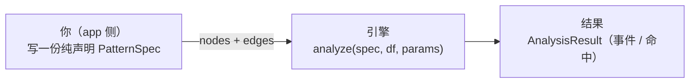
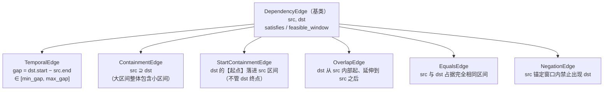

# path2 核心概念

> 这篇是 path2 的「心智模型导引」。读完你会对 path2 形成一套直觉：它把一个「走势」拆成哪些角色、用什么方式把这些角色拼起来、引擎又是怎么从一堆候选里找出一次完整命中的。
>
> 本篇讲**模型和直觉**，不堆完整的 API 字段清单（那是 api-reference 的活）。我们会从一个最小的例子起步，逐步加复杂度，把密集的参考表往后放。第一次接触 path2 也能顺着读下来。

---

## 先建立一个总览直觉

在钻进任何术语之前，先记住一句话：

> **path2 帮你「用声明的方式描述一种行情走势的形状」，然后在 K 线数据上把它找出来。**

打个比方。假设你想在 K 线图上找这样一种走势：「先有一段大幅下跌，然后在底部横盘，横盘里连续冒出好几个突破点，最后还回踩确认了一下」。

传统做法是写一大坨 `if/else` 去逐个 bar 扫描判断。path2 反过来——你只**描述**这个走势「长什么样」：有哪几个组成部分、它们之间有什么先后/包含/位置关系。剩下的「怎么在数据里把它捞出来」全交给引擎。

为了做到这一点，path2 把世界切成三个角色（下面第一节细讲），并用两种正交的方式表达约束（第二节细讲）。整条链路是：



你只负责左边那一格——**写声明**。中间的引擎和右边的结果，path2 都给你包好了。

一句话总结：**你描述形状，引擎负责匹配。**

---

## 目录

1. [三角色：Event / Detector / Pattern-as-DAG](#三角色)
2. [两层约束的正交：where vs 类型化边](#两层约束的正交)
3. [嵌套事件：把「一串同类事件」表达成一个整体](#嵌套事件--burstevent)
4. [Kleene 节点：框架另有的一条「一串」路径（当前 app 未用）](#kleene-节点)
5. [匹配语义：引擎到底怎么找出一次命中](#匹配语义)
6. [结果契约：拿到命中后能读到什么](#结果契约)
7. [面板投影：to_topology](#面板投影)
8. [参考：一个真实的完整声明](#参考完整声明例)

---

## 三角色

path2 里任何一个走势，都是由三个角色拼出来的，分工严格不重叠。先一句话各自点明它们是什么：

- **Event（事件）**——「数据上一段有意义的现象」。比如一次突破、一段趋势、一次回踩。它是**事实**。
- **Detector（探测器）**——「负责从原始数据里把这些事实找出来的工人」。它是**事实的生产者**。
- **Pattern-as-DAG（模式即图）**——「把多个事实按某种结构关系拼成一个完整走势的蓝图」。它是**形状的声明**。

可以这样类比：Event 是「积木块」，Detector 是「生产积木块的工厂」，Pattern-as-DAG 是「用积木拼成的图纸」。下面逐个展开。

### Event —— 数据上一段有意义的现象

`Event` 是所有具体事件类的冻结（frozen）dataclass 基类。每个实例代表行情序列上一段有意义的现象，由三个核心字段定位它在数据里的位置：

```python
@dataclass(frozen=True)
class Event(ABC):
    event_id: str   # 同一次 run() 内唯一
    start_idx: int  # 在 df 中的起始 bar（含）
    end_idx: int    # 在 df 中的结束 bar（含），>= start_idx
```

注意 Event 本质上就是「一个带起止位置的时间区间」。一次突破、一段趋势，都被抽象成「从第 start_idx 根 bar 到第 end_idx 根 bar 的一段」。

各种具体事件类型按业务往子类里加属性（比如突破事件会带 `drought`、成交量比 `vol_ratio` 之类），但**不改变基类「我是一段区间」这个语义**。

**每个具体事件子类必须声明一个类变量 `class_id`**——它是这种事件的「类型身份」，一个非空、全局唯一的字符串（比如突破事件是 `"bo"`、趋势段是 `"trend"`）。它有两个用处：一是给同一次 run 里产出的事件起 `event_id` 前缀，二是面板拿它给不同类型的事件上不同颜色。

```python
@dataclass(frozen=True)
class BOEvent(Event):
    class_id = "bo"      # 类变量：非空、全局唯一
    drought: Optional[int] = None
    ...
```

> 💡 为什么要「全局唯一」？path2 内部有一张 `class_id` 注册表，子类一定义就登记；如果两个事件类撞了同一个 `class_id`、或忘了声明（留空），在类定义那一刻就直接抛错——绝不会让两种事件悄悄共用一个身份。

### 嵌套事件 —— 一个事件内部还能装更小的事件

先说它解决什么问题：有时候「一段现象」其实是由**一串更小的同类事件**组成的。比如「底部连续冒出好几个突破点」——这「一串突破」本身就是一个有意义的整体，你希望能像引用一个普通宽事件那样去引用它、给它整体加条件、把它画在图上。

为此 `Event` 基类提供了一套**通用嵌套协议**：一个事件可以在内部「装」着它的子事件。叶子事件（如单个突破 `BOEvent`）这套方法默认全返回空，行为和以前完全一样；而**复合事件**（composite，如下面会讲的 `BurstEvent`）则覆盖它们、把内部成员暴露出来：

```python
class Event(ABC):
    def child_slots(self) -> Mapping[str, ...]: ...   # 构成本事件的主要子事件集（遍历/展平用），叶子返回 {}
    def child(self, name: str) -> Event: ...          # 按名字取单个子事件，如 'first_bo' / 'last_bo'
    def children(self, name: str) -> Tuple[Event, ...]: ...  # 按名字取一组子事件，如 'members'
    @property
    def descendant_leaves(self) -> Tuple[Event, ...]: ...  # 递归展平到底层不含子事件的 atom
```

`child(name)` / `children(name)` 这两个「按名字取」的方法，主要是给后面 [类型化边](#两层约束的正交) 的端点 selector 用的（让一条边能连到父事件的某个子事件，而不是父事件整体）。下面的 [嵌套事件 / BurstEvent](#嵌套事件--burstevent) 小节会用一个真实例子把它讲透。

> 💡 小贴士：构造一个非法 Event（比如 `start_idx > end_idx`、字段是 NaN、`start_idx` 是 bool）时，`Event.__post_init__` 在开启 `RUNTIME_CHECKS` 时会直接抛错。这是一道「坏数据进不来」的护栏。

### Detector —— 生产事件的工人

`Detector` 是一个 Protocol（鸭子类型协议）。**你不需要继承任何基类**，只要你的对象有一个 `detect` 方法，它就是一个合法的 Detector：

```python
class Detector(Protocol):
    def detect(self, source: Any) -> Iterator[Event]: ...
```

Detector 分两种，区别在于「它吃什么进去」：

- **根节点 detector**（`consumes_stream=None`）：直接消费原始 K 线 DataFrame。引擎调用形式是 `detect(df)`。
- **消费者节点 detector**（`consumes_stream` 指向上游某个节点的 id）：消费「上游事件流 + df」。引擎调用形式是 `detect(上游流, df)`。

举几个直观的例子，看看 `consumes_stream` 怎么把 detector 串成一条**数据流水线**：

- 突破点 `bo`、下跌段 `down`、横盘段 `side` 都是**根 detector**，直接扫原始 df。
- 突破爆发 `burst` 是**消费者**：它 `consumes_stream="bo"`，吃 `bo` 流，把密集的突破点切成串、聚合成 `BurstEvent`（详见后面的嵌套事件小节）。
- 回踩 `tb` 也是**消费者**：它同样 `consumes_stream="bo"` 吃突破事件流——你得先有突破点，才能判断它后面有没有回踩。

可以看到，`burst` 和 `tb` 都消费同一条 `bo` 流。引擎为此做了去重：同一个 detector 对象在同一条上游流上只会被真正物化一次，不会重复扫。这样 detector 之间就形成了「谁产、谁吃」的流水线，而不必每个 detector 都从原始 df 从零扫一遍。

引擎推荐用 `run(detector, *source)` 来驱动 detector，而不是直接调 `detect`。`run` 在流式 yield 事件的同时，顺带帮你做跨事件的健全性检查（开启 `RUNTIME_CHECKS` 时）：

- yield 出来的必须是 `Event`，否则抛 `TypeError`；
- `end_idx` 必须升序，否则抛 `ValueError`；
- `event_id` 在本次 run 内必须唯一，否则抛 `ValueError`。

> 💡 小贴士：作为 app 作者，你**几乎不会手写 `run(...)`**。你只是在声明里把 detector 实例交给节点，引擎会在内部按依赖顺序帮你跑。后面 [匹配语义](#匹配语义) 会看到引擎是怎么编排的。

### Pattern-as-DAG —— 描述走势形状的图纸

这是三角色里最关键、也最需要换脑子的一个。

先说它**解决什么问题**：你有了一堆 Event（积木），怎么表达「这些积木要按某种结构拼在一起，才算我要找的走势」？比如「下跌段**之后**出现突破串」「突破串**落在**横盘段**内部**」「突破串**之后紧接**回踩」。

path2 的回答是：**别用代码逻辑去拼，而是画一张图。**

这张图是一张**类型级有向无环图（DAG）**：

- 图的**节点**，是走势里的一个个**角色**（用 `NodeSpec` 描述）——「下跌段」「横盘段」「突破串」「回踩」各是一个节点。
- 图的**有向边**，是角色之间的**结构关系**（用 `DependencyEdge` 的子类描述）——「下跌段 → 突破串」表达一种时序依赖。

> 💡 为什么叫「类型级」？因为这张图描述的是**角色之间的关系**（「下跌段这种东西」和「突破串这种东西」怎么搭），而不是某根具体 bar、某个具体实例。它是模板，不是某次具体匹配的结果。

整张图打包进一个 `PatternSpec` 交给引擎。你（app 侧）的全部工作就是**纯声明**，不写任何匹配逻辑：

```python
PatternSpec(
    pattern_id="...",
    display_name="...",
    nodes=(...),   # Tuple[NodeSpec, ...]
    edges=(...),   # Tuple[DependencyEdge, ...]
    root="burst",  # 退化字段：引擎匹配并不读它，只要求是一个合法的已声明 node_id
)
```

> 💡 `root` 是个**退化字段**：早期它曾是结构性的「图的根」，现在引擎求解完全不依赖它，只在校验时要求它是一个已声明的 node_id。填任意一个合法节点名即可。

`PatternSpec.__post_init__` 会在你一构造它的瞬间就做三类校验，把错误挡在声明阶段、不让它拖到运行时才暴露：

1. **DAG 合法性**：边的两个端点必须都是已声明的节点；`root` 必须是已声明节点；整张图不能有环（用 Kahn 拓扑削平检测）。
2. **Kleene 参数合法性**：基数范围（`min_count >= 1`、`min_count <= max_count`）、`span_from_first` 合法（`lo >= 0` 且 `lo <= hi`）、`endpoint_for_edges` 必须是 `"first"` 或 `"last"`。（Kleene 是框架支持的特性，但当前示例 app 已不用它——详见后文 [Kleene 节点](#kleene-节点) 小节。）
3. **detector 依赖图合法性**：任何 `consumes_stream` 引用都必须指向一个已声明的节点。

任何一条违规都立刻抛 `ValueError`。

> ⚠️ 常见坑：边里写了一个拼错的 node_id、或者忘了把某个被 `consumes_stream` 引用的节点声明进去——这些不会等到跑数据时才报错，而是在你构造 `PatternSpec` 的那一行就抛 `ValueError`。看到这种错先回头检查 node_id 拼写。

你现在应该理解了：**走势 = 一张「角色节点 + 关系边」的 DAG，打包成 PatternSpec。** 那「角色自己的条件」和「角色之间的关系」具体怎么写？这正是下一节的「两层约束」。

---

## 两层约束的正交

这一节是 path2 设计的脊梁，值得慢慢读。

先抛出问题：描述一个走势，约束其实分两种性质完全不同的——

1. **关于「某一个角色自己」的条件**：比如「这段下跌的跌幅要够大」「这段是横盘而不是上涨」。这只看**一个角色自身的属性**。
2. **关于「两个角色之间」的关系**：比如「下跌段结束后 1~120 根 bar 内要出现突破」「突破串要落在横盘段内部」。这看的是**两个角色的相对位置**。

path2 把这两种约束交给两个**完全正交、互不重叠**的层来承载：

| 层 | 管什么 | 看哪些数据 | 写在哪 |
|----|---------|---------|---------|
| **where 谓词**（一元，管单个角色自己） | 单个节点自身的属性 | 只读这一个实例（或整串）自己的字段 | `NodeSpec.where` 或 `KleeneSpec.aggregate_where` |
| **类型化边**（二元，管两个角色之间） | 两个节点之间的区间关系 | 读一对实例的 `start_idx` / `end_idx` | `PatternSpec.edges` |

记住这条铁律：**where 从不碰节点间关系，类型化边从不碰节点内属性。** 两层之间没有重叠、也没有依赖——你想加一个「自身条件」就去动 where，想加一个「相对关系」就去动边，永远不会纠结该写哪。

### where 谓词 —— 给单个角色加条件

`where` 是挂在 `NodeSpec` 上的一元过滤器。它的格式是一串 `((clause_id, fn), ...)`，多条之间是 **AND 合取**（全部满足才通过）。`clause_id` 是给这条子句起的名字，方便诊断时看是哪条没过。

谓词函数的签名（`WherePredicate`）长这样：

```python
WherePredicate = Callable[[Union[Event, Tuple[Event, ...]], MatchContext], bool]
```

第一个参数「吃什么」取决于节点类型：

- 普通节点：第一参数是单个 `Event`；
- Kleene 节点（下一节讲）：第一参数是 `Tuple[Event, ...]`（整串）。

第二个参数 `MatchContext` 是求值环境，它携带：

```python
@dataclass(frozen=True)
class MatchContext:
    df: object       # 原始 K 线，供谓词回看数据
    params: object   # 运行时参数，供谓词读取阈值
    bound: object = None
```

你很少需要从零手写 `WherePredicate`。`path2.dag.where` 模块（习惯导入为 `W`）提供了一组**工厂函数**，覆盖业务常用的所有一元约束，调用它们就能拿到现成的谓词：

```python
from path2.dag import where as W

# 【单实例】断言 e.drought >= 60
W.attr("drought", ">=", 60)

# 【Kleene 串首】断言 seq[0].drought >= 60
W.first("drought", ">=", 60)

# 【Kleene 串尾】断言 seq[-1].vol_ratio >= 2.0
W.last("vol_ratio", ">=", 2.0)

# 【Kleene 串长/基数】断言 len(seq) >= 3
W.count(">=", 3)

# 【存在量化】串中至少一个成员满足 e.vol_ratio >= 3.0
W.any("vol_ratio", ">=", 3.0)

# 【跨序列 distinct 计数】去重后 distinct 数 >= 3
# 若属性值本身是 tuple/list/set，会自动 flatten 再去重（适合 broken_peak_ids 这种字段）
W.distinct("broken_peak_ids", ">=", 3)

# 【归约聚合】fn([e.name for e in seq]) op thr，这里取整串 vol_ratio 的最大值 >= 5.0
W.reduce("vol_ratio", max, ">=", 5.0)

# 【AND 合取组合】把多条谓词拼成一条（可在 aggregate_where 单个槽位里内联多条）
W.all(W.count(">=", 3), W.any("vol_ratio", ">=", 3.0))
```

> 💡 小贴士：所有这些工厂函数在「属性值是 `None`」时都**安全返回 `False`**，而不是抛 `TypeError`。也就是说 `None op 阈值` 被当成「不满足」，跟「先判 `x is not None` 再比较」的短路语义一致。所以面对 Optional 字段（如 `BOEvent.drought`）你不用自己加判空。

> ⚠️ 常见坑（硬约束）：`where` 谓词**只能读当前节点自己的属性或 `ctx.params`，严禁去读 `ctx.bound`（那是别的节点的绑定）**。一元约束就该只看自己。引擎在剪枝阶段会把 `bound` 换成一个哨兵 `_TRIPWIRE`，一旦你的谓词偷偷去读它，立刻抛 `RuntimeError`——宁可炸响，也绝不让一个偷读跨节点数据的谓词静默返回错误结果。跨节点的关系请走「类型化边」。

### 类型化边 —— 描述两个角色之间的关系

DAG 的每条边都是一个 `DependencyEdge` **子类**的实例。一条边同时承担两个正交的职责：

- **结构职责**（来自基类 `DependencyEdge`）：`src→dst` 这个方向定义了拓扑序（引擎先绑 src，再据 src 收窄 dst 的候选），也定义了面板上箭头的方向。基类本身**不判定任何关系真假**。
- **语义职责**（由子类实现）：`satisfies(e_src, e_dst) -> bool`，判定一对已绑候选到底满不满足这条边的关系。

基类还提供两个引擎用来加速的钩子（你做声明时一般不用关心，但理解它们有助于知道引擎为什么快）：

- `feasible_window(e_src) -> (lo, hi)`：给定已绑的 src，返回 dst 的 `start_idx` 的可行区间。引擎用它把「扫描整个后缀」收窄成「只看一个区间」，从而剪枝。默认 `(-inf, +inf)`，即不剪枝。
- `signature_fields() -> tuple[str, ...]`：声明本边实际依赖 src 的哪些字段。引擎用它构造「前沿割签名」。默认空。

> 💡 引擎只通过基类的这套多态接口消费所有边（`satisfies` / `feasible_window` / `signature_fields`），对具体边类型**零分支判断**。这意味着：想加一种新的关系类型，你只要写一个新的 `DependencyEdge` 子类，核心引擎一行都不用改。

目前内置了六种边。先看它们的全景，再逐个细看：



**TemporalEdge —— 时序关系（最常用）。** 表达「dst 在 src 之后、相隔多少根 bar」：

```python
# 下跌段结束后 1~120 根 bar 内，出现突破爆发
TemporalEdge("down", "burst", min_gap=1, max_gap=120)

# 突破爆发结束后恰好 1 根 bar 出现回踩（gap 锁死在 [1,1]）
TemporalEdge("burst", "tb", min_gap=1, max_gap=1)
```

判据是 `gap = dst.start_idx - src.end_idx`，要求 `min_gap <= gap <= max_gap`。

`TemporalEdge` 还有一个 keyword-only 的参数 `strict`（默认 `False`）：`strict=True` 表示 **next 语义**——src 与 dst 之间的窗口里，不能有更早的同类 dst 候选（即「紧接着的下一个」，而非「之后任意一个」）。

> ⚠️ 注意 `strict` 是 keyword-only 的：必须写成 `strict=True`，不能当位置参数塞在 `min_gap`/`max_gap` 后面，否则会和它们错位。

**ContainmentEdge —— 包含关系。** 规范方向是「大区间 → 小区间」，表达「dst **整体**落在 src 内部」：

```python
# 小事件整体落在大事件内部
ContainmentEdge("outer", "inner")
# satisfies: src.start <= dst.start AND dst.end <= src.end（端点重合也算包含）
```

**StartContainmentEdge —— 只管「起点落进来」的包含。** 它和 `ContainmentEdge` 是「同与不同」：两者都管包含，区别只在**管不管 dst 的终点**——`ContainmentEdge` 要求 dst 整体被包住（连 `dst.end <= src.end` 都要），而 `StartContainmentEdge` 只要 dst 的**起点**落进 src 区间，dst 的终点延伸到哪儿都不管：

```python
# 只要求 burst 的起点落在横盘段内，不管 burst 延伸多远
StartContainmentEdge("side", "burst")
# satisfies: src.start <= dst.start <= src.end（只约束 dst.start）
```

为什么需要它？后面会讲到 `burst` 是个**宽事件**（从串首突破延伸到串尾突破）。我们想表达的是「这串突破**起在**横盘段里」，至于它后面突破得多猛、延伸出横盘段都没关系。如果用 `ContainmentEdge`，就会额外强求整串都被横盘段包住，那就把条件改严了。`StartContainmentEdge` 精确表达了「起点落进来就行」这个意思。

**OverlapEdge —— 部分交叠。** 表达「dst 从 src 内部某处开始，一直延伸到 src 结束之后」（严格不等号，端点重合不算满足）：

```python
OverlapEdge("trend_a", "trend_b")
# satisfies: trend_a.start < trend_b.start < trend_a.end < trend_b.end
```

**EqualsEdge —— 同段。** 表达「两个角色占据完全相同的时间区间」：

```python
EqualsEdge("event_a", "event_b")
# satisfies: a.start == b.start AND a.end == b.end
```

**NegationEdge —— 否定约束（「这里不准出现某种东西」）。** 它和前四种最大的不同是：dst **不会进入** `role_index` / `children`，它不是结构成员，只是一个「全称量词约束」。

```python
# src 结束后 0~10 根 bar 内，禁止出现 dst 类型的事件
NegationEdge("anchor", "forbidden", min_gap=0, max_gap=10)

# 再附加一个内部谓词：只有满足该谓词的 dst 才算「违禁」
NegationEdge("anchor", "forbidden", inner_predicate=lambda e: e.vol_ratio > 5.0)
```

> ⚠️ 关键且反直觉：`NegationEdge.satisfies` 的语义是**反转**的——它返回 `True` 表示「这个 dst 实例构成了违禁」。引擎用全称量词来消费它：**窗口内不存在任何违禁实例时，这条边才算满足**。换句话说，`satisfies==True` 在这里是坏消息，不是好消息。

> 💡 进阶：边的端点除了写节点名字符串，还能用 `Child(node_id, name)` 取**父事件的某个子事件**来参与关系判定，比如 `Child("burst", "first_bo")` 表示「拿 burst 里的串首突破」。这是嵌套事件让边能连到「子事件」而非整体的机制（边在构造时会把 `Child` 归一化）。当前示例 app 暂未用到，了解一下即可。

一句话总结这一节：**「角色自己的条件」用 where，「角色之间的关系」用边；六种边覆盖时序、包含、起点包含、交叠、同段、否定六类关系。**

---

## 嵌套事件 / BurstEvent

前面所有节点都默认「一个节点绑一个事件实例」。但有些走势天生是「连续一串同类事件」——比如「底部连续冒出**好几个**突破点」。这串突破有几个、跨度多大、放没放量，本身就是约束的一部分；而且整串应该作为**一个整体**去和外层的下跌段、横盘段发生关系。

path2 当前推荐的表达方式是**嵌套事件**：把「一串突破」打包成一个一等公民的复合事件 `BurstEvent`，让它像普通宽事件一样被引用、被加条件、被画在图上。

### 先说它解决什么问题

以前要表达「一串 bo」，框架里**没有一个实体代表这整串**——你只有散落的一个个突破点，没法一把抓住「这一串」去给它整体加条件、去用一条边连它。嵌套事件就是给这「一串」一个实体。

### BurstEvent —— 一串突破聚合成的一个宽事件

`BurstEvent` 是一个继承自 `Event` 的复合事件。它的关键之处：

- 它有自己的区间：`start_idx` = 串首突破的起点，`end_idx` = 串尾突破的终点。所以它是个**宽事件**（跨越整串）。
- 它内部用 `members` 字段装着组成它的那些突破——存的是**完整的 `BOEvent` 对象**（不是 id）。
- 它在 detect 期就把几个**聚合标量**算好、存成普通字段：`count`（串里几个）、`distinct_pk`（涉及多少个不同的峰）、`max_vol_ratio`（最大放量倍数）、`first_drought`（串首的干涸天数）。这样 where 用 `W.attr("count")` 直接读字段就行，不必每次去遍历 `members`。

```python
@dataclass(frozen=True)
class BurstEvent(Event):
    class_id = "burst"
    count: int = 0            # 串里几个 bo
    distinct_pk: int = 0      # 涉及多少个不同的峰
    max_vol_ratio: float = 0.0
    first_drought: int = 0
    members: Tuple[BOEvent, ...] = ()   # 成员突破（完整对象）

    def child_slots(self):  return {"members": self.members}
    def children(self, name):                          # children('members') 取整串
        if name == "members": return self.members
        raise KeyError(name)
    def child(self, name):                             # child('first_bo'/'last_bo') 取单个端点
        if name == "first_bo": return self.members[0]
        if name == "last_bo":  return self.members[-1]
        raise KeyError(name)
```

这正是前面 [Event 嵌套协议](#三角色) 的真实落地：`BurstEvent` 覆盖了 `child_slots` / `child` / `children`，把内部成员暴露出来。收益是「一串」终于能像普通宽事件一样：被**一个 where 整体检查**（`W.attr("count", ">=", 3)`）、被**一条边连**（如 `StartContainmentEdge("side", "burst")`）、被**画在图上**。

### BurstDetector —— 把 bo 流切串聚合成 BurstEvent 的生产者

那 `BurstEvent` 从哪来？由一个专门的消费者 detector `BurstDetector` 生产。它的职责很清晰：

- **它是消费者**（`consumes_stream="bo"`）：吃上游的 `bo` 流，不自己去 new 一个 `BODetector`（遵守「detector 之间互相独立」的原则）。
- **它只负责切串 + 算预算标量**：把密集的突破点切成一段段「极大段」，每段打包成一个 `BurstEvent`，并顺手算好 `count` / `distinct_pk` / `max_vol_ratio` / `first_drought`。
- **真正的阈值过滤交给 where**：detector 不管「干涸要 >= 多少」这类阈值；那些是 `burst` 节点的 where 去读预算字段判断的。

切串口径是这样的：把 bo 按起点排好序，单向扫一遍；每个还没被吃掉的 bo 作为段首，把「起点距段首不超过 `max_span` 根 bar」的后续 bo 都吸进这一段；贪心取极大段、不回头；最后只有「段长 >= `min_bos`」的段才产出成 `BurstEvent`。

参数分两路，别混：

- `max_span` / `min_bos`：**切串参数**，走 `BurstDetector` 的构造函数。
- 各种阈值（干涸、峰数、放量）：走 `burst` 节点的 **where**，不传给 detector。

> 💡 这套切串逻辑和框架里 Kleene 求解器的切串（下一节）**完全对等**——只是把「成簇」这件事从求解期前移到了 detect 期。所以你会看到，同样一串突破，无论用嵌套事件还是用 Kleene，切出来的串是一样的。

---

## Kleene 节点

> 这一节讲的是**框架另有的一条路**：用一个会重复的「Kleene 节点」来表达「一串同类事件」。它和上一节的嵌套事件解决的是同一类问题，但走的是不同机制。**注意：当前唯一的示例 app `bottom_burst` 已经不用 Kleene 了**——它改用了上一节的嵌套事件 `BurstEvent`。Kleene 作为框架特性仍然完整保留、随时可用，下面的讲解（及其中的 bo 串例子）仅作 Kleene 机制示意。

**Kleene 节点**的思路是：一个节点绑**一整串连续的同类事件**，整段作为单个绑定单元参与外层 DAG 匹配。

> 💡 名字来源：Kleene 是正则里「闭包/重复」的那个 Kleene。你可以把它理解成「这个角色不是出现一次，而是连续出现若干次」。

机制上：当 `NodeSpec.kleene` 不为 `None` 时，这个节点在结果的 `role_index` 里的值，就从「单个 `Event`」**升级成** `Tuple[Event, ...]`（一整串）。

怎么定义「什么样的连续子序列才算一个合法的 Kleene 绑定」？由 `KleeneSpec` 的各参数共同描述：

```python
KleeneSpec(
    min_count=3,                        # 串至少 3 个事件（基数下界）
    span_from_first=(0, 20),            # 每个成员距【段首】的跨度 ≤ 20 根 bar（成簇约束）
    endpoint_for_edges="last",          # 外层边连本节点时，取串尾参与 satisfies
    aggregate_where=(                   # 对【整串】的聚合约束
        ("distinct_pk", W.distinct("broken_peak_ids", ">=", 3)),
        ("vol_spike",   W.any("vol_ratio", ">=", 3.0)),
    ),
    greedy=True,                        # 贪心取极大段（默认）
)
```

`KleeneSpec` 的字段及默认值（先扫一眼，下面会逐个讲）：

```python
@dataclass(frozen=True)
class KleeneSpec:
    min_count: int = 1
    max_count: float = math.inf
    span_from_first: Optional[Tuple[int, float]] = None
    aggregate_where: Tuple[Tuple[str, Callable], ...] = ()
    endpoint_for_edges: str = "first"
    greedy: bool = True
```

下面挑几个最需要建立直觉的参数细讲。

### 「整段作为一个绑定单元」是什么意思

引擎从事件流里提取出一段满足约束的连续子序列，把**整段**当作单个绑定单元。这带来两个直接后果：

- 串内成员之间的时序、间距，由 `span_from_first` 统一约束，**而不是逐对去检查相邻成员**。
- 外层 DAG 看到的是「一个 Kleene 节点」这一个整体，**而不是散落的多个节点**。所以「下跌段 → 突破串」这条边，连的是「整串」，不是串里某一个突破。

### span_from_first —— 让这串事件「成簇」

`span_from_first=(lo, hi)` 要求串里**每个**成员 `e` 满足：

```
e.start_idx - seq[0].start_idx ∈ [lo, hi]
```

注意基准是**段首**（`seq[0]`），不是相邻的前一个成员。直觉上它表达的是「这一串别拖得太散，都得挤在距第一个成员 hi 根 bar 以内」——也就是「成簇」。默认 `None` 表示不限跨度。

### aggregate_where —— 对整串下判断

`aggregate_where` 是对**整串**做聚合判断的 where 谓词列表（每条同样是 `(clause_id, fn)`）。常见用法：

```python
# 串长至少 3
("min_len", W.count(">=", 3))

# 串中至少一个成员成交量放量
("vol_spike", W.any("vol_ratio", ">=", 3.0))

# 整串涉及的 distinct 峰值数 >= 3
("distinct_pk", W.distinct("broken_peak_ids", ">=", 3))
```

它和 `NodeSpec.where` 的区别是初学者最容易混的一点，记住这个对照：

- `NodeSpec.where`：对**每个候选实例**独立过滤——决定「哪些事件够格进入这串」。
- `KleeneSpec.aggregate_where`：对**已经提取出来的整串**做聚合判断——决定「这一整串作为一个整体合不合格」。

前者是入场筛选，后者是整体验收。

### endpoint_for_edges —— 整串和外层边相连时，用首还是用尾

外层的类型化边要和一个 Kleene 节点发生关系时，得有一个**确定的端点**参与 `satisfies` 计算（毕竟一串有头有尾，得说清用哪一端）。`endpoint_for_edges` 就是定这个的：

- `"first"`（默认）：取**串首**。适合「串首落在某区间内」（如 `ContainmentEdge`），或「某段在串首之前」（如指向本节点的 `TemporalEdge` 入边）。
- `"last"`：取**串尾**。适合「串尾之后紧接某事件」（如从本节点出发的 `TemporalEdge` 出边 `bo → tb`）。

```python
# bo 节点（Kleene）设 endpoint_for_edges="last"，配合出边：
# TemporalEdge("bo", "tb", min_gap=1, max_gap=1)
# 语义就变成：tb.start = bo串尾.end + 1（回踩紧跟在串的最后一个突破之后）
KleeneSpec(
    ...,
    endpoint_for_edges="last",
)
```

### ⚠️ 当前引擎支持的 Kleene 形状

`KleeneSpec` 的字段在数据结构上允许各种组合，但**当前引擎只完整支持** `greedy=True`（贪心极大段）且 `max_count=math.inf`（无上限）这一种形状。其他形状（有限上界 `max_count`、或 `greedy=False`）当前引擎尚未支持，遇到时会直接报错而**绝不静默给出错误结果**。换句话说，现阶段写 Kleene 就按「贪心、无上限」来用。

一句话总结：**Kleene 节点 = 一个角色绑一整串同类事件；`min_count` 管至少几个，`span_from_first` 管别散开，`aggregate_where` 管整串验收，`endpoint_for_edges` 管它跟外层边用头还是用尾相连。**

---

## 两个补充机制

迁移到嵌套事件后，当前 app 还用到两个小而关键的机制，单独点一下。

### 孤立 role：让 bo 只当「密度流源层」、不污染形态匹配

在当前 app 里，突破点 `bo` 节点**在图里没有任何边连它**（既不当 src 也不当 dst）——这种节点叫**孤立 role**。它为什么还在图里？因为它要给 `burst` 和 `tb` 当输入流（两者都 `consumes_stream="bo"`），同时也方便面板把所有突破点都画在 K 线上（一个「密度流源层」）。

但孤立 role 会带来一个麻烦：它没有任何边约束，每个突破点候选都能自成一解，于是会产出一大堆「只含 bo 这一个角色、根本没凑成完整形态」的**残缺命中**（语义垃圾）。

`analyze` 在出口处自动收拾这个问题：它从 `spec.edges` 推出哪些节点是「孤立无边 role」（把所有 node_id 减去所有边的端点），然后丢弃那些「绑定里只含孤立 role」的命中。判据完全从声明的边推出、不需要任何额外标记。结果：`bo` 既能作密度流源层被独立扫描/渲染，又给 `burst`/`tb` 当输入，但它本身不进任何完整形态匹配。

### source_tag：同一类 detector 有多个实例时，给 event_id 消歧

当前 app 里，下跌段 `down` 和横盘段 `side` 各自持有一个**独立的** `TrendSegmentDetector` 实例。问题来了：两个实例产出的都是 `class_id="trend"` 的事件，如果 `event_id` 前缀都用 `"trend"`，两边就会撞 id。

`source_tag` 就是为此而设的：它是 detector 实例上的一个 `event_id` 前缀钩子（默认 `None` 时回退用 `class_id`）。引擎在跑流之前会自动做一步消歧——发现同一个 `class_id` 下有 >= 2 个不同的 detector 对象时，按节点首次出现的顺序，给那些没显式设过 `source_tag` 的实例自动填上 `"trend0"` / `"trend1"`，让前缀不撞。

这步是**幂等且向后兼容**的：单实例、共享同一对象、或你已经手动命名过 `source_tag` 的情况，它一律不动，`event_id` 逐字不变。万一某个 detector 出现了多实例却连 `source_tag` 钩子都没有，引擎会直接报错，绝不静默地让 id 撞上。

---

## 匹配语义

声明写好了，引擎到底怎么从一堆候选事件里捞出一次次完整命中？这一节揭开盖子。

### 它是「约束图求解」，不是正则匹配

很多人第一反应会以为 path2 像正则/NFA 那样「逐字符状态转移」。**不是。** path2 的求解模型是**约束图 + 拓扑序**：

- 每条 `DependencyEdge` 在「一对事件候选」上定义一个二元谓词（`satisfies`）。
- 整张 DAG 就是一个**约束满足问题**：找到一组「节点 → 事件实例」的绑定，使得**所有边的谓词同时成立**。

所以一次命中 = 「给图上每个角色都派一个具体事件实例，且所有关系边都被满足」的一组解。

### 四个阶段

`analyze(spec, df, params)` 是公开入口，固定按四个阶段执行（app 侧零参与，只管把 spec 递进去）：

```
阶段 1：detector 编排 + 跑流
  按 consumes_stream 的依赖顺序，依次运行各节点的 detector
  根节点（consumes_stream=None）        → run(detector, df)
  消费者节点（consumes_stream=上游 id）→ run(detector, 上游流, df)

阶段 2：compile_plan
  把 spec 编译成约束图 Plan（含 WCC 拆解、前沿割签名等）

阶段 3：求解
  调 solve()：枚举所有满足 DAG 约束的绑定 + 按 leaf event 跨 prefix 去重
  （reachable-leaves always-on，同一 leaf event 至多 emit 一次）

阶段 4：reify
  把求出的解物化成 PatternMatch，并收集 predicate_trace（诊断信息）
```

> 💡 阶段 1 的细节：引擎用 `run(node.detector, df)` 跑根节点，用 `run(node.detector, streams[上游], df)` 跑消费者节点。这跟前面 Detector 那节的「吃什么」完全对应——你不用自己排顺序，引擎按 `consumes_stream` 自动拓扑排序。

### 一个最小完整例

下面是一个只含一条时序边的最小 DAG，从声明一路走到读结果，帮你把整条链路串起来：

```python
from path2.dag.nodes import NodeSpec
from path2.dag.edges import TemporalEdge
from path2.dag.spec import PatternSpec
from path2.dag.engine import analyze
from path2.dag import where as W

# 假设 my_detector_a / my_detector_b 已实现 Detector 协议（有 detect 方法）
spec = PatternSpec(
    pattern_id="demo",
    display_name="示例模式",
    nodes=(
        NodeSpec(
            node_id="a",
            detector=my_detector_a,   # 事件类型身份来自 detector.event_cls.class_id
            where=(("strength", W.attr("strength", ">=", 0.5)),),
        ),
        NodeSpec(
            node_id="b",
            detector=my_detector_b,
        ),
    ),
    edges=(
        TemporalEdge("a", "b", min_gap=1, max_gap=10),
    ),
    root="a",
)

result = analyze(spec, df, params=None)

for m in result.matches:
    print(m.start_idx, m.end_idx)
    event_a = m.role_index["a"]   # 单个 Event
    event_b = m.role_index["b"]   # 单个 Event
```

读到这里你应该能看懂：两个角色 a、b，各自有 detector；a 带一条 where（强度够大）；一条时序边要求 b 在 a 之后 1~10 根 bar 出现；`analyze` 跑完，从 `result.matches` 里逐个取命中，再用 `role_index` 按 node_id 把绑定的具体事件取出来。下一节就讲结果里到底有什么。

---

## 结果契约

`analyze` 跑完返回一个 `AnalysisResult`。这节讲你能从里面读到什么。

### AnalysisResult —— 总返回值

```python
@dataclass(frozen=True)
class AnalysisResult:
    events: Tuple[Event, ...]              # 所有节点流平铺合并（含中间节点产出）
    matches: Tuple[PatternMatch, ...]      # 全部命中，空 tuple 表示无命中
    spec: object = None                    # 原始 PatternSpec（面板用）
```

- `events`：**所有节点**产出的全量事件，平铺合并在一起，**不限于命中内的子事件**。适合面板把原始事件全都标注出来。
- `matches`：全部完整命中。空 tuple 就是没命中。
- `spec`：原始的 `PatternSpec` 引用，面板拿它去投影拓扑（见下一节）。

### PatternMatch —— 一次完整命中

`PatternMatch` 继承自 `Event`，所以它本身也带 `event_id` / `start_idx` / `end_idx`（命中整体的区间）：

```python
@dataclass(frozen=True)
class PatternMatch(Event):
    pattern_id: str = ""                                    # 来自 PatternSpec.pattern_id
    role_index: Optional[Mapping[str, RoleBinding]] = None  # node_id → 绑定实例
    children: Tuple[Event, ...] = ()                        # role_index 展平，按 start_idx 升序
    predicate_trace: Optional[PredicateTrace] = None        # 诊断信息
```

其中 `RoleBinding = Union[Event, Tuple[Event, ...]]`——普通节点的值是单个 `Event`，Kleene 节点的值是 `Tuple[Event, ...]`。

> 💡 `children` 是 `role_index` 所有值展平后、按 `start_idx` 升序排好的一个**冗余视图**。它和 `role_index` 指向的是**同一批对象**（`id` 一致），只是换了个扁平、有序的角度方便遍历，不是新拷贝——别因为它存在就把同一批事件遍历两遍。

读命中的典型姿势：

```python
match = result.matches[0]

# 读普通节点绑定（单个 Event）
down_seg = match.role_index["down"]
side_seg = match.role_index["side"]

# 读突破爆发（单个 BurstEvent），再从它内部取成员突破
burst = match.role_index["burst"]         # 单个 BurstEvent
bo_seq = burst.members                    # Tuple[BOEvent, ...]，等价于 burst.children("members")
print(f"突破串长度: {len(bo_seq)}  ==  burst.count = {burst.count}")

# 读回踩节点
tb = match.role_index["tb"]               # Event
```

> 💡 注意：在当前 app 里，`bo` 是孤立 role、不进任何完整命中的 `role_index`（见前面「孤立 role」一节）。想读「那一串突破」，应该读 `role_index["burst"]` 拿到 `BurstEvent`，再从它的 `members` 取成员。（如果你用的是 Kleene 节点，则 `role_index[该节点]` 的值本身就是一个 `Tuple[Event, ...]`——这是框架仍支持的另一条路。）

### predicate_trace —— 命中是怎么算出来的（诊断用）

`predicate_trace` 记录本次命中的完整求值过程，给调试和面板展示用。你能看到每条 where 子句过没过、实测值是多少、每条边在哪两个实例上、实测量是多少：

```python
@dataclass(frozen=True)
class PredicateTrace:
    where_results: Mapping[str, Mapping[str, ClauseWitness]]  # node_id → {clause_id: ClauseWitness}
    edge_results: Mapping[Tuple[str, str], EdgeWitness]       # (src, dst) → 实证
```

这里的每条 where 子句不是一个裸 `bool`，而是一个 `ClauseWitness`。它**既可以当 bool 用**（`__bool__` 返回 `satisfied`，所以旧代码 `if where_results[nid][cid]:` 照样工作、向后兼容），**又额外携带实测对照**——`measured`（实测值）、`op`（比较算子）、`threshold`（阈值）。换句话说，它不仅告诉你这条 where 过没过，还告诉你「差了多少」——这正是诊断侧栏 / 面板能显示「实测 vs 门槛」的来源。

每条边的「实证」由 `EdgeWitness` 承载——它留住了边两端到底绑了哪两个实例、以及实测的那个量（比如 `TemporalEdge` 这里的 `measured` 就是 gap = `dst.start - src.end`）：

```python
@dataclass(frozen=True)
class EdgeWitness:
    satisfied: bool
    src_instance: Event           # Kleene 节点取 endpoint_for_edges 指定的那一端
    dst_instance: Event
    measured: float               # 实测 gap / overlap 量
```

> 💡 排查「为什么这支票没命中 / 为什么命中了」时，`predicate_trace` 是第一手材料：`where_results` 告诉你哪条自身条件没过、实测值是多少，`edge_results` 告诉你哪条关系没满足、差了多少。

---

## 面板投影

> 这节是给「想把走势画成图」的面板/可视化用的。核心就一个方法：`to_topology()`。

`PatternSpec.to_topology() -> PatternTopology` 把你声明的 nodes 和 edges **零派生、直投**成面板需要的数据结构——它不做任何反推、不从谓词里猜结构，就是把声明原样翻译一遍：

```python
@dataclass(frozen=True)
class PatternTopology:
    nodes: Tuple[TopoNode, ...]
    edges: Tuple[TopoEdge, ...]

@dataclass(frozen=True)
class TopoNode:
    node_id: str
    class_id: str           # 来自 detector.event_cls.class_id，面板按它给事件上色
    label: str = ""
    kleene: bool = False    # 是否为 Kleene 节点（kleene is not None）

@dataclass(frozen=True)
class TopoEdge:
    src: str
    dst: str
    kind: str          # 边子类名（如 'TemporalEdge'），面板按此分流渲染不同箭头样式
```

由于 `AnalysisResult.spec` 持有原始 `PatternSpec`，面板拿到结果后可以直接 `result.spec.to_topology()` 取拓扑，渲染出这张类型级 DAG 视图：

```python
topo = result.spec.to_topology()

for node in topo.nodes:
    print(node.node_id, "(kleene)" if node.kleene else "")

for edge in topo.edges:
    print(f"{edge.src} --[{edge.kind}]--> {edge.dst}")
```

> 💡 `TopoEdge.kind` 是边的子类名字符串（`type(e).__name__`），面板正是靠它来给不同关系画不同样式的箭头——时序边一种样式、包含边另一种，等等。

---

## 参考：完整声明例

> 这一节是「集大成」的真实例子：把前面所有概念在一个项目里实际跑的走势包上看一遍。建议在理解了前面各节后再来读，会很顺。

下面是项目里真实的走势包声明（`path2_apps/bottom_burst/dag_spec.py`），它有**五个节点**，展示七个业务约束是怎么被分配到各层里的——哪些进 where、哪些进边、哪些进 detector：

```python
def build_pattern(params: Params) -> PatternSpec:
    # down / side 各持一个独立的 TrendSegmentDetector 实例
    #（引擎会自动给它们的 trend 事件打上 trend0 / trend1 前缀消歧）
    down_det = TrendSegmentDetector(**params.trend_kwargs())
    side_det = TrendSegmentDetector(**params.trend_kwargs())
    nodes = (
        # bo：孤立 role（无任何边）。既给 burst/tb 当输入流，也作密度流源层独立渲染。
        NodeSpec("bo",
                 BODetector(**params.bo_kwargs())),
        # 约束④：前置下跌段，regime==down 且 drawdown 达标
        NodeSpec("down",
                 down_det,
                 where=(("regime",   W.attr("regime", "==", "down")),
                        ("drawdown", W.attr("drawdown", ">=", params.pred4_min_drawdown))),
                 label="下跌段"),
        # 约束①：横盘背景，regime==sideways
        NodeSpec("side",
                 side_det,
                 where=(("regime", W.attr("regime", "==", "sideways")),),
                 label="横盘段"),
        # 约束②③⑤⑥：突破爆发（BurstDetector 消费 bo 流、切串成嵌套事件 BurstEvent）
        #   ② 串长下界 min_bos 在 BurstDetector 构造期生效（走 burst_kwargs）
        #   ③⑤⑥ 是 burst 节点的普通单实例 where，直读 BurstEvent 预算字段
        NodeSpec("burst",
                 BurstDetector(**params.burst_kwargs()),
                 where=(("first_drought", W.attr("first_drought", ">=", params.THR_DROUGHT)),  # ③
                        ("distinct_pk",   W.attr("distinct_pk",   ">=", params.THR_PK)),        # ⑤
                        ("vol_spike",     W.attr("max_vol_ratio", ">=", params.THR_VOL))),      # ⑥
                 consumes_stream="bo", label="突破爆发"),
        # 约束⑦：末突破后回踩，消费 bo 流（吃 BOEvent，不是 BurstEvent）
        NodeSpec("tb",
                 ThrowbackDetector(**params.throwback_kwargs()),
                 consumes_stream="bo", label="回踩确认"),
    )
    edges = (
        TemporalEdge("down", "burst", min_gap=1, max_gap=params.pred4_lookback_bars),  # ④ burst 前 lookback 内
        StartContainmentEdge("side", "burst"),                                         # ① burst.start 落横盘段内
        TemporalEdge("burst", "tb", min_gap=1, max_gap=1),                             # ⑦ 末 bo 后回踩
    )
    return PatternSpec(
        pattern_id="bottom_burst",
        display_name="底部反转突破爆发",
        nodes=nodes, edges=edges, root="burst",   # root 退化字段，引擎不读，填合法 node_id 即可
    )
```

留意几个跟前面讲的概念对得上的地方：

- **bo 是孤立 role**：它没有 where、没有 kleene、不参与任何边。它存在只是为了当 `burst`/`tb` 的输入流 + 作密度流源层。它产出的「只含 bo」的残缺命中，会被 `analyze` 出口的孤立节点过滤掉。
- **burst 是普通节点**（不是 Kleene 节点）：它的 detector 是 `BurstDetector`，吃 `bo` 流切串成 `BurstEvent`；三条 where 都是 `W.attr(...)` 直读 `BurstEvent` 的预算字段。
- **三条边全连到 `burst` 本体**：因为 `burst` 是有头有尾的宽事件，边可以直接连它，不用再纠结取串首还是串尾。
- **down / side 各持独立 detector 实例**：触发引擎的 `source_tag` 自动消歧（trend0 / trend1）。

七个约束各自的归宿（看这张表就能反查「某个业务条件该写在哪一层」）：

| 约束 | 描述 | 归宿 |
|------|------|------|
| ① | 突破爆发的起点落在横盘段内 | `StartContainmentEdge("side", "burst")` + `side.where(regime)` |
| ② | 突破串长度 ≥ MIN_BOS | `BurstDetector(min_bos=...)`（切串构造期生效） |
| ③ | 串首 drought ≥ 阈值 | `burst.where(W.attr("first_drought", ...))` |
| ④ | burst 前 lookback 内大幅下跌 | `TemporalEdge("down", "burst")` + `down.where(drawdown)` |
| ⑤ | distinct 峰值数 ≥ THR_PK | `burst.where(W.attr("distinct_pk", ...))` |
| ⑥ | 至少一次成交量 spike | `burst.where(W.attr("max_vol_ratio", ...))` |
| ⑦ | 末突破后回踩确认 | `TemporalEdge("burst", "tb", gap[1,1])` + `ThrowbackDetector(consumes_stream="bo")` |

你现在应该完整理解了 path2 的心智模型：**用 NodeSpec 声明角色、用 where 加自身条件、用类型化边连关系、用嵌套事件（`BurstEvent`）表达「一串」、打包成 PatternSpec 交给 `analyze`，最后从 `AnalysisResult` 读命中。**（框架还另有 Kleene 一条「一串」路径，当前 app 未用。）具体每个字段的逐项说明，去查 api-reference。
